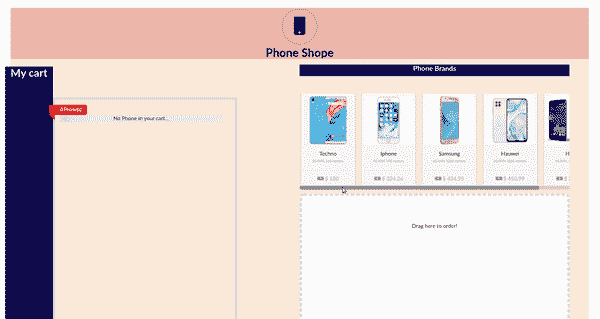

# 用 React、Redux 和 React-DnD 构建购物车—第 4 部分

> 原文：<https://itnext.io/build-a-shopping-cart-with-react-redux-and-react-dnd-part-4-6a77f0a39c0c?source=collection_archive---------2----------------------->



**图 1** 拖拽劈砍车

W 欢迎来到**第 4 部分**构建一个利用 [React DnD](https://react-dnd.github.io/react-dnd/about) 的简单购物车。在第三部分中，我们将 React DnD 集成到了 React 应用程序中。如果你想从第 4 部分开始构建，确保从这个[分支](https://github.com/Eyongkevin/shopping-list---React-Redux-DragandDrop/tree/React-Drag-and-Drop)克隆并下载第 3 部分的代码，因为第 4 部分是一个延续。

# 入门指南

在本文中，我们将继续构建我们的购物车，使用 React Actions 和 Reducers 将项目从拖动源移动到拖放目标，以响应 React DnD `endDrag`事件。在这篇文章的结尾，我们将学习

*   [动作](https://redux.js.org/basics/actions)
*   [减速器](https://redux.js.org/basics/reducers)
*   [调度](https://redux.js.org/api/store#dispatchaction)
*   [中间件](https://redux.js.org/advanced/middleware)

> *本节所有代码在* [*分支*](https://github.com/Eyongkevin/shopping-list---React-Redux-DragandDrop/tree/Move-Action) 中找到

# 我们想要建造的东西

到目前为止，每当我们将一个项目从拖动源拖动到拖放目标时，除了一些控制台日志消息之外，没有什么特别的事情发生。


图 2 我们 React 应用程序的当前状态

我们现在试图构建的是使拖放到拖放目标中的项目实际上移动到其中，如上面的**图 1** 所示。

## 行动

我们集成 React DnD 的方式是，每当我们将一个兼容的项目放入拖放目标时，就会触发`endDrag`事件。我们希望通过通知商店采取何种措施来应对这一事件。

> 动作是将数据从应用程序发送到商店的信息负载。他们是商店唯一的*信息来源。你用`[store.dispatch()](https://redux.js.org/api/store#dispatchaction)`把它们送到商店。*

移动到`src/actions/phones.js`并修改如下

```
export const RECEIVE_PHONES = 'RECEIVE_PHONES'
**export const MOVE_INCART = 'MOVE_INCART'**export function receivePhones(phones){
    return{
        type: RECEIVE_PHONES,
        phones
    }
}**export function moveIncart(phone_id){
    return{
        type: MOVE_INCART,
        id: phone_id
    }
}**
```

我们的动作是一个普通的 JavaScript 对象，带有一个强制的`type`属性，该属性通常采用一个字符串常量值来指示正在执行的动作的类型。在这种情况下，`MOVE_INCART.`我们接下来需要的是我们想要移动的项目的 id`phone_id`，它作为参数被传递给`moveIncart()`函数。

## 还原剂

在动作被发送到商店之后，我们需要一个 reducer 来指定状态将如何响应动作而改变。

> Reducers 指定应用程序的状态如何改变，以响应发送到商店的[动作](https://redux.js.org/basics/actions)。记住动作只描述了*发生了什么*，而没有描述应用程序的状态如何变化。

移动到`src/reducers/phones.js`并修改如下

```
import { RECEIVE_PHONES } from '../actions/phones'
**export const MOVE_INCART = 'MOVE_INCART'**export default function phones(state={}, action){
    switch(action.type){
        case RECEIVE_PHONES:
            return {
                ...state,
                ...action.phones
            }
        **case MOVE_INCART:
            return{
                ...state,
                [action.id]:{
                    ...state[action.id],
                    inCart: 'true'
                }
            }
 **       default:
            return state
    }
}
```

上面的代码基本上将特定项的`inCart`属性从`false`修改为`true`

## 分配器

我们已经设置了动作和减速器，现在是触发状态改变的时候了。对于我们的应用程序，我们将在`endDrag`事件被触发时分派一个动作。通过这种方式，我们获得特定商品的 id 并将其传递给 action 函数，action 函数又被传递给 dispatch 函数。

> 一个存储保存了你的应用程序的整个状态树。改变它内部状态的唯一方法是对它分派一个[动作](https://redux.js.org/glossary#action)。

打开`src/components/Phone.js`并修改如下代码

> 在我使用`*// Lines of code stay the same here*` *、*的地方，请参考 [PART3](/build-a-shopping-cart-with-react-redux-and-react-dnd-part-3-f1e1e8265d14) 以获得代码的完整部分，或者与这个[分支](https://github.com/Eyongkevin/shopping-list---React-Redux-DragandDrop/tree/Move-Action)进行比较。既然是一样的，我就不想重复了。

```
import React, { Component } from 'react'
import { DragSource } from 'react-dnd';
**import { connect } from 'react-redux'**import { ItemTypes } from './Constants';
**import { moveIncart } from '../actions/phones'**// phone DnD spec
const phoneSpec = {
    beginDrag(props){
        return{
            name: props.brand,
            id: props.id

        }
    },
    endDrag(props, monitor, component){
        if (monitor.didDrop()){
            const dragItem = monitor.getItem();
            const dropResult = monitor.getDropResult();           
            console.log("You dropped ", dragItem.name, ' into '+ dropResult.name)
             // Move action goes here
            **props.dispatch(moveIncart(dragItem.id))**
        }else{
            return;
        }
    }
}
*// Lines of code stay the same here.*export default **connect()**(DragSource(ItemTypes.PHONE, phoneSpec, collect)(Phone));
```

我们从' react-redux '导入了`[connect](https://react-redux.js.org/api/connect#connect)`,它将为我们提供用于向商店分派动作的函数`dispatch`。

*   `dragItem.id`从`beginDrag's`返回的对象中获取，该对象可从`monitor.getItem()`访问
*   如果`monitor.didDrop()`为真，意味着如果拖动源与放下目标兼容，我们将调度一个动作。

# 最后润色

我们上面的调度将向 reducer 发送一个动作，这个动作将改变项目的`inCart` 属性的状态。但是，为了完成这一部分，我们还需要处理一些事情。

*   我们需要获取所有电话条目，并根据它们的`inCart`属性是‘真’还是‘假’来过滤它们。“真”将显示在`target list`部分，而“假”将保留在`shopping list`部分。

> 查看[part 2](/build-a-shopping-cart-with-react-redux-and-react-dnd-part-2-b4cd649e25db)T27 中名为`resulting UI with Semantic UI`的图像，了解`Shopping List`和`Target Space`的位置

一 pp.js

移动到`scr/components/App.js`并修改代码如下

```
// Lines of code stay the same here.
  render(){

    return (
      <Container />
    );
  }
}export default connect()(App);
```

请注意，我们移除了`mapStateToProps`。此外，我们不需要像在 [PART3](/build-a-shopping-cart-with-react-redux-and-react-dnd-part-3-f1e1e8265d14) 中那样手动将我们的存储传递给`Container`组件。因为，`src/index.js`中的`<Provider >`为我们处理。

> `<Provider />`使 Redux `store`对任何已经被包装在`connect()`函数中的嵌套组件可用。

D isplayPhone.js

我们上面提到过，我们必须在`target space`和`shopping list`部分显示电话项目。因此，我们将创建一个用于每种情况的组件，而不是重复的代码。

创建组件`src/components/DisplayPhone.js`并插入代码

```
import React, { Component } from 'react';
import { connect } from 'react-redux'import Phone from './Phone'class DisplayPhone extends Component {
    render(){
        const { phones, displayPhones } = this.props
        return(
            <div>
                {displayPhones
                    .map((phone) =>(
                        <Phone 
                             key={phone} 
                             id={phone} 
                             brand={phones[phone].brand} />

                ))}
            </div>
        )
    }
}function mapStateToProps({phones}){return{
        phones,
    }
  }export default connect(mapStateToProps)(DisplayPhone);
```

*   它接受我们的商店(`phones`)和一组要显示的电话 id(`displayPhones`)
*   然后，它使用`Phone`组件创建用于显示的电话结构。

C ontainer.js

我们的容器组件将被修改，为每个部分(`target space`和`shopping list`)提供要显示的正确的 id 数组。

移动到`scr/components/Container.js`，修改代码如下

*   我们在**4、9 线增加了两个进口。**
*   我们在**行 57** 上的`connect`函数将为我们的容器提供存储，并在作为`props`输入我们的容器之前使用`mapStateToProps`修改我们的存储。
*   我们的`mapStateToProps()`函数接收我们的存储并创建两个数组`inCart_phones`和`outCart_phone`，每个数组保存电话商品的 id。前者保存具有`inCart`属性等于‘真’的电话的 id，而后者保存具有`inCart`属性等于‘假’的电话的 id。
*   它从**线 13** 上的`props`中提取这些数组，并分别传递给**线 34** 和 **36** 上的部件`DisplayPhone`和`ShoppingCart`。
*   **行 34** 将在`shopping list`部分显示电话项目，而**行 36** 将在`target space`部分显示电话项目。

S hoppingCart.js

该组件将接收数组`inCart_phones`，该数组包含属性`inCart`等于‘true’的电话项目的 id，并在`DisplayPhone`容器的帮助下显示它们。

```
import React, { Component } from 'react'
import { DropTarget } from 'react-dnd'import { ItemTypes } from './Constants'
**import DisplayPhone from './DisplayPhone'***// Lines of code stay the same here.* return connectDropTarget(
            **<div className="shopping-cart" style={ style } >
                { !inCart_phones.length  &&
                    (isActive
                    ? 'Humm, phone!'
                    : 'Drag here to order!')
                }
                { inCart_phones.length
                ? <DisplayPhone displayPhones = {inCart_phones} />
                : null
                }
            </div>**
        )
    }
}export default DropTarget(ItemTypes.PHONE, ShoppingCartSpec, collect)(ShoppingCart);
```

## 中间件

为了确保我们的应用程序正常工作并便于调试，我们将引入一个中间件`logger`，它将在我们与应用程序交互时记录我们的活动。

> 中间件在分派动作和动作到达缩减器之间提供了第三方扩展点。人们使用 Redux 中间件进行日志记录、崩溃报告、与异步 API 对话、路由等等

**中间件:日志**

如上所述，我们想要监控分派给我们的 reducer 的每一个动作。因此，我们的日志记录函数将打印以下内容。

*   即将被派遣的行动`type`。
*   行动开始后我们商店的新状态。

在开发应用程序时，logger()中间件函数的好处是巨大的。在这种情况下，它将拦截所有的调度调用，并记录已经被调度的动作以及 reducer 运行后的状态变化。然后，我们可以使用这些信息来跟踪我们的应用程序中正在发生的事情，并轻松地注意到任何潜在的错误。

创建文件`src/middleware/logger.js`并插入代码

```
const logger = (store) => (next) => (action) =>{
    console.group(action.type)
        console.log("The action: ",action)
        const result = next(action);
        console.log("New state is: ", store.getState())
    console.groupEnd()
    return result
}export default logger
```

我知道对吗？我们的 logger()中间件函数看起来很奇怪。实际上它的作用是:

*   我们的记录器是一个接收`store`的函数，并返回一个接收`next`的函数，接下来可能是另一个中间件或调度程序。这又返回了另一个函数，该函数接受我们的`action`。所有这些都让我们可以使用这三个特性。
*   然后它打印我们的动作的`type`，然后它调用`next`，在这种情况下`dispatch,` 传递给它我们的动作，并用`store.getState()`获取我们的商店的新状态

**应用中间件**

为了将 logger()中间件函数应用到 redux 中，我们将在将商店创建到`createStore()`时传递它。但是首先，我们将使用`applyMiddleware()`函数，它是一个[存储增强器](https://redux.js.org/glossary#store-enhancer)，然后将它传递给我们的`createStore()`函数。

我 ndex.js

让我们将我们的`logger()`中间件功能添加到存储增强器`applyMiddleware()`中。创建文件`src/middleware/index.js`并插入代码

```
import {applyMiddleware} from 'redux'import logger from './logger'export default applyMiddleware(
    logger
)
```

> 注意，我们可以在`applyMiddleware()`函数中添加任意多的中间件函数！中间件按照它们被提供给存储增强器的顺序被调用。

接下来，我们将把中间件添加到`createStore()`功能中。移动到`src/index.js`并修改代码如下

```
import React from 'react';
import { render } from 'react-dom'
import { Provider } from 'react-redux'
import { createStore } from 'redux'import reducer from './reducers'
**import middleware from './middleware'** import './index.css';
import App from './components/App';**let store = createStore(reducer, middleware)**render(
  <Provider store={ store }>
    <App />
  </Provider>,
  document.getElementById('root')
);
```

检查这个分支的[自述文件](https://github.com/Eyongkevin/shopping-list---React-Redux-DragandDrop/tree/Move-Action)以查看当一个电话项目被放入目标空间时`logger()`会记录什么信息。

# 结论

这个旅程的第四部分是展示 redux action、reducer、dispatch 和中间件的使用。你可以在这里获得这部分[的完整代码。**接下来，我们将更新** `**My cart**` **部分，这样当一个电话项目被放入目标空间时，它的信息将显示在该部分中。查看这个分支**](https://github.com/Eyongkevin/shopping-list---React-Redux-DragandDrop/tree/Move-Action) [**自述**](https://github.com/Eyongkevin/shopping-list---React-Redux-DragandDrop/tree/my-card) **来领略一下我们接下来要看的**。

不要错过我即将发布的第 5 部分。**承诺**！