# 用 Python Flask 用 100 行或更少的代码构建一个简单的 CRUD todo 应用程序

> 原文：<https://itnext.io/build-a-simple-crud-todo-app-with-python-flask-in-100-lines-of-code-or-less-97d8792f24be?source=collection_archive---------0----------------------->

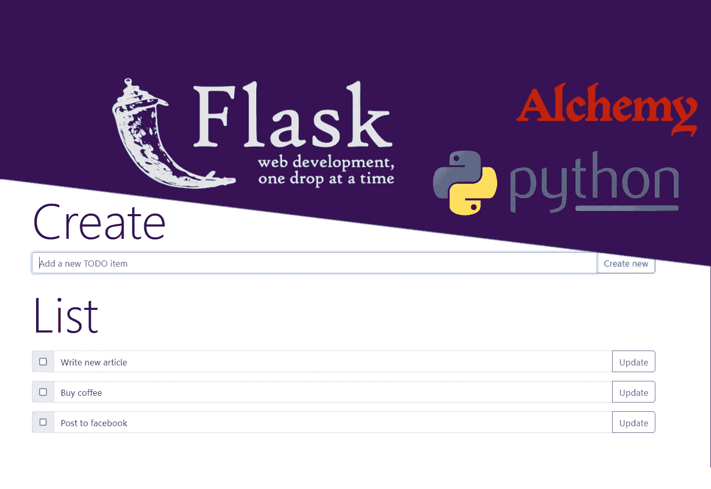

在本教程中，我们将构建一个简单的 CRUD 应用程序(*创建，读取，更新，删除*)来保存一个“待办事项”列表。我们将使用 Python 3 和两个外部库。第一个是 Flask web 框架，第二个是 SqlAlchemy 中的 ORM mapper，用于简化数据库操作。我们将使用 Bootstrap 作为前端。Python 代码可以容纳 50 行代码，HTML 也可以。

# 安装依赖项并准备环境

首先，我们将使用 pip 依赖管理器来安装 flask 和 SQLAlchemy(每个 Python 安装都附带了 pip)。

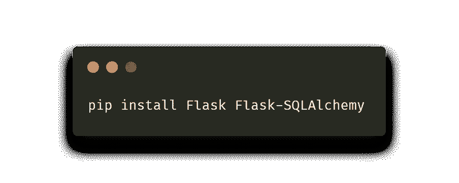

让我们在根文件夹中创建一个模板文件夹。Flask 用它来加载 HTML 模板。创建一个新的 index.html 文件。

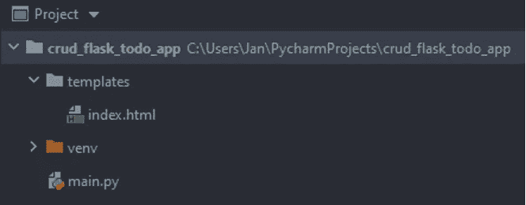

# 导入和应用程序初始化

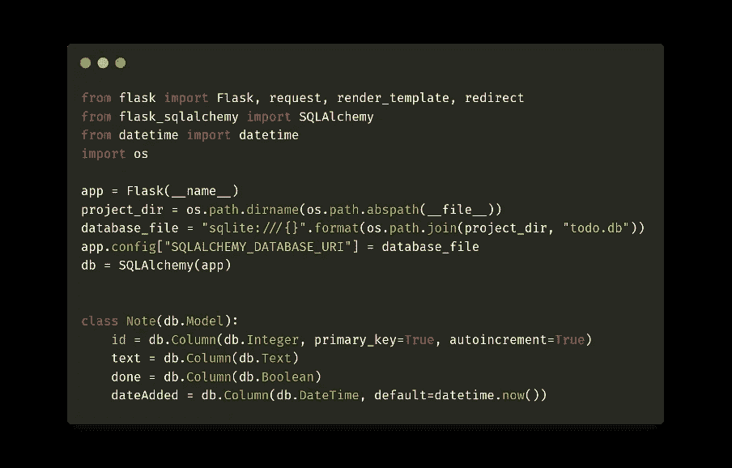

首先，我们需要导入所需的依赖项。然后我们初始化 Flask 应用程序(我们使用活动模块名 *__name__* 作为参数)。然后我们创建数据库连接。我使用的是一个基本的文件数据库，SQLite。如果你有一个更复杂的数据库作为一个单独的进程运行(MariaDB，Postgres)，使用它。您只需要更改连接字符串。然后，我们将这个字符串作为 URI 数据库地址传递，并运行 SQLAlchemy。一个重要的步骤是定义数据库模型。

为此，我们创建了*注释*表，其中包含自动 *id* 、todo 任务的*文本*、保存*完成*值的布尔值以及保存创建时间的自动日期*日期添加*。稍后我们将用这个模型初始化数据库。

# CRUD API

让我们创建 4 个方法，这将确保我们的应用程序是一个 CRUD 应用程序，它将能够创建，读取，更新和删除记录。

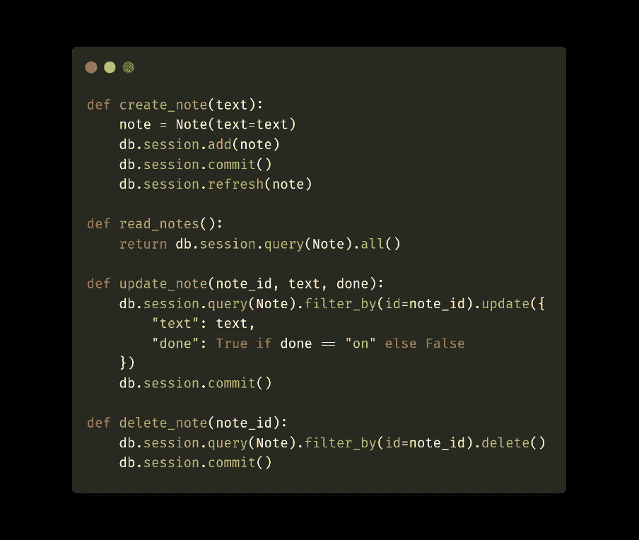

*create_note* 方法只有任务*文本*作为参数。首先，我们创建一个新的*注释*，以文本形式传递这个参数，并将其保存在数据库中。对于*已读笔记*，我们只列出数据库中所有的*笔记*记录。 *update_note* 方法有两个参数，*文本*和*完成*。*文本*也是任务的文本，而*完成*是我们将创建的表单的复选框的值。如果该复选框的值为“开”(即被检查)，则存储的布尔值 *done* 将为*真*，否则*假*。现在只剩下删除的方法 *delete_note* 。

# 主页，添加和显示记录

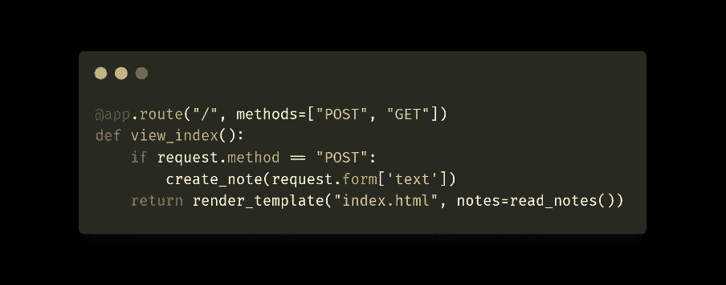

在 Flask 框架中，使用 *@ app.route* 装饰器定义端点。第一个参数是相对 URL。另一个可选参数保存允许的请求方法，在我们的例子中， *POST* 和 *GET* 用于表单处理。 *POST* 方法意味着我们发送一个带有新创建任务的表单。但是无论是 *POST 还是 GET* ，我们都会显示*index.html*模板，并将我们已经存储在数据库中的所有任务( *read_notes* )传递给 *Jinja* 模板系统，以将它们绘制到模板中。

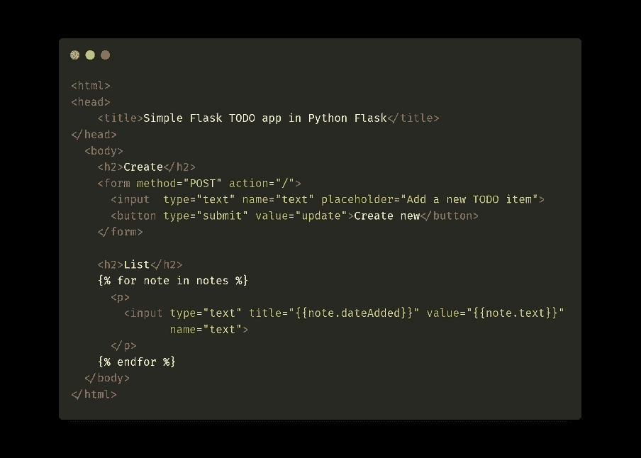

第一种形式将连接到“/”端点，即。到主页。它只有一个文本输入字段和一个提交按钮。然后，我们将检查传递给 notes 变量中的模板的所有记录，并显示它们。稍后，我们将为每条记录添加一个表单，这样就可以从前端编辑和删除单个记录。目前，页面看起来像这样。我们可以添加和显示，但不能编辑和删除。

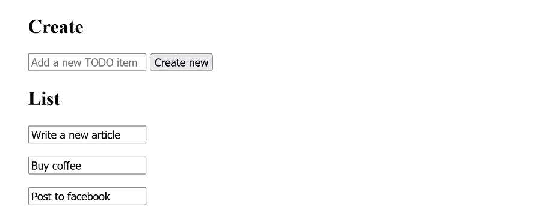

# 编辑、删除和更好的前端

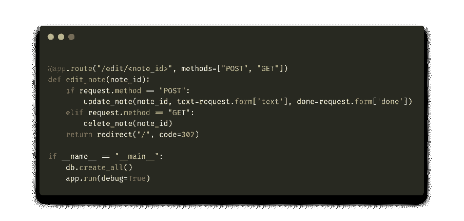

编辑和删除的方法有点复杂。我们将端点的相对地址指定为 */edit/note_id* ，即。我们将向 URL 传递一个参数，我们将其命名为 *note_id* 。我们把它传递给 *edit_note* 方法。如果输入请求是通过 *POST* 发出的，我们将输入表单传递给 *update_note* 函数来修改任务。如果作为*的 GET* 请求，那么我们删除给定的任务。完成后，我们会将所有内容重定向到原始页面。

在 Python 代码中，我们调用 *db.create_all* ，它创建一个包含我们指定的所有表的数据库(在我们的例子中，只有*注释*)，然后运行整个 Flask 应用程序。

最后，我们调整模板，使它看起来不错。这需要对现有的 HTML 代码进行重大修改(对于整个应用程序，请访问 my [Github](https://github.com/janjilecek/simple_python_flask_crud_todo_app) )。

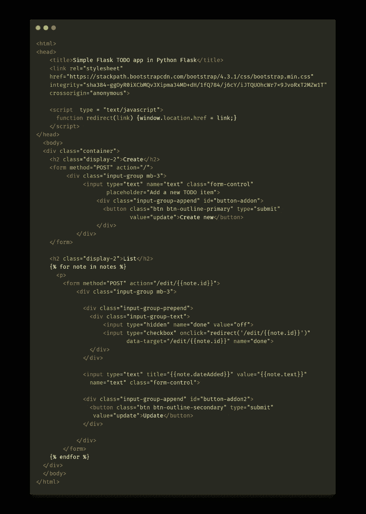

首先，我们将导入引导 CSS 样式。我们将所有表单编辑成引导样式，并将每个列出的任务更改为左侧有一个复选框、右侧有一个按钮来确认文本编辑的表单。如果复选框被选中，我们通过 *onChange* javascript 调用重定向函数，该函数向地址 */edit/note_id* 发送 *GET* 请求。如果点击更新按钮，它将被发送到同一个 *POST* 请求地址。我们还将添加一些小细节，比如在鼠标悬停时显示任务的创建时间。渲染的模板现在看起来像这样:

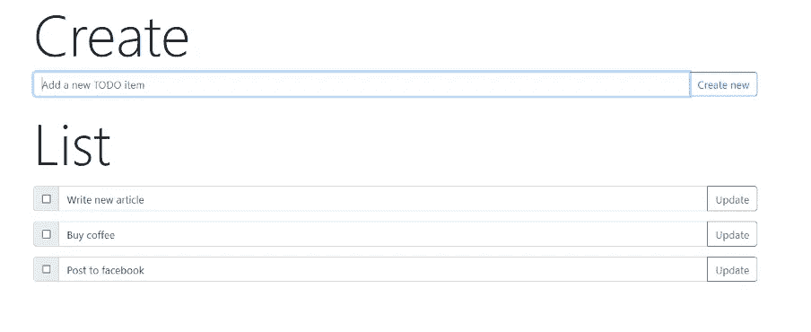

这是我们最后的申请！我们研究了如何创建用于创建、编辑、读取和删除记录的端点，将前端连接到它们，并将所有东西包装成引导样式以使我们的应用程序看起来更好，并且我们在不到 100 行代码中完成了所有这些。我的 [Github](https://github.com/janjilecek/simple_python_flask_crud_todo_app) 上有整个应用程序。希望你学到了新的东西，下次再见！