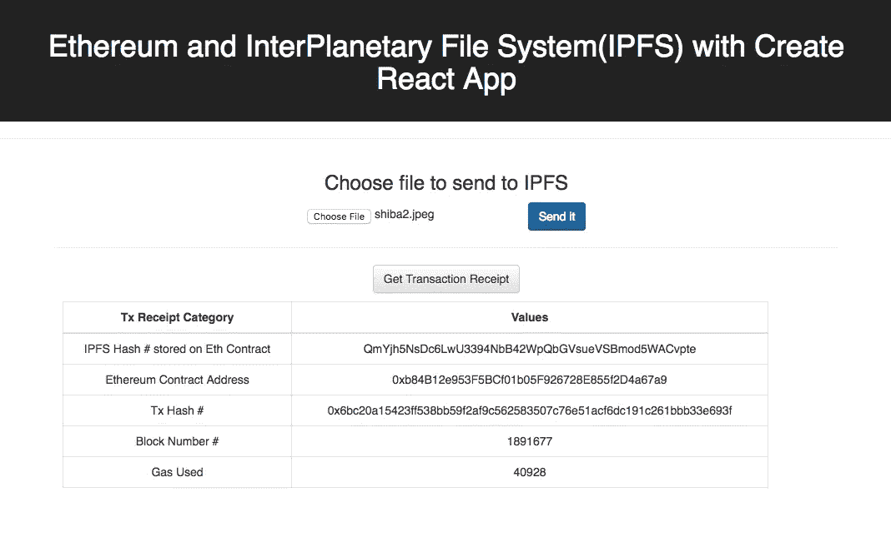
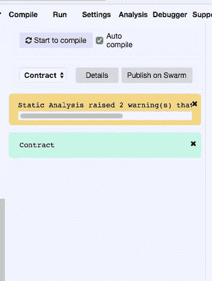
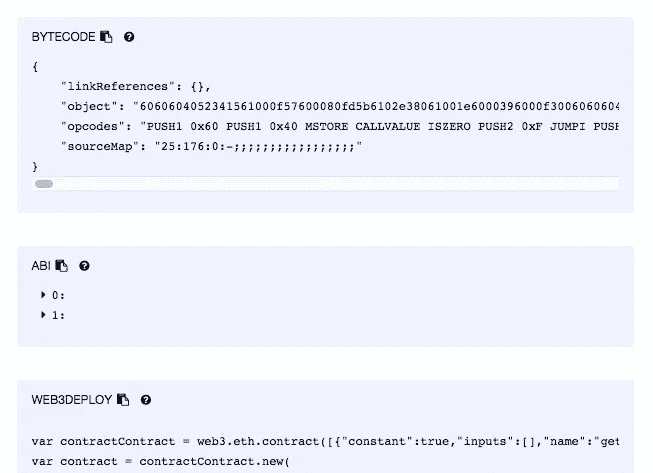
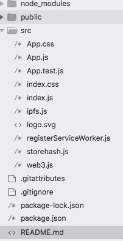
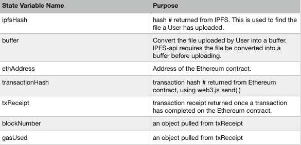
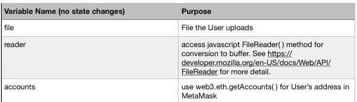
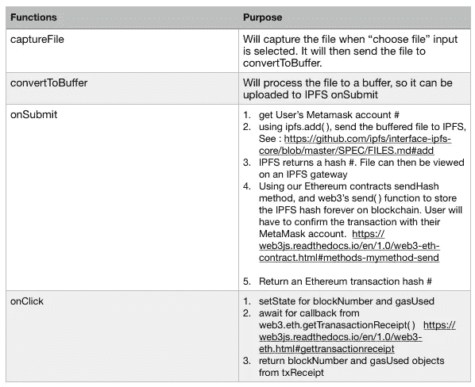

# 构建一个简单的以太坊+星际文件系统(IPFS)+ React.js DApp。

> 原文：<https://itnext.io/build-a-simple-ethereum-interplanetary-file-system-ipfs-react-js-dapp-23ff4914ce4e?source=collection_archive---------0----------------------->

我们为什么要建造这个？

**在以太坊区块链**上存储大量数据的成本高得惊人。根据以太坊的黄皮书，256 位/8 字节(1 个字)大约需要 20，000 gas。基于 2018 年 2 月 28 日天然气价格 4 gwei/gas。查看:[https://eth gastation . info](https://ethgasstation.info)当前价格。

8 字节的每笔交易 20，000 gas x4 gwei/gas = 8 字节的 80，000 gwei。

8 个字节 80,000 gwei。x 1000 字节/8 = 10，000，000 gwei/kB = 0.01 以太

. 01 以太/kB x 1000kB = 10 以太以 860 美元/以太= 8600.00 美元存储 1Mb！在以太坊区块链上存储一个 1 GB 的文件需要花费 860 万美元！

存储以太坊的 38 页 PDF 黄皮书(520Kb) = $4472 美元。参见:[http://eth-converter.com/](http://eth-converter.com/)进行转换。

如果我们只能负担得起在区块链上存储几 Kb 的数据，那么我们仍将不得不依靠集中式服务器来存储数据。令人欣慰的是，一种称为星际文件系统(“IPFS”)的在分散网络上存储数据的解决方案是可用的。参见:[https://ipfs.io/](https://ipfs.io/)阅读更多。在 IPFS 查找文件时，您是在要求网络寻找存储唯一散列背后内容的节点。来自 IPFS 自己的网站:

> “IPFS 和区块链是绝配！您可以使用 IPFS 处理大量数据，并将不可变的永久 IPFS 链接放入区块链事务中。这将为您的内容添加时间戳并保护其安全，而无需将数据放在链上。”

**我们在建造什么？**

一个简单的 DApp 上传文件到 IPFS，然后存储在以太坊区块链 IPFS 散列。一旦 IPFS 散列值被发送到以太坊区块链，用户将收到一张交易收据。我们将使用 Create-React-App 框架来制作前端。此 Dapp 适用于任何在其浏览器中安装了元掩码的用户。

这是我们完工后 DApp 的样子:



**如何构建:**

注:如果你只是想要代码，请到 https://github.com/mcchan1/eth-ipfs[看我的 github。](https://github.com/mcchan1/eth-ipfs)

在我们开始之前，这些是我做的假设:

**关于用户的假设:**用户安装了元掩码以与 DApp 交互。

**关于你/开发者的假设:**你对 JavaScript 和/或 React.js 以及 Node.js/NPM.有些熟悉重要说明:请确保你运行的是 Node 和 NPM 的最新版本。对于本教程，我正在运行:**节点 v8.9.4** 和 **NPM 5.6.0** 。

**安装元掩码。**如果还没有安装 MetaMask，请转到[https://metamask.io/](https://metamask.io/)并按照说明操作。该 DApp 将假设用户安装了元掩码。

**创建一个目录来存储我们的 DApp。对于本教程，我称之为“eth-ipfs”**

**使用 NPM 安装 Create-React-App 和其他依赖项。**使用 NPM 并安装以下部件:

```
npm i create-react-app
npm install react-bootstrap
npm install fs-extra
npm install ipfs-api
npm install web3@^1.0.0-beta.26
```

**进入“eth-ipfs”目录，键入“NPM start”**，Create-React-App 应该会自动呈现在 [http://localhost:3000/](http://localhost:3000/) 上。

*注意:如果您到目前为止还没有使用 create-react-app，您可能需要先全局安装它*

*1。sudo NPM install-g create-react-app
或 NPM install-g create-react-app*

*2。创建-反应-应用 eth-ipfs*

*3。cd 进入 eth-ipfs 和“npm 启动”*

**在 Rinkeby testnet 上使用 Remix 部署以下 Solidity 代码。**参见，[https://remix.ethereum.org](https://remix.ethereum.org)。你将需要一些 Rinkeby 测试乙醚，如果你还没有一些去 Rinkeby 水龙头免费测试乙醚。[https://www.rinkeby.io/#faucet](https://www.rinkeby.io/#faucet)。

```
pragma solidity ^0.4.17;contract Contract {
 string ipfsHash;

 function sendHash(string x) public {
   ipfsHash = x;
 }

 function getHash() public view returns (string x) {
   return ipfsHash;
 }}
```

**保存部署的合同地址和应用二进制接口(ABI)。**要获得合同的 ABI，请在 Remix 中转至您的合同地址:

单击“编译”选项卡，然后单击灰色的“详细信息”按钮。



这将打开详细信息窗口。复制“ABI”，这是一个 JSON 文件。



就我个人而言，我更喜欢将 ABI JSON 放入格式化程序，比如 https://jsonformatter.org[和 ，并在我的 javascript 代码中使用它之前检查它是否有效。把合同地址和 ABI 留着以后用。](https://jsonformatter.org)

在我们的“eth-ipfs/src”目录下，创建以下文件: **web3.js** 、 **ipfs.js** 和 **storehash.js** 。我们的大部分代码将在 **App.js** 中。



**web3.js**

我们希望使用 web3.js 的 1.0 版本，因为与 0.20 版本不同，1.0 允许我们在 javascript 中使用 async 和 await 来代替 promises。目前，MetaMask 的默认 web3.js 提供程序是 0.20 版本。因此，让我们确保覆盖 Metamask 的 web3 版本 0.20 的默认版本，并使用我们的 1.0。代码如下:

```
//overrides metamask v0.2 for our 1.0 version. 
//1.0 lets us use async and await instead of promisesimport Web3 from ‘web3’;

const web3 = new Web3(window.web3.currentProvider);export default web3;
```

**storehash.js**

为了让 web3.js 访问我们之前部署到以太坊的 Rinkeby testnet 的合同，您需要以下内容:1)合同地址和 2)合同中的 ABI。一定要从/src 目录中导入 web3.js 文件。代码如下:

```
import web3 from './web3';//access our local copy to contract deployed on rinkeby testnet
//use your own contract addressconst address = '0xb84b12e953f5bcf01b05f926728e855f2d4a67a9';//use the ABI from your contractconst abi = [
  {
    "constant": true,
    "inputs": [],
    "name": "getHash",
    "outputs": [
      {
        "name": "x",
        "type": "string"
      }
    ],
    "payable": false,
    "stateMutability": "view",
    "type": "function"
  },
  {
    "constant": false,
    "inputs": [
      {
        "name": "x",
        "type": "string"
      }
    ],
    "name": "sendHash",
    "outputs": [],
    "payable": false,
    "stateMutability": "nonpayable",
    "type": "function"
  }
]export default new web3.eth.Contract(abi, address);
```

**ipfs.js**

在本教程中，我们将运行 [ipfs.infura.io](http://ipfs.infura.io) 节点来连接 ipfs，而不是在我们自己的计算机上运行 IPFS 守护进程。在代码注释中，如果您将 IPFS 作为一个全局依赖项安装，您还可以选择运行自己的 IPFS 守护进程。参见，[https://infura.io/](https://infura.io/)关于使用他们的节点的更多信息。代码如下:

```
//using the infura.io node, otherwise ipfs requires you to run a //daemon on your own computer/server.const IPFS = require(‘ipfs-api’);
const ipfs = new IPFS({ host: ‘ipfs.infura.io’, port: 5001, protocol: ‘https’ });//run with local daemon
// const ipfsApi = require(‘ipfs-api’);
// const ipfs = new ipfsApi(‘localhost’, ‘5001’, {protocol:‘http’});export default ipfs;
```

**App.js**

这是 App.js 中的操作顺序

1.  设置状态变量。
2.  捕获用户的文件。
3.  将文件转换为缓冲区。
4.  将缓冲文件发送到 IPFS
5.  IPFS 返回一个散列值。
6.  获取用户的元掩码以太坊地址
7.  将 IPFS 发送到以太坊进行存储。
8.  使用元掩码，用户将向以太坊确认交易。
9.  以太坊契约将返回一个交易散列数。
10.  交易散列号可用于生成交易收据，该收据具有诸如使用的气体量和区块号的信息。
11.  当 IPFS 和以太坊信息在一个表格中可用时，它将使用 CSS 的 Bootstrap 来呈现。注意:我没有创建 isLoading 类型变量来自动重新呈现 blockNumber 和 gasUsed 变量的状态。所以现在，你必须再次点击或者实现你自己的加载图标。下面是描述变量和函数的表格，以及代码本身:



最后，这里是 **App.js** 代码:

```
import React, { Component } from ‘react’;
//import logo from ‘./logo.svg’;
import ‘./App.css’;
import web3 from ‘./web3’;
import ipfs from ‘./ipfs’;
import storehash from ‘./storehash’;class App extends Component {

    state = {
      ipfsHash:null,
      buffer:'',
      ethAddress:'',
      blockNumber:'',
      transactionHash:'',
      gasUsed:'',
      txReceipt: ''   
    };captureFile =(event) => {
        event.stopPropagation()
        event.preventDefault()
        const file = event.target.files[0]
        let reader = new window.FileReader()
        reader.readAsArrayBuffer(file)
        reader.onloadend = () => this.convertToBuffer(reader)    
      };
 convertToBuffer = async(reader) => {
      //file is converted to a buffer for upload to IPFS
        const buffer = await Buffer.from(reader.result);
      //set this buffer -using es6 syntax
        this.setState({buffer});
    };onClick = async () => {try{
        this.setState({blockNumber:"waiting.."});
        this.setState({gasUsed:"waiting..."});//get Transaction Receipt in console on click
//See: [https://web3js.readthedocs.io/en/1.0/web3-eth.html#gettransactionreceipt](https://web3js.readthedocs.io/en/1.0/web3-eth.html#gettransactionreceipt)await web3.eth.getTransactionReceipt(this.state.transactionHash, (err, txReceipt)=>{
          console.log(err,txReceipt);
          this.setState({txReceipt});
        }); //await for getTransactionReceiptawait this.setState({blockNumber: this.state.txReceipt.blockNumber});
        await this.setState({gasUsed: this.state.txReceipt.gasUsed});    
      } //try
    catch(error){
        console.log(error);
      } //catch
  } //onClickonSubmit = async (event) => {
      event.preventDefault(); //bring in user's metamask account address
      const accounts = await web3.eth.getAccounts();

      console.log('Sending from Metamask account: ' + accounts[0]); //obtain contract address from storehash.js
      const ethAddress= await storehash.options.address;
      this.setState({ethAddress}); //save document to IPFS,return its hash#, and set hash# to state
    //[https://github.com/ipfs/interface-ipfs-core/blob/master/SPEC/FILES.md#add](https://github.com/ipfs/interface-ipfs-core/blob/master/SPEC/FILES.md#add)      await ipfs.add(this.state.buffer, (err, ipfsHash) => {
        console.log(err,ipfsHash);
        //setState by setting ipfsHash to ipfsHash[0].hash 
        this.setState({ ipfsHash:ipfsHash[0].hash }); // call Ethereum contract method "sendHash" and .send IPFS hash to etheruem contract 
  //return the transaction hash from the ethereum contract
 //see, this [https://web3js.readthedocs.io/en/1.0/web3-eth-contract.html#methods-mymethod-send](https://web3js.readthedocs.io/en/1.0/web3-eth-contract.html#methods-mymethod-send)

        storehash.methods.sendHash(this.state.ipfsHash).send({
          from: accounts[0] 
        }, (error, transactionHash) => {
          console.log(transactionHash);
          this.setState({transactionHash});
        }); //storehash 
      }) //await ipfs.add 
    }; //onSubmitrender() {

      return (
        <div className="App">
          <header className="App-header">
            <h1> Ethereum and IPFS with Create React App</h1>
          </header>

          <hr /><Grid>
          <h3> Choose file to send to IPFS </h3>
          <Form onSubmit={this.onSubmit}>
            <input 
              type = "file"
              onChange = {this.captureFile}
            />
             <Button 
             bsStyle="primary" 
             type="submit"> 
             Send it 
             </Button>
          </Form><hr/>
 <Button onClick = {this.onClick}> Get Transaction Receipt </Button> <Table bordered responsive>
                <thead>
                  <tr>
                    <th>Tx Receipt Category</th>
                    <th>Values</th>
                  </tr>
                </thead>

                <tbody>
                  <tr>
                    <td>IPFS Hash # stored on Eth Contract</td>
                    <td>{this.state.ipfsHash}</td>
                  </tr>
                  <tr>
                    <td>Ethereum Contract Address</td>
                    <td>{this.state.ethAddress}</td>
                  </tr> <tr>
                    <td>Tx Hash # </td>
                    <td>{this.state.transactionHash}</td>
                  </tr> <tr>
                    <td>Block Number # </td>
                    <td>{this.state.blockNumber}</td>
                  </tr> <tr>
                    <td>Gas Used</td>
                    <td>{this.state.gasUsed}</td>
                  </tr>

                </tbody>
            </Table>
        </Grid>
     </div>
      );
    } //render
} //Appexport default App;
```

我在 src/ **App.css** 中添加了一点 CSS，让它看起来更舒服一些:

```
/*some css I added*/
input[type=”file”] {
 display: inline-block;
}.table {
 max-width: 90%;
 margin: 10px;
}
.table th {
 text-align: center;
}
/*end of my css*/
```

并添加一些导入到 **src/index.js** :

```
/*[https://github.com/facebook/create-react-app/blob/master/packages/react-scripts/template/README.md#adding-a-stylesheet](https://github.com/facebook/create-react-app/blob/master/packages/react-scripts/template/README.md#adding-a-stylesheet)*/
import ‘bootstrap/dist/css/bootstrap.css’;
import ‘bootstrap/dist/css/bootstrap-theme.css’;
```

就是这样！你的 DApp 应该完成了。所以你所需要做的就是选择一个文件，发送它，然后得到一个交易收据。如果您通过 localhost:3000 连接到一个 IPFS 节点，那么您应该能够在一个 IPFS 网关上看到您的文件。[https://gateway.ipfs.io/ipfs/](https://gateway.ipfs.io/ipfs/QmYjh5NsDc6LwU3394NbB42WpQbGVsueVSBmod5WACvpte)+你的 IPFS 哈希#。

例如:[https://gateway . ipfs . io/ipfs/qmyjh 5 nsdc 6 lwu 3394 nbb 42 wpqbgvsuevsbmod 5 WAC vpte](https://gateway.ipfs.io/ipfs/QmYjh5NsDc6LwU3394NbB42WpQbGVsueVSBmod5WACvpte)

关于 IPFS 的一个注意事项是，除非你的文件被另一个节点拾取或者你将其固定，否则 IPFS 最终将对你的文件进行垃圾收集。他们的网站上有更多关于这方面的内容。

**参考链接:**

*   【https://ipfs.io/docs/getting-started/ 
*   [https://web3js.readthedocs.io/en/1.0/index.html](https://web3js.readthedocs.io/en/1.0/index.html)
*   [https://infura.io/](https://infura.io/)
*   [https://react-bootstrap . github . io/入门/简介](https://react-bootstrap.github.io/getting-started/introduction)
*   [https://metamask.io/](https://metamask.io/)
*   [https://github.com/ipfs/js-ipfs-api](https://github.com/ipfs/js-ipfs-api)
*   [https://remix.ethereum.org/](https://remix.ethereum.org/)
*   [https://ethereum.github.io/yellowpaper/paper.pdf](https://ethereum.github.io/yellowpaper/paper.pdf)
*   [https://eth gastation . info](https://ethgasstation.info)
*   [http://eth-converter.com/](http://eth-converter.com/)
*   [https://www.rinkeby.io/#faucet](https://www.rinkeby.io/#faucet)
*   [https://developer.mozilla.org/en-US/docs/Web/API/FileReader](https://developer.mozilla.org/en-US/docs/Web/API/FileReader)
*   [https://github . com/ipfs/interface-ipfs-core/blob/master/SPEC/files . MD # add](https://github.com/ipfs/interface-ipfs-core/blob/master/SPEC/FILES.md#add)
*   [https://web 3js . readthedocs . io/en/1.0/web 3-eth-contract . html # methods-my method-send](https://web3js.readthedocs.io/en/1.0/web3-eth-contract.html#methods-mymethod-send)
*   [https://web 3js . readthedocs . io/en/1.0/web 3-eth . html # gettransactionreceipt](https://web3js.readthedocs.io/en/1.0/web3-eth.html#gettransactionreceipt)
*   [https://github.com/mcchan1/eth-ipfs](https://github.com/mcchan1/eth-ipfs)