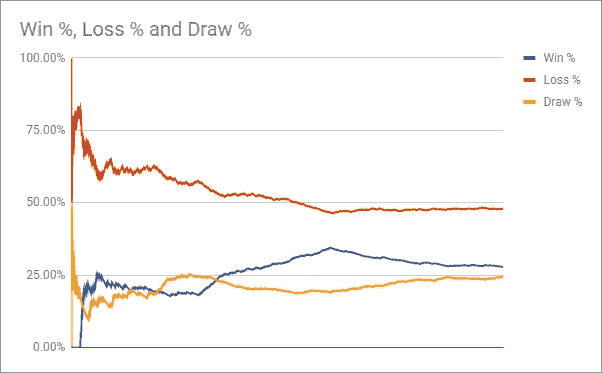

# 构建稀疏奖励 PySC2 代理

> 原文：<https://itnext.io/build-a-sparse-reward-pysc2-agent-a44e94ba5255?source=collection_archive---------0----------------------->

[*点击这里在 LinkedIn* 上分享这篇文章](https://www.linkedin.com/cws/share?url=https%3A%2F%2Fitnext.io%2Fbuild-a-sparse-reward-pysc2-agent-a44e94ba5255)

在我的[最后几个教程](https://medium.com/@skjb/add-smart-attacking-to-your-pysc2-agent-17fd5caad578)中，我讲述了如何构建一个 PySC2 代理，它使用机器学习来建造单位和攻击敌人。如果你跟着做，你可能已经注意到代理有有趣的结果，例如它经常在敌人基地外等待，等待单位出现，这样它就可以获得奖励。

在本教程中，我们将转移到使用稀疏奖励，基本上代理人将获得奖励 1 赢得游戏，或-1 输掉游戏。这可能需要更多的训练，但最终结果应该是更多的胜利。

让我们开始吧。

注意:对于那些关注过我之前教程的人来说，本教程中的许多代码可能看起来很熟悉，但实际上有一些重要的区别。我会试着给你指出这些。

# 1.建立

首先，让我们设置我们将使用的导入和一些变量:

这里的最后一个项目是新的，它将允许我们指挥 scv 采集矿物。

我在这里添加了军队供应 ID，以便更容易地遵循代码。

这里又有了一个新的单位 ID，用来探测矿点的位置。

这里的最后一个动作类型是新的，它很酷，因为它允许我们在一个动作中选择屏幕上相同类型的所有单位。

这是我们将存储 Q 学习表的文件的前缀。这将允许我们结束和恢复训练，当我们需要运行数百集时，这将派上用场。

你可能会注意到这里遗漏了几个动作，在本教程中，我们将把一系列动作(例如选择兵营，训练陆战队员)浓缩成一个动作(例如训练陆战队员)。我会边走边解释。

如果你读过我以前的教程，你可能会意识到这是把小地图分成四个象限。这是为了保持相对较小的动作空间，使代理更容易学习。

# 2.添加 Q 学习表

和我以前的教程一样，我们将使用 Q 学习表。请注意，这个已经更新，以支持一些熊猫的更新，这似乎导致一些人的问题。

这里的最后四行与我以前的教程不同，我们不是在每一点都应用全部奖励，而是在状态变得不稳定时才应用全部奖励，比如赢或输。所有其他的学习步骤都会打折扣。

我总是惊讶于强化学习只需要这么少的代码就能奏效！

# 3.创建代理

代理的开始与之前的教程相同，我们保留所有 QLearningTable 设置的默认值。

我们添加了几个属性`cc_x`和`cc_y`来跟踪指挥中心的位置。

另一个新属性`move_number`将跟踪多步动作中的序列位置。

这段代码很酷，如果`sparse_agent_data.gz`存在，它将从这个文件中加载 Q 学习表数据，这允许您从以前的位置恢复学习。如果您需要停止培训，或者有某种错误导致您的代理崩溃，您可以简单地重新启动它，您的学习历史不会丢失。

前两种方法与之前的教程相同，如果底部位于右下角，它们基本上允许我们反转屏幕和小地图的位置，这样所有的操作都可以被视为从左上角执行，从而使我们的代理可以更快地学习。

最后一个方法是一个实用程序，它允许 is 从我们选择的动作中提取我们需要的信息。

你可能以前没见过`obs.first()`，这个方法本质上告诉你这是不是一集(游戏)的第一步，所以在这里你可以设置游戏剩余部分所需的任何数据。

在这里，我们只是设置了一些计数，可以用于状态和其他需要知道我们拥有什么的代码。你可以在这里阅读更详细的解释[。](https://medium.com/@skjb/how-to-locate-and-select-units-in-pysc2-2bb1c81f2ad3)

好了，我们现在有了一个应该运行的基本代理，但是没有实现任何东西。

# 4.添加多步骤操作的第一步

正如我前面提到的，我们将把几个动作压缩成一个动作，这使得我们的动作空间更简单，这将有助于我们的代理更快地学习。我们所有的多步骤动作将消耗 3 个步骤，即使它们需要更少，因此学习调用总是每 3 个游戏步骤进行一次，以保持事情的一致性。

我们将采取的主要行动是:

*   什么都不做——3 步都不做
*   建造补给站—选择 SCV，建造补给站，派 SCV 去采集矿物
*   建造兵营—选择 SCV，建造兵营，派 SCV 去采集矿物
*   建造海军陆战队——选择所有兵营，训练海军陆战队，什么都不做
*   攻击(x，y)-选择军队，攻击坐标，什么都不做

不幸的是，将 scv 送回矿点并不完美，但似乎相当有效。这样做的目的是为了防止 scv 被选中，而不是被兵营选中。

在上一步的`barracks_count`行后插入以下代码:

首先，我们检查这是否是多步操作中的第一步，由值为 0 的`self.move_number`表示。我们增加数字，以便在下一个游戏步骤中，我们将继续进行多步动作的第二步。

接下来，我们设置州包括我们的每种建筑类型的计数和我们的海军计数。

现在我们把小地图分成四个象限，如果其中包含任何敌人单位，就标记一个象限为“热点”。如果底座在右下角，我们将象限颠倒，这样所有游戏都可以从左上角底座的角度来看，而不管实际的底座位置。这应该有助于我们的代理更快地学习。

如果我们不在整个游戏的第一步，我们调用 Q 学习表上的`learn()`方法。因为这仅在每个多步骤动作的第一步完成，所以将在每第三个游戏步骤采取状态并执行学习。

接下来，我们选择一个动作，如果存在任何`x`和`y`坐标，则将其分离出来。

建造补给站或兵营的第一步是选择一个 SCV。我们通过识别屏幕上的所有 SCV 点并随机点击一个点来做到这一点。

建造海军陆战队的第一步是选择兵营。事实上，通过发送`_SELECT_ALL`值，我们可以同时选择屏幕上的所有兵营。这样做的主要好处是，游戏会自动将下一个陆战队员排在最不繁忙的兵营，首先考虑选择正确兵营的需要。

攻击一个地点的第一步是选择军队。

# 5.添加多步骤操作的第二步

将以下代码直接添加到上一步中的代码下方:

我们从增加移动数和提取动作细节开始。

建造补给站的第二步是命令 SCV 在给定的地点建造补给站。通过使用我们储存的指挥中心位置，即使我们的指挥中心被摧毁了，我们也可以建造一个补给站。

为了让我们的代理更容易，每个补给站的位置都是硬编码的，所以它只需要知道它决定建立一个补给站，而不是补给站的位置。这使得我们的状态和动作空间更加简单，因为我们不需要跟踪这些细节。

这里可能出现的一个问题是，你的第一个补给站可能会在你的第二个补给站建成后被摧毁，但是你的代理会认为你的第一个补给站在第一个位置，因此会试图在已经有补给站的地方建立第二个补给站。虽然你可以试着解决这个问题，但我觉得没有必要，通常一旦敌人摧毁了你的一个兵营，你很可能就会失败。

建造兵营的第二步与补给站非常相似，只是坐标不同。

训练陆战队员的第二步很简单，告诉兵营去训练陆战队员！我们把命令排队，这样兵营可以把几个陆战队员排成一排，在军队进攻需要增援的时候就方便了。

攻击的第二个动作是简单地命令军队攻击小地图上的一个地点。

为了防止意外选择 scv 并试图用它们攻击，我们检查了`single_select`和`multi_select`空格以确保我们没有选择 scv。

一旦我们确定选择了军队，我们就在象限的中心随机选择一个位置。这允许我们保持我们的行动空间只有四个攻击坐标，但是帮助代理在象限周围攻击并且不留下任何敌人单位不被触动。

# 6.添加多步骤操作的最后一步

将以下代码直接添加到上一步中的代码之后:

剩下唯一要做的就是把 scv 送回矿点。注意，这个动作是排队的，所以它会在 SCV 建造完补给站或兵营后执行。

所有其他跳过的或无效的动作将通过一个`_NO_OP`调用来实现。

# 7.检测游戏完成

最后一步是检测游戏的结束，应用奖励，并为下一集清除任何属性。

将以下代码添加到代理的 step()方法的开头，在`super(SparseAgent, self).step(obs)`调用之后:

就像我们之前做的`obs.first()`调用一样，`obs.last()`调用允许我们检测一集的最后一个游戏步骤。

幸运的是，作为观察的一部分，DeepMind 以`obs.reward`的形式提供了我们需要的奖励。这个值要么是 1 代表赢，要么是-1 代表输，要么是 0 代表僵持或一集达到 28，800 步。

可以使用`game_steps_per_episode`命令行参数增加该剧集步长限制，但这不是必需的。

接下来，我们将这个奖励应用到我们的 Q 学习表中，但我们传入的不是当前状态，而是一个字符串`terminal`，它表示一个特殊的状态，该状态应用完全奖励(乘以学习率)而不是折扣奖励。

我们以 gzipped pickle 格式输出 Q 学习表数据，这样，如果我们的代理由于任何原因被停止，它可以被重新加载。

然后我们重置我们的代理，使它可以重新开始。请注意，这些可以在第一步重置，但在我看来这样做更清晰。

我们立即返回一个`_NO_OP`调用，因为在我们的代码中继续下去没有任何价值。

# 8.运行代理

为了运行代理，请从命令行执行以下命令:

```
python -m pysc2.bin.agent \
--map Simple64 \
--agent sparse_agent.SparseAgent \
--agent_race T \
--max_agent_steps 0 \
--norender
```

1035 场比赛后，我的经纪人的记录是这样的:



令我印象深刻的是，使用默认设置的代理丢失的时间不到 50%。在我的下一个教程中，我将讲述如何让胜率超过 70%。

你可以在这里找到奖励历史和最终 Q 学习表数据[。](https://docs.google.com/spreadsheets/d/10I4F4ONFo23DLp7kX5gHk62cOJ7JEzeFNj6d_GxDsqM/edit?usp=sharing)

本教程的所有代码都可以在[这里](https://github.com/skjb/pysc2-tutorial/tree/master/Building%20a%20Sparse%20Reward%20Agent)找到。

如果你喜欢这个教程，请在 [Patreon](https://www.patreon.com/skjb) 上支持我。也请和我一起上 [Discord](https://discord.gg/qTZ65sh) ，或者关注我上 [Twitch](https://www.twitch.tv/skjb) 、 [Medium](https://medium.com/@skjb) 、 [GitHub](https://github.com/skjb) 、 [Twitter](https://twitter.com/theskjb) 和 [YouTube](https://www.youtube.com/channel/UCZcEvhpV4_6llcrWrWQ2wsg) 。