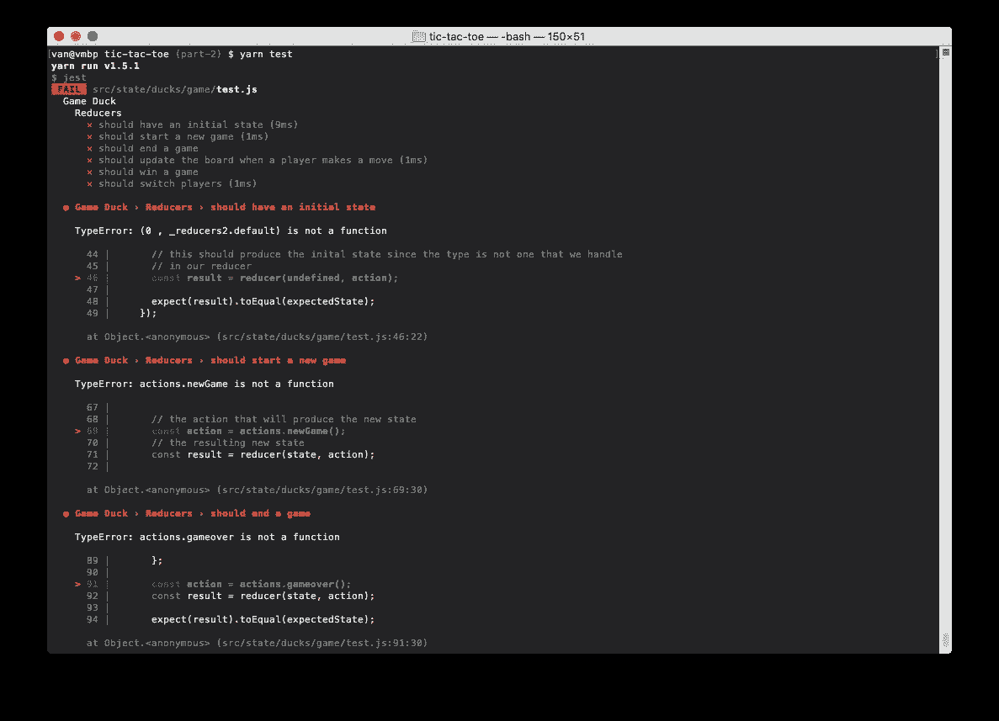
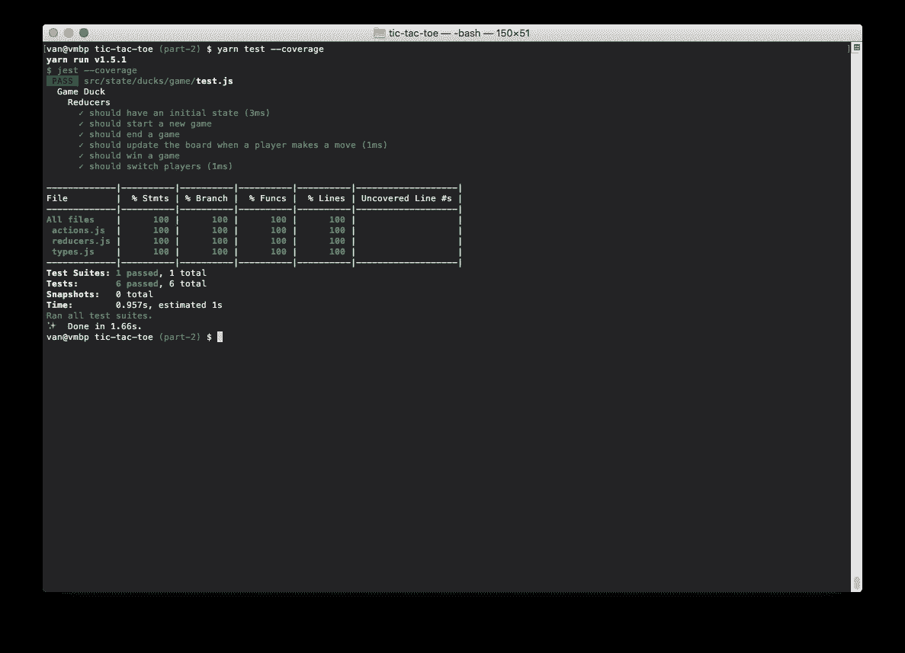
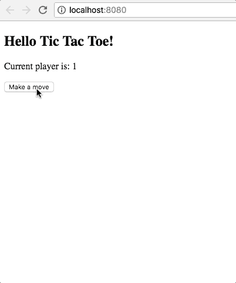

# 用 React/Redux、Babel、Webpack 和 Material-UI 构建一个井字游戏

> 原文：<https://itnext.io/build-a-tic-tac-toe-game-with-react-redux-babel-webpack-and-material-ui-part-2-of-5-1608f247690d?source=collection_archive---------0----------------------->

## 第 2 部分，共 5 部分

在这一部分中，我们将开始编写游戏的逻辑，并添加测试来验证我们的游戏是否可以运行。

*   [第 1 部分—项目设置、依赖关系和 Hello Tic Tac Toe！app。](https://medium.com/@vanister/learn-react-redux-by-making-a-tic-tac-toe-game-part-1-of-5-dc9111ca09ad)
*   第二部分——游戏结构、状态和测试。
*   第三部分——游戏性和基本风格。
*   [第 4 部分——提示、新游戏和更多风格](/build-a-tic-tac-toe-game-with-react-redux-babel-webpack-and-material-ui-part-4-of-5-f7cb4a611481)。
*   [第 5 部分——清理和事后反思](/build-a-tic-tac-toe-game-with-react-redux-babel-webpack-and-material-ui-part-5-of-5-fe2ece35b839)。

**更新 2019 年 7 月 22 日:**项目依赖关系更新。

*   巴别塔 7.x
*   React 16.x
*   Redux 4.x
*   Webpack 4.x

查看 [package.json](https://github.com/vanister/medium.com/blob/part-2/tic-tac-toe/package.json) 获取更新的完整列表。

## 新依赖项

为了针对我们的动作、缩减器和操作编写测试，我们需要将 [jest](https://facebook.github.io/jest/) 作为开发依赖项添加到我们的项目中。Jest 很好，因为它包含了我们编写、运行和收集代码覆盖率所需的一切。

我们也将使用 [redux-thunk](https://github.com/gaearon/redux-thunk) 来允许我们有条件地为我们的游戏分派动作。

```
yarn add --dev jest redux-thunk
```

用 jest cli 命令更新`package.json`文件的测试脚本，以执行我们项目中的所有测试。Jest 将默认查找以“test，*”开头的文件。测试或*.spec。"

```
// package.jsonscripts: {
  ...,
  ...,
  "test": "jest"
}// rest of package.json
```

## 游戏结构

井字游戏是一个非常简单的游戏。有一个由 3×3 个方块组成的网格，每个玩家轮流在每个方块中标记一个“X”或“O”。第一个在一排、一列或对角线上得到三个的玩家获胜。既然游戏这么简单，我们只需要四个状态。

*   `board` — 3x3 数数组；游戏板的当前状态。
*   `gameover` —布尔；有一个赢家或者是平局。
*   `player` —数字；当前玩家，或无(0)。
*   `winner` —数字；赢得游戏或平局(0)的玩家。

## 管理状态

我们将使用 [re-ducks](https://github.com/alexnm/re-ducks) 模式将我们的 redux reducers、类型和动作组织成“ducks”。管理和组织 redux 文件有很多方法，但我喜欢 re-ducks 模式，因为它将状态分解到易于管理的文件夹中，使我们编写测试更加容易。

典型的“duck”将包含以下文件:

*   `index.js` —为我们的鸭子出口。
*   `reducers.js` — redux 减速器。
*   `actions.js` —可用于我们运营的行动。
*   `operations.js` —可以对我们的鸭子进行的操作。一个操作可以分派一个或多个操作。
*   `selectors.js` —映射复杂状态或导出分配给属性的值(可选)。
*   `types.js` —动作类型常数。
*   `test.js` —测试我们的鸭子。

鸭子存放在`src/state/ducks/.`文件夹下

## 野味鸭——减速器、动作和类型

我们游戏中唯一的鸭子是“游戏”鸭。它将包含“游戏结构”一节中列出的四种状态。

在`src/state/ducks/`下创建一个`game`文件夹，并将“管理状态”一节中列出的文件添加到其中。

我们将从为我们的减速器、类型和动作编写测试开始。打开`test.js`文件，并将以下代码添加到其中:

如果您现在运行`yarn test`，您将会得到失败的测试消息，比如“TypeError: reducers 不是一个函数”或者“TypeError: action”。*不是函数”，因为我们还没有实现它们。



打开`reducers.js`、`actions.js`和`types.js`文件，添加如下实现:

game/reducers.js

游戏/动作. js

game/types.js

再次运行`yarn test`，你应该会看到它们现在都通过了。



## 游戏鸭—操作和选择器

re-ducks 模式将操作描述为我们的 duck 的接口。通过我们的 duck 公开的操作可以用来更新我们的 duck 的状态。

我们的一些 duck 操作很简单，可以用它们的动作一一公开，但是还有一些稍微复杂一点，需要一些逻辑才能调度动作来改变状态。

在`operations.js` 和`utils/game.js`文件中实现操作之前，我们将首先用新的操作部分更新我们的`test.js`文件。

游戏/测试. js

游戏/运营. js

src/state/utils/game.js —请注意,“utils”文件夹是 ducks 文件夹的同级文件夹。

注意:我们没有使用选择器，但是它们可以用来获取我们的 duck 状态并从中派生出一个新的状态。它们应该是纯函数，像减速器一样，不会改变我们鸭子的状态。

我们可以在`selectors.js`文件中有一个空的导出作为占位符。

```
// ducks/game/selector.jsexport {};
```

## 野味鸭——暴露鸭子

现在我们已经实现了 duck，我们需要公开它，以便组件可以使用它来呈现它们的状态。

在`index.js`文件中，导出减速器、操作、选择器和类型:

鸭子/游戏/索引. js

在`src/state/ducks/`创建另一个`index.js`文件，将所有的单个鸭子分组(目前仅针对`game`)。这些是 redux 存储的根缩减器中将要组合的缩减器。

```
// src/state/ducks/index.jsexport { default as gameState } from './game';
// ...
// more exports from other ducks
```

## Redux 商店

要将游戏 duck 与 redux 一起使用，我们需要将它的 reducers 添加到 redux 存储中。在`src/state/`创建一个`store.js`文件来配置商店。

状态/商店. js

我们导出了`configureStore`函数，该函数通过将我们所有的鸭子组合到一个根 reducer 中来配置存储，添加了 thunk 中间件来允许我们推迟或有条件地调度动作，并在创建和返回存储之前应用任何初始状态。

## 用鸭子

打开`src/index.js`文件，更新它以使用我们创建的 redux 存储。

src/index.js

我们使用 react-redux `Provider`向所有组件提供我们的`store`。

稍后，如果我们想要将我们的状态保存到本地存储，我们可以使用`initialState`变量在导航离开后刷新或返回游戏时再次加载它。

在`src/views/App.jsx`文件中，更新它以使用我们的游戏鸭。

src/views/App.jsx

通过运行`yarn start`测试我们的应用程序是否仍在工作。



## 未完待续…

这部分的所有源代码都可以在这里找到:

[](https://github.com/vanister/medium.com/tree/part-2) [## 一字棋

### 第二部分来源

github.com](https://github.com/vanister/medium.com/tree/part-2)