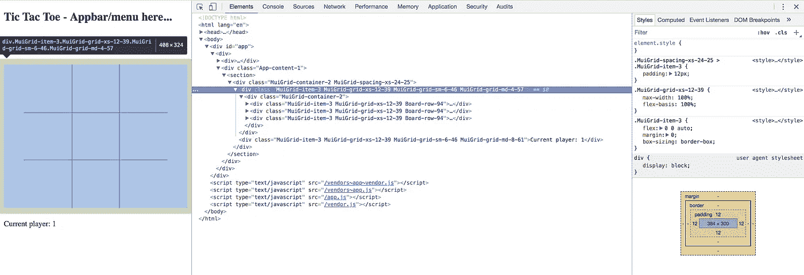
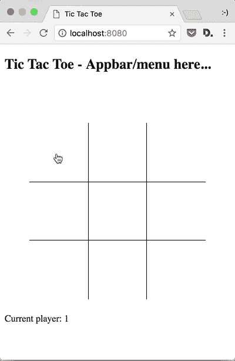

# 用 React/Redux、Babel、Webpack 和 Material-UI 构建一个井字游戏(第 3 部分，共 5 部分)

> 原文：<https://itnext.io/build-a-tic-tac-toe-game-with-react-redux-babel-webpack-and-material-ui-part-3-of-5-9e5fd9b02fcf?source=collection_archive---------0----------------------->

> [点击这里在 LinkedIn](https://www.linkedin.com/cws/share?url=https%3A%2F%2Fitnext.io%2Fbuild-a-tic-tac-toe-game-with-react-redux-babel-webpack-and-material-ui-part-3-of-5–9e5fd9b02fcf%3Futm_source%3Dmedium_sharelink%26utm_medium%3Dsocial%26utm_campaign%3Dbuffer) 上分享这篇文章

*   [第 1 部分—项目设置、依赖关系和 Hello Tic Tac Toe！app。](https://medium.com/@vanister/learn-react-redux-by-making-a-tic-tac-toe-game-part-1-of-5-dc9111ca09ad)
*   第二部分——游戏结构、状态和测试。
*   第三部分——游戏性和基本风格。
*   [第 4 部分——提示、新游戏和更多风格](/build-a-tic-tac-toe-game-with-react-redux-babel-webpack-and-material-ui-part-4-of-5-f7cb4a611481)。
*   [第 5 部分——清理和事后反思](/build-a-tic-tac-toe-game-with-react-redux-babel-webpack-and-material-ui-part-5-of-5-fe2ece35b839)。

**更新 2019 年 7 月 22 日:**项目依赖关系更新。

*   巴别塔 7.x
*   React 16.x
*   Redux 4.x
*   Webpack 4.x

查看 [package.json](https://github.com/vanister/medium.com/blob/part-3/tic-tac-toe/package.json) 获取更新的完整列表。

我们最后停止编写游戏 duck，它包含了玩完整的井字游戏所需的所有 redux 状态代码。现在我们将添加一些组件来渲染状态并玩一个游戏。我们将使用 Material-UI 来设计游戏风格，并使其适应移动、平板和桌面屏幕尺寸。最后，测试以确保我们可以玩一个完整的游戏，其中有一个赢家或平局。

## 最后的依赖项

我们首先将最后两个依赖项添加到项目中:

*   `material-ui@1.0.0-beta.43` —实现 Google 材质设计的 React 组件库(版本 1.0.0-beta.43)。
*   `classnames` —将类组合成单个字符串以分配给组件的`className`属性的实用程序。

```
yarn add classnames
yarn add --dev material-ui@next
```

## 游戏性和风格

Material-UI 或 MUI 实现了 Google Material Design，包含了我们构建 UI 所需的所有组件。我们将利用网格、图标、应用程序栏和模态来使我们的游戏手机友好。

## 更新入口点

我们不使用 MUI 提供的额外字体和图标库，而是直接从 Google 的 CDN 引用它们。打开`index.html`文件，添加 MUI 的字体和图标参考。

```
<!DOCTYPE html>
<html>
<head>
  **<link rel="stylesheet" href="https://fonts.googleapis.com/css?family=Roboto:300,400,500">** **<link rel="stylesheet" href="https://fonts.googleapis.com/icon?family=Material+Icons">**
  ...
  ...
</head><body>
  ...
</body></html>
```

然后，我们需要更新我们的`index.js`文件，以便在游戏首次加载时调度一个新游戏。

由于我们没有持续状态，我们可以做一个快速检查，如果初始状态为空，然后在我们渲染应用程序组件之前调度一个动作来开始一个新游戏。

## 正在清理应用程序组件

在最后一部分中，我们添加了一些临时代码来验证我们的 redux 存储和 ducks 工作正常。我们现在可以清理代码并开始设计应用程序组件了。

## 游戏组件

游戏组件将是我们的第一个容器组件，当游戏被玩家交互时，它将使用 duck 来获取状态和调度动作。

列出我们的道具类型是一个好主意，即使大部分(如果不是全部的话)来自更高级的组件(第 65-71 行)。

由于这是游戏的一个核心组件，我们想设计它的风格，使它能够适应屏幕尺寸的变化。当屏幕是移动尺寸时，我们将它布置在两行的网格中，当屏幕是平板电脑或更大时，我们将它布置在两列的网格中。

如果我们定义每个网格项目总计 12 个大小，那么网格组件将为我们处理屏幕断点。

我们还添加了一个事件处理程序`handleBoardOnMove`，来处理用户点击游戏中的方块。

## 电路板组件

Material-UI 使用 JS 中的 [CSS 将一个将属性映射到类的 JavaScript 对象转换成可以应用于组件中元素的 CSS 类。](https://material-ui-next.com/customization/css-in-js/)

你可能已经看到了应用和游戏组件中的`withStyles`和`const styles = () => ({...})`模块。它们在那里很少使用，但在这里却被大量使用来设计电路板组件的样式。我们将样式隔离到组件中，而不是 CSS 文件中，因为它们只适用于特定的组件。这使得更新样式及其使用位置变得容易，而不是必须在 CSS 文件中查找，然后在组件中找到。缺点是很难跟踪组件中自动生成的类名以及它们应用于组件的特定顺序。



JS 或 JSS 中 CSS 的示例输出

棋盘是一个简单的表示组件，它将从游戏组件中获取棋盘状态，并将其呈现在网格中。当一个方块被点击时，它还会调用带有坐标的`handleBoardOnMove`处理程序。

样式:

*   `square` —游戏网格中一个 100x100px 的正方形。
*   `marked` —如果有玩家占据方块，则应用此样式，它设置不允许的光标样式，以便玩家知道这是一个不能点击的方块。
*   `row` —网格中的一行，居中对齐。
*   `x_y` —使网格看起来像传统井字游戏网格的边框样式。如果我们把它应用到所有的正方形，我们会得到一个每个边界都被填充和加厚(重叠)的框格。

## 方形部件

最后，我们有平方部分。这是另一个表示组件，它接受一个玩家并呈现一个代表该玩家或空白的图标。我们应用了一种字体大小样式，使其足够大以填充大部分正方形。

我从[材质图标中选择了两个与`X`和`O`非常相似的图标](https://material.io/icons/)。不一定要用我选的，任何图标都可以。

## 玩个游戏！

运行`yarn start`我们应该可以玩一个完整的游戏。我们必须刷新浏览器来开始一个新游戏，但我们将在下一部分中通过添加一个带有汉堡菜单的标题和一个告诉我们谁赢了并可以选择开始一个新游戏的对话框来解决这个问题。



## 未完待续…

在下一部分，我们将通过添加标题、菜单、玩家信息和一个在游戏结束时通知玩家的对话框来完成游戏。

这部分的来源可以在这里找到:[https://github.com/vanister/medium.com/tree/part-3](https://github.com/vanister/medium.com/tree/part-3)