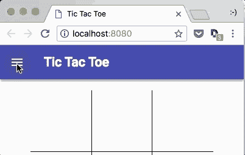
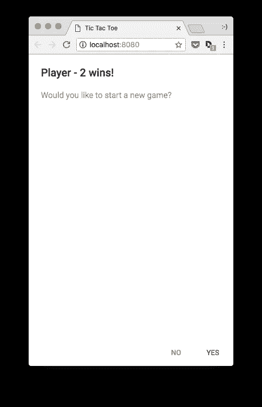
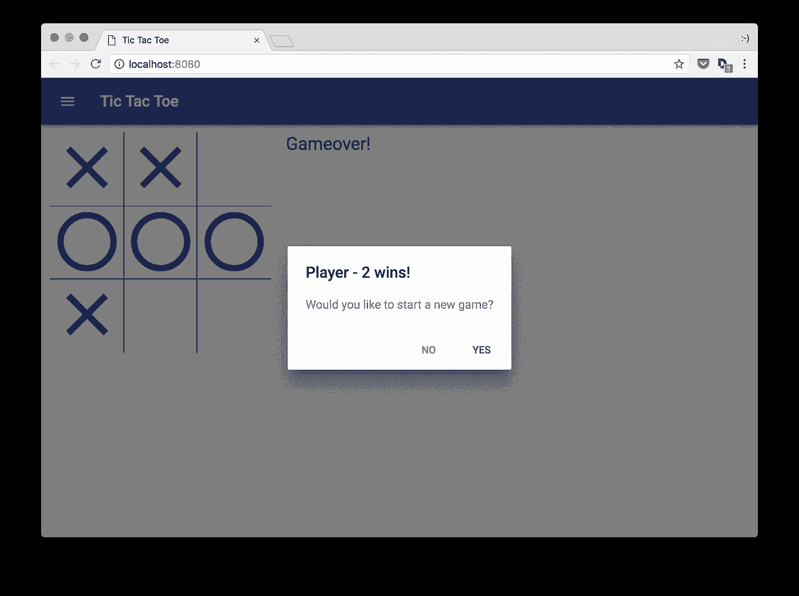

# 用 React/Redux、Babel、Webpack 和 Material-UI 构建一个井字游戏(第 4 部分，共 5 部分)

> 原文：<https://itnext.io/build-a-tic-tac-toe-game-with-react-redux-babel-webpack-and-material-ui-part-4-of-5-f7cb4a611481?source=collection_archive---------8----------------------->

*   [第 1 部分—项目设置、依赖关系和 Hello Tic Tac Toe！app。](https://medium.com/@vanister/learn-react-redux-by-making-a-tic-tac-toe-game-part-1-of-5-dc9111ca09ad)
*   [第二部分——游戏结构、状态和测试。](/build-a-tic-tac-toe-game-with-react-redux-babel-webpack-and-material-ui-part-2-of-5-1608f247690d)
*   [第三部分——游戏性和基本风格。](/build-a-tic-tac-toe-game-with-react-redux-babel-webpack-and-material-ui-part-3-of-5-9e5fd9b02fcf)
*   第 4 部分——提示、新游戏和更多风格。
*   [第 5 部分——清理和事后反思](/build-a-tic-tac-toe-game-with-react-redux-babel-webpack-and-material-ui-part-5-of-5-fe2ece35b839)。

**更新 2019 年 7 月 22 日:**项目依赖关系更新。

*   巴别塔 7.x
*   React 16.x
*   Redux 4.x
*   Webpack 4.x

查看 [package.json](https://github.com/vanister/medium.com/blob/part-4/tic-tac-toe/package.json) 获取更新的完整列表。

在第 3 部分中，我们添加了材质-用户界面和组件布局，并玩了一个完整的游戏。在这一部分，我们将添加完成游戏所需的剩余组件和样式。

## 标题栏和菜单组件

为了让我们能够开始一个新游戏，而不必先玩完整个游戏，我们需要添加一个标题栏和一个菜单组件。

标题栏组件是一个容器组件，它将显示游戏的标题并保存游戏的菜单组件。我们认为它是一个容器组件，因为它将保存本地状态并响应来自菜单交互的事件。

Menu 组件是一个演示组件，它显示一个菜单并调用从标题栏组件传递给它的事件处理程序。

我选择了`fiber_new`图标，因为它有“新”的字样。你可以从[材质图标](https://material.io/icons/)中选择任何你想要的图标作为新游戏物品的占位符。

## 更新应用程序组件

现在我们已经创建了标题栏和菜单组件，我们将通过用标题栏替换占位符标题来更新应用程序组件。



如果我们现在运行游戏，我们应该会看到一个蓝色的标题栏，左侧有一个汉堡菜单，我们可以在这里切换“新游戏”菜单。

## PlayerInfo 和 GameoverDialog 组件

接下来，我们将添加 PlayerInfo 和 GameoverDialog。这将允许我们看到谁是当前的玩家，并在游戏结束时显示一个对话框。该对话框还允许我们触发一个新游戏，而不必关闭它，并使用“新游戏”菜单。

PlayerInfo 组件是一个简单的表示组件，它接受一个`player`和`gameover`并显示当前玩家或游戏结束消息。

Gameover 对话框，也是一个演示组件，将显示一个获胜的玩家或平局游戏消息，并根据玩家开始新游戏或关闭对话框的动作触发事件。

## 更新操作

因为我们要从游戏组件中显示游戏结束对话框，所以我们需要更新`checkWinner`操作，如果有赢家，返回一个布尔值。

在游戏鸭的`test.js`文件中，通过将`checkWinner`函数的返回值赋给一个变量来更新我们为`checkWinner`编写的测试。添加`expect`语句，检查每个测试是否返回正确的值。

打开`operations.js`文件，为`hasWinner`添加一个变量，将其设置为`true`或`false`，并将其返回给调用者。

运行`yarn test`以确保我们所有的测试仍然通过。

## 更新游戏组件

最后一步是用 PlayerInfo 和 Gameover 对话框组件更新游戏组件。

像标题栏一样，我们将保留一些本地状态来跟踪是否在游戏结束时显示或隐藏游戏结束对话框。我们将添加两个新的事件处理程序来处理当对话框想要关闭时，以及当玩家点击“是”或“否”时

当玩家点击“否”或在对话框外的灰色空间(平板电脑或更大的屏幕)时，我们通过将本地状态`showDialog`设置为`false`来处理。如果玩家点击“是”,我们将调度`newGame`动作开始新游戏。

最后，我们用 PlayerInfo 组件替换旧的玩家信息。



手机游戏结束对话



平板电脑或更大的游戏结束对话框

## 玩完整个游戏

运行`yarn start`启动完成的游戏。

由于我们首先关注的是移动设备，所以让我们尝试使用 Chrome 的设备仿真在移动设备上进行游戏。


## 可选:部署到 Surge.sh

如果你真的想在移动设备上玩游戏，你可以在 [surge.sh](http://surge.sh/) 上创建一个免费帐户，安装 surge npm 模块，然后将`./dist`目录部署到一个定制的 surge 域。

我会用一个新的脚本来更新`package.json`文件，你所需要做的就是运行它，一旦你的账户被创建，就可以发布它。

```
// install surge globally so you can use it anywhere
yarn global add surge// then we run the script to publish
yarn surge// console output:
$ yarn build && surge ./dist
$ yarn clean && webpack --config webpack.config.js --progress
$ rimraf ./dist// build output:
// ...
// ...// surge sample output:
Running as <your_account>project: ./distdomain: <autogenerated-domain>.surge.shupload: [====================] 100% eta: 0.0s (9 files, 3238471 bytes)CDN: [====================] 100%IP: <surge_ip_address>Success! - Published to <autogenerated-domain>.surge.sh
```

运行，`yarn surge`，会构建 app，然后发布到 surge。我已经使用 surge 将第 4 部分的代码发布到下面的 url。

 [## 井字游戏—第 4 部分

### 注意:这可能会在几周后过期…

超级建议. surge.sh](https://super-advice.surge.sh/) 

## 未完待续…

就这样吧，下一集也是最后一集再见。

本部分来源:【https://github.com/vanister/medium.com/tree/part-4 