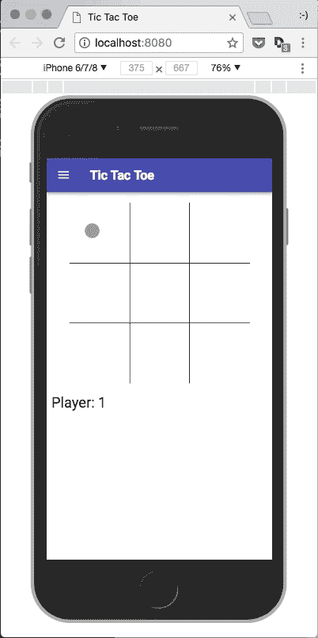

# 用 React/Redux、Babel、Webpack 和 Material-UI 构建一个井字游戏(第 5 部分，共 5 部分)

> 原文：<https://itnext.io/build-a-tic-tac-toe-game-with-react-redux-babel-webpack-and-material-ui-part-5-of-5-fe2ece35b839?source=collection_archive---------2----------------------->

*   第 1 部分—项目设置、依赖关系和 Hello Tic Tac Toe！app。
*   [第二部分——游戏结构、状态和测试。](/build-a-tic-tac-toe-game-with-react-redux-babel-webpack-and-material-ui-part-2-of-5-1608f247690d)
*   [第三部分——游戏性和基本造型。](/build-a-tic-tac-toe-game-with-react-redux-babel-webpack-and-material-ui-part-3-of-5-9e5fd9b02fcf)
*   第 4 部分——提示、新游戏和更多风格。
*   **第 5 部分—清理和事后反思。**

## 清除

游戏很简单，所以我们没有太多需要清理的地方。我们可能会将棋盘组件分解为行和方块，并将样式移动到它们各自的组件中。

如果我们想更好地记录我们的状态和闪避，我们可以清理或改进一些 JSDocs。

除了这些项目，我们没有太多其他可以做的来清理游戏。

## 事后思考

我选择不做 [Jest 快照测试](https://facebook.github.io/jest/docs/en/snapshot-testing.html),因为这会让写帖子的时间比做一个简单的井字游戏要长得多。一个很好的练习是把完成的游戏带回去，为游戏中的所有状态添加快照测试。也许在另一个帖子里？

按照游戏的设计方式，可以很容易地返回并添加更改玩家姓名的功能，让玩家选择自己的图标，记分，保持当前的游戏状态，甚至可以通过 Firebase 或类似的服务支持在线多人游戏。

我希望你喜欢阅读这些帖子，因为创作这个游戏和写这个过程很有趣。

 [## vanister/medium . com/井字游戏/master

### 最后，工作，游戏。

github.com](https://github.com/vanister/medium.com/tree/master/tic-tac-toe)