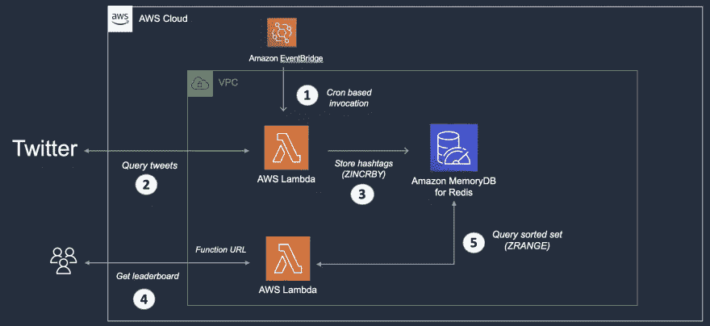
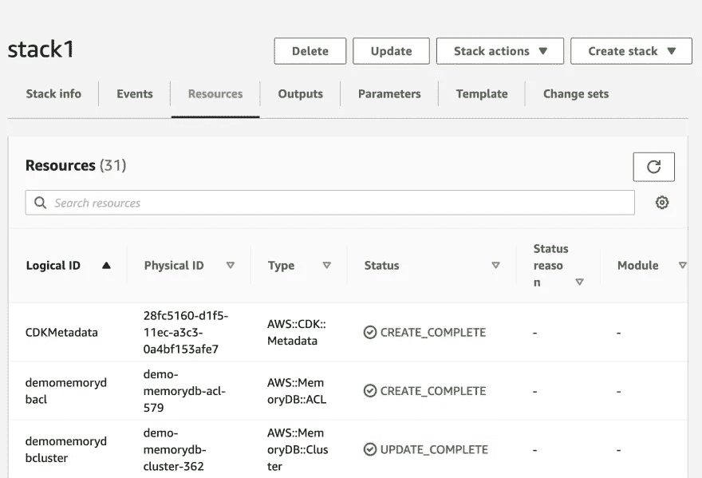
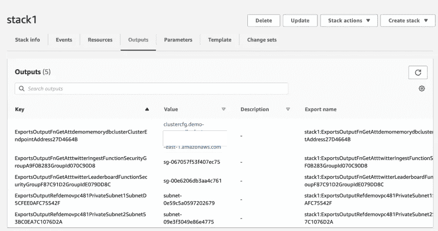
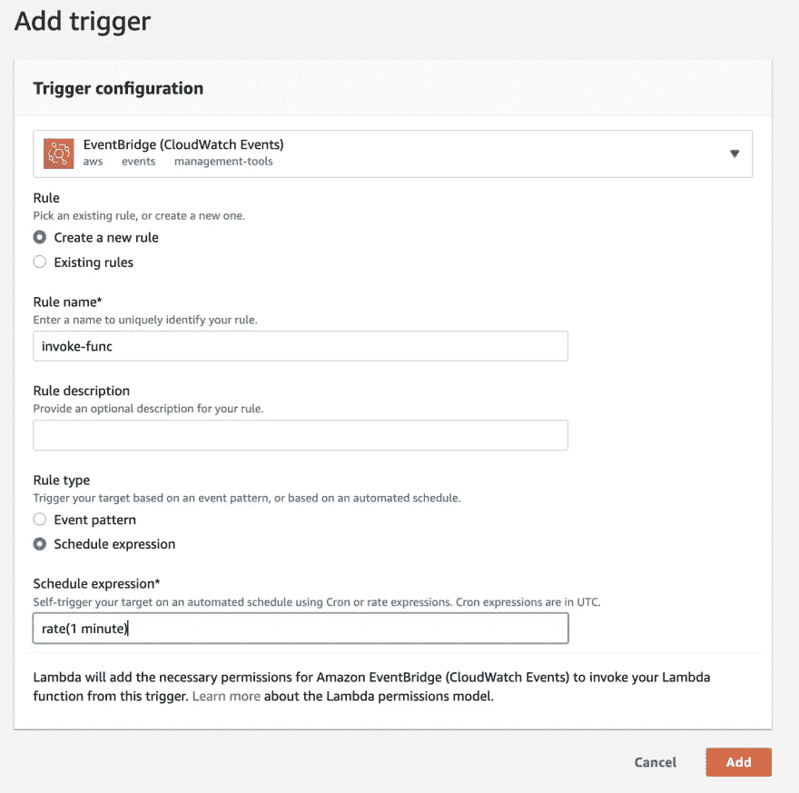
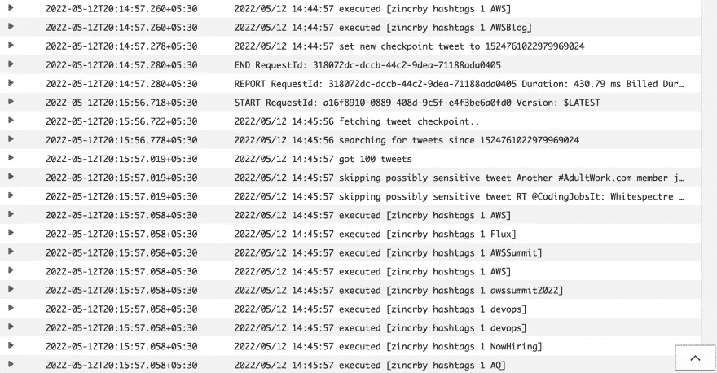
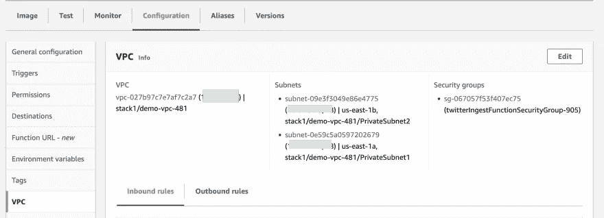

# 用 Redis 和 AWS Lambda 构建一个 Twitter 排行榜应用程序(第 1 部分)

> 原文：<https://itnext.io/build-a-twitter-leaderboard-app-with-redis-and-aws-lambda-part-1-670e7a8c6a91?source=collection_archive---------3----------------------->

你好，欢迎👋🏼这个由两部分组成的博客系列使用一个简单而实用的应用程序来演示如何将 Redis 与 AWS Lambda 集成。第一部分(这一部分)涵盖了应用程序——在本博客结束时，您应该已经部署了解决方案，并对其进行了测试，在此过程中，您对解决方案有了一个很好的了解。

第二部分是关于基础设施(具体是 IaaC)方面——主要围绕 AWS CDK 以及一些代码演练。

在本博客系列的课程中，您将了解到:

*   如何一起使用 Lambda 和 Redis 包括 VPC 和其他配置来使事情工作
*   如何使用 Lambda 函数 URL
*   如何将 Lambda 函数部署为 Docker 容器(不是 zip 文件)
*   使用 AWS CDK 创建解决方案的所有组件—基础架构(VPC、子网等。)、数据库以及 Lambda 函数(这包括单个 CDK 应用程序环境中的多个堆栈)

我已经将 [Go](https://go.dev/) 用于 Lambda 函数( [aws-lambda-go](https://github.com/aws/aws-lambda-go) )以及基础设施(带有 [CKD Go 支持](https://docs.aws.amazon.com/cdk/v2/guide/work-with-cdk-go.html))，但是您应该能够很容易地将这些概念应用到您选择的编程语言中。

> *一如既往，代码为* [*可在 Github*](https://github.com/abhirockzz/twitter-leaderboard-app) 上获得

下面是该解决方案中涉及的服务的简要概述:

*   [Amazon MemoryDB for Redis](https://docs.aws.amazon.com/memorydb/latest/devguide/what-is-memorydb-for-redis.html)—这是一种持久的内存数据库服务，与 Redis 兼容，从而使您能够使用他们目前已经使用的灵活友好的 Redis 数据结构、API 和命令来构建应用程序。
*   [Lambda 函数 URL](https://docs.aws.amazon.com/lambda/latest/dg/lambda-urls.html) 是一个相对较新的特性(在撰写这篇博客时)，它为您的 Lambda 函数提供了专用的 HTTP(S)端点。当您只需要一个功能端点(例如作为一个 webhook)并且不想设置和配置 API 网关时，它真的很有用。
*   AWS 云开发套件 (CDK)完全是关于 IaaC(基础设施即代码)的。它是一个在代码中定义云基础设施并通过 AWS CloudFormation 提供它的框架。您可以从支持的编程语言列表中进行选择(在编写时— TypeScript、JavaScript、Python、Java、C#/。Net，并(在开发者预览版中))将基础设施组件定义为代码，就像您对任何其他应用程序所做的那样！

# Twitter 标签排行榜应用

别担心，这比听起来简单！这是高级架构:



该解决方案可以分为两个逻辑部分:

*   第一部分处理 tweet 摄取:Lambda 函数(从 Twitter)获取 tweet，提取每个 tweet 的 hashtags，并将它们存储在 MemoryDB 中(在 Redis 排序的集合中)。该函数根据基于 CloudWatch 触发器中的规则的计划被调用
*   第二部分提供了排行榜功能:这是另一个 Lambda 函数，它提供了一个 HTTP(s)端点(由于 Lambda 函数的 URL)来查询排序后的集合并提取前 10 个标签(排行榜)

我告诉过你，这很简单！

好了，介绍完了，我们可以进入有趣的部分——部署应用程序。在此之前，请确保您已准备好以下内容:

# 要求

*   [创建一个 AWS 账户](https://portal.aws.amazon.com/gp/aws/developer/registration/index.html)(如果你还没有的话)并登录。您使用的 IAM 用户必须有足够的权限进行必要的 AWS 服务调用和管理 AWS 资源。
*   安装和配置 [AWS CLI](https://docs.aws.amazon.com/cli/latest/userguide/install-cliv2.html)
*   安装并引导 [AWS CDK](https://docs.aws.amazon.com/cdk/v2/guide/getting_started.html#getting_started_install)
*   设置[对接](https://docs.docker.com/get-docker/)
*   [安装 Go](https://go.dev/dl/)
*   获取您的 [Twitter API 证书](https://developer.twitter.com/en/docs/twitter-api/getting-started/getting-access-to-the-twitter-api)

# 部署应用程序—一次部署一个 CDK 堆栈

我们将在第二部分讨论细节。现在，只需要知道这个解决方案的基础设施部分由三个(CDK) [栈](https://docs.aws.amazon.com/cdk/v2/guide/stacks.html)组成(在单个 [CDK 应用](https://docs.aws.amazon.com/cdk/v2/guide/apps.html)的上下文中)。虽然有可能将它们一起部署(用`cdk deploy --all`)，但我们将一个一个来做。这样，您可以回顾每个阶段发生的事情，反思已经创建的组件，并更好地理解所有东西是如何连接在一起的。

首先，克隆 Github repo:

```
git clone [https://github.com/abhirockzz/twitter-leaderboard-app](https://github.com/abhirockzz/twitter-leaderboard-app)
```

# 从基础架构开始…

第一个堆栈部署了一个 [VPC](https://docs.aws.amazon.com/vpc/latest/userguide/what-is-amazon-vpc.html) (以及子网、NAT 网关等。)，一个用于 Redis 集群和一些安全组的 MemoryDB。

为 MemoryDB 选择一个您自己选择的密码，并将其导出为一个环境变量(这只是出于演示目的—对于生产，您将有特定的进程来处理敏感信息)

请注意密码要求。来自[文档](https://docs.aws.amazon.com/memorydb/latest/devguide/clusters.acls.html):

*"特别是，在对 MemoryDB 使用 ACL 时，请注意这些用户密码限制:*

*   *密码必须是 16-128 个可打印字符。*
*   *不允许使用以下非字母数字字符:，" "/ @。”*

转到正确的文件夹，开始堆栈部署:

```
export MEMORYDB_PASSWORD=<enter a password e.g. P@ssw0rd12345678>cd cdk# stack1 is the name of the stack - used for simplicity
cdk deploy stack1
```

有许多事情要做。虽然 CDK 正在为我们努力工作，但你需要耐心等待:)这可能是一个导航到 AWS 控制台中的`CloudFormation`并查看幕后发生的事情的好时机。



一旦栈创建完成，进入 AWS 控制台并检查您新创建的 VPC、MemoryDB 集群和其他组件！

以下是供您参考的堆栈输出:



接下来的两个栈部署了独立的 Lambda 函数。不过，在继续之前，请确保为这两个函数构建了 Go 二进制文件。

**去，建！**

移动到各自的文件夹，调用每个功能的`go build`:

```
cd tweet-ingest && GOOS=linux go build -o app
cd leaderboard-function && GOOS=linux go build -o app
```

> *为了将 Lambda 函数打包成 Docker 容器，我使用了*[*Go:1 . x base image*](https://gallery.ecr.aws/lambda/go)*。但是，您也可以探索* [*其他选项*](https://docs.aws.amazon.com/lambda/latest/dg/go-image.html) *。在部署期间(通过* `*cdk deploy*` *)，Docker 映像在本地构建，被推送到一个* [*私有 ECR 注册表*](https://docs.aws.amazon.com/AmazonECR/latest/userguide/Registries.html) *，最后 Lambda 函数被创建——所有这一切，只需几行代码！*

# 第二个堆栈—用于第一个 Lambda 函数

该函数需要您的 Twitter API 凭证(以及 MemoryDB 密码)—将它们作为环境变量播种。然后，启动堆栈创建:

```
export MEMORYDB_PASSWORD=<enter the password you had previously chosen e.g. P@ssw0rd12345678>
export TWITTER_API_KEY=<enter twitter API key>
export TWITTER_API_SECRET=<enter twitter API secret>
export TWITTER_ACCESS_TOKEN=<enter twitter access token>
export TWITTER_ACCESS_TOKEN_SECRET=<enter twitter API access token secret># note the name of the stack is stack2
cdk deploy stack2
```

这个会更快(相比`stack1`)，我保证！

一旦栈创建完成，为了使事情正常工作，需要一个手动步骤。进入 AWS 控制台，打开刚刚创建的 Lambda 函数(名为`tweet-ingest-function`，点击**添加触发器**，手动添加 CloudWatch 触发器配置。



现在你的功能会每分钟自动触发一次！

要检查事情进展如何，请查看 Lambda 函数的日志(AWS 控制台> Lambda >监视器):



我也鼓励你检查你的 Lambda 函数的 VPC 配置:



# 最后，部署排行榜功能

```
export MEMORYDB_PASSWORD=<enter the password you had previously chosen e.g. P@ssw0rd12345678># note the name of the stack is stack3
cdk deploy stack3
```

成功部署后，您应该有一个 Lambda 函数 URL 可供访问——您可以简单地从堆栈输出中复制它！


只需访问端点(我使用了`curl` CLI，但浏览器应该可以正常工作):

```
curl -i <enter lambda function URL from the stack output>
```

您应该得到一个 JSON 有效负载，其中包含关于前 10 个标签的信息，以及它们的名称和被提及的次数——类似如下:

```
[
  {
    "Score": 121,
    "Member": "AWS"
  },
  {
    "Score": 56,
    "Member": "gaming"
  },
  {
    "Score": 56,
    "Member": "RESTOCK"
  },
  {
    "Score": 56,
    "Member": "ALERT"
  },
  {
    "Score": 35,
    "Member": "aws"
  },
  {
    "Score": 26,
    "Member": "rtx3080"
  },
  {
    "Score": 26,
    "Member": "geforce3080"
  },
  {
    "Score": 24,
    "Member": "Infographic"
  },
  {
    "Score": 23,
    "Member": "箱マスク"
  },
  {
    "Score": 23,
    "Member": "startups"
  }
]
```

第一部分到此结束。在第二篇文章中，我们深入 CDK 方面，看看一些 Go 代码——再见！