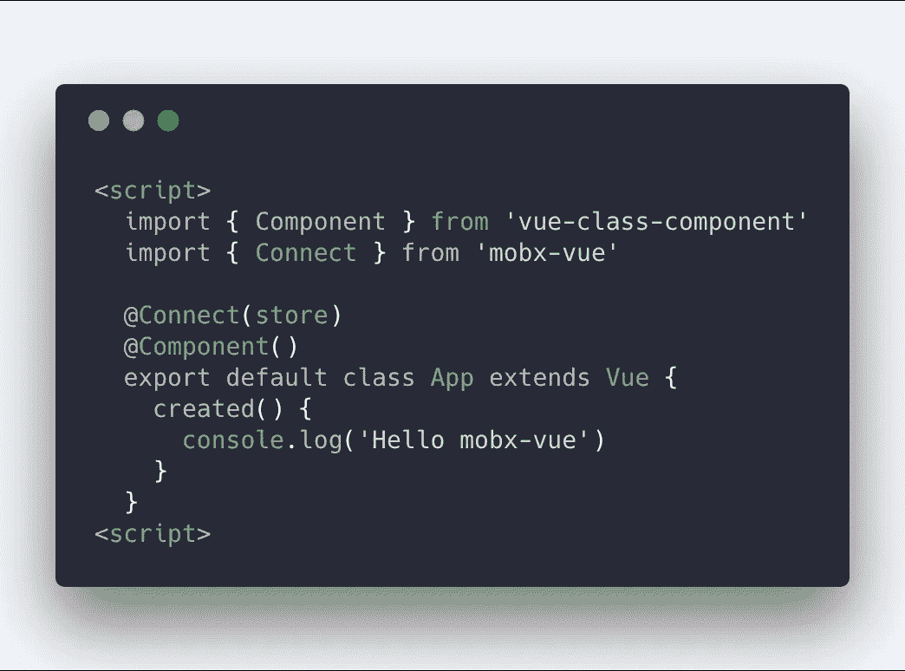

# 基于 MobX 构建无视图框架的数据层—与 Vue 集成(1)

> 原文：<https://itnext.io/build-a-view-framework-free-data-layer-based-on-mobx-integration-with-vue-1-8b524b86c7b8?source=collection_archive---------4----------------------->

*预告:* [*mobx-vue*](https://github.com/mobxjs/mobx-vue) *已被移至 mobxjs 组织！*



几周前我写了一篇文章描述 mobx 和 angularjs 的用法以及它的用途，这次我将介绍如何将 MobX 和 Vue 结合起来。

**安装**

```
npm i mobx-vue -S
```

**用途**

mobx-vue 使用起来非常简单。您只需要使用 Connect 来装饰您的 mobx 定义的 vue 组件存储:

```
<template>
    <section>
        <p v-text="amount"></p>
        <p v-for="user in users" :key="user.name">{{user.name}}</p>
    </section>
</template><script lang="ts">
    import { Connect } from "mobx-vue";
    import Vue from "vue";
    import Component from "vue-class-component";
    class ViewModel {
        [@observable](http://twitter.com/observable) users = [];
        [@computed](http://twitter.com/computed) get amount() { return this.users.length }
        [@action](http://twitter.com/action) fetchUsers() {}
    }[@Connect](http://twitter.com/Connect)(new ViewModel())
    [@Component](http://twitter.com/Component)()
    export default class App extends Vue {
        mounted() { 
            this.fetchUsers();
        }
    }
</script>
```

**为什么选择 MobX/mobx-vue**

我们知道 MobX 和 Vue 都是基于数据劫持和依赖收集来实现响应机制的。mobx 官方也几次提到受 vue 启发的*。那么我们为什么要把两个几乎一样的东西组合在一起呢？*

> 是的，很奇怪。

2016 年，我在构建公司级组件库的时候，就开始思考一个问题:当代码库是基于一个特殊的框架时，我们未来如何尽可能省力地将组件库迁移到其他框架/库？不能基于新技术完全重写，那浪费生命。除了基本的控件，交互/行为逻辑基本上是可确定的，最多在 UI 中做一些调整。公司简单推倒底层库去尝试新技术也是非常不负责任的。所以我们要接受被框架绑架，卡在一个技术栈里卡住？对于一个前端框架半衰期特别短的领域来说显然是不可接受的，结果要么有人离职，要么找不到人一起补洞……简单来说就是享受不到新技术的好处。

从 MVVM 架构来看，应用越重，复杂度越集中在 M (Model)和 VM (ViewModel)两层，尤其是模型层。理论上应该是独立于上层视图独立运行/测试/发布。不同的视图框架只使用具有不同绑定语法的动态模板引擎，我在以前的文章中已经介绍过了..如果我们把视图层做得很薄，我们迁移的成本自然会降到一个可以接受的范畴，甚至有可能通过工具在编译时自动生成不同框架的视图层代码。

为了使模型甚至 ViewModel 可以独立地重用，我们需要一个通用的、与框架无关的状态管理机制来帮助我们描述数据模型之间的依赖图。期间尝试了 ES6 accessor、redux、rxjs 等解决方案，都不尽如人意。存取器太低级异步不友好，redux 开发体验太差，rxjs 太重等等。直到我遇到了 MobX: MobX 足够简单，无绑定，面向 oop，无框架，其他特性完全符合我的需求。

在过去的一年里，我尝试在 react、angularjs 和 angular 上构建一个基于 MobX 的 VM/M 层。有两个在线项目和一个个人项目。实际效果基本达到了我的预期。在架构上，我们只需要使用相关的连接器在基于同一数据层的不同框架之间进行切换。现在只有 Vue 还没有用这套思路验证。

在 mobx-vue 之前，社区已经有了一些优秀的连接器实现，比如 [move](https://github.com/nighca/movue) [vue-mobx](https://github.com/dwqs/vue-mobx) ，但它们基本上都是基于 vue 的插件机制，受 vue-rx 的启发，除了使用的繁琐，最大的问题是实现都是基于 vue.util.defineReactive，也就是说，是基于 Vue 自身的响应机制。这不仅在一定程度上浪费了 MobX 的反应能力，而且会以可预测的行为迁移到其他视图框架中(也就是说，你无法确定 Vue 或 MobX 是谁对状态变化做出反应)。

理想情况下，mobx 应该管理数据依赖性，vue 只需对 mobx 做出反应并进行重新渲染。Vue 被当作动态模板渲染引擎，就像 react 一样。

**mobx-vue 如何工作**

既然我们的目标是把 vue 变成一个纯粹的模板渲染引擎(vdom)并且使用 mobx 的 reactive 机制来代替 vue 的，那么只要劫持 vue 组件的组件挂载和更新方法，然后在组件挂载时收集依赖项，在依赖项更新时更新组件。

以下将称为 mobx-vue 的工作原理，而不是 vue 的工作原理:

我们知道 Vue 通常是这样初始化的:

```
new Vue({ el: '#app', render: h => h(App)});
```

然后我们找到了 Vue 构造函数:

```
function Vue (options) {   ......   this._init(options) }
```

转到 _init 函数，我们找到了$mount 函数:

```
if (vm.$options.el) {   vm.$mount(vm.$options.el) }
```

以 web 运行时为例，$mount 函数是:

```
if (process.env.NODE_ENV !== 'production' && config.performance && mark) {
    updateComponent = () => {
        ...
    }
} else {
    updateComponent = () => {
        vm._update(vm._render(), hydrating)
    }
}vm._watcher = new Watcher(vm, updateComponent, noop)
```

可以看到，updateComponent 方法将是组件更新的关键入口，跟进 Watcher 构造函数，看看 Vue 是如何调用这个方法的:

```
constructor (
    vm: Component,
    expOrFn: string | Function,
    cb: Function,
    options?: Object
  ) {
    ...
    this.expression = process.env.NODE_ENV !== 'production'
      ? expOrFn.toString()
      : ''
    // parse expression for getter
    if (typeof expOrFn === 'function') {
      this.getter = expOrFn
    } else {
      this.getter = parsePath(expOrFn)
      ...
    }
    this.value = this.lazy
      ? undefined
      : this.get()
...........get () {
    ...
    try {
      value = this.getter.call(vm, vm)
    } catch (e) {
      ...
  }
```

现在我们可以发现组件加载/更新的发起方是:value = this.getter.call(vm，vm)，我们可以通过:vm 得到方法引用。_watcher.getter，意思是 updateComponent := vm。_watcher.getter。

所以我们只需要在“$mount”之前，直接将 MobX 管理的数据嵌入到组件上下文中，让 MobX 在调用“$mount”时收集相应的依赖关系，并在 MobX 检测到发生变化时调用“updateComponent”。这不仅允许 MobX 的反应机制以一种简单的方式侵入 Vue 系统，还保证了组件的原生行为不受影响(生命周期挂钩等。).

根本就是利用 MobX 的反应机制来接管 Vue 的 Watcher，将 Vue 降级为一个纯粹的 vdom 渲染引擎。

核心实现非常简单:

```
const { $mount } = Component.prototype;Component.prototype.$mount = function (this: any, ...args: any[]) {
    let mounted = false;
    const reactiveRender = () => {
        reaction.track(() => {
            if (!mounted) {
                $mount.apply(this, args);
                mounted = true;
            } else {
                this._watcher.getter.call(this, this);
            }
        });return this;
    };
    const reaction = new Reaction(`${name}.render()`, reactiveRender);
    dispose = reaction.getDisposer();
    return reactiveRender();
};
```

下面是完整的代码:[https://github . com/mobxjs/mobx-vue/blob/master/src/connect . ts](https://github.com/mobxjs/mobx-vue/blob/master/src/connect.ts)

**结论**

[尤雨溪](https://medium.com/u/4f198f5f1f12?source=post_page-----8b524b86c7b8--------------------------------)说过: [mobx + react 是一个更啰嗦的 Vue。](https://twitter.com/youyuxi/status/736939734900047874)本质上就是这样，mobx & react 组合的能力正是 Vue 与生俱来的。而 mobx-vue 做的恰恰相反:降级 vue 来反应，然后用 mobx 升级到 Vue。这真的很奇怪。但是，我想说的是，我们的初衷并不是指 Vue 的 reactive 机制实现得不够好，想用 mobx 取而代之，而是想通过 MobX 这种相对中立的状态管理平台，为不同的视图层技术提供一个相对通用的数据层编程范式，试图平滑不同框架和技术栈之间的语法差异，以便为开发者提供更多的视图技术的决策权和可能性，而不会陷入一个框架中。