# 建立一个不会崩溃的投票网站——第二部分。现在用 Amplify。

> 原文：<https://itnext.io/build-a-voting-website-that-doesnt-crash-part-two-now-with-amplify-9e4746b757e7?source=collection_archive---------0----------------------->

在第一篇文章中，我们在不到一个小时的时间里建立了一个无服务器的投票网站。现在让我们再做一次，这次使用 AWS Amplify。

我给自己设定了一个挑战，在一个小时内建立一个高度可扩展的、[无服务器投票网站](https://vote.jbes.dev/)，并在[这篇文章](/build-a-voting-website-that-doesnt-crash-under-load-in-under-an-hour-1c0948307773)中发表了结果。虽然这是一个概念验证，但部署过程并不理想——我必须手动创建一个 DynamoDB 表，设置 API 网关并配置我的 IAM 权限，这与捆绑和托管前端是分开的。

在这篇博文中，我再次探讨了这个问题，仍然使用 Vue 作为前端，但这次引入了 AWS Amplify 作为协调后端的一种方式。目标是生成相同的应用程序，但具有更少的活动部分和更易于维护的架构，以便将来进行修改。

# 为什么我们需要放大器？

使用无服务器后端开发 JavaScript 前端的一个问题是，您最终会有两个不同的代码库，实际上创建了两个不同的应用程序。这使得在两者之间同步变更变得很困难，尤其是在处理多个版本或不同环境时(例如，dev 和 prod)。

通常还涉及大量样板代码——仅仅是为 DynamoDB 表设置一个基本的 CRUD 接口，就需要同样的 100 行代码来反复实现 REST API。将精力集中在为客户关心的特性编写代码上是很好的，而不必担心管道问题。

Amplify 是相当长一段时间以来 web 和移动应用程序开发人员的最大新闻。这是 AWS 为 web 和移动开发设计的固执己见的框架，但对于 JavaScript 开发人员来说，它包括了所有最流行的单页应用程序库和框架，如 React 和 Vue。它将后端服务视为您可以与之交互的组件，并代表您管理所有的配置和交互。

简而言之，如果你有一个需要数据库、授权和 S3 桶的 web 前端，不用再找了——我们可以在几分钟内从 Amplify 完成所有这些工作，而无需冒险进入 AWS 控制台。最初的投票应用程序使用 API Gateway 与 DynamoDB 交互来管理投票记录，在本练习中，我们将使用由 Amplify 框架管理的相同组件。

> 在[https://aws-amplify.github.io/docs/](https://aws-amplify.github.io/docs/)了解更多关于 Amplify 框架的信息。

# 入门指南

首先，在我们开始之前，确保您已经安装了节点和 AWS CLI 。我使用的是 VSCode，但是你可以随意使用你最喜欢的 IDE。

## 设置 Vue 应用程序:

1.  为应用程序创建一个空目录，并在这里打开一个控制台。
2.  安装 Vue CLI: `npm install -g @vue/cli`。
3.  创建一个新的 Vue 项目:`vue create pollcounter`。接受项目默认值。
4.  换上新的目录:`cd pollcounter`。

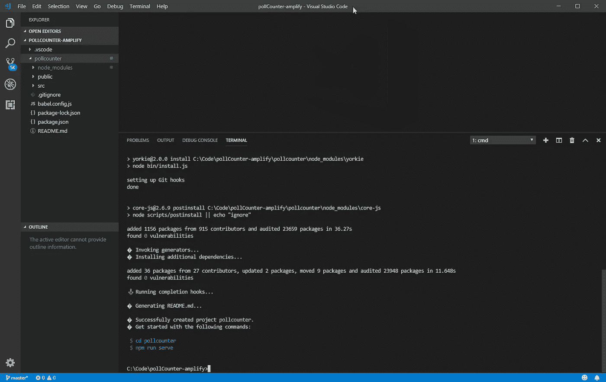

在 VSCode 中初始化 Vue 项目。

## 设置放大器:

1.  现在安装 Amplify 及其 Vue 专用组件:`npm install --save aws-amplify aws-amplify-vue`。
2.  初始化放大:`amplify init`。接受默认值，并根据您的环境回答问题，例如:

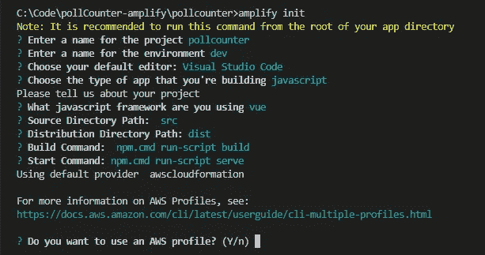

这将在您的 AWS 帐户中创建一些资源，之后您就可以在 Vue 项目中使用 Amplify 了。

# 配置后端服务

在这一步中，我们将为应用程序定义 AWS 服务。上一次，我们在 AWS 控制台中手动完成了这项工作，但是这里要简单得多。该应用程序的架构如下所示:

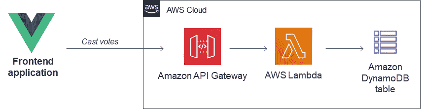

为了在 Amplify 中实现这一点，我们发出命令`amplify add api`，然后回答配置过程中的提示:

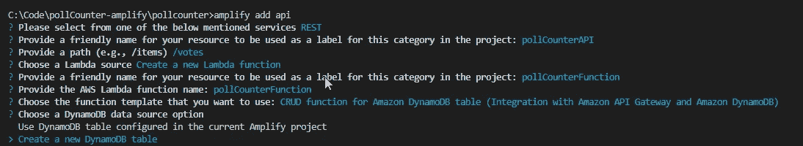

这里的一个重要部分是为资源提供有意义的名称——这使得后面的过程更加容易。一旦到达*创建一个新的 DynamoDB 表*，继续回答，如下所示:

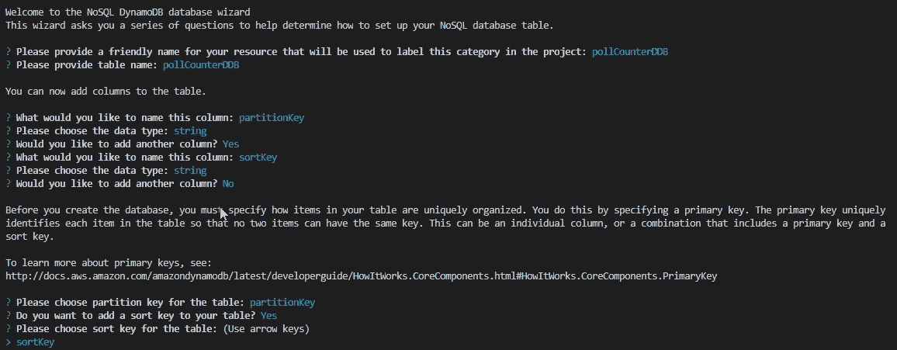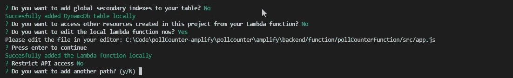

最后，选择“否”添加另一个路径并完成设置。文件 app.js 现在应该在编辑器中打开了——在这里您可以看到它已经为我们的 API 资源连接了基本方法。投票应用程序只使用两种方法:

*   GET:用于检索投票总数。
*   邮寄:用于投票。

您可以删除 delete 和 PUT 方法，因为不会用到它们。

让我们替换 app.post 方法—在我们的例子中，我们希望更新投票计数，而不是插入一个项目:

```
/************************************
* HTTP post method for insert object *
*************************************/app.post(path, function(req, res) { if (userIdPresent) {
   req.body['userId'] =
   req.apiGateway.event.requestContext.identity.cognitoIdentityId || UNAUTH;
  } const UpdateAttribute = req.query['vote'] === 'no' ? 'votesNo' : 'votesYes' let updateItemParams = {
    TableName: tableName,
    Key: {
      partitionKey: 'poll-001',
      sortKey: 'total'
    },
    UpdateExpression: `set ${UpdateAttribute} = ${UpdateAttribute} + :val`,
    ExpressionAttributeValues:{
      ":val": 1
    },
    ReturnValues:"UPDATED_NEW"
  } dynamodb.update(updateItemParams, (err, data) => {
    if(err) {
      res.statusCode = 500;
      res.json({error: err, url: req.url, body: req.body});
    } else {
      res.json({success: 'post call succeed!', url: req.url, data: data})
    }
  })
})
```

现在已经为部署做好了准备——在控制台中输入`amplify push`,它将部署到您的 AWS 帐户。

虽然已经创建了 DynamoDB 表，但是它是空的——我们需要添加一个条目来初始化轮询的值。在 AWS 控制台中打开表，单击创建项目，然后添加以下项目:

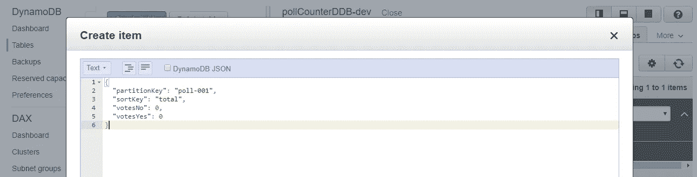

设置轮询计数器的初始值。

# 最后，添加前端

最初的应用程序是一个 VueJS 组件——除了一些小的变化，它在这里是一样的。首先，让我们连接 main.js。

## 修改 main.js

主布局使用 Vue Bootstrap，因此从命令行(和主项目目录)运行该命令来安装必要的组件:

```
npm i bootstrap bootstrap-vue --save
```

接下来，让我们将必要的 Amplify 和 Bootstrap 包添加到 main.js 文件中，以确保在应用程序启动时加载这些包。用以下内容替换整个 main.js:

```
import Vue from 'vue'
import App from './App.vue'
import Amplify from 'aws-amplify'
import awsmobile from './aws-exports'Amplify.configure(awsmobile)import BootstrapVue from 'bootstrap-vue'
import 'bootstrap/dist/css/bootstrap.css'
import 'bootstrap-vue/dist/bootstrap-vue.css'Vue.use(BootstrapVue)
Vue.config.productionTip = falsenew Vue({
  render: h => h(App),
}).$mount('#app')
```

## App.vue

与任何 Vue 文件一样，它被分为模板、脚本和样式部分。用以下内容替换现有模板部分:

```
<template>
  <div id="app" class="hello"><h1>Welcome to the Serverless Voting App. Now with Amplify!</h1>
      <h4>Click to vote on this very important issue.</h4>
      <h4>You can vote as many times as you like. Click away!</h4><b-row align-h="center" class="mt-5">
      <b-card-group deck>
        <b-card bg-variant="success" text-variant="white" header="Vote Yes" class="text-center" footer-tag="footer">
          <b-card-text>Lorem ipsum dolor sit amet, consectetur adipiscing elit.</b-card-text>
          <b-button size="lg" variant="primary"  [@click](http://twitter.com/click)="vote('yes')">Button</b-button>
          <em slot="footer">{{ votesYes }} voted</em>
        </b-card><b-card bg-variant="danger" text-variant="white" header="Vote No" class="text-center" footer-tag="footer">
          <b-card-text>Lorem ipsum dolor sit amet, consectetur adipiscing elit.</b-card-text>
          <b-button size="lg" variant="primary" [@click](http://twitter.com/click)="vote('no')">Button</b-button>
          <em slot="footer">{{ votesNo }} voted</em>
        </b-card>
      </b-card-group>
    </b-row>
    <b-row align-h="center" class="mt-5">
      <p>Questions? Ask James <a href="[https://twitter.com/jbesw](https://twitter.com/jbesw)">[@jbesw](http://twitter.com/jbesw)</a>.</p>
    </b-row>
  </div>  
</template>
```

在文件的底部，用以下代码替换 style 部分:

```
<style>
#app {
  font-family: 'Avenir', Helvetica, Arial, sans-serif;
  -webkit-font-smoothing: antialiased;
  -moz-osx-font-smoothing: grayscale;
  text-align: center;
  color: #2c3e50;
  margin-top: 60px;
}
</style>
```

现在有趣的部分是脚本部分。Amplify 允许我们在不需要 http 库(例如 Axios 或 request)的情况下调用 API，并且我们可以在不知道端点 URL 的情况下通过名称调用 API。我们只需在该部分的顶部添加一个导入，然后使用 Amplify 的 API 接口，如下所示:

```
<script>
import { API } from 'aws-amplify'
export default {
  name: 'app',
  data() {
    return {
      apiName: 'pollCounterAPI',
      votesYes: 0,
      votesNo: 0
    }
  },
  methods: {
    vote: async function (vote) {
      const init = {
        queryStringParameters: {
          vote
        }
      }
      const response = await API.post(this.apiName, '/votes', init)
      if (vote === 'yes') this.votesYes = response.data.Attributes.votesYes
      if (vote === 'no') this.votesNo = response.data.Attributes.votesNo
    },
    updateVotes: async function () {
      const response = await API.get(this.apiName, '/votes/poll-001')
      this.votesNo = response[0].votesNo
      this.votesYes = response[0].votesYes    
    }
  },
  created () {
    this.updateVotes()
    setInterval(this.updateVotes, 3000)
  }
}
</script>
```

# 部署到 AWS 云

以前，您必须运行`npm run build`，然后将生成的 dist 文件夹文件复制到您已经准备好的 S3 存储桶中，并可选地设置 CloudFront 分发。这个过程很容易出错，因为您必须正确设置各种权限，并且在部署后续版本时很容易出错。

Amplify 介绍了一种使用 [Amplify 控制台](https://docs.aws.amazon.com/amplify/latest/userguide/welcome.html)无缝部署应用程序的简单方法。你只需要将控制台指向你的代码库，它就可以*自动*完成剩下的工作。让我们试试这个。

1.  转到[https://console.aws.amazon.com/amplify/](https://console.aws.amazon.com/amplify/)。

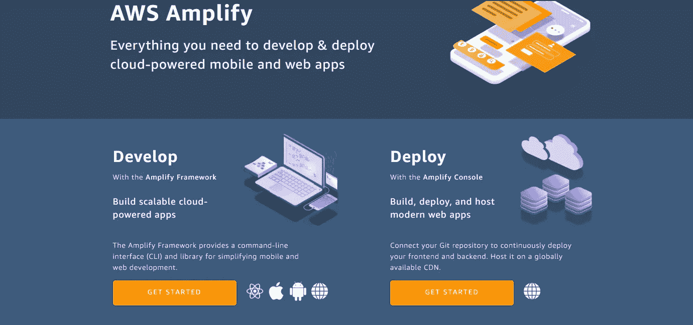

2.单击部署下的“开始”。在下一个屏幕中，选择 GitHub 并按照步骤授权访问您的 GitHub 存储库。单击下一步。

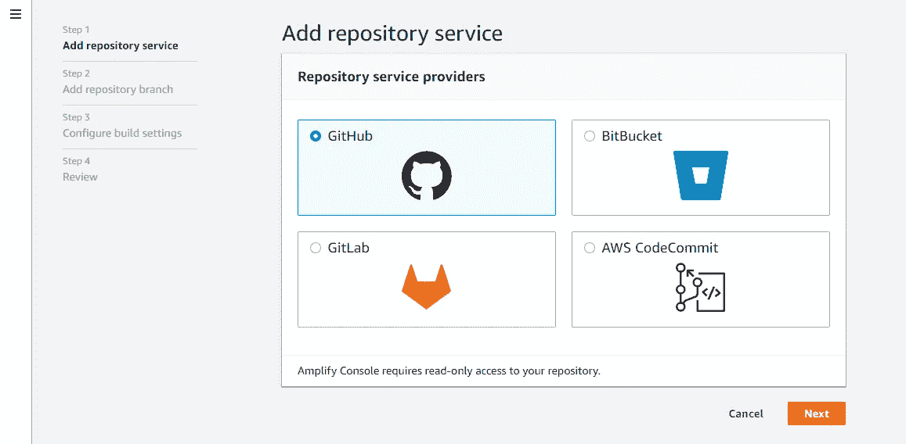

3.选择 GitHub repo 和分支，然后单击下一步:

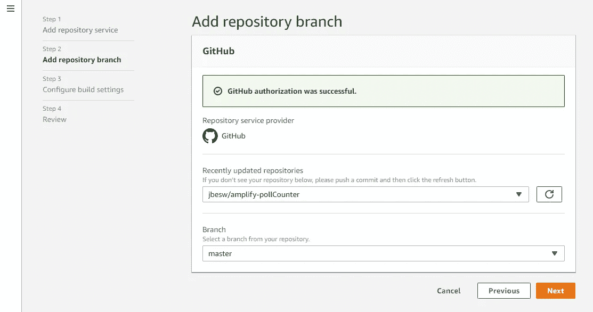

4.在“构建设置”下，选择创建新环境，单击“创建新角色”,并按照步骤创建具有必要权限的 Amplify IAM 用户:

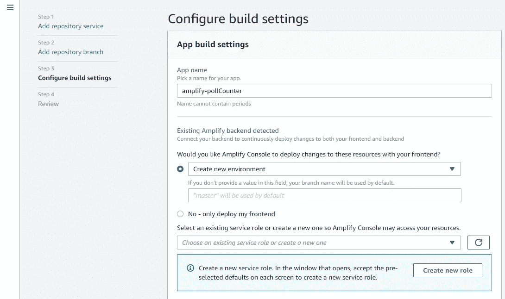

5.查看设置，然后单击“保存并部署”。屏幕顶部的横幅显示部署已经开始:

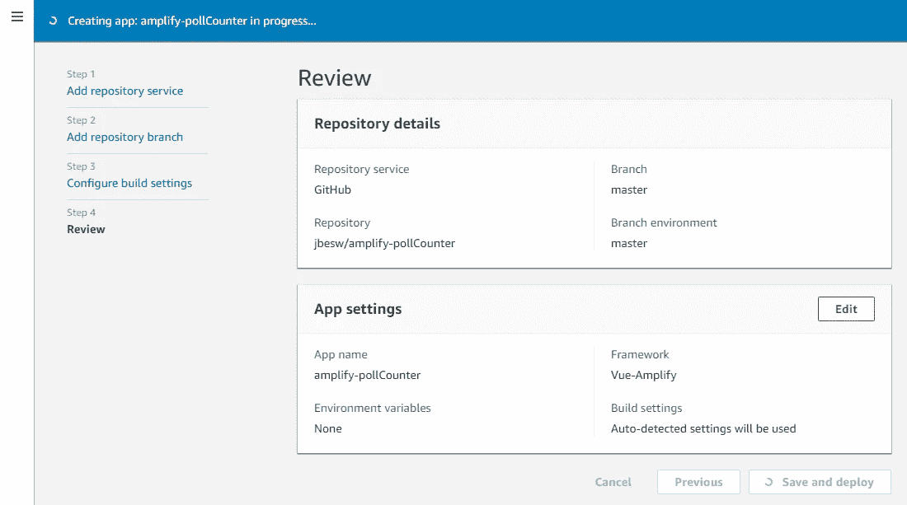

这需要几分钟的时间来完成，然后您会看到以下屏幕:

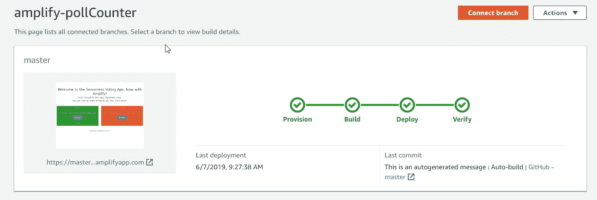

在过程的最后，Amplify 返回一个 URL，您可以在那里看到部署的应用程序。

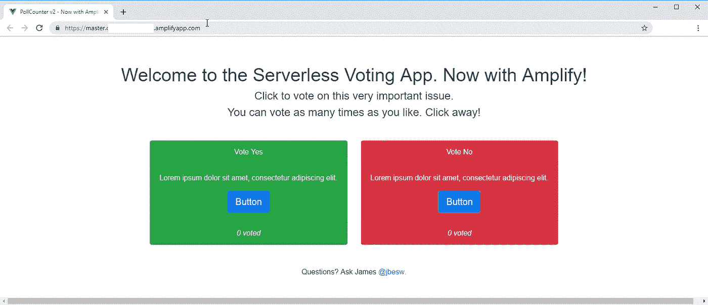

Amplify Console 还显示了您的网站如何在各种移动分辨率下呈现的截图，提供了快速的完整性检查，以确保您没有任何明显的布局问题:

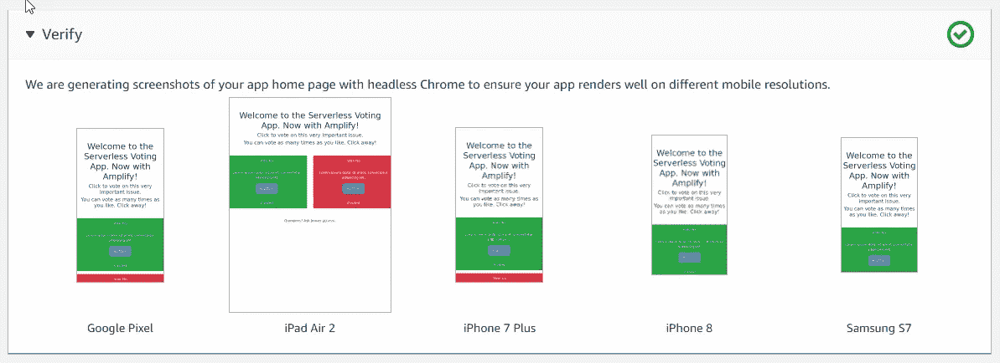

# 结论

对于使用 Vue 或 React 等单页面应用程序的 web 应用程序开发人员来说，Amplify 提供了一种简单的方式来配置和部署 AWS 服务，所有这些都来自一个代码存储库。在本文中，我们仅仅触及了它的皮毛，但是您可以看到使用这个框架管理关键资源的简单性。

在本系列的后续部分中，我将添加授权、多个环境，并用实时 GraphQL 解决方案替换 REST API。同时，如果你有任何问题，请在评论中告诉我。

> 从[https://github.com/jbesw/amplify-pollCounter](https://github.com/jbesw/amplify-pollCounter)下载该项目的代码。