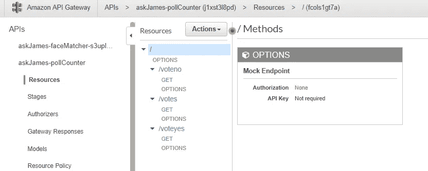
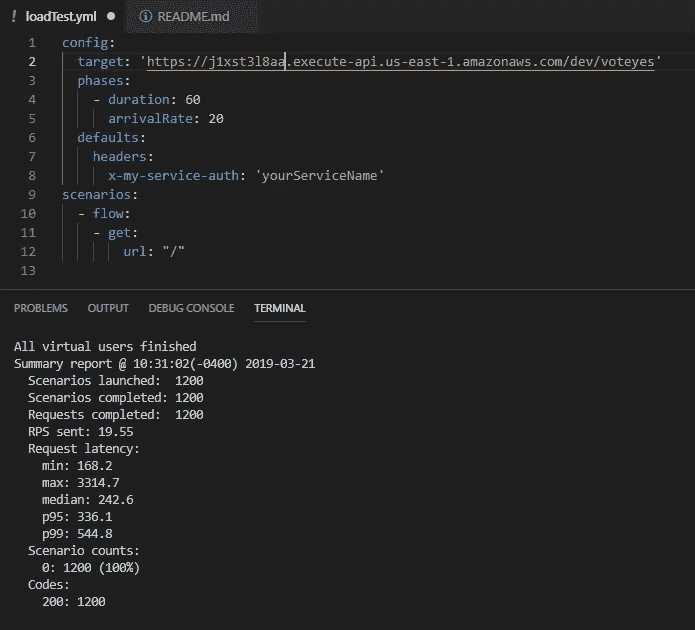
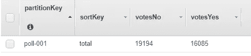
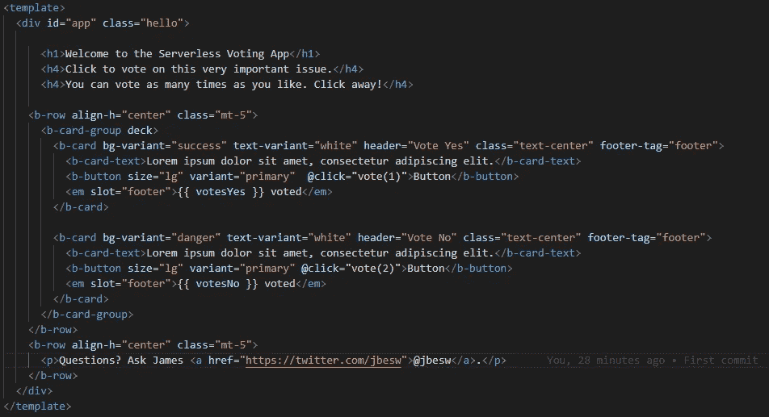
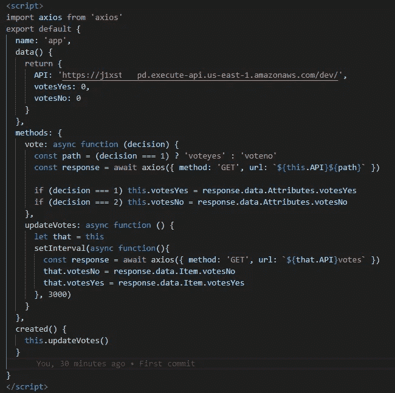
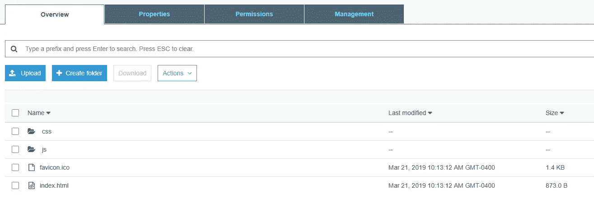
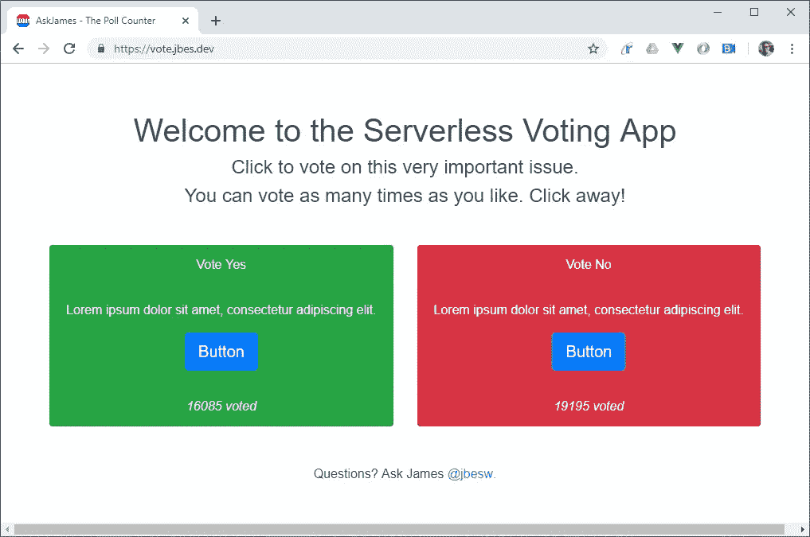

# 建立一个在负载下不会崩溃的投票网站(在一个小时内)

> 原文：<https://itnext.io/build-a-voting-website-that-doesnt-crash-under-load-in-under-an-hour-1c0948307773?source=collection_archive---------3----------------------->

*高峰交通？不可预测的负载？听起来像是无服务器的工作。*

请愿网站可能会经历需求的极端情况——当一项大众动议摆在公众面前时，不知从哪里冒出来成千上万的人。更糟糕的是，许多人在投票后留下来，按 F5 键浏览新的计票结果，给已经不堪重负的服务器增加了更多的负载:

上面的推文引用了今天英国的一篇主要新闻文章，显示了这种意外的需求如何导致自我造成的拒绝服务。我们怎样才能重新设计这个无服务器的网站，以便网站可以很快恢复呢？

今天早上我给自己设定了一个挑战，要在一个小时内找到解决方案！这是我整理的。

## 第一步:投票功能。

我创建了一个空的 DynamoDB 表，将 provisioning 设置为‘On Demand’。接下来，我编写了两个函数——**VoteYes**和**vote no**——除了它们在表中增加的值之外，这两个函数是相同的:

```
const AWS = require('aws-sdk')
AWS.config.update({ region: process.env.REGION || 'us-east-1' })
const ddb = new AWS.DynamoDB.DocumentClient()const params = {
    TableName : "askJames-pollCounter",
    Key: {
        partitionKey: 'poll-001',
        sortKey: 'total'
    },
    UpdateExpression: "set **votesNo** = **votesNo** + :val",
    ExpressionAttributeValues:{
        ":val": 1
    },
    ReturnValues:"UPDATED_NEW"
}exports.handler = async (event) => {
    return {
        statusCode: 200,
        isBase64Encoded: false,
        headers: {
            "Access-Control-Allow-Origin": "*"
        },
        body: JSON.stringify(await updateDynamoDB(params)),
    }
}const updateDynamoDB = async (params) => {
    return new Promise((resolve, reject) => {
        ddb.update(params, function (err, data) {
            if (err) {
                console.error('updateDynamoDB', err)
                reject(err)
            } else {
                console.log('updateDynamoDB: ', data)
                resolve(data)
            }
        })
  })
}
```

然后，我创建了一个 **getVotes** 函数，该函数返回计数的摘要:

```
const AWS = require('aws-sdk')
AWS.config.update({ region: process.env.REGION || 'us-east-1' })
const ddb = new AWS.DynamoDB.DocumentClient()const params = {
    TableName : "askJames-pollCounter",
    Key: {
        partitionKey: 'poll-001',
        sortKey: 'total'
    }
}exports.handler = async (event) => {
    return {
        statusCode: 200,
        isBase64Encoded: false,
        headers: {
            "Access-Control-Allow-Origin": "*"
        },
        body: JSON.stringify(await updateDynamoDB(params)),
    }
}const updateDynamoDB = async (params) => {
    return new Promise((resolve, reject) => {
        ddb.get(params, function (err, data) {
            if (err) {
                console.error('updateDynamoDB', err)
                reject(err)
            } else {
                console.log('updateDynamoDB: ', data)
                resolve(data)
            }
        })
  })
}
```

最后，我在 API Gateway 中将它们连接起来，以便我的前端可以调用它们:



这个练习已经进行了 20 分钟，让我们对这些功能进行负载测试。使用[大炮](https://artillery.io/)，我模拟 20 个用户每秒钟点击 API 端点一分钟(每天 170 万次投票):



我调高了数值，又试了几次，都没有问题。

200 个状态代码显示每次测试 100%成功执行。在另一个函数上运行这个负载测试，然后检查我的 DynamoDB 表:



## 第二步:构建快速前端。

我建立了一个普通的 Vue 项目(`vue create poll-counter`)，添加了 vue-bootstrap 和 Axios，然后构建了一个带有一些投票按钮的简单页面:



接下来，我连接投票按钮并设置一个刷新计时器，这样页面将每 5 秒更新一次投票计数:



之后，我`npm run build`并复制结果的 dist 文件夹到一个启用静态网站托管的 S3 桶中:



最后，我配置了一个指向这个 bucket 的 CloudFront 发行版和一个自定义域名——大约 15 分钟后，我们就上线了。



你可以在[https://vote.jbes.dev/](https://vote.jbes.dev/)测试这个页面，在[https://gitlab.com/jbesw/askjames-pollcounter-vue](https://gitlab.com/jbesw/askjames-pollcounter-vue)从 GitLab 下载代码回购。

## 最后的想法

无服务器非常适合这种解决方案。首先，前端是通过 CloudFront 从一个 S3 桶加载的，因此可以承受几乎无限数量的用户。

API Gateway 可扩展到每秒数亿次调用，并且仅受您的预算限制。实际上，我的 AWS 帐户的软限制将是主要瓶颈，但可以通过致电支持来解除这些限制。

DynamoDB 使用原子计数器维护投票计数的状态。我的解决方案中根本没有缓存，但在整个设计中可以在多个级别应用缓存，以提高性能并降低成本。

它就在那里！一个小时，大约 200 行代码——一个可大规模扩展的投票平台，为黄金时段做好了准备。