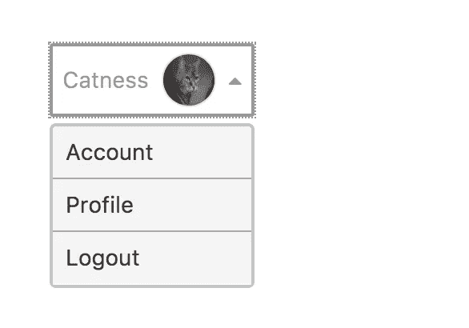
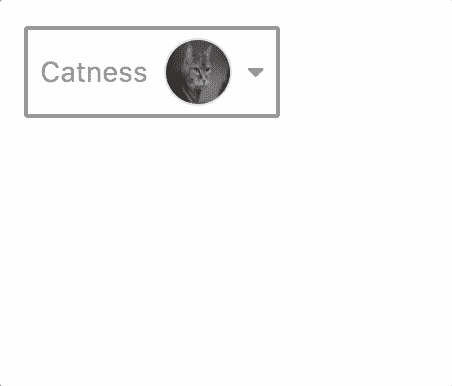

# 构建 Vue.js 下拉配置文件菜单组件

> 原文：<https://itnext.io/build-a-vue-js-drop-down-profile-menu-component-97be8a3d2424?source=collection_archive---------7----------------------->

> *欢迎来到每周到双周系列的第二篇文章，为你的 Vue.js 项目创建基本组件。在本教程中，我将构建一个基本的下拉菜单来编辑配置文件。使用函数式 CSS，这次使用 TachyonCss 和一些 Vue.js 转换，您可以立即构建一个简单下拉列表的基础！*(代码见本文底部)

在本教程中，我将带您浏览为典型的配置文件菜单构建基本下拉菜单的步骤。尽管在构建这样的东西时，使用引导框架往往很诱人，但我更喜欢从功能性内联 CSS 开始构建组件原型。这样你就可以真正地调整它来满足你的需要，然后如果需要的话，把它包装成可重用的 CSS。当您想要构建像转换这样的自定义功能时，这一点尤其重要，因为转换通常需要在 HTML 标记之间进行才能很好地工作。

*免责声明:代码没有经过任何极端的浏览器测试。您可能需要修改 CSS，使其向后兼容遗留浏览器。*

# 从结尾开始

和上一篇文章一样，我更喜欢从完成的 UI 或静态 HTML + CSS 开始构建组件。然后，我从那里开始研究它的内部工作原理。这是最终产品的图片。

所以在这里，我想建立一个按钮，其中包括用户名，杯子和一个基本的下拉图标，将由字体真棒提供。

通过参考 Tachyon CSS [组件文档](http://tachyons.io/components/)，大部分 UI 都很容易构建。

# 模板

让我们从去除了大部分 CSS 和 HTML 细节的 Vue.js 模板开始。

这很简单，我们所需要的就是按钮链接，它将下拉菜单显示在视图中。我们只有`showDropDown`和`links`这两个数据属性来完成这项工作。当`showDropDown`为真时，我们显示下拉菜单，当它为假时隐藏，这不是火箭科学！

组件代码如下:

当用户点击按钮时，我们触发`v-on:click.prevent="showDropDown=!showDropDown"`来切换值。

# 关于 CSS 的一个注释

这是值得回顾的 CSS，因为它使用了 Tachyon CSS，这是一个功能框架，鼓励预定义的 CSS 规则的组成。这和用`style`写 css 是不一样的！

在这个项目中，我使用了更少的样式，并定义了菜单和链接的样式规则，以保持 HTML 的整洁。纯粹的功能性 CSS 追随者可能不喜欢这种方法，更喜欢保持内联。我个人喜欢混合方法，负责边距、填充和一般布局规则的类内联，然后将可重用的 CSS 放入一个文件中。

我坚信，如果你开始使用功能性 CSS 来构建一个新的 UI 组件，你将能够比用传统的语义方法至少快两倍。最后，我的结果确实创建了一些语义 CSS，但不同的是，我是在内联了组件的原型之后才这么做的。我没有把它应用到所有的地方，所以你在代码样本中看到的将是功能性和实用性的混合。

# 制作动画

我喜欢 Vue.js 的一点是，使用过渡功能让事情变得生动起来是多么容易。让我们通过为它的出现和消失添加一个过渡来使这个下拉菜单变得更漂亮一点。下面是它应该是什么样子的 gif:

下面是我们实现这一目标所需的相关代码

事情就是这么简单，我们所需要的只是一个名称指向 CSS 类的`transition`标签。

CSS 定义了一些特定的转换，有以下的后期命名约定`-enter-active`、`-leave-active`、`-enter`和`-leave-to`。Vue.js transitions 查找这些，然后相应地应用它们。

在这个示例中，我在 Y 轴上添加了一个负平移，使菜单看起来像是来自按钮。

使用`transition-group`可以让每个菜单项以更交错的方式下拉，但我会把这个挑战留给你，或者如果有人要求更高级的关于 Vue.js 转换的教程，我会考虑这么做。

# 结论

现在你有了它，用一个相对小的代码笔，你就有了一个可重用的下拉组件，它有一个漂亮的过渡。这里的和 Github 上的[这里的](https://github.com/andreliem/vuesnippets/tree/master/vue-dropdown)都提供了代码笔。我希望这篇文章对你有用！如果你还没有订阅我们的时事通讯，请[订阅我们的时事通讯](http://newsletter.vuejsradar.com/)并且[在 Twitter 上关注我们](https://twitter.com/vuejsradar)以保持对 Vue.js 的了解！

*最初发表于*[*【www.vuejsradar.com】*](https://www.vuejsradar.com/building-vuejs-dropdown-component)*。*