# 用 Ionic 构建一个天气移动应用

> 原文：<https://itnext.io/build-a-weather-mobile-app-with-ionic-985d14f94c15?source=collection_archive---------3----------------------->


# 介绍

在本文中，我将带您了解构建一个移动应用程序的过程，该应用程序提供世界各地的天气信息。使用本教程中的概念，您可以添加尽可能多的位置，甚至自定义位置。这个应用程序将使用 Ionic 框架和 Tomorrow.io 天气 API 来构建

Ionic 是一个开源的移动工具包，允许你创建跨平台的网络和移动应用。

Tomorrow.io Weather API 为开发人员提供了一套强大的 API，可以报告快速、准确、可靠的天气数据，并可灵活用于任何集成。

我们开始吧。

# 入门指南

构建 Ionic 移动应用的两个先决条件是在你的电脑上安装 Node 和 Ionic。如果您不确定是否安装了它们，请运行以下命令:

`node -v`

`ionic -v`

这些命令将分别输出您系统上的 Node 和 Ionic 的版本。

如果您没有安装它们，请访问 [NodeJS](https://www.nodejs.org) 下载并安装 Node。然后运行下面的命令来安装 Ionic:

`npm install -g ionic`

# 构建 Ionic 应用程序

启动 Ionic 应用程序非常容易，因为它有很好的启动模板:

*   **标签**:带有默认底部标签的项目，您可以自定义。
*   **侧菜单**:已经添加了侧菜单的项目。
*   **列表**:列表布局的项目。
*   **空白**:单页的空项目。

对于我们的例子，我们将使用**列表**模板。运行以下命令启动:

`ionic start ionic-weather-project list --type angular`

这里，'*离子-天气-项目*'是项目名称。你可以给你的孩子起任何你喜欢的名字。

“列表”是我们正在使用的离子模板。

“角度型”意味着我们将使用角度作为框架。其他框架有 Vue 和 React。

如果出现添加电容器的提示，使用类型 **y** 。

进入目录 ionic-weather-project，用 VS 代码打开

`cd ionic-weather-project`

`code .`

使用命令运行项目:

`ionic serve`

这将在您的默认浏览器中打开应用程序，网址为 [http://localhost:8100](http://localhost:8100) ，如下所示:

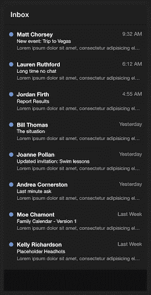

# 定制和整合它与我们的天气 API

我们将获得以下列表中地点的天气信息。要从 [Tomorrow.io Weather API](https://www.tomorrow.io/weather-api/) 获取天气信息，您需要位置的纬度和经度。在这里，我们将手动获取它们。然而，你可以使用任何地理定位插件。

访问[谷歌地图](https://map.google.com)，输入地点名称。你可以从网址中得到经度和纬度。

纽约，纽约，美国= 40.6971494，-74.278678676867

英国伦敦= 51.5285582，-0.2416813

迪拜，阿拉伯联合酋长国= 25.0757755556677

美国加利福尼亚州洛杉矶= 34.0201613，-118.6919217

尼日利亚拉各斯。= 6.5480357,3.1438724

# 创建位置数据服务文件

转到 src/app/services/文件夹，创建一个 location.services.ts 文件。在下面输入脚本。

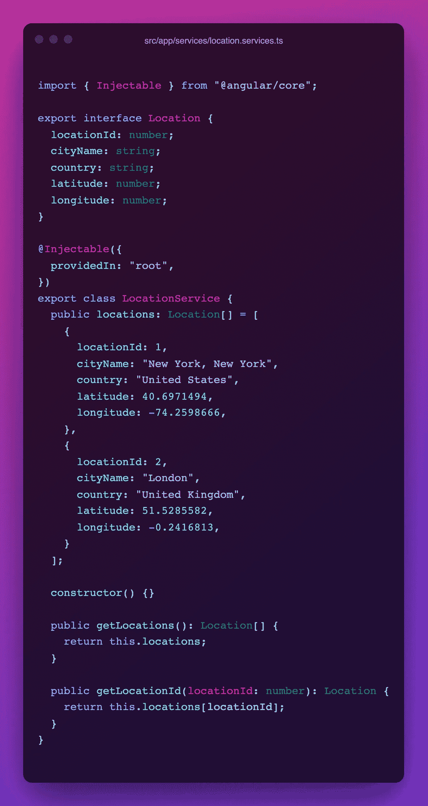

为了简洁起见，我只添加了 2 个位置，但是您可以添加所有的位置。它们的地理位置在上面:我把它们列出来了。

现在我们已经有了定位服务，让我们把它放入我们的主页。转到 src/home/home.page.html。编辑 home.page.html 文件，使其标题为 Location，并根据获取的位置复制应用程序消息组件。参见下面的代码:

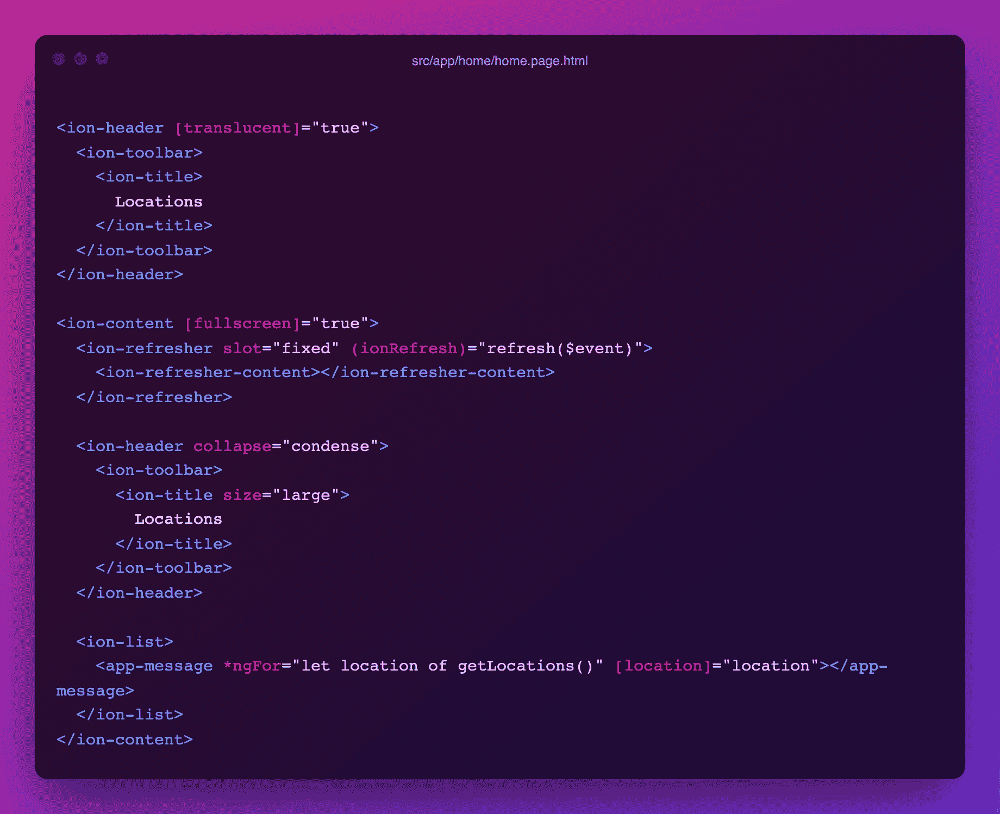

从位置服务中获取位置。转到 src/app/home/home.page.ts，编辑如下:

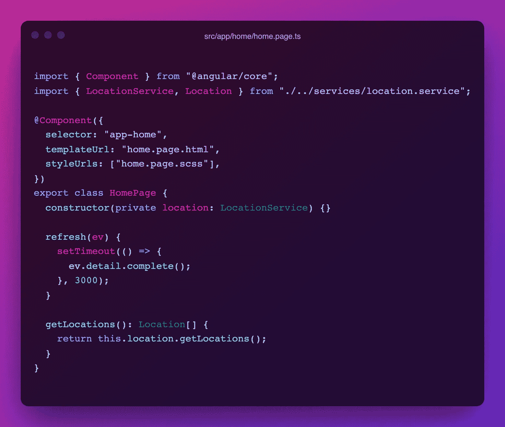

定制显示位置列表的<app-message>组件。编辑 src/app/message/message . component . html 和 src/app/message/message . component . ts 文件，以动态接收位置馈送并相应地在视图中显示它们。</app-message>

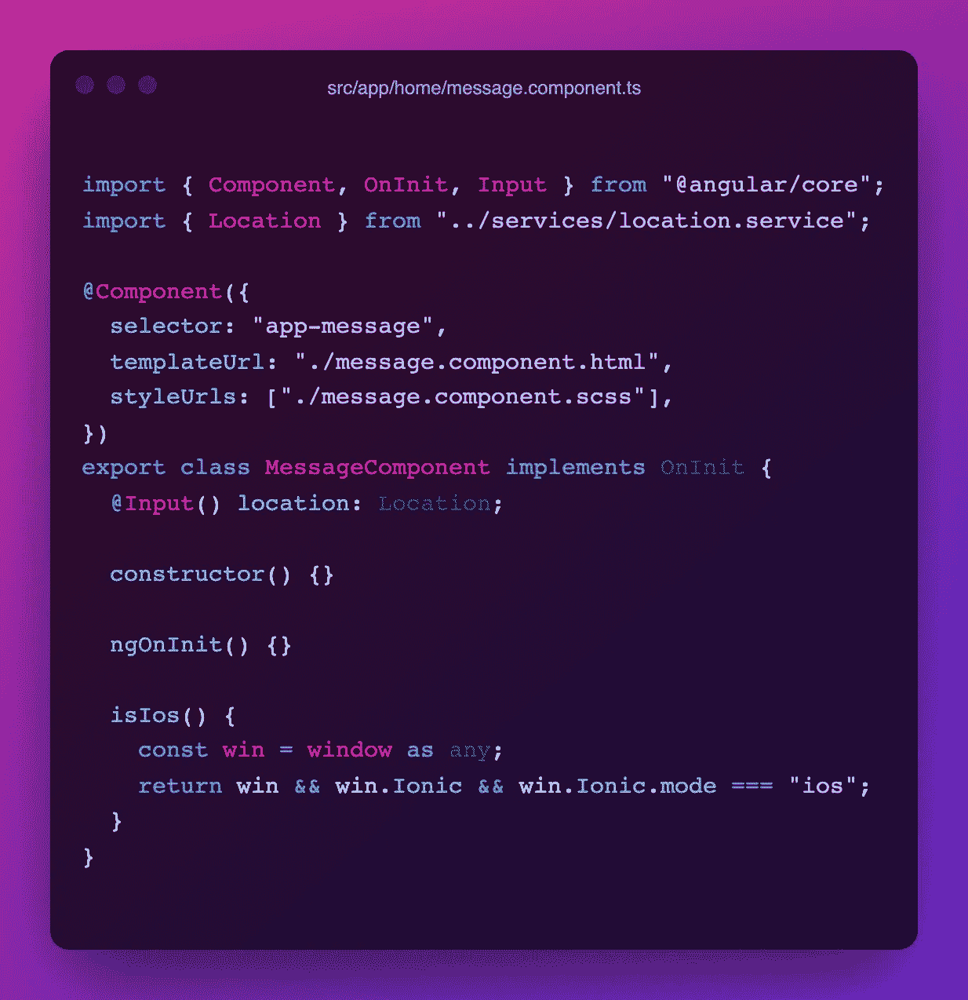

对于 message.component.html 的文件:

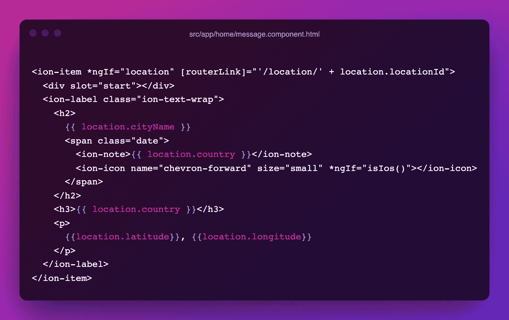

接下来会发生什么。单击一个位置后，它会将您带到<view-message>组件。你需要更新路线。</view-message>

转到 src/app/app-routing.module.ts，将视图消息路径编辑为:

```
...{ path: "location/:id", loadChildren: () => import("./view-message/view-message.module").then( (m) => m.ViewMessagePageModule ),},...
```

在这一点上，这里是你会有:

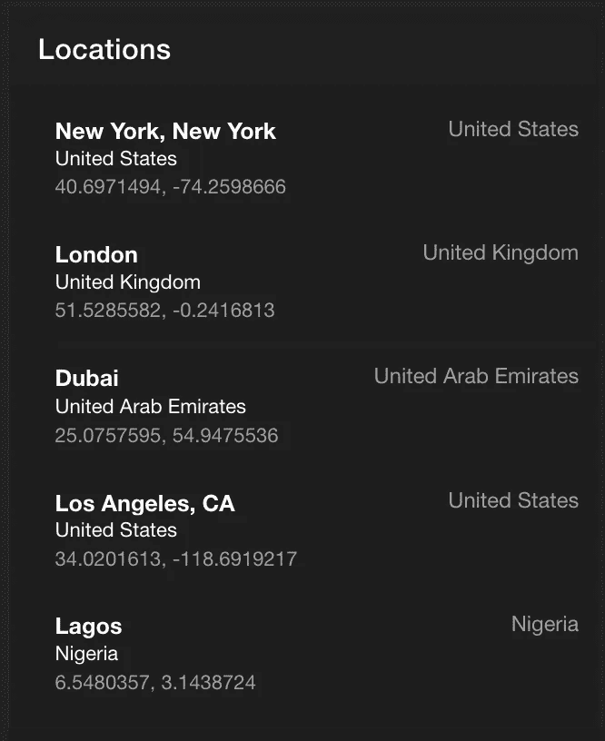

# 集成 Tomorrow.io 天气 API

首先，您需要注册并获得一个 API 密钥。有了这个键，就可以调用 Tomorrow.io 天气 API 上的各种端点。明天访问[io](https://www.tomorrow.io/weather-api/)并报名。您也可以使用您的 Google 或 Github 帐户注册。

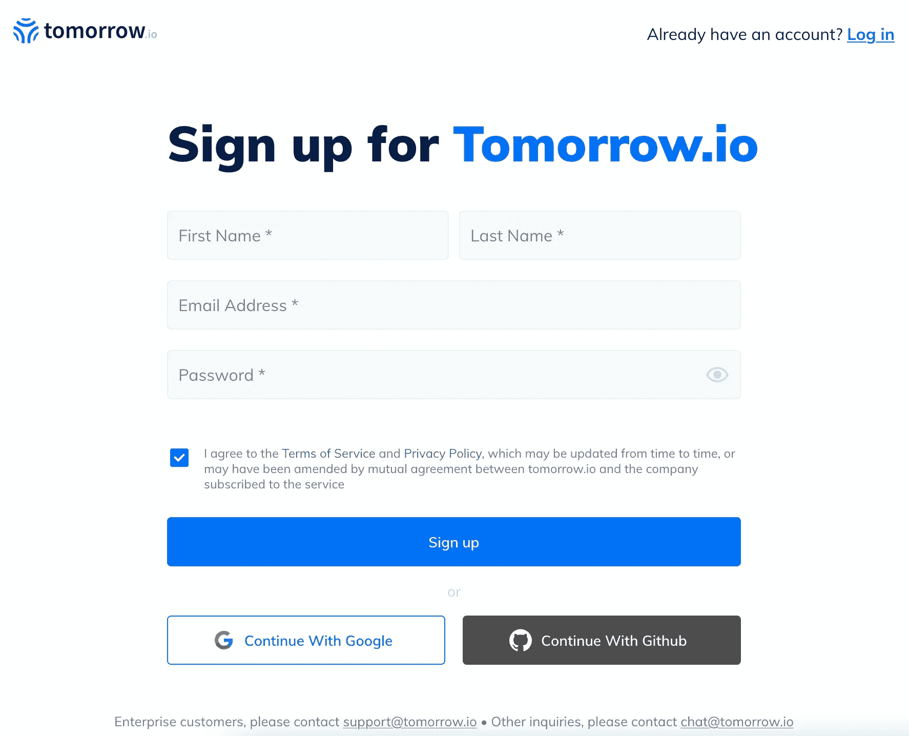

# 透露您的 API 密钥

登录后，单击左侧的开发菜单。在“密钥”下，单击您的密钥前面的“显示”(眼睛图标)以显示它。现在你可以打多个电话了。

不要忘记参考他们强大的[文档](https://docs.tomorrow.io/reference/welcome)来使用你想要调用的任何端点。

在本教程中，我们将使用[检索时间轴(基本)](https://docs.tomorrow.io/reference/get-timelines)端点来获取我们所在位置的天气信息。

当调用这个端点时，需要传递几个参数。我们将通过的一些是:

*   **位置**:我们将使用“latlong”格式，该格式采用位置的纬度和经度，用逗号分隔。
*   **时间步长**:这是接收数据的时间间隔。允许的值为:“最佳”、“1m”、“5m”、“15m”、“30m”、“1h”、“1d”。
*   **单位**:接收数据的计量单位。
*   **apikey** *:这是您访问端点的 API 密钥。
*   **开始时间**:指报表应该开始的时间。默认为现在。
*   **结束时间**:返回数据应该停止的时间。我们将使用矩来输入这个。
*   **字段**:这是您希望在结果中出现的返回字段的数组。端点返回很多，您可以在这里指定您想要的。

我们将使用 Angular 的 HttpClient 进行调用，并为 endTime 时刻。让我们安装时刻:

`npm install moment`

然后，将 HttpClientModule 添加到您的 app.module.ts 中。转到 app.module.ts，在顶部导入它，并向其中添加 imports 数组。

```
...import { HttpClientModule } from "@angular/common/http";...imports: [ HttpClientModule,],...
```

让我们从定位服务中调用天气 API。在 location.services.ts 文件中，添加以下内容:

```
...import { HttpHeaders, HttpClient } from "@angular/common/http";...baseURL = "https://api.tomorrow.io/v4/";apiKey = "<yourAPIkey>";constructor(*private* http: HttpClient) {}*public* fetchLocationData(latlong) {<see screenshot below for content of this function>}
```

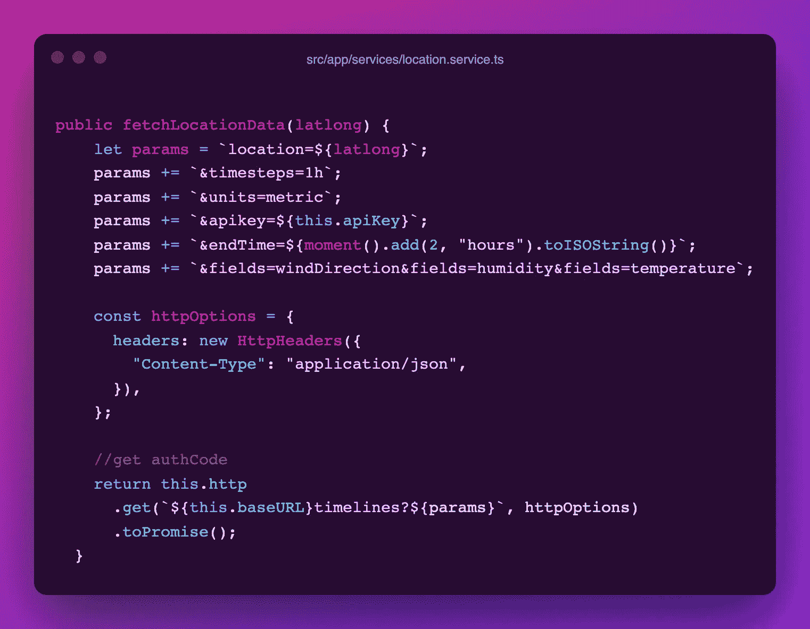

我们刚才在上面的片段中所做的是:

*   我们导入了 HttpClient 和 HttpHeaders 模块来调用我们的天气 API。
*   我们创建了 baseURL 和 API 密钥常量。请注意，API 密匙应该在您的环境文件中，而不是上传到任何公共存储库中。
*   我们创建了 fetchLocationData()函数，使用前面指定的参数使调用成为天气端点。这个函数接收位置的纬度和经度来获取数据。

# 调用组件中的定位服务

打开 src/app/view-message/view-message . page . ts，从那里呼叫我们的定位服务:

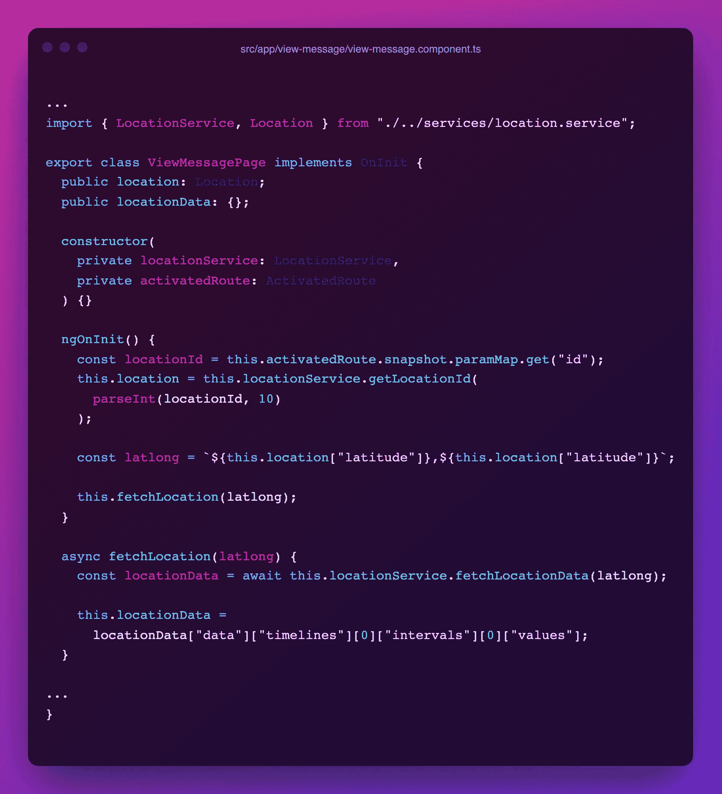

在上面的代码片段中，我们导入了位置服务，称为服务，并将其分配给在类中创建的 LocationData 变量。

完成后，我们还需要在视图上显示结果。编辑 src/app/view-message/view-message . page . html 文件，如下所示:

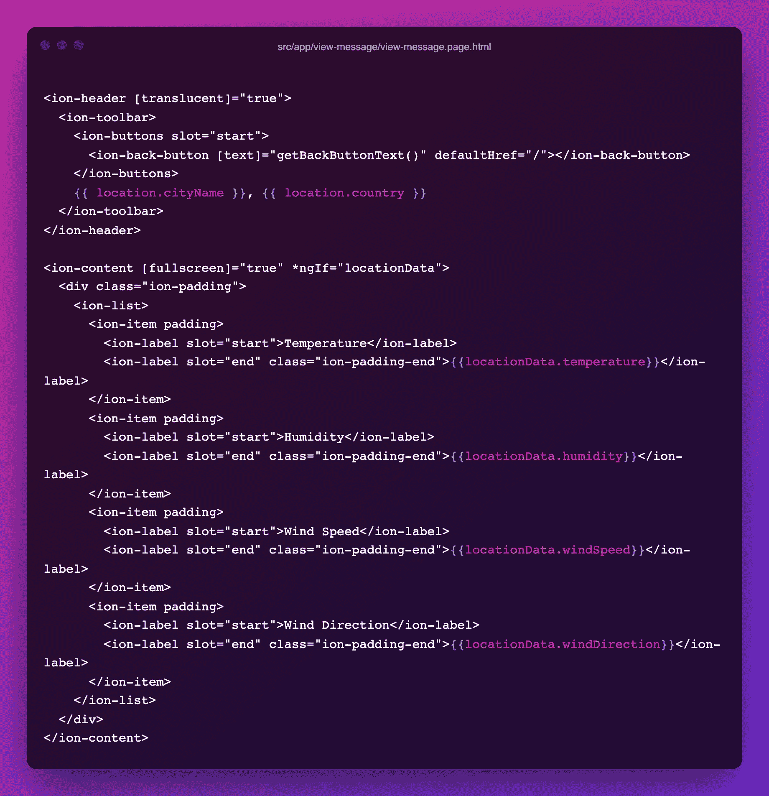

这个代码片段以列表格式显示了从 API 中检索到的数据。您的页面应该如下图所示:

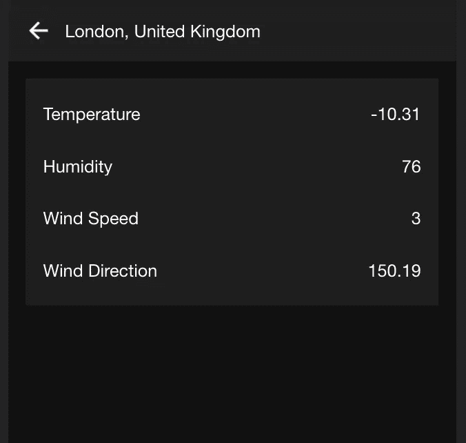

这标志着教程的结束。完整源代码，可以查看 Github 上的[Ionic Weather App](https://github.com/hellotunmbi/ionic-weather-app)

# 结论

这是一次精彩的会议，我希望你能跟上。对于任何用例，Tomorrow.io 天气 API 都是健壮和灵活的。尽可能多地研究文档中的用例。您还可以添加图标或创建具有不同布局的应用程序。这完全取决于你。