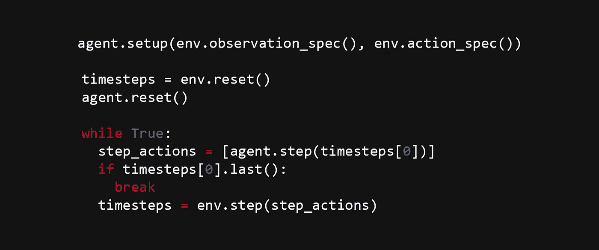

# 用 PySC2 2.0 构建一个虫族机器人

> 原文：<https://itnext.io/build-a-zerg-bot-with-pysc2-2-0-295375d2f58e?source=collection_archive---------1----------------------->

距离我的上一个教程已经有一段时间了，但我一直在坚持等待前几天才发布的 [PySC2 2.0](https://github.com/deepmind/pysc2) 。最新版本的学习环境带来了一些很大的改进，但也有一些向后不兼容的变化。

在本教程中，你将建立一个基本的虫族机器人，它将能够生产小狗并把它们送到地图上攻击敌人。我假设您具有基本的 Python 编程知识，并且能够安装 PySC2 2.0。

让我们开始吧。

# 1.创建基本代理

首先，让我们导入基本模块:

现在我们可以创建我们的代理:

方法是我们代理的核心部分，它是我们所有决策发生的地方。在每一步结束时，你必须返回一个动作，在这种情况下，这个动作就是什么都不做。我们将很快添加更多的动作。

如果你遵循了我以前的教程，你会注意到动作的格式已经改变了，以前最后一行应该是:

我认为新的格式更简单，更容易理解，[提莫](https://github.com/tewalds)在这方面做得很好。

这一步的完整代码是[这里是](https://github.com/skjb/pysc2-tutorial/blob/master/Build%20a%20Zerg%20Bot/zerg_agent_step1.py)。

# 2.添加运行代码

现在我们设置好环境，这样我们就可以运行它了。在我最初的教程中，我们在命令行上运行代理，并传入了许多参数，但在这里，我们将添加一些代码，以便代理可以在没有这些额外参数的情况下运行。

我在这里选择使用深海礁石地图，它比我以前教程中的简单的 64 地图更有趣。

这里我们指定第一个玩家是我们的代理人，代理人的种族是虫族。你可以简单地用`sc2_env.Race.protoss`、`sc2_env.Race.terran`甚至`sc2_env.Race.random`选择另一个种族，如果你够勇敢的话。

接下来我们指定第二个玩家是一个机器人，意味着它使用了游戏内部的 AI，机器人的种族是随机的，难度级别是非常容易的。可能的难度级别有`very_easy`、`easy`、`medium`、`medium_hard`、`hard`、`harder`、`very_hard`、`cheat_vision`、`cheat_money`和`cheat_insane`。请注意，`medium_hard`其实是游戏中的“硬”，`hard`是“更硬”，`harder`是“很硬”，`very_hard`是“精英”。

在这个空间你可以选择指定另一个代理，允许两个代理互相对战！

在这里，我们指定屏幕和小地图分辨率，这些是 PySC2 1.x 中的默认值。这些分辨率本质上决定了每个要素图层中有多少个数据“像素”,这些图层包括地形高度、可见性和单位所有权等内容。你的机器人可以使用这些功能来做决定。

PySC2 2.0 中的一个新特性是增加了 RGB 层，本质上是人类会看到的渲染游戏，如果你想使用该层，你需要在这里指定尺寸为`rgb_dimensions`，但是我们不会在本教程中涉及。

这个参数决定了在你的机器人选择要采取的行动之前要经过多少“游戏步骤”。默认设置为 8，在“正常”游戏速度下大约是 300 APM，我们将设置为 160 来减少 APM 到 150。额外的 APM 在这个阶段是不必要的，如果你采取更少的行动，游戏会更快地结束。

这里我们设置了每场比赛的固定长度，PySC2 1.x 中默认是正常速度下 30 分钟左右。在 PySC2 2.0 中，您可以将该值设置为 0，以允许游戏运行所需的时间。

这最后一个参数是可选的，但是它将方便你看到可视化，因为它包含了你的机器人可用的所有观察层的细节。通过在屏幕上看到这些层，你可以更好地理解它们。

剩下的代码只是简单地循环，将步骤细节输入代理，接收一个动作，并重复直到游戏结束或终止。

现在您可以运行您的代理了:

`python zerg_agent.py`

你应该看到你的代理采集矿物，直到它最终被敌人占领。

这一步的完整代码是[这里是](https://github.com/skjb/pysc2-tutorial/blob/master/Build%20a%20Zerg%20Bot/zerg_agent_step2.py)。

# 3.选择一架无人机

在虫族代理可以生产任何小狗之前，它需要一个产卵池。为了建立一个产卵池，我们需要选择一个无人机，所以让我们这样做。

PySC2 2.0 的一个很酷的新特性是添加了特性单元。我知道这个功能很酷，因为它是我做的。它允许您获取屏幕上您无法观察到的或通过屏幕要素图层可能更难观察到的单元的信息。我们将使用特征单元来选择无人机。

另一个很酷的新特性是增加了一个单元列表，它允许你使用一个单元的名字来检索单元类型。以前我们用类似于`_TERRAN_SCV = 45`的东西来编码我们自己的单元类型，但是现在我们可以使用类似于`units.Terran.SCV`的东西。这个功能也是我做的:)

让我们将单元列表添加到模块导入中:

我们还需要`random`模块做一些事情。

接下来，我们需要启用功能单元:

现在，在`step()`方法中，让我们使用特征单元特性来获得屏幕上所有无人机的列表:

很酷，对吧？！多亏了新的点符号，一切看起来干净多了，谢谢提莫！以前，您可能会这样做:

现在，让我们选择一架无人机:

这里的`select_all_type`参数相当于 CTRL+click，所以屏幕上所有的无人机都会被选中。如您所见，无人机的 *x* 和 *y* 坐标可以作为属性访问。你可以访问更多的属性，比如`health`、`shields`、`energy`、`build_progress`，重要的是`ideal_harvesters`和`assigned_harvesters`用于基地和船只。

如果你愿意，你现在可以运行代理，以确保你的无人机被选中。

这一步的完整代码是[这里的](https://github.com/skjb/pysc2-tutorial/blob/master/Build%20a%20Zerg%20Bot/zerg_agent_step3.py)。

# 4.建造一个产卵池

在上面的代码中，让我们确保我们选择了一个无人机。让我们给我们的类添加一个小的实用方法:

该代码检查单选和多选，以查看第一个选择的单元是否是正确的类型。在`step()`的顶部，我们可以将此方法用于:

接下来，我们要确保我们可以建立一个产卵池。如果我们没有足够的矿物质，这可能是不可能的，如果我们不先检查，将导致崩溃:

然后我们可以在屏幕上随机选择一个点，希望是在某个爬行动物上:

最后，我们将随机坐标输入到动作中。

试一试，看看效果如何。运气好的话，你会有很多产卵池。我们如何阻止我们所有的无人机成为产卵池？

让我们添加另一个实用方法来选择具有给定单元类型的单元:

这与上面的代码相同，但是`unit_type`可以根据需要替换掉。让我们用方法替换前面的代码:

然后我们可以用这个方法得到产卵池:

这样更好，如果我们还没有产卵池的话，现在我们只建一个。

这一步的完整代码是[这里](https://github.com/skjb/pysc2-tutorial/blob/master/Build%20a%20Zerg%20Bot/zerg_agent_step4.py)。

# 5.建造小狗

快到了！现在我们有一个产卵池，我们终于可以建立一些小狗。让我们从选择屏幕上的所有幼虫开始:

然后我们可以创造一些小狗。将这段代码放在前一个块的正上方:

测试一下，你会得到一对小狗。

这很好，但是我们不能建造足够多的小狗来提高效率，我们的供应是有限的。我们需要领主。

这一步的完整代码是[这里是](https://github.com/skjb/pysc2-tutorial/blob/master/Build%20a%20Zerg%20Bot/zerg_agent_step5.py)。

# 6.产生更多的霸主

当我们选择了幼虫，如果没有免费供应，我们可以繁殖一个霸主:

还有最后一点我不喜欢，我们再加一个方法:

我们现在可以替换动作检查:

并且:

并且:

如果你现在测试你的机器人，你会发现它会产生很多小狗，是时候攻击了！

这一步的完整代码是[这里是](https://github.com/skjb/pysc2-tutorial/blob/master/Build%20a%20Zerg%20Bot/zerg_agent_step6.py)。

# 7.攻击

在我们进攻之前，我们需要知道我们在哪里，敌人在哪里。出于本教程的目的，我们将假设产卵位置总是在左上角和右下角。所以我们需要找到我们的位置，然后攻击对方。

让我们创建一个`__init__()`方法来初始化一个变量:

在`step()`方法的开头，添加以下内容:

代码检查这是否是游戏的第一步。然后我们得到小地图上我们单位的中心坐标。为此有一个要素图层，它根据单位所属的人员显示小地图上的所有单位。我将在以后的教程中更详细地解释这一点。

现在我们知道了攻击地点，开始攻击吧。首先我们选择我们的军队:

在此之前，我们可以攻击:

测试一下。该死，我们的小狗被咬碎了！让我们等到有更多的小狗时再攻击:

是的，这还差不多！

这一步的完整代码是[这里是](https://github.com/skjb/pysc2-tutorial/blob/master/Build%20a%20Zerg%20Bot/zerg_agent_step7.py)。

如果你喜欢这个教程，请在[版块](https://www.patreon.com/skjb)上支持我。也请和我一起上[不和谐](https://discord.gg/qTZ65sh)，或者关注我上 [Twitch](https://www.twitch.tv/skjb) 、 [Medium](https://medium.com/@skjb) 、 [GitHub](https://github.com/skjb) 、 [Twitter](https://twitter.com/theskjb) 和 [YouTube](https://www.youtube.com/channel/UCZcEvhpV4_6llcrWrWQ2wsg) 。