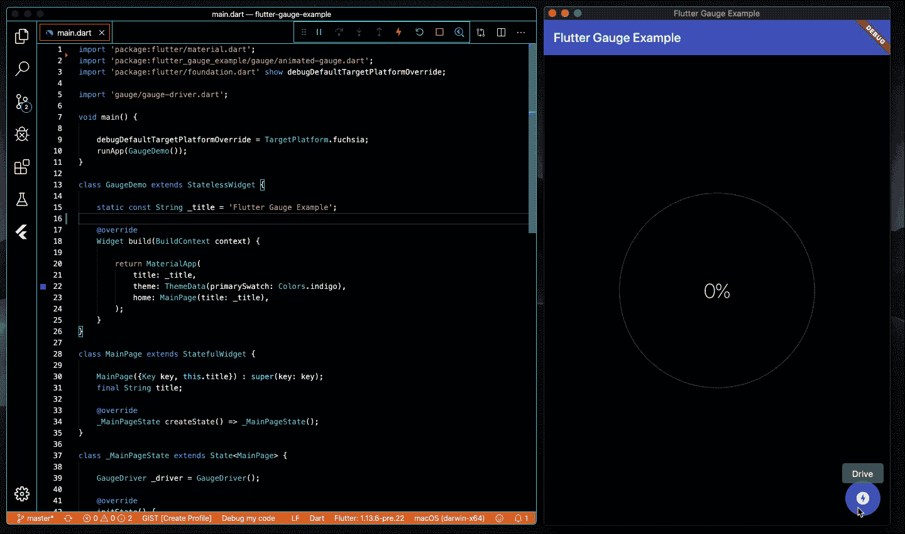
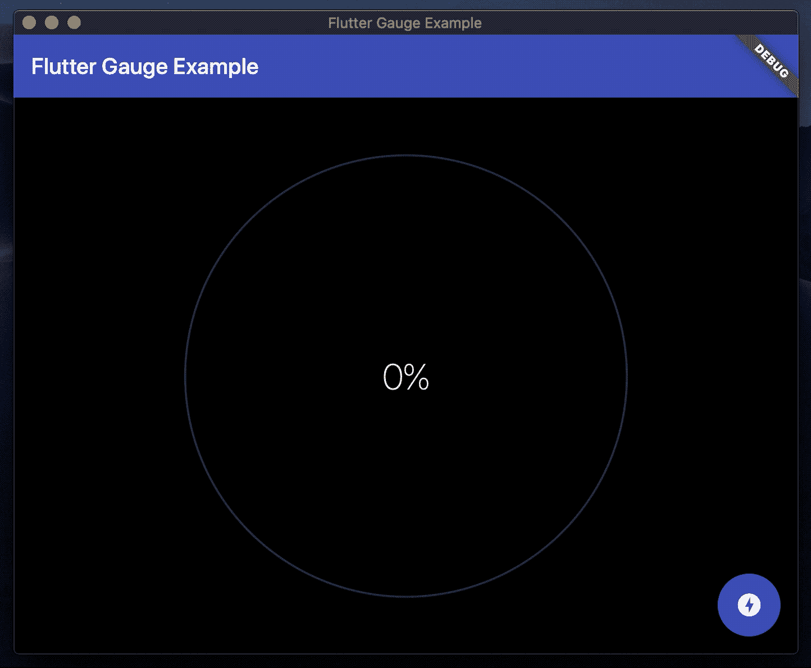

# 在 Flutter 中构建动画量规

> 原文：<https://itnext.io/build-an-animated-gauge-in-flutter-e495a436dbf8?source=collection_archive---------0----------------------->

## 如何在 Dart 和 Flutter 中创建动画仪表部件

在 macos 上运行的示例项目的屏幕截图

## 介绍

奥登·UX 的设计采用了高度可见的组件以及流畅的动画和恰当的过渡，以吸引注意力并快速有效地传达信息。在本文中，我们将了解如何在 Flutter 中构建一个带有百分比读数的动画仪表小部件。

Dart 和 Flutter 非常适合于构建高性能的用户界面，这些界面可以在各种设备和外形上进行漂亮的渲染。如果你还没有 Flutter，从他们的安装页面[为你的操作系统下载一份。](https://flutter.dev/docs/get-started/install)

GitHub 上的[提供了示例项目源代码的副本。](https://github.com/kenreilly/flutter-gauge-example)

## 应用入口点

示例应用程序中的主文件是 **lib/main.dart** :

这个文件包含了一个 Flutter app 的标准配置，`GaugeDemo`作为容器，`MainPage`作为应用的主页。量测轨和量测轨驱动程式类别会汇入以用在这个档案中。

MainPage 类是 [StatefulWidget](https://api.flutter.dev/flutter/widgets/StatefulWidget-class.html) 的一个实现，它保存了 GaugeDriver 的一个实例，并使用一个应用程序栏、一个包含`AnimatedGauge`小部件的主体和一个用于驱动和重置计量器的浮动操作按钮构建了一个基本的页面布局。

这个页面及其子页面`AnimatedGauge`的状态都是由`GaugeDriver`驱动的，当标尺值改变时，它会通知所有的监听器重新绘制。点击按钮调用`_driver.drive(1/10)`，指示驾驶员将仪表增加 10%。

收到从`_driver`返回的事件消息后，该页面将重新绘制，按钮图标将呈现为充电按钮或复位按钮，这取决于仪表当前是否达到最大值。

## GaugeDriver 类

下一个要检查的文件是**lib/gauge/gauge-driver . dart:**

`GaugeDriver`类处理计量器的支持逻辑，包括一个用于向监听组件广播计量器事件的 [StreamController](https://api.flutter.dev/flutter/dart-async/StreamController-class.html) 、一个`_current`值和一个`maxed`属性，如果计量器值超过 99%,该属性返回 true。`listen`方法用于附加事件侦听器，以通知将来的事件，而`drive` 方法用于增加标尺值，并向侦听器触发一个事件，以触发呈现更新。

## AnimatedGauge 类

接下来，我们来看看**lib/gauge/animated-gauge . dart**:

`AnimatedGauge`类需要一个`GaugeDriver,`实例，该实例将用于监听仪表值的变化。GaugeState 类包含仪表的各种必需组件，包括`_animation`和`_controller`属性、用于显示文本的`_readout`，以及用于计算动画的属性`begin`和`end`。此外， [TextStyle](https://api.flutter.dev/flutter/dart-ui/TextStyle-class.html) `_style`是为仪表中心的读数定义的。

GaugeState 利用了[SingleTickerProviderStateMixin](https://api.flutter.dev/flutter/widgets/SingleTickerProviderStateMixin-mixin.html)，它提供了一个单独的 ticker，可以用来将一个单独的 [AnimationController](https://api.flutter.dev/flutter/animation/AnimationController-class.html) 添加到一个小部件状态。

当这个小部件状态被初始化时，创建一个持续时间为 *320 ms* 的控制器实例，并且状态对象通过`vsync`属性被传递到控制器中，这允许这个小部件的渲染时间由动画控制器驱动。

当通过`on`方法接收数据时，设置新的`begin`和`end`点。由于这些操作被放在对`setState`的调用中，将触发重绘。当构建小部件时，计算仪表的`_diameter`，创建一个新的`_animation`，并添加一个状态监听器将`begin`值设置为`end`，这将阻止它再次运行，如果小部件由于某种原因而不是仪表更新而被重画的话。

使用 provided _animation 创建一个 AnimatedBuilder，它使用一个带有 GaugePainter 的 [CustomPaint](https://api.flutter.dev/flutter/widgets/CustomPaint-class.html) 小部件作为前景画师，并使用一个 [Text](https://api.flutter.dev/flutter/dart-html/Text-class.html) 输出来呈现百分比文本显示。

## GaugePainter 类

这个项目的最后一个文件是**lib/gauge/gauge-painter . dart**:

`GaugePainter`类是 [CustomPainter](https://api.flutter.dev/flutter/rendering/CustomPainter-class.html) 的实现，用于直接绘制到[画布](https://api.flutter.dev/flutter/dart-ui/Canvas-class.html)上。`percent`的值用于计算围绕圆绘制的圆弧的颜色和角度。使用了两个笔刷:一个用于跟踪，另一个用于显示标尺值。

从画布区域的[大小](https://api.flutter.dev/flutter/dart-ui/Size-class.html)计算出轨距的位置和半径，并通过`2 * pi * percent`找到角度，然后使用该角度从`-pi/2 (90 degrees).`开始顺时针绕轨迹画一个圆弧

## 结论

仪表可用于显示实时信息，如剩余时间或系统资源使用情况，以及分析和许多其他类型的数据。通过使用一些简单的内置组件和基本的事件驱动设计，很容易设计和构建干净且响应迅速的 UX，包括动画和过渡，所有这些都按预期运行并表现良好。此外，类似的设计可以用于绘制任何种类的图形或图表数据，或者用于控制任何种类的动画或效果。

感谢您的阅读，祝您的下一个颤振项目好运！

> 肯尼斯·雷利(8 位黑客)是 LevelUP 的首席技术官