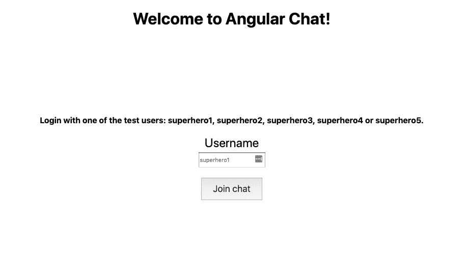
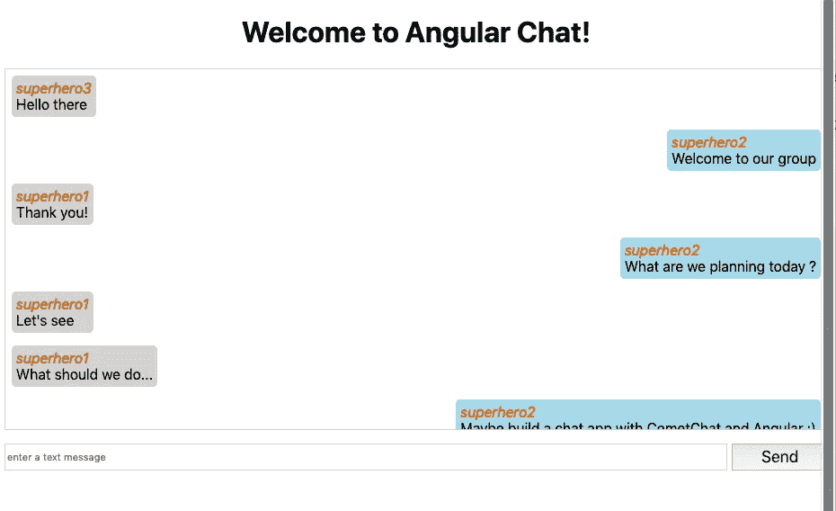

# 用 Angular 7 建立匿名群聊

> 原文：<https://itnext.io/build-an-anonymous-group-chat-with-angular-7-5e910f1ccee1?source=collection_archive---------4----------------------->

要跟这个帖子，需要一些 Angular 的基础知识。因为我们用的是 Angular，我们还会看到一些打字稿代码。这里的一些基本知识也会有所帮助。人们需要安装 [Node 10](https://nodejs.org/en/) 或任何更新的版本，才能使用 GitHub 的示例代码。就这些，有了这个，按照这个教程应该是直截了当的。

我们将从头开始。如何生成新的角度应用程序？如何[在 CometChat Pro](https://www.cometchat.com/pro) 上创建一个新帐户(免费)以及如何创建一个匿名群聊并在其中发布消息。

我们不会过多地关注用户界面，而是更多地关注功能部分，但下面是它最终的样子:



代码在 [GitHub 这里](https://github.com/cometchat-pro-samples/Angular-group-chat)，以防你想直接进入。克隆回购，玩得开心，不要忘记回到文章跟随教程😉

# 新项目

我们要做的第一件事是创建一个新项目，这样我们就可以在这个令人敬畏的应用程序上工作了。为此，我们需要全球安装的[角度控制器](https://cli.angular.io/):

```
npm install -g @angular/cli
```

然后我们可以创建项目:

```
ng new AngularChat
```

或者我们可以使用 npx，即[节点包运行器](https://blog.npmjs.org/post/162869356040/introducing-npx-an-npm-package-runner)。我们实现了相同的结果，而无需在全球范围内安装任何东西:

```
npx @angular/cli new AngularChat
```

遵循交互式安装。当询问您想要使用什么样的样式表格式时，对路由说**是，并选择 **CSS** 。**

这将生成新角度应用所需的所有结构和代码。它还将安装所有的依赖项。一旦命令运行完毕，您就可以在您喜欢的编辑器中打开新文件夹(我喜欢 [VsCode](https://code.visualstudio.com/) )。您可以通过运行`npm start`或`ng serve`来启动本地开发服务器。这两个命令做同样的事情。现在，您可以转到 http://localhost:4200 并看到应用程序启动并运行。

# CometChat Pro 帐户

我们需要做的第二件重要的事情，是 ***创建一个免费的 CometChat Pro 账号*** 。

可以去[网站](https://app.cometchat.com/#/register)点击上面写着“免费入门”的红色大按钮。一旦你填写了所有需要的信息，你就有了一个试用帐户，并准备好了。

在 [CometChat 仪表盘](https://app.cometchat.com/#/login)上，您会看到您账户的概况。在“添加新应用程序”对话框中，输入名称并单击加号创建新应用程序。记下应用程序 ID，因为我们将使用它与 ComeChat API 通信。

从左侧菜单，转到 API Keys，因为我们必须为我们的应用程序创建一个新的。给它起一个适合你的名字，选择 *Auth Only* 作为 scope。记下这个 API 键，因为我们将在应用程序中使用它。

CometChat 应用程序有五个用户和一个已经创建的组，所以我们有我们需要的一切。现有用户有:*超级英雄 1、超级英雄 2、超级英雄 3、超级英雄 4* 自然还有*超级英雄 5* 。一个符合这五个条件的群体是超群。您可以使用 [CometChat 仪表盘](https://app.cometchat.com/#/login)查看它们。

# CometChat SDK

有了这些，我们现在将 CometChat 包添加到我们的应用程序中。这将有助于我们更轻松地使用 API。我们可以使用预置的函数来执行我们想要的操作，而不是必须进行所有的调用。

要添加包运行:

```
npm install @cometchat-pro/chat
```

现在，我们可以在项目中引用该库，并在代码中使用我们需要的任何函数:

```
import { CometChat } from '@cometchat-pro/chat';
```

# TypeScript 类型定义

在撰写本文时，该库还没有 TypeScript 类型定义。虽然这是可能发生的事情😉。

所有 Angular/TypeScript 开发人员都喜欢类型定义。为了更容易理解教程和使用代码，我为我们将要使用的函数创建了几个。

这是通过在我们应用程序的 *src* 文件夹中创建一个新的*.d.ts 文件来完成的。当处理代码时，TypeScript 编译器将选择它并向我们显示类型定义。这不是你需要做的事情，但是如果你好奇，你可以看看 GitHub 上的[文件。](https://github.com/cometchat-pro-samples/Angular-group-chat/blob/dd1f922a57267405b6e819ff8db864152a068460/src/custom-typings.d.ts)

# 应用程序结构

现在让我们考虑一下我们的应用程序，我们想要一个匿名聊天，所以这将是一个组件。但是在我们开始这个组件之前，我们还希望允许用户登录到我们的应用程序。所以我们需要另一个组件。此外，将库的使用包装在服务中也是一种最佳实践，因此我们还需要一个 CometChat 服务类。

记住这一点，我们将使用 Angular CLI 为我们生成这些组件。如果您在开始时全局安装了 CLI，您可以使用`ng`命令。如果没有，可以通过运行`npm run ng`使用本地安装的。

现在生成我们的组件:

```
ng generate component components/Login
ng generate component components/GroupView
```

我们首先传递 generate 参数，告诉 CLI 我们想要做什么。然后我们指定我们想要生成的蓝图，在这个例子中是一个组件。然后我们指定组件的名称。在我们的例子中，我还在实际名称前添加了`components/`，这样所有的组件都在同一个文件夹中。

要创建服务类别，请执行以下操作:

```
ng generate service services/CometChat
```

和以前一样。这次我们将蓝图更改为 service，并为这个类指定了一个 services 文件夹。

现在我们已经有了应用程序的结构。

# 按指定路线发送

我们已经有了两个组件，现在我们必须告诉 Angular 什么时候加载它们。

在我们的 App routing 模块(app-routing.module.ts)中，我们可以像这样更新路线:

```
const routes: Routes = [
  { path: '', redirectTo: 'login', pathMatch: 'full' },
  { path: 'login', component: LoginComponent },
  { path: 'chat', component: GroupViewComponent },
];
```

第一个是重定向，当我们的应用程序启动时，我们希望转到登录路径。第二个命令告诉 Angular，每当我们登录时，我们都希望显示 LoginComponent。第二个示例做了同样的事情，但是使用了聊天路径和 group view 组件。

我们现在可以继续在我们的应用程序中实现一些功能。

# 初始化 CometChat

使用 CometChat SDK 我们需要做的第一件事是[初始化它](https://prodocs.cometchat.com/docs/js-quick-start#section-initialize-cometchat)。这必须在调用任何其他方法之前完成。因此，实现它的一个好地方就是我们的应用程序初始化的时候。意思是 app 组件的 **ngOnInit** 钩子。

在我们的 CometChat 服务中，我们创建了一个 **init** 方法。它只有一个参数，即应用程序 ID。在内部，我们将调用 CometChat 库的 **init** 方法:

```
init(apiKey: string) {
  CometChat.init(apiKey).then(
    msg => console.log('Initialized succesfull: ', msg),
    err => console.log('Initialization failed: ', err),
  );
}
```

init 方法将返回一个承诺。虽然这不是强制性的，但是使用一个**然后**调用来处理结果是一个很好的实践。在成功或失败的情况下打印一些消息对我们来说就足够了，这样可以更容易地调试代码。

在我们的应用程序组件中，我们必须将服务作为参数添加到**构造器**中:

`constructor(private cometChat: CometChatService) {}`

您可以注意到，在名称之前有一个私有访问修饰符。这是 TypeScript 中的一个小技巧，它允许我们在类中创建一个具有该名称的字段。

当我们的应用程序启动时，我们可以继续并初始化 CometChat，因此在同一个应用程序组件中:

```
ngOnInit() {
  this.cometChat.init('CometChatApp ID');
}
```

# 全局配置值

将全局值保存在同一个文件中是一个好习惯。一个很好的地方是 angular 环境配置文件( [environment.ts](https://github.com/Shivangi-cometchat/Angular-group-chat/blob/2b435b7d401a01e5b8df9d98aa4f6bc0ca381bc7/src/environments/environment.ts) )。我们已经有了一个名为环境的对象。我们可以用 CometChat 应用程序 id 和 API 键的值在其上添加一个属性:

```
export const environment = {
  production: false,
  cometChat: {
    apiKey: 'API_KEY_HERE',
    appId: 'APP_ID_HERE',
  }
}
```

这将允许我们在需要时通过应用程序引用它们。所以在上面的例子中，我们可以做的不是硬编码这个值:

```
this.cometChat.init(environment.cometChat.appId);
```

# 登录组件

一切都初始化了。现在我们可以继续前进，允许用户对我们的应用程序进行身份验证。

为此，我们将使用 CometChat 的[登录功能](https://prodocs.cometchat.com/docs/js-quick-start#section-login-your-user)。这允许基于用户 id 和 API 密钥对用户进行身份验证。尽管这是一个匿名聊天应用程序，但我们需要对 CometChat API 进行身份验证，这样我们才能读取和写入与我们的应用程序相关的信息。

在我们的 CometChat 服务中，我们创建了一个新的**登录**方法并执行调用:

```
login(userId: string) {
  return CometChat.login(userId, environment.cometChat.apiKey)
  .then(
    user => console.log('Login succesfull: ', user),
    err => console.log('Login failed: ', err),
  );
}
```

我们传入用户 id 并使用来自环境对象的 API 键。和以前一样，我们通过在控制台中写入一些值来处理 outcome Promise 结果。该方法还返回 API 调用的结果。我们在这里处理它，但是我们也想知道如果它成功与否，我们在哪里使用它。

如果成功，此方法调用的结果将是登录的用户。拿着它可能会有用。因此，让我们创建一个本地用户属性，并在有响应时分配它。

```
user => {
  console.log('Login succesfull: ', user);
  this.currentUser = user;
}
```

有了这个，我们可以继续添加一个输入，用户可以输入一个名字和一个提交按钮。在我们的登录组件 html 模板中，我们会有这样的代码:

```
<label for="userName">Username</label>
<input id="userName" type="text" #userName/>
<button>Join chat</button>
```

当用户点击*‘加入聊天’*按钮时，我们将从输入中获取文本值，并调用我们类中的登录方法。正如我们在应用程序组件中所做的那样。我们必须使用依赖注入来获得 CometChat 服务的实例:

```
constructor(private cometChat: CometChatService, private router: Router) {}
```

我们还有 Angular 路由器，因为我们将使用它导航到群聊页面。

在**登录**方法中，我们将调用 CometChat 服务。如果登录成功，我们会将用户重定向到聊天页面:

```
login(userId: string) {
  this.cometChat
    .login(userId)
    .then(() => this.router.navigateByUrl('chat'))
}
```

如果一切正常，一旦用户输入有效的名称并点击 join，他们就可以访问我们的组视图组件。

# 组视图组件

这是我们最复杂的组件，也是大部分动作发生的地方。我们将能够在此处查看消息并撰写新消息。

为了使事情变得简单，我们将从模板开始。我们需要一个列表，显示所有的消息和一个按钮输入，允许用户编写新的消息。对于消息列表，我们可以有这样的内容:

```
<div class="messages">
  <p>
    <i>{{ message.sender.uid }}</i> <br />
    {{ message.text }}
  </p>
</div>
```

我们使用 Angular 的 [ngForOf](https://angular.io/api/common/NgForOf) 指令迭代消息集合。对于每封邮件，我们显示发件人的 uid。这意味着写消息的用户的名字和消息的文本。

我们还使用 [ngClass 指令](https://angular.io/api/common/NgClass)将 css 类仅添加到登录用户编写的消息中。这是我们在大多数聊天应用中习以为常的。通常，它们有不同的颜色或放在屏幕上的不同位置。

为此，我们需要在我们的类中定义属性:

```
messages = [];

get currentUser() {
  return this.chatService.currentUser;
}
```

在这里，我们可以看到，在执行登录时，我们实际上使用了存储的 currentUser。

和前面一样，CometChat 服务作为参数添加到构造函数中:

```
constructor(private chatService: CometChatService) {}
```

好，现在我们也必须显示一些信息🙂。这有两个部分，我们需要获取以前写的现有消息。之后，我们需要为任何可能到达的新消息注册一个监听器。

# 以前的消息

要获取消息，我们需要构建类似查询的东西，并指定我们想要检索的内容。SDK 的 [MessagesRequestBuilder](https://prodocs.cometchat.com/docs/js-messaging#section-fetch-messages) 类允许我们这样做。

我们在类似 fluent 的 API 中有不同的方法，允许我们为请求设置不同的属性:

*   要检索的消息数
*   用户或组 id
*   时间戳或消息 id 等过滤方法

在我们的例子中，我们希望从一个组中获取消息，所以我们只需要指定组 id。好吧，也许增加一个限制也是明智的😃。在我们设置了所有想要的属性后，我们可以调用 **build** 方法。这将创建查询并返回一个 MessageRequest 实例，我们可以用它来获取消息:

```
getPreviousMessages(groupId: string) {
  const messageRequest = new CometChat.MessagesRequestBuilder()
    .setGUID(groupId)
    .setLimit(100)
    .build();
    return messageRequest.fetchPrevious();
}
```

消息请求类有两个方法: **fetchNext** 和 **fetchPrevious。**顾名思义，next 将在过滤器后得到消息，类似于大于。Previous 将获取之前或低于之前的消息。

在我们的例子中，我们没有设置任何过滤器，所以这两个过滤器中的任何一个都应该工作。上面的方法被添加到 CometChat 服务类中。我们可以在组视图组件中调用它来获取以前的消息:

```
this.chatService
  .getPreviousMessages('supergroup')
  .then(messages => (this.messages = messages))
```

当我们得到响应时，我们将消息分配给本地属性。Angular 会注意到有新的东西，并用新的值呈现我们的组件。

# 消息监听器

我们已经有了以前写的消息，但我们还想显示新来的实时消息。当我们看着屏幕时，其他用户可能写的消息。为了获得它们，我们需要注册一个[消息监听器](https://prodocs.cometchat.com/docs/js-messaging#section-receive-messages)。为此，我们需要一个惟一的监听器 ID。与聊天链接到的屏幕或应用程序部分相关的内容。然后，我们可以使用 MessageListener 类为不同类型的消息注册处理程序:

```
listenForMessages(listenerId: string, onMessageReceived: (msg: any) => void) {
  CometChat.addMessageListener(
    listenerId,
    new CometChat.MessageListener({
      onTextMessageReceived: onMessageReceived,
    })
  );
}
```

目前，我们只关心短信。那是我们唯一注册的听众。但是对于其他类型，它也有类似于 *onMediaMessageReceived* 和 *onCustomMessageReceived* 的属性。

将上述方法添加到 CometChat 服务类后，我们可以在我们的组视图组件中使用它。在我们读完所有以前的信息后，我们可以收听新的信息:

```
this.chatService.listenForMessages(this.listenerId, msg => this.messages.push(msg));
```

我们有一份本地房产清单。值为“Web_App_Listener_Group_ID”，但是您可以使用几乎任何您想要的值。对于我们的应用程序来说，这应该是一个惟一的值，但是因为我们只有一个侦听器，所以我们是安全的。作为一种方法，我们传递一个函数，该函数将接受任何新消息并将其添加到我们的消息数组中。同样，这将触发组件被渲染，我们将在屏幕上看到新的消息。

当不再需要消息侦听器时，最好将其删除。让我们开始吧。

在我们的 CometChat 服务中，我们添加了 **remove** 方法:

```
removeListener(listenerId: string) {
  CometChat.removeMessageListener(listenerId);
}
```

在我们的组视图组件中，我们为销毁事件添加了一个处理程序，并在那里调用它:

```
ngOnDestroy(): void {
  this.chatService.removeListener(this.listenerId);
}
```

# 添加新邮件

我们需要做的最后一部分是编写新消息并将它们发送到服务器。

首先，我们需要用输入和按钮更新模板:

```
<div class="messageInput">
  <input type="text" placeholder="enter a text message" #messageText />
  <button (click)="sendMessage(messageText.value); messageText.value = ''">
    Send
  </button>
</div>
```

当用户点击“发送”按钮时，我们从输入中提取文本，并调用我们的类中的 **sendMessage** 方法。另外，我们还清除了输入值，允许用户编写新消息。

要发送消息，我们必须使用 [sendMessage 函数](https://prodocs.cometchat.com/docs/js-messaging#section-send-a-text-message)。在我们发送消息之前，我们必须创建它:

```
const message = new CometChat.TextMessage(
  receiverId,
  text,
  CometChat.MESSAGE_TYPE.TEXT,
  CometChat.RECEIVER_TYPE.GROUP
);
```

这是一个如何发送短信的例子。第一个值 receiverId 是我们要向其发送消息的用户或组 Id。第二，也是最简单的一个，是消息的文本内容。

第三个是消息的类型，在我们的例子中是文本。它也可以是文件、图像、视频或音频。

最后一个值表示接收者的类型，可以是用户或组。在我们的例子中是一组。

一旦创建了消息，我们就将它发送到服务器:

```
CometChat.sendMessage(message);
```

这是在 CometChat 服务类中实现的 **sendMessage** 函数。你可以在这里看一下[的代码。](https://github.com/cometchat-pro-samples/Angular-group-chat)

有了这个函数，我们可以转到我们的组视图组件，并在那里实现 **sendMessage** 函数:

```
sendMessage(message: string) {
  this.chatService.sendMessage('supergroup', message);
}
```

有一点要记住。用户发送的消息将不会返回到我们已经注册的消息侦听器中。要在发送后在屏幕上看到它们，我们必须手动将它们添加到消息数组中:

```
this.messages.push({
  text: message,
  sender: { uid: this.currentUser.uid }
});
```

就是这样！现在我们可以在超级群里收发信息了🙂。

# 结论

这是一种用 Angular 和 CometChat 创建通用匿名聊天应用程序的方法。您已经了解了在角度上下文中使用 CometChat 的基本知识。现在，您可以在此基础上扩展您的应用程序，使其具备全新的功能。



GitHub 上的[示例代码包含了更多的错误处理和一些基本的 css 来使一切变得更加整洁。不要犹豫，去看看吧😉。](https://github.com/cometchat-pro-samples/Angular-group-chat)

关注这个博客，获得更多关于如何使用 CometChat 的教程和技巧。