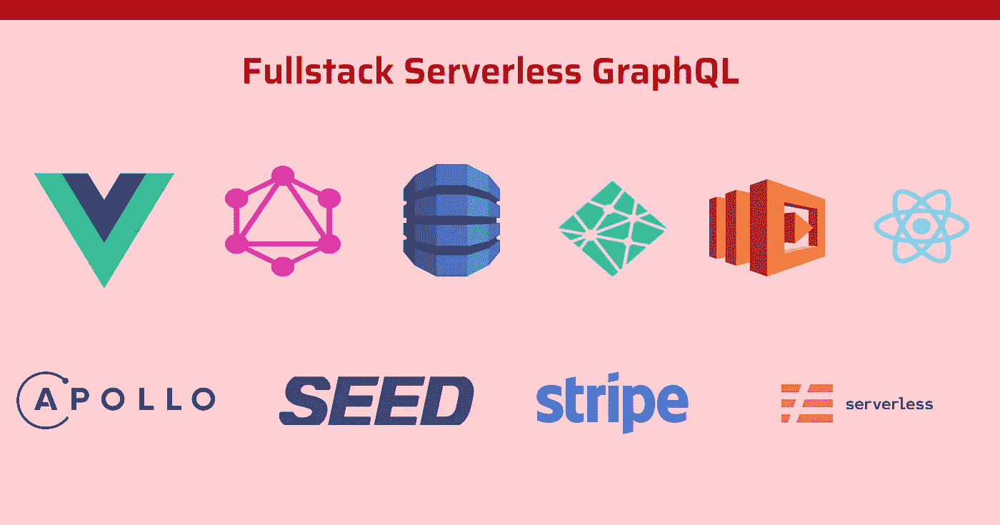
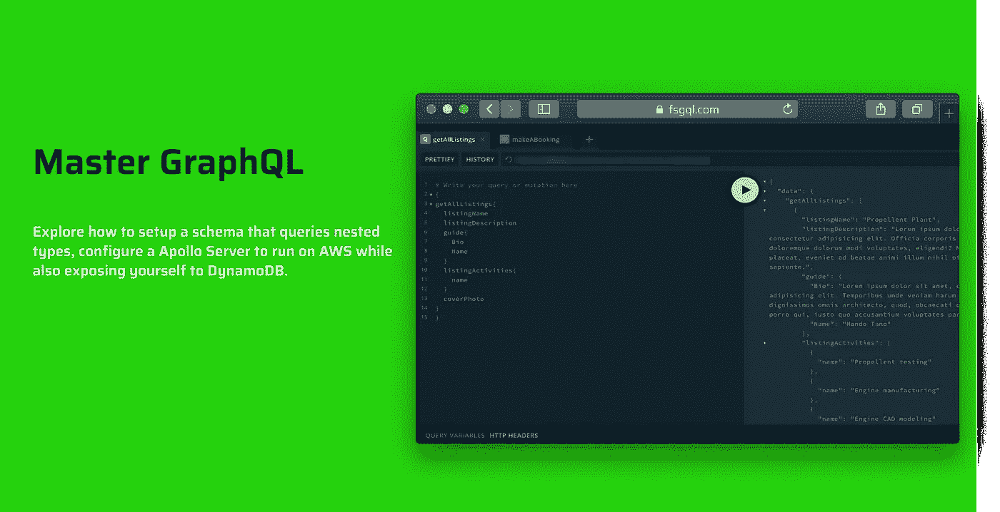

# 使用 GraphQL、Lambda、DynamoDB、无服务器框架、Vue、React 和 TailwindCSS 构建一个预订月球度假的应用程序🌝

> 原文：<https://itnext.io/build-an-app-that-books-vacations-to-the-moon-with-graphql-lambda-dynamodb-serverless-framework-569b26b6e85?source=collection_archive---------1----------------------->

> 去看看课程文件👉[这里](https://fsgql.com/)

如果你准备好改进你的前端和后端 [JavaScript](https://developer.mozilla.org/en-US/docs/Web/JavaScript) ，学习 [GraphQL](https://graphql.org/) 和[无服务器](https://martinfowler.com/articles/serverless.html)，那么这就是适合你的[资源](https://fsgql.com/)！在本课程中，您将学习如何使用以下玩具制作前沿的 fullstack 应用程序:

*   [AWS Lambda](https://aws.amazon.com/lambda/?c=ser&sec=srv)
*   [AWS DynamoDB](https://aws.amazon.com/dynamodb/?c=ser&sec=srv)
*   GraphQL ( [Apollo Serve](https://www.apollographql.com/docs/apollo-server/) r， [Client](https://www.apollographql.com/docs/react/) ， [Vue Apollo](https://www.notion.so/Links-b512a3954ee24765a24ffd2fe17eaf6c#a60a67d807a047caae789682fb9fea26)
*   VueJS
*   [反应堆](https://reactjs.org/)
*   [尾翼 CSS](https://tailwindcss.com/)
*   [无服务器框架](https://www.serverless.com/)
*   [蚂蚁设计](https://ant.design/)

当我开始我的第一份工作时，我真的很难用这个堆栈来设置一个应用程序。我不得不拼凑不同的教程，这是一场噩梦。最后，我设置了一个样板项目，用 JavaScript 和 TypeScript 搭建了一个无服务器的 GraphQL API。虽然有很多关于如何在前端使用 GraphQL 的例子，但是关于如何开发和部署 fullstack 项目的资源却很少。因此，我还需要一款前沿应用程序，供我不时参考。因此，本指南将成为你实现这一目标的资源。它非常固执己见，所以如果它不适合你的堆栈，你可以看看项目的不同部分，并采取你所需要的。

这个课程的美妙之处在于，你可以在 Vue 和 React 之间选择自己的前端冒险。在 Vue 方面，我们探索了如何使用 [Vue CLI](https://cli.vuejs.org/) 构建项目，并管理父组件及其子组件的状态。而如果你选择在 React 中做课程的前端部分，你将学习如何使用 Apollo 的本地缓存来替代 [Redux](https://redux.js.org/) 。

顺风 CSS 正在悄悄进入每个人的工作流程来管理他们的 CSS，虽然我相信你可以在你的 React 应用程序中结合使用它与[风格的组件](https://styled-components.com/)，它为你的应用程序风格带来了不同的好处。这些好处是:

*   使您完全能够在不覆盖现有样式的情况下构建自定义样式。
*   更容易构建响应性 UI。
*   更容易在代码中采用和实现您的设计系统。

这个项目的灵感来自于[异常创新](https://anoma.ly/)的人们，他们创建了[无服务器堆栈](https://serverless-stack.com/)，这是一门教你如何使用 REST 发布无服务器 API 的课程。

等待获得如何构建一个全栈无服务器 GraphQL 应用程序的机会结束了！[免费获取！](https://fsgql.com/)

以下是各种回购和演示应用程序的链接🎮：

*   [Vue 前端](https://lunar-tour-vue.netlify.app/) || [部署的 App](https://github.com/Fullstack-Serverless-GraphQL/lunar-tour-frontend)
*   [React 前端](https://github.com/Fullstack-Serverless-GraphQL/lunar-tour-react) || [部署的 App](https://lunar-tour-react.netlify.app/)
*   [无服务器 API](https://github.com/Fullstack-Serverless-GraphQL/lunar-tour-api)
*   [科目回购](https://github.com/Fullstack-Serverless-GraphQL/fullstack-serverless-graphql-docs) || [科目单据](https://fsgql.com/)

