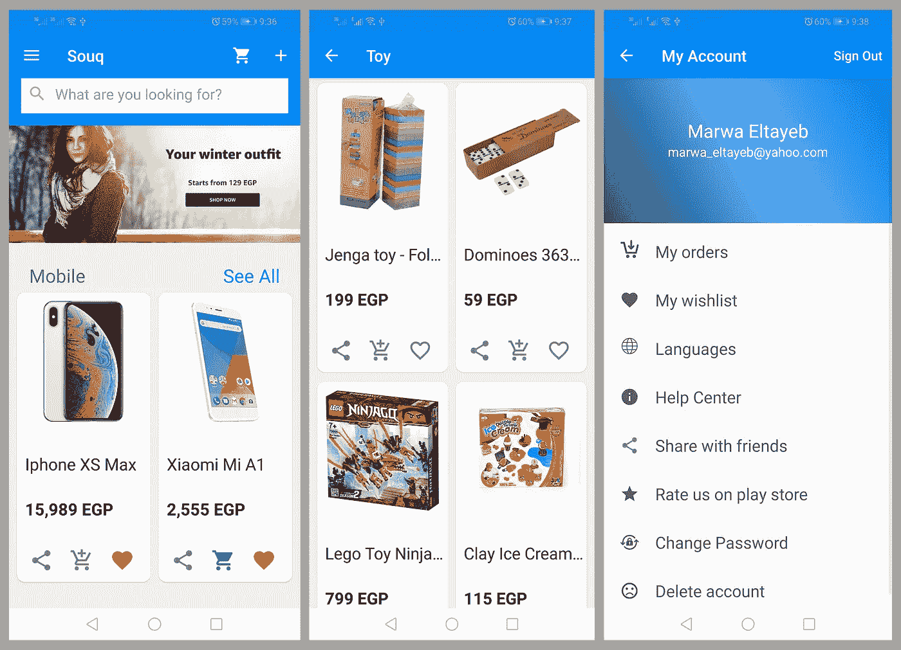

# 为 Android 开发一个像 Souq.com 一样的电子商务商店应用

> 原文：<https://itnext.io/build-an-e-commerce-store-app-like-souq-com-for-android-5d87889f7dc?source=collection_archive---------4----------------------->



网上购物

许多开发人员都想知道如何创建一个电子商务商店应用程序，我也是。因此，我决定创建一个类似于*souq.com*的电子商务商店应用程序。当我分享它的时候，有那么多开发者喜欢它，并问我关于它的问题，所以我决定写一下它，让你了解一下它的特性。我的应用程序是使用 **MVVM 架构**实现的。我已经用 **MySQL** 和 **Node.js** 写了后端 rest API。

它是 Souq.com 的克隆体，但并不完全相同。如你所知，要建立一个像*Souq.com*这样的应用，你需要有一个大团队来协作。然而，我自己制作了这个应用程序，它包含了许多你可以在应用程序中实现的功能。

首先，用户可以注册一个新帐户，如果他/她没有，或者登录到他们现有的帐户。该应用程序使他们能够添加其他产品，如果他们有管理员帐户。他们可以浏览产品并查看产品的详细信息，如产品名称、图片、图像、价格等。

此外，用户可以使用关键字或类别搜索产品。他们可以在购物车中添加或删除产品。该产品可以添加到他们的愿望清单或从中删除。

用户可以评论一个产品，给出反馈，并检查其他用户的评论。他们可以查看购物车或愿望清单中的所有产品。

如果愿意，用户可以注销或删除他/她的帐户。对于个人资料图片，用户可以通过相机拍照或从图库上传。

用户可以更新密码，并通过电子邮件获得 OTP 来验证他们的身份，如果他们忘记了密码。此外，如果用户愿意，他们可以更改应用程序的语言。

有能力与朋友分享应用程序，并在谷歌 Play 商店评级。此外，用户可以获得关于新优惠的新闻提要。该应用程序还通过帮助中心提供支持。

最后，用户可以添加他们的送货地址，并跟踪他们的订单状态。

**Android 端包含的库:**

(分页/滑动/改装/数据绑定/实时数据/视图模型/回收视图/卡片视图/ GSON / CircleImageView)

**服务器端包含的库:**

(Express/ Multer/ Bcrypt/ JWT/正文解析器/节点邮件程序)

## 运行应用程序的步骤:

1.从 Xampp 启动服务器和 MySql。

2.从 SQL_Database 导入数据库到 PhpMyAdmin [如何导入](https://help.dreamhost.com/hc/en-us/articles/214395768-phpMyAdmin-How-to-import-or-restore-a-database-or-table)。

3.在 Souq_Backend 中创建三个文件夹来存储图像。

```
mkdir storage_postermkdir storage_productmkdir storage_user
```

4.单击 Souq_Backend 文件夹并运行 npm install 命令来安装服务器依赖项。

5.要启动服务器，请运行 npm start 命令。

6.打开 Android Studio 并运行项目。

万岁，现在你可以使用它，并在你的电子商务商店应用程序中应用任何你喜欢的功能。

**通过** [Souq_ShopOnline](https://github.com/Marwa-Eltayeb/Souq_ShopOnline) 获取 app

更多文章:点击 [**此处**](https://marwa-eltayeb.medium.com/)

**在:**[GitHub](https://github.com/Marwa-Eltayeb)|[LinkedIn](https://www.linkedin.com/in/marwa-eltayeb/)|[Twitter](https://twitter.com/Marwa_Eltayeb1)