# 使用 Angular 构建企业级可扩展仪表板—第 1 部分

> 原文：<https://itnext.io/build-an-enterprise-scalable-dashboard-using-angular-155aa4280a74?source=collection_archive---------1----------------------->

许多专业开发人员已经或将要承担为他们的公司网站构建仪表板的任务。本文将介绍一种保持内容独立于仪表板的特殊方法。

这是两部分系列文章的第一部分。你可以在这里找到第二部。

如果你是 Angular 的新手，我建议你阅读[这篇关于表示/哑组件 vs 容器/智能组件的文章](https://blog.angular-university.io/angular-2-smart-components-vs-presentation-components-whats-the-difference-when-to-use-each-and-why/)。

在参加 ng-conf 2019 时，我遇到了一位在一家非常大的银行公司工作的人，他试图以一种让仪表板完全不知道组件的方式来构建仪表板。仪表板上的每个卡片都有潜在的动态组件，这些组件需要在仪表板模板中没有任何直接引用的情况下存在。后来我发现[这是 Angular 团队的官方教程](https://angular.io/guide/dynamic-component-loader)，我建议你在继续之前读一读。但是，本教程并没有展示如何加载多个组件，并且还需要仪表板将数据绑定到动态组件，这在现实应用程序中变得非常复杂。这篇文章解决了缺失的部分，所以让我们开始吧。

# 入门指南

我总是做的第一件事是生成一个功能模块来托管我们所有的仪表板相关的优点。我还生成了仪表板组件，所有的操作都将在这里发生。

在仪表板中，我将声明一个名为 *tracks 的变量。*可变轨道保存相关信息以及属于每个轨道的项目。

> 仪表板.组件. ts

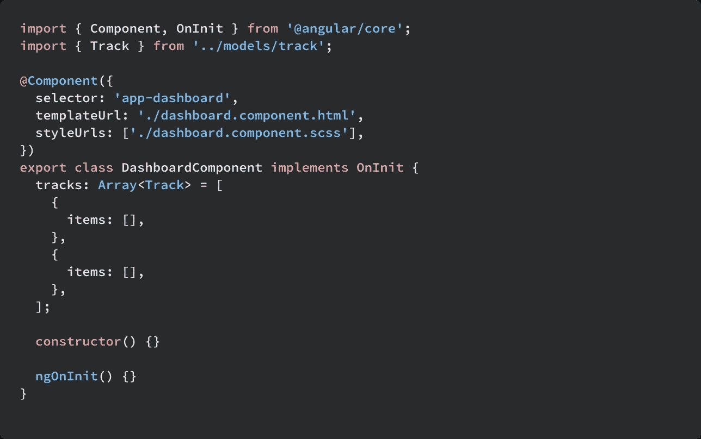

> item.ts

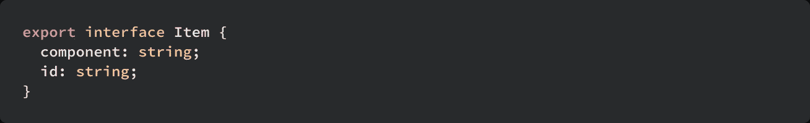

> track.ts

请注意 Item 上的 component 属性是一个字符串。这是有意的，将在后面的部分解释。

我还呈现了仪表板模板中的项目。

> dashboard.component.html

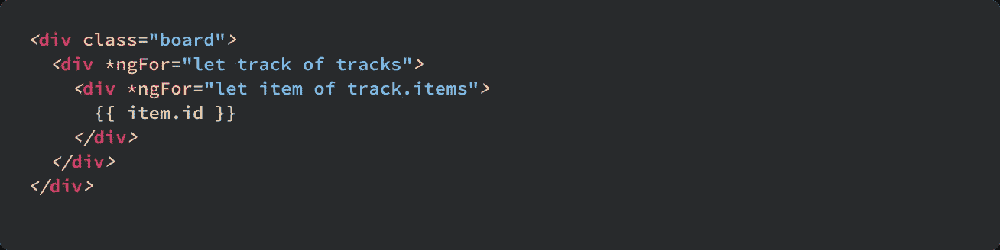

# 动态加载内容

本节将介绍如何在不直接引用组件的情况下将组件加载到仪表板上。

为了动态加载组件，我们需要一个对每个项目模板的视图容器引用。要访问它，创建一个指令，在我的例子中，我称它为“dashboardOutlet ”,并将 ViewContainerRef 添加到构造函数中，并为该项添加一个@Input()。

*dashboard-outlet . directive . ts*

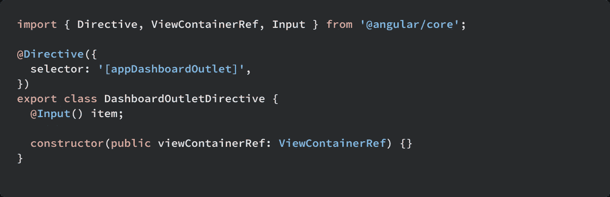

然后用 ng-template 标记替换 dashboard.component.html 中的 item.id 表达式。接下来，将 dashboard-outlet 指令添加到 ng-template，并将项目的数据绑定到 item 指令。

*dashboard.component.html*

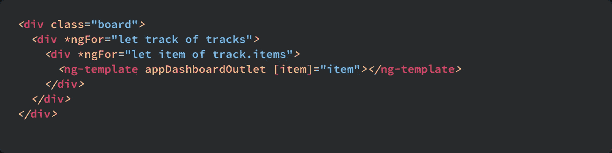

现在，在我们将内容组件呈现到仪表板之前，我们必须做一些事情。

首先，我创建了一个 dashboardCard 组件和 dashboardCardContainer 组件，每个仪表板卡及其父容器都将扩展这两个组件，这允许我们绑定一组公共的变量和事件。DashboardCardContainer 需要一个@Input()项来保存对该项本身的引用。其思想是容器将为表示组件完成所有的服务调用和数据检索。目前，这些只是占位符组件。

*dashboard-card . container . ts*

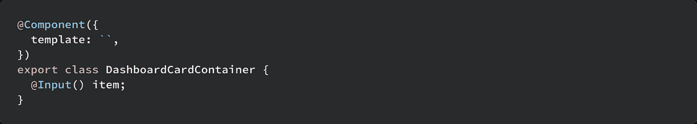

其次，我们必须有一个地方来托管仪表板上不存在的组件。为此，创建一个文件并导出一个名为 *dashboardCards* 的对象。dashboardCards 是一个将字符串映射到仪表板组件的对象。这样，我们可以给它一个字符串，它会返回一个组件供我们渲染。我还喜欢创建一个枚举来保存对每个字符串的引用，这允许我们在 track 对象上构建项目时使用 autocomplete。

*仪表板-卡片. ts*

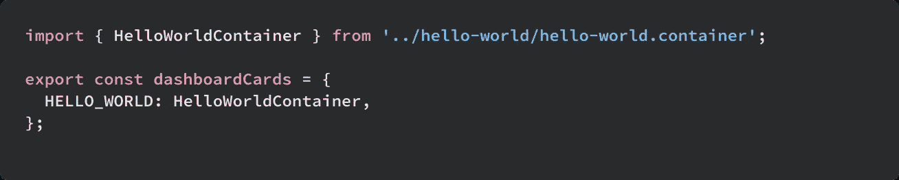

*dashboard-cards.enum.ts*

使用这些引用，我们可以引用内容组件，而不需要仪表板直接引用模板中的组件。

回到仪表板组件，我们需要一个从*ngFor 循环中创建的所有模板的引用。我们可以通过使用 [@ViewChildren](https://angular.io/api/core/ViewChildren) 查询 DashboardOutlet 指令来实现这一点。

*dashboard.component.ts*

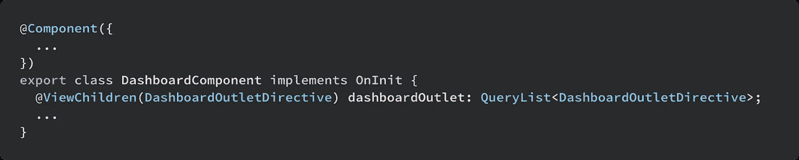

有了这个引用，我们现在可以将组件加载到仪表板上。我们使用一个名为 loadContent 的方法来实现这一点。它有两个参数:类型为 DashboardOutletDirective 的 template 和名称非常巧妙的类型为 item 的 Item。然后，我们使用 loadContent 方法中的[componentforyresolver](https://angular.io/api/core/ComponentFactoryResolver)来创建内容并将其呈现在模板上。我还创建了另一个方法 loadContents(注意“s”)，它遍历@ViewChildren 提供的所有模板，并将其传递给 loadContent。

*dashboard.component.ts*

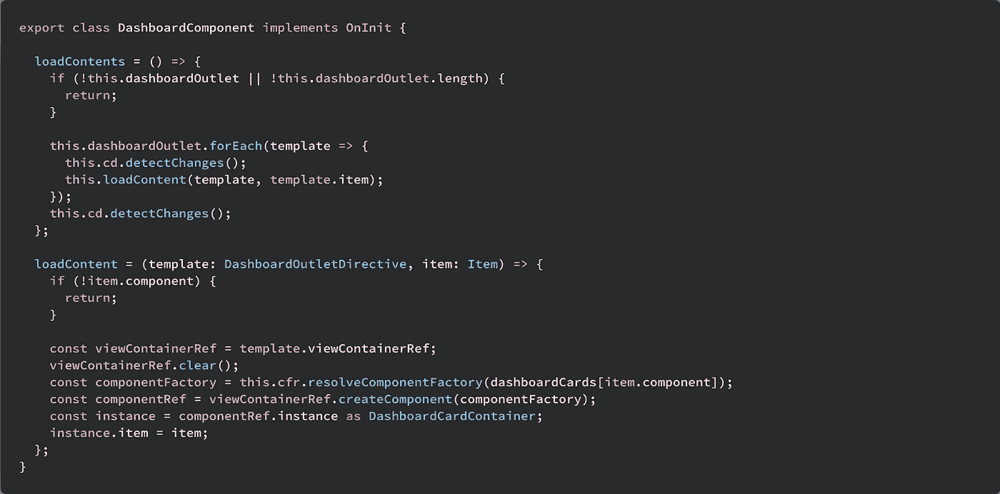

因为我们已经更新了 dom，所以我们告诉 changeDetectorRef 来检测更改是很重要的。如果没有这个调用，您可能会得到错误或意外的结果。

最后，我们所要做的就是将项目添加到轨道中，并在 ngAfterViewInit()中调用 loadContents。

*dashboard.component.ts*

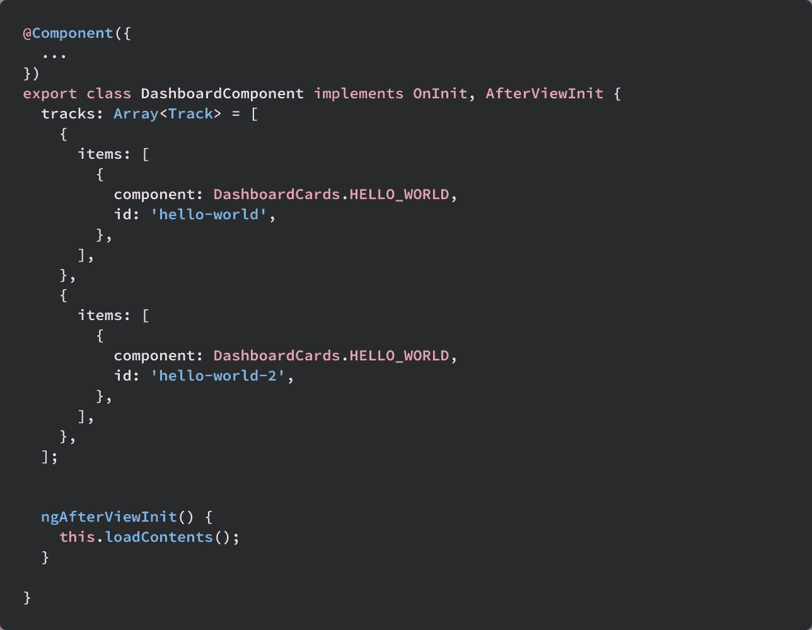

就是这样！您应该拥有一个功能完整的动态仪表板，独立于它所呈现的内容。

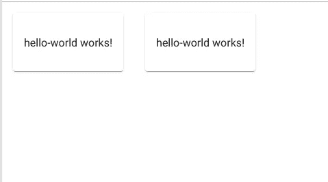

你可以在这里获得完整的功能示例:[https://stack blitz . com/github/but tars/enterprise-dynamic-dashboard](https://stackblitz.com/github/buttars/enterprise-dynamic-dashboard)

在[第 2 部分](https://medium.com/@buttars/build-an-enterprise-scalable-dashboard-using-angular-part-2-104acc38bea3)中，我将讲述如何在维护状态的同时实现拖放，如何为单个卡片进行服务调用，以及如何在运行时从轨道中添加/删除项目。

这是我写的第一篇文章，如果你喜欢它或者学到了什么，给它几个掌声，这对我意义重大。此外，我将尽可能回答更多的问题，所以如果你有任何问题，请在下面评论。