# 使用 Angular 构建企业级可扩展仪表板—第 2 部分

> 原文：<https://itnext.io/build-an-enterprise-scalable-dashboard-using-angular-part-2-104acc38bea3?source=collection_archive---------3----------------------->

在[第 1 部分](https://medium.com/@buttars/build-an-enterprise-scalable-dashboard-using-angular-155aa4280a74)中，我们讨论了如何利用动态组件呈现将仪表板内容与仪表板本身分开。在这一部分中，我们将讨论如何在轨道中添加/删除项目，如何为仪表板上的各个卡片进行服务调用，以及如何在维护状态的同时实现拖放。

# 添加和删除项目

## 在开始之前

Angular 的最佳实践是将共享状态转移到可以在应用程序的多个组件间使用的服务中。因为我们在 dashboard.component.ts 中声明了我们的跟踪，所以任何其他组件都无法直接访问它，包括仪表板内容。为了能够从仪表板组件本身之外的任何地方添加或删除卡片，我们需要将 tracks 变量移动到服务中。

在我们继续之前，理解可观察服务的概念是很重要的。可观察服务是以可观察的形式返回数据(通常是状态)的常规服务。如果你不熟悉可观察服务的概念以及它们的优缺点，我推荐你阅读[这篇文章](https://blog.angular-university.io/how-to-build-angular2-apps-using-rxjs-observable-data-services-pitfalls-to-avoid/)，它更深入地讨论了这个主题。现在，这将允许我们共享仪表板状态，这将很快有用。

首先，生成仪表板服务。然后将 tracks 数组从 dashboard.component.ts 复制到您的服务中。我还将变量重命名为 *defaultState* 。

*dashboard.service.ts*

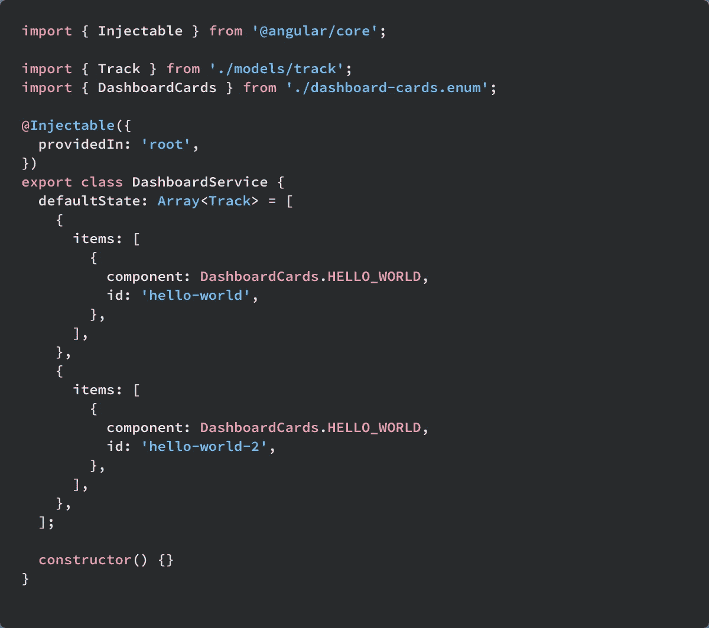

第二，创造一个我们可以给出数据的主体。一个[主题](http://reactivex.io/rxjs/manual/overview.html)就像一个 EventEmitter，能够拥有多个观察者。在我们的例子中，我们想用一个行为主体。BehaviorSubject 将向新的侦听器发出最后一个给定值。我们可以通过调用 this.subject.asObservable()从我们的主题创建一个可观察对象，我将该变量命名为 tracks$。

*dashboard.service.ts*

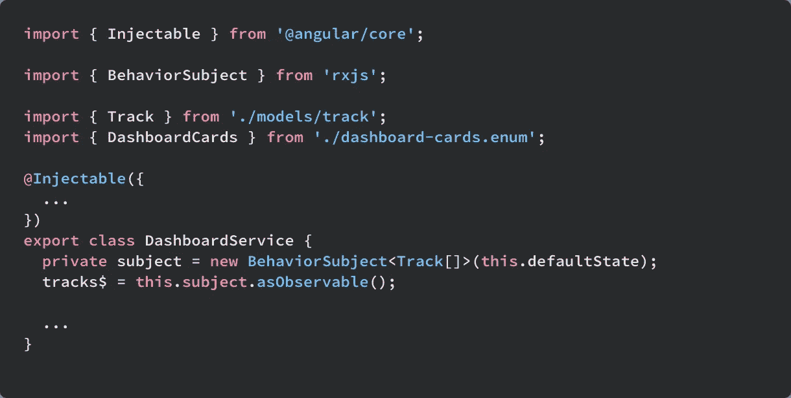

最后，从仪表板组件的服务中检索曲目。

*dashboard.component.ts*

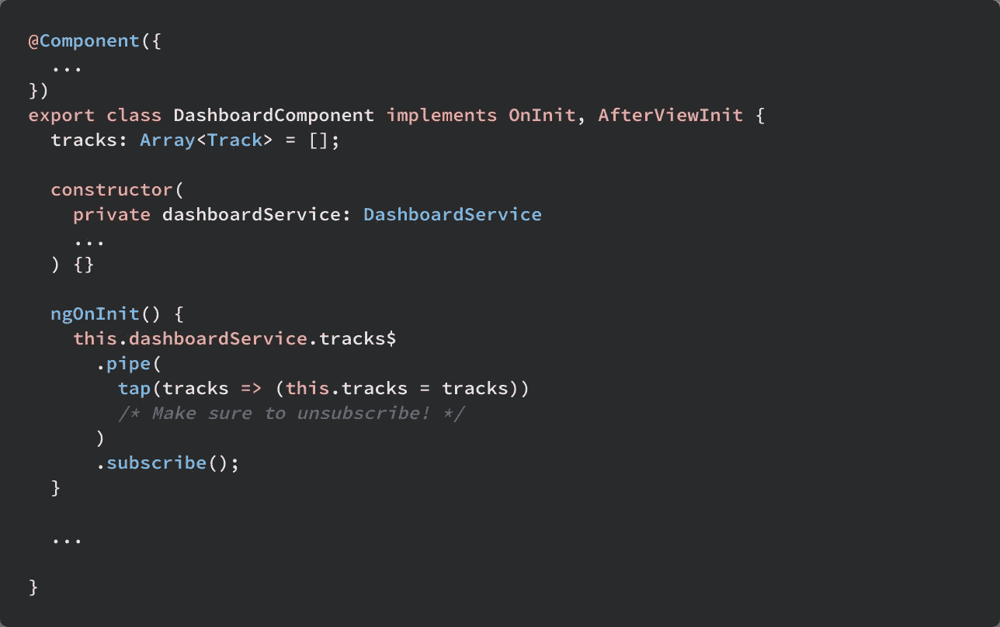

现在，我们可以开始在仪表板上添加和删除曲目。

## 移除项目

为了移除项目，在仪表板服务上创建一个方法，我将其命名为 removeItem。Removed item 将某个项目作为参数，并尝试从 tracks 状态中删除该项目，并将更改推送到主题。

要从主题获取状态，请调用 subject.getValue()。这将给我们一个主题在那个时间点的快照。现在我们有了快照，可以开始操作它了。

*dashboard.service.ts*

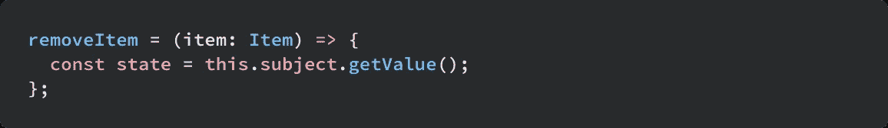

通过循环状态数组中的每个轨迹来移除项目。然后，对于每个轨道，在轨道中的项目上循环。如果循环中的项目与作为参数提供的项目相匹配，那么我们希望将它从轨道中拼接出来。完成后，我们希望通过调用 this.subject.next()将新状态再次传递给主题。

*dashboard.service.ts*

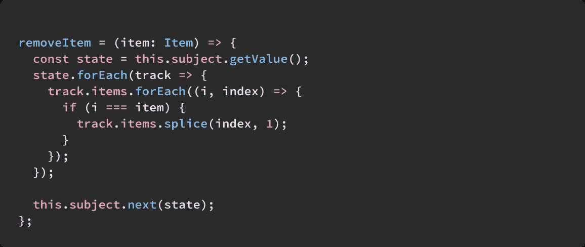

## 添加项目

创建一个名为 addItem 的方法，该方法将获取一个项目并将其添加到其中一个轨道。我选择将新物品推到物品最少的赛道。可选:在添加项目之前，您可能希望验证项目不存在于任何一个轨道上，以防止重复。

*dashboard.service.ts*

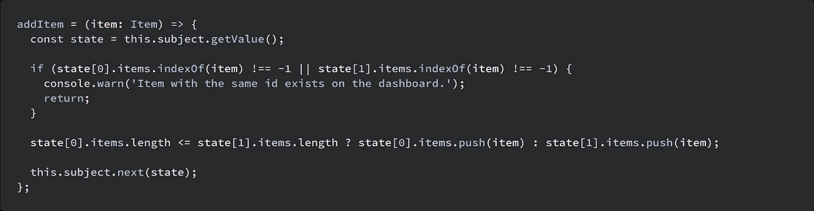

在我们可以使用 addItem/removeItem 方法之前，我们必须了解如何从仪表板内容中进行单独的服务调用，这将在下一节中介绍。

# 调用服务并将状态传递到仪表板内容中

将内容状态从仪表板中分离出来是非常强大的。它允许我们独立地创建仪表板内容，表示为卡片，而在仪表板组件中没有任何特定于内容的逻辑。如果您在企业环境中工作，将仪表板与内容的状态分离允许多个组织创建、管理和维护他们负责的仪表板内容，而无需接触仪表板组件本身。例如，财务部门可能想要创建一个金融卡来显示财务事项。当他们这样做时，除了 dashboard-cards.enum.ts 和 dashboard-cards.ts 之外，他们不需要接触任何东西。

对于这个示例，继续创建另一个名为 HelloService 的服务。该服务将保存一个姓名列表，可以通过仪表板内容检索到该列表。同样，在 HelloWorldComponent 上添加 Input() *name* ，并在组件模板中显示它。

*hello-world.service.ts*

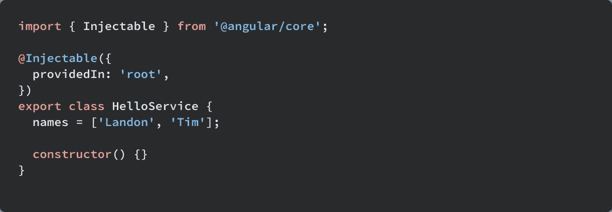

*hello-world . component . ts*

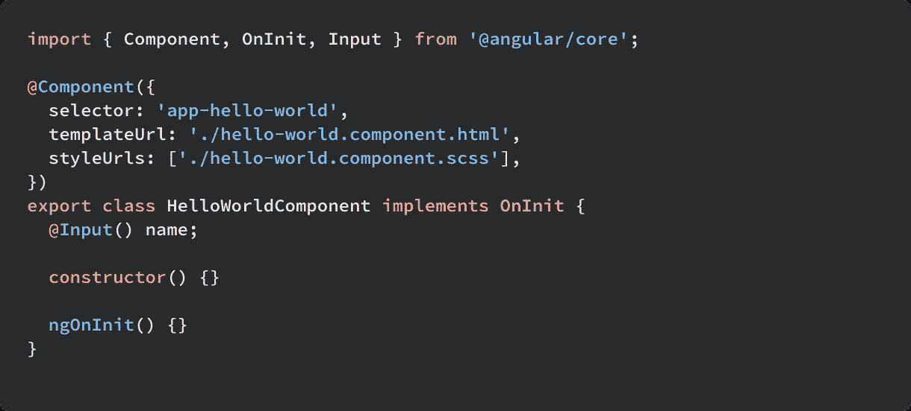

*hello-world.component.html*

如果您按照教程进行操作，您将在第一部分创建了一个 HelloWorldContainer 组件。容器应该调用服务，检索它需要的信息，并通过子组件的 Input()属性将其传递给内容。

由于我们将容器映射到跟踪项目的方式，仪表板上的每个唯一项目都必须有一个容器。这是因为容器必须调用服务来检索数据，并且根据您构建组件的方式，这可能会限制任何特定容器的可重用性。

为了检索不同的数据，我将生成第二个容器 hello-world-two.container.ts，并将其添加到 entryComponents，这与我们用于 hello-world.container.ts 的过程相同。

每个容器将从 HelloService 中检索一个名称，并将其传递给 HelloWorldComponent。唯一的区别是每个容器检索的名称。

*hello-world.container.ts* 和*hello-world-two . container . ts*

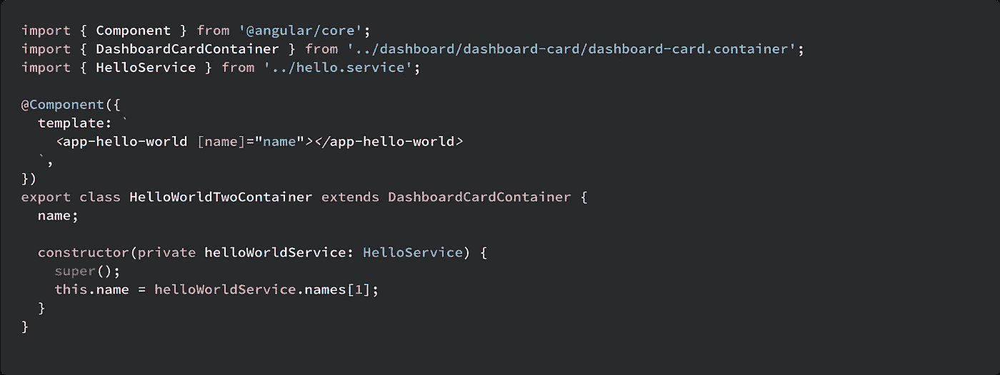

现在进入 dashboard-cards.ts 和 dashboard-cards.enum.ts 并添加另一个条目 HELLO_WORLD_TWO。

*仪表板-卡片. ts*

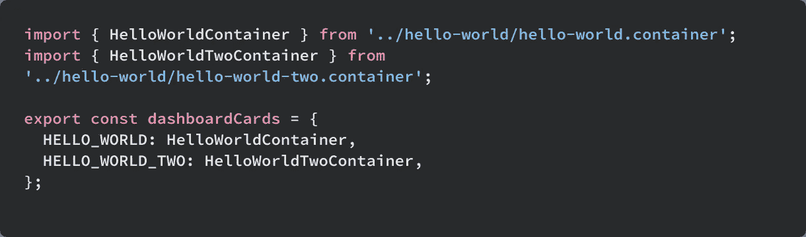

*仪表盘-cards.enum.ts*

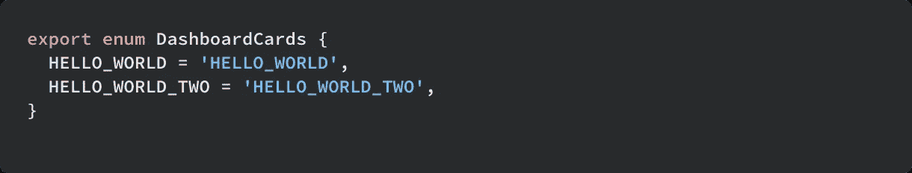

在 dashboard.service.ts 中，将第二个项目的组件更改为“HELLO_WORLD_TWO”。

保存更改，您可以看到仪表板上现在有两张内容不同的卡片。

万岁！！！现在我们已经构建了一个解耦的静态仪表板。在下一节中，我们将使内容可拖动。

# 实现拖放

拖放通常是一项非常困难而又平凡的任务。幸运的是 ng2-dragula 让这变得非常容易。继续安装它。纱线添加 ng2-dragula。在 [dragula repo](https://github.com/valor-software/ng2-dragula#Setup) 中有一个您需要遵循的安装说明列表。Dragula 也需要导入仪表板模块。

要实现拖放，我们只需添加 dragula 和 dragulaModel 指令以及 dragulaModelChanged 事件。dragula 指令简单地标识了给定轨道应该属于哪个组。在我们的例子中，它们都属于*仪表板*组。dragulaModel 指令指定 dragula 轨道应该包含哪些项目。这将与我们的曲目数据同步。我们还需要一些 css 来确保当轨道为空时，轨道不会缩小到 0 大小，这样我们就可以把东西拖回来。

*dashboard.component.html*

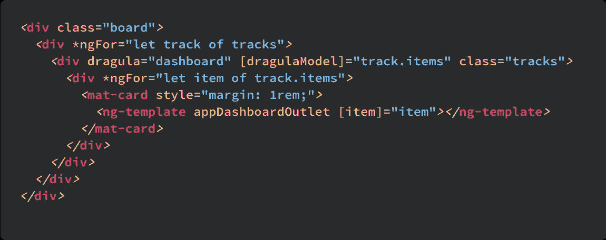

*dashboard . component . scss*

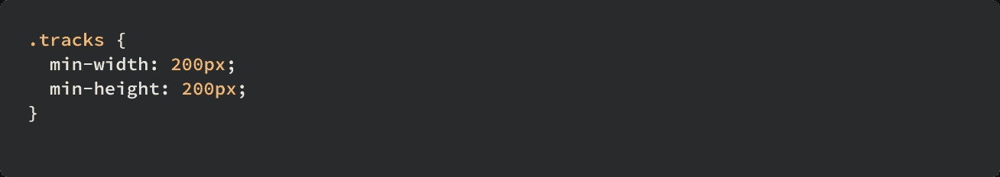

有了这些补充，卡片现在是可拖动的了。厉害！现在开始存储一些状态。

## 存储状态

为了在拖放时保持变化，我们必须做一些事情。

首先，我们必须获取由 dragulaModelChanged 事件发出的已更改状态，并在服务中设置它。我们将需要一种方法来获取轨迹的整个状态，并将它们推入主题中。将名为 setState 的方法添加到 DashboardService 中。setState 需要一个轨道数组，并相应地设置状态。

*dashboard.service.ts*

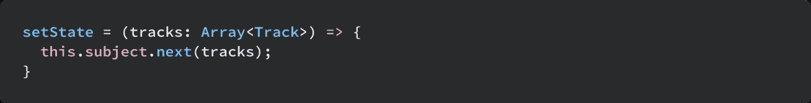

当轨道发生变化时，我们将在仪表板组件中调用它。

dragulaModelChanged 将发出一个事件，该事件在拖放后返回传递给 dragulaModel 的数组以及相应的更改。问题是它只返回特定轨道的单个项目，而不是轨道的数组。这意味着我们必须知道哪个轨道的项目被改变了。为此，我们可以在仪表板模板中轻松添加对 tracks ngFor 循环索引的引用。这将为我们提供 dragulaModelChanged 所指的轨道的参考。

在仪表板组件上创建一个名为 changed 的方法。更改后的方法将接受 track 和 trackIndex。一旦调用 changed，它将检索当前状态并应用从事件中给我们的更改。一旦有了对修改状态的引用，就将其传递给 setState 来更新服务。

*dashboard.component.ts*

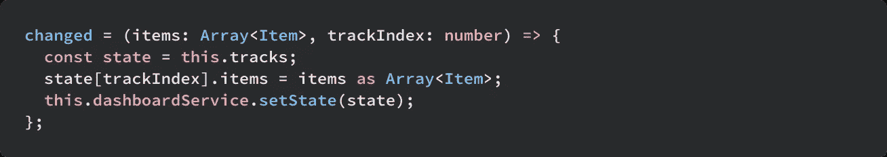

我们现在可以将 dragulaModelChanged 事件添加到我们的 div 并调用 Changed。

dashboard.component.html

*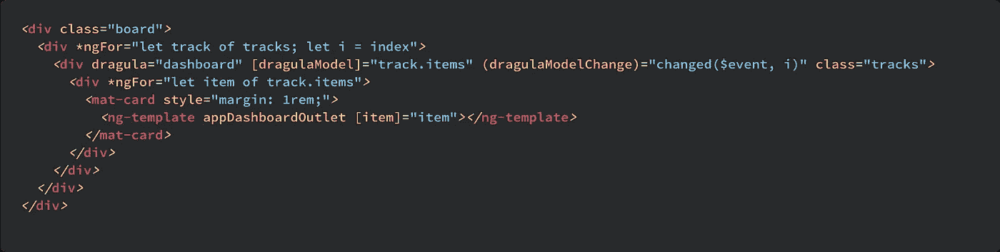*

*现在事情变得奇怪了。因为我们正在更新指示需要呈现什么的对象，所以我们必须告诉变更检测来检查变更，只有这样我们才重新加载内容。如果您按错误的顺序操作，loadContents 方法将没有正确的 ng 模板来呈现组件。添加 detectChanges 调用的最佳位置是 tracks 订阅中。每当 dashboard 服务中的 subject 获得一个新值时，就会调用这个订阅，在我们的例子中，就是当卡片被拖放时。*

**dashboard.component.ts**

*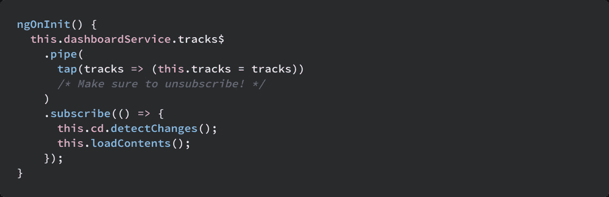*

*耶，当我们拖动时状态是一致的！！剩下要做的就是拯救这个国家。*

## *保存仪表板状态*

*保存仪表板状态非常简单。我们所要做的就是将仪表板轨道存储在本地存储中(或者任何你想要的地方),并在启动时加载它。我们还将实现一个默认配置，以防用户第一次访问仪表板。*

*在仪表板服务上创建一个名为 loadFromLocalStorage 的方法。这将获取仪表板状态并更新服务。*

**dashboard.service.ts**

*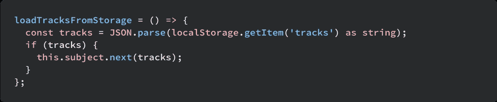*

*创建另一种方法；saveTracksToStorage。顾名思义，它将曲目作为字符串保存到 localstorage。*

**dashboard.service.ts**

*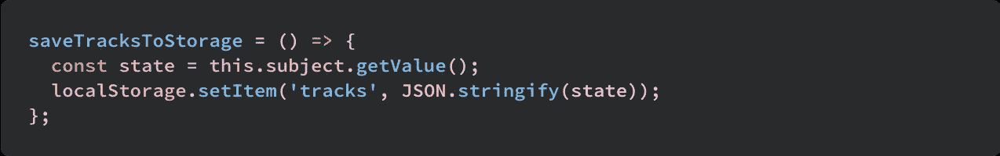*

*要保存对跟踪的未来更新，请订阅仪表板服务构造函数中的 tracks$。在此之前，我们需要确保并调用 this.loadTracksFromStorage，以便获得最近保存的状态。*

**dashboard.service.ts**

*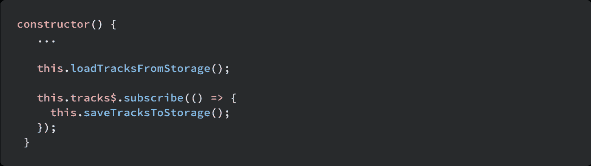*

*然后嘣！*

*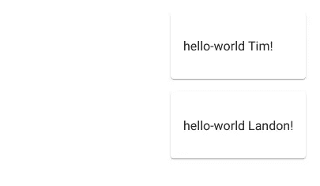*

*你有一个动态的可拖动仪表板，它的状态完全独立于内容！*

*源代码:[https://stack blitz . com/github/but tars/enterprise-dynamic-dashboard/tree/part-2](https://stackblitz.com/github/buttars/enterprise-dynamic-dashboard/tree/part-2)*

*我希望你喜欢这两部分系列。如果你做到了，我会很感激你给它一些掌声。(如果你觉得特别慷慨，最多 50 英镑)。*

*我会在下面的评论中回答尽可能多的问题，所以请随意提问。*