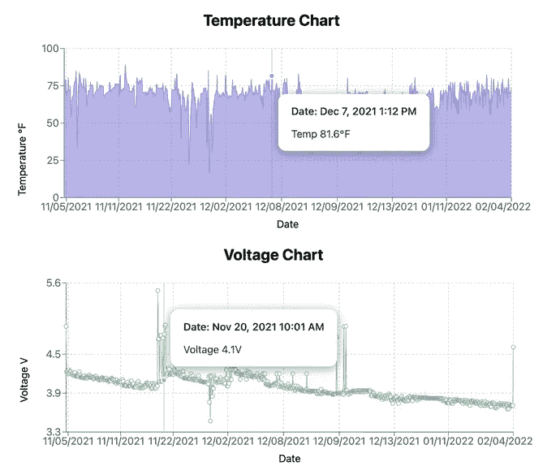
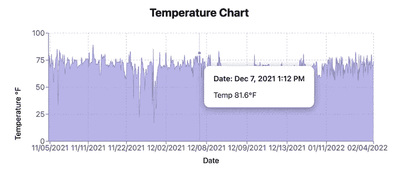
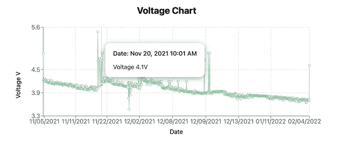
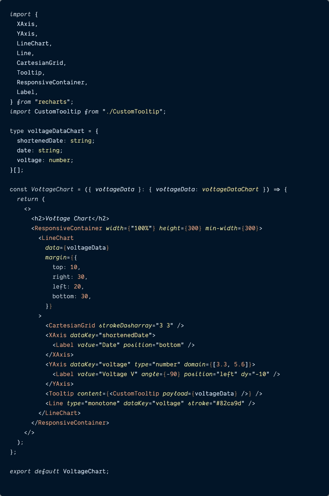
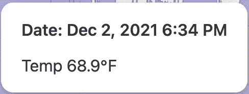
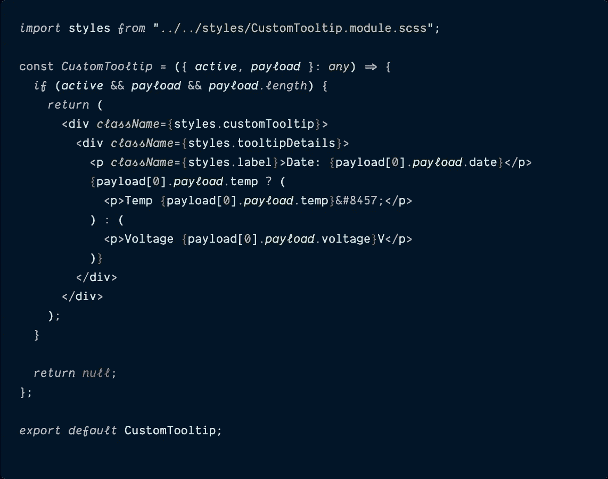
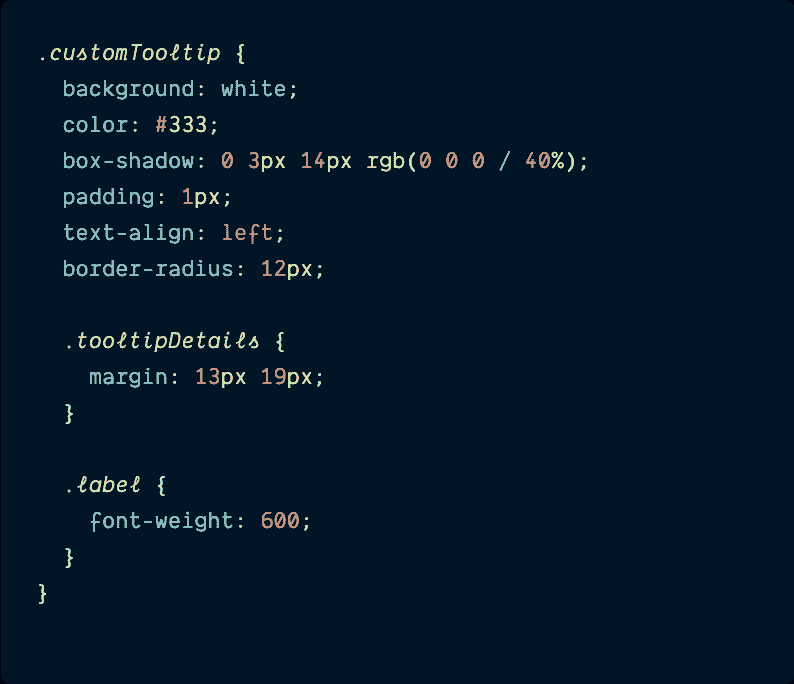
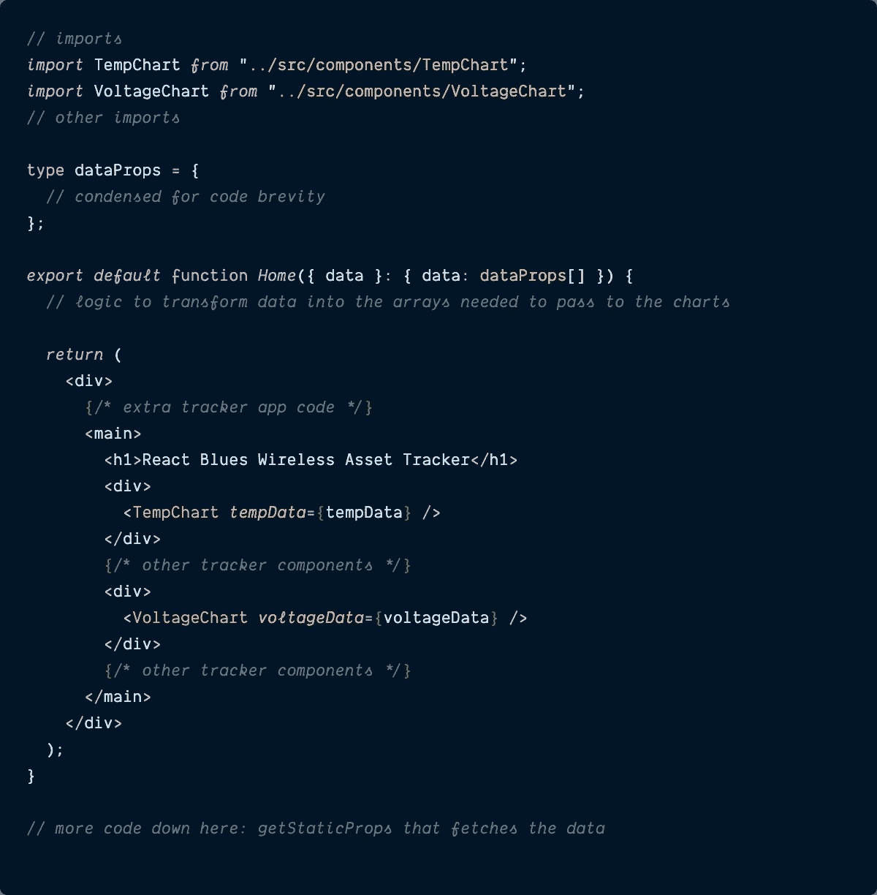
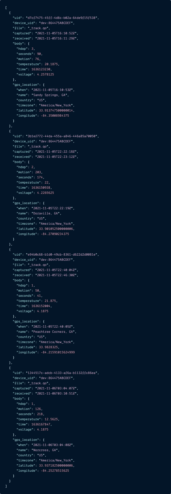
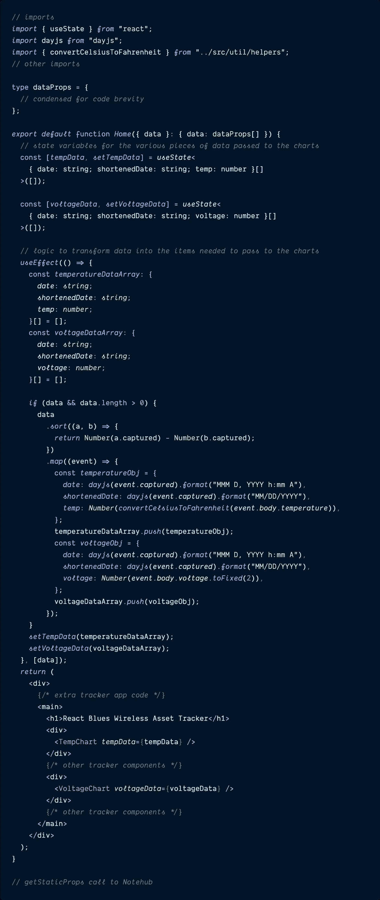

# 构建和自定义风格反应数据图表

> 原文：<https://itnext.io/build-and-custom-style-recharts-data-charts-d602f226a18c?source=collection_archive---------3----------------------->

## Recharts 有标准的图表和工具提示，但是定制它们需要一点额外的努力。



# 介绍

2021 年夏天，我开始为一家物联网(IoT)初创公司 [**Blues Wireless**](https://blues.io/?&utm_source=medium&utm_medium=web&utm_campaign=niedringhaus-effect&utm_content=ep-2) 工作，该公司旨在让物联网开发变得简单——即使在可靠的互联网连接不可用的情况下。Blues 通过 [**Notecards**](https://blues.io/products/notecard/?&utm_source=medium&utm_medium=web&utm_campaign=niedringhaus-effect&utm_content=ep-2) 来实现这一点——可以嵌入任何“边缘”物联网设备的预付费蜂窝设备，以 JSON 的形式将传感器数据传输到安全的云: [**Notehub**](https://notehub.io/?&utm_source=medium&utm_medium=web&utm_campaign=niedringhaus-effect&utm_content=ep-2) 。

然而，我不是硬件或固件工程师，web 开发是我的专业领域(特别是前端)，所以为了涉足物联网开发，我开始构建一个更简单的项目:一个 [**资产追踪器**](https://www.hackster.io/paige-niedringhaus/low-code-gps-asset-tracker-and-map-display-b10419) 仅使用一个 Blues[**note card**](https://shop.blues.io/products/note-nbgl-500/?&utm_source=medium&utm_medium=web&utm_campaign=niedringhaus-effect&utm_content=ep-2)，Blues[**note carrier AL**](https://shop.blues.io/products/carr-al/?&utm_source=medium&utm_medium=web&utm_campaign=niedringhaus-effect&utm_content=ep-2)和一个小型 [**锂离子聚合物(LiPo)电池**](https://www.adafruit.com/product/328)

在 Blues [**开发者体验文档**](https://dev.blues.io/guides-and-tutorials/notecard-guides/asset-tracking/?&utm_source=medium&utm_medium=web&utm_campaign=niedringhaus-effect&utm_content=ep-2) 的帮助下，我在 30 分钟内将温度、电压和 GPS 定位数据从我的追踪器传送到了 Notehub 云端。这很酷，但来自传感器的数据真正变得有用的方式是在某种 UI 中显示给用户，对吗？可能是地图、表格，或者对我来说是图表。

因此，我想从 Notehub 云中获取数据，并将其输入一个定制的仪表板，以跟踪和显示现实世界中 Notecard 的位置、电压和传感器读数。React 是我目前选择的 JavaScript 框架，我决定构建一个 Next.js 类型脚本驱动的仪表板，在这个过程中我学到了很多有趣的东西，我打算在接下来的几个月里通过一系列博客文章与您分享。

> *如果你错过了我的第一篇博文《使用 React 传单在 Next.js 中构建资产跟踪地图》，你可以在这里阅读*[](https://www.paigeniedringhaus.com/blog/create-an-asset-tracker-with-next-js-and-react-leaflet)**。**

***今天，我计划向您展示如何在 Next.js 应用程序中使用 Recharts 库，使用来自第三方 API 源的真实数据来构建图表和定制样式的工具提示。***

*这是最终仪表板的样子——温度和电压图表是这篇文章的重点。*

# *在 Next.js 应用程序中创建图表组件*

***请注意:**本文不会介绍一个全新的 Next.js 应用程序的初始设置——这超出了本博客的范围。如果你是从零开始，我会推荐使用 [Next.js starter 应用程序和 Typescript 文档](https://nextjs.org/docs/basic-features/typescript)。*

> **如果你愿意，你也可以从 GitHub repo* [***这里***](https://github.com/paigen11/react-gps-asset-tracker-dashboard) *分叉并下载我的整个工作代码库。**

## *安装图表相关性*

*要开始向我们的 Next.js 应用程序添加图表，我们必须安装 [**Recharts 库**](https://recharts.org/en-US/) 。Recharts 是一个用 React 和流行的数据可视化库 D3 构建的图表库，它使得使用基于 React 的图表组件来制作各种不同类型的图表变得很容易，同时还允许根据需要进行高度灵活的定制。*

> **[***API***](https://recharts.org/en-US/api)*和* [***示例***](https://recharts.org/en-US/examples) *有关图表的文档非常详尽，我强烈建议您阅读这些文档，以了解各种可用的图表以及如何使用它们。***

**在终端中使用以下命令安装 Next.js 应用程序中的 Recharts 库。**

```
**$ npm install recharts**
```

**这是重新启动和运行所需的唯一一个新库，即使在使用 Typescript 时也是如此，所以是时候继续前进，制作一些不同的图表组件了。**

## **设置一个`<TempChart >`组件**

**我们将为仪表板创建的第一种图表组件将用于显示 Notecard 提供的温度数据。这将是一个面积图，看起来像这里的图像。**

****

**这是一个显示一段时间内温度数据的 Recharts 面积图，包括一个工具提示。**

**因为这个组件的惟一目标是显示温度数据，所以在 repo 中创建一个名为`TempChart.tsx`的新文件，并将下面的代码粘贴到其中。GitHub 中的实际代码可以通过点击下面的文件标题获得。**

**`[**TempChart.tsx**](https://github.com/paigen11/react-gps-asset-tracker-dashboard/blob/main/src/components/TempChart.tsx)`**

****

**在这个组件中有很多来自 Recharts 的导入，所以让我们一个一个地来理解它们的目的是什么。**

**从文件顶部的`recharts`库导入的每一个文件都代表了一个不同的组件，用于使这个图表正确显示。**

*   **`**AreaChart**`是所有图表数据的容器，也是 Recharts 知道它正在渲染的图表类型的方式。**
*   **`**Area**`是图表要显示的数据数组的传递位置。`<Area>`组件中的`stroke`和`fill`属性允许我们将图表的线条颜色和填充颜色定义为十六进制代码。**
*   **(注意:如果该图表需要显示不止一组温度数据——比方说，对于多个报告数据的便笺，第二个`<Area>`组件将包含在第一个实例下的 JSX 中)**
*   ****XAxis 和 YAxis** 是图表如何知道图表的 X 轴和 Y 轴应该使用什么作为它们的数据显示。**
*   **轴组件内部的`dataKey`属性是传递给图表的数组数据的属性名。例如，传递给温度图表的`<YAxis>`的数据数组中的每一项都有一个属性`"temp"`，因此这就是`<YAxis>`组件的`dataKey`。**
*   **`**Label**`必须始终是`XAxis`或`YAxis`组件的子组件，并显示自定义轴标签。**
*   **我喜欢它是因为图表标签、标签角度、值、定位等等都可以在这里非常容易地更改。**
*   **`**CartesianGrid**`绘制与笛卡尔坐标轴对齐的漂亮正方形。**
*   **这不是必需的组件，但我认为它提高了图表的可读性。`strokeDasharray`属性是可定制的，因此您可以随意摆弄数字，找到适合您的正方形图案。**
*   **`**Tooltip**`尽管我们的工具提示最终将是一个自定义组件，但是为了显示自定义组件，我们必须将它作为属性`content`传递给通用`<Tooltip>`组件。我们将在创建工具提示组件时更深入地讨论这一点，所以现在先放一个大头针在这里。**
*   **`**ResponsiveContainer**`包装整个图表组件，并使其响应父容器的大小。尽管图表组件本身可以被赋予一个`height`和`width`，但是它们是静态的。当传递`<ResponsiveContainer>`组件宽度和高度道具时，其中一个应该是百分比字符串。**
*   **对于我的组件来说，`width`就是`width={100%}`，就是这个原因。**

**这个文件的另一个导入是`<CustomTooltip>`组件，我们很快会深入讨论这个组件。**

**在所有的导入之后，为传递给这个图表的数据的 Typescript 数组定义了`tempDataProps`。`props`非常简单:数组中的每个对象都包含:**

*   **在`<XAxis>`组件中显示的`shortenedDate`(这是 MM/DD/YYYY 的简化日期格式),**
*   **A `date` -显示在工具提示中的较长的表格日期 MMM D，YYYY h:mm A，**
*   **还有一个`temp`——实际温度。**

**最后，在 JSX 中组合所有这些图表组件，形成一个响应区域图，X 轴上是日期，Y 轴上是温度，淡紫色笔画和填充颜色，以及一个自定义工具提示。**

## **构建一个`<VoltageChart>`组件**

**我们要构建的第二个图表组件是一段时间内便笺的电压水平。Notecard 被设计为超低功率，因此即使是小电池也可以长时间供电(甚至多年)，但仍然需要关注电压，以便如果电压开始下降，可以对 LiPo 电池进行充电或更换。**

****

**这是一个显示一段时间内电压数据的 Recharts 折线图，包括一个工具提示。**

**这个组件将是一个标准的折线图而不是面积图，所以在您的项目中创建一个名为`VoltageChart.tsx`的新组件文件。**

**当你阅读它的时候，你应该对`<VoltageChart>`组件的许多代码感到熟悉——它与`<TempChart>`组件的代码非常相似。和以前一样，你可以点击文件标题进入 GitHub 代码。**

> *****没错，这个图表代码并不是最干的(不要重复自己)。*****
> 
> ***如果这是一个有更多图表的大型项目，我会努力制作一些更通用的“基本图表”组件，以便更灵活地用于各种目的，但由于这是一个只有两个图表的相对较小的应用程序，我让它更简单。***

**`[**VoltageChart.tsx**](https://github.com/paigen11/react-gps-asset-tracker-dashboard/blob/main/src/components/VoltageChart.tsx)`**

****

**与`<TempChart>`一样，`<VoltageChart>`导入所有相同的 Recharts 组件，除了它使用和来指示该图表将显示为折线图而不是面积图，并告诉`<Line>`组件`type`将是带有柔和绿色`stroke`的完整的`monotone`类型。**

**除了这些关键的区别之外，其他一切都是一样的:相同的`<ResponsiveContainer>`图表包装器，形状相似的`voltageData`数组(每个对象上的`temp`属性在这里被替换为`voltage`)，相同的 X 和 Y 轴数据(尽管这个 Y 轴有一个`domain`属性设置图表的上限和下限)，甚至相同的`<CustomTooltip>`组件。**

**现在我们已经定义了我们的图表，是时候开始研究那个`<CustomTooltip>`组件了。**

## **制作一个`<CustomTooltip >`组件并对其进行样式化**

**这就是事情不再如此简单的地方。如果我们仔细检查 Recharts [**tooltip API 文档**](https://recharts.org/en-US/api/Tooltip#content) ，你会看到提到方法`content`作为一种呈现自定义工具提示的方式，幸运的是，这个方法链接到 [**示例代码**](https://recharts.org/en-US/examples/CustomContentOfTooltip) ，所以我们可以看到自定义工具提示组件可以采用什么道具，包括 CSS 样式。**

**这是我们的自定义工具提示的最终外观。**

****

**一个自定义风格的工具提示。**

**在应用程序中，创建一个名为`CustomTooltip.tsx`的新组件文件，然后创建一个名为`CustomTooltip.modules.scss`的新样式文件。**

> ***除了内置的* [***CSS 模块样式***](https://nextjs.org/docs/basic-features/built-in-css-support#adding-component-level-css) *之外，我在我的下一个项目中也在使用 Sass。***
> 
> ***在这个特殊的 SCSS 文件中很少有 Sass 嵌套，所以我认为它很容易理解，但是如果你想在你自己的下一个项目中建立 Sass，你可以遵循 Next 的指示* [***这里***](https://nextjs.org/docs/basic-features/built-in-css-support#sass-support) *。***

**`[**CustomTooltip.tsx**](https://github.com/paigen11/react-gps-asset-tracker-dashboard/blob/main/src/components/CustomTooltip.tsx)`**

****

**这里的`CustomTooltip`组件接受两个道具:**

*   **`**active**` -一个布尔值，表示是否应该显示工具提示(当用户将鼠标悬停在桌面上的图表上或点击移动设备上的特定点时会发生这种情况)，**
*   **`**payload**` -工具提示将从图表中显示的数据。对我们来说，我们希望图表的温度(或电压)和工具提示中更具体的`date`时间戳。**

**自定义工具提示的 JSX 检查`active`对于特定的数据点是否为真，以及`payload`是否作为单个对象存在于数组中。如果两个条件都满足，工具提示将显示较长的格式日期，以及温度或电压，具体取决于调用工具提示的图表。**

> ***同样，对于一个更大的项目，显示需要重新设计，以便更灵活地适应传入的任何数据属性。***

**我们的数据显示在工具提示中，现在给它一点样式看起来体面。**

**`[**CustomTooltip.scss**](https://github.com/paigen11/react-gps-asset-tracker-dashboard/blob/main/styles/CustomTooltip.module.scss)`**

****

**`customTooltip`类包装了所有的工具提示数据，给它一个白色背景，带一点填充的黑色文本，一个轻微的方框阴影，和一些漂亮的圆角。嵌套在这个类中的是`tooltipDetails`，它定义了文本周围的一些边距，还有`label`，它给了字体额外的强调。**

**然后将 SCSS 文件导入到`CustomTooltip`组件文件中，将模块名定义为`styles`，并在 JSX 中的正确组件中插入相应的 CSS。现在，当这个组件被导入到两个图表组件中时，它应该看起来不错，并显示我们想要的更具体的工具提示数据。**

**完成后，我们就可以开始在仪表板页面中使用这些组件了。**

## **在应用程序中呈现图表**

**好了，在导入所有仪表板组件的主文件中，让我们添加图表并准备向它们传递数据。**

**`[**pages/index.tsx**](https://github.com/paigen11/react-gps-asset-tracker-dashboard/blob/main/pages/index.tsx)`**

****

**这些导入没有太多内容，它们是将这些组件放入文件的标准默认导入。导入这两个图表组件后，它们会呈现在文件底部的 JSX 中。我写了注释的文件底部的`getStaticProps`函数是 Notehub 数据被拉入应用程序的地方，我们的`export default function`行下面的注释是我们将原始数据转换成图表需要的`tempData`和`voltageData`数组的地方。**

**我们开始吧。**

# **为图表引入数据**

**在我之前的 [**资产跟踪仪表板文章**](https://www.paigeniedringhaus.com/blog/create-an-asset-tracker-with-next-js-and-react-leaflet) 中，我详细介绍了如何创建自己的资产跟踪器，以使用 Blues 无线硬件和数据获取功能为应用程序生成真实数据。**

**如果您想沿着这条路构建自己的跟踪器并将数据发送到 Notehub，请自便。**

**在这篇文章中，我将跳到我们已经通过 Next.js `getStaticProps` API 调用将数据拉入应用程序的部分。来自 Notehub 云的 JSON 数据如下所示:**

****

**这个数组中的每个 JSON 对象都是一个单独的`_track.qo`运动事件，显示记事卡的当前位置和传感器读数。在这篇文章中，我们关心的对象部分是`body.temperature`和`body.voltage`值。这是我们的图表需要的数据。**

> ***如果你想保存设置你自己的资产追踪器，你可以将这一小组事件粘贴到你的应用程序的* `*index.js*` *文件中，以模拟从 Notehub 获取的数据，用于测试目的。***

## **获取这些数据并对其进行整形，以便与我们的图表和工具提示组件一起使用**

**随着我们的数据(通过`getStaticProps`和 Notehub)或我上面分享的 JSON 测试数据的正确形式被输入到我们的应用程序中，是时候重塑这些数据了。**

**我已经压缩了逻辑，使这个文件更容易阅读，但你可以在 GitHub 上看到完整的文件。**

**`[**pages/index.tsx**](https://github.com/paigen11/react-gps-asset-tracker-dashboard/blob/main/pages/index.tsx)`**

****

**在这个文件中，我们声明了两个新的 React 状态变量:`tempData`和`voltageData`——这些数组是传递给图表组件的。这些变量中的每一个都是具有三个属性的对象:`date`、`shortenedDate`和`temp`或`voltage`。**

**然后，在一个一旦通过`getStaticProps`调用获得`data`变量就运行的`useEffect`函数中，我们对数据进行排序，然后迭代原始`data`数组中的每个对象，并从推入在`useEffect`顶部声明的`temperatureDataArray`和`voltageDataArray`变量的数据中创建一个新的`temperatureObj`和`voltageObj`。**

**最后，用我们的`useState`变量将这些数组设置成组件的状态。此时，您应该有几个好看的图表，显示了关于您的笔记卡的电压和温度的几个数据点。**

> ***如果你仔细观察，你会发现在这个代码示例的顶部有几个额外的导入，用于* `*dayjs*` *库和一个我命名为* `*convertCelsiusToFahrenheit*` *的帮助函数。* `*dayjs*` *库有助于使我们新数据数组的* `*date*` *和* `*shortenedDate*` *属性的日期时间格式化明显更容易，并且* `*convertCelsiusToFahrenheit*` *获取便笺的 temp(以摄氏度报告)并使其为华氏温度。这两件事都不复杂，但我想为你们当中观察力非常敏锐的人指出它们。***

# **结论**

**当我开始为一家物联网初创公司工作时，更熟悉传感器可以从现实世界中报告什么的可能性成了我更多的关注点——但仍然是从 web 开发的角度。为此，我构建了一个 web 仪表板，从现场的硬件设备中提取数据:位置、温度、电池电压等。**

**对于像温度和电压这样的数据，图表似乎最适合显示随时间变化的值，所以我选择了 Recharts 库来帮助这些数据可视化。这个库很容易使用，并且不需要我太多的努力就可以生成一些漂亮的图表，当我想设计自己的工具提示并显示一些自定义数据时，这也很简单。**

**感恩节后的晚上，当我父母的车在车道上被偷时，这个仪表盘就派上了用场。如果你想听完整个故事并建立你自己的追踪器，看看我为蓝调无线制作的这个 [**博客帖子和视频**](https://blues.io/blog/gps-asset-tracker-with-blues-wireless-and-react/?&utm_source=medium&utm_medium=web&utm_campaign=niedringhaus-effect&utm_content=ep-2)——它详细描述了从硬件到软件到部署到网络的整个过程。**

**过几周再来看看——我会写更多关于 JavaScript、React、IoT 或其他与 web 开发相关的东西。**

**如果你想确保你不会错过我写的一篇文章，在这里注册我的时事通讯:[https://www.paigeniedringhaus.substack.com](https://www.paigeniedringhaus.substack.com/)**

**感谢阅读。我希望您喜欢学习如何使用 Recharts 库创建一些图表和自定义工具提示——流畅的数据可视化有很多潜在的应用，可以将大量数据点转换为人们可以从中得出结论的有意义的数据。**

# **参考资料和更多资源**

*   **[Hackster.io 原始资产跟踪项目](https://www.hackster.io/paige-niedringhaus/low-code-gps-asset-tracker-and-map-display-b10419)**
*   **[资产追踪公司 GitHub 回购](https://github.com/paigen11/react-gps-asset-tracker-dashboard)**
*   **[再充电](https://recharts.org/en-US/)图表库**
*   **蓝调无线[网站](https://blues.io/?&utm_source=medium&utm_medium=web&utm_campaign=niedringhaus-effect&utm_content=ep-2)**
*   **Blues Wireless [开发者体验网站](https://dev.blues.io/?&utm_source=medium&utm_medium=web&utm_campaign=niedringhaus-effect&utm_content=ep-2)**

***原载于*[*https://www.paigeniedringhaus.com*](https://www.paigeniedringhaus.com/blog/build-and-custom-style-recharts-data-charts)*。***