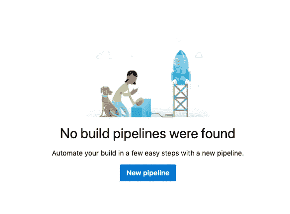
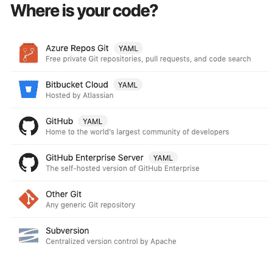
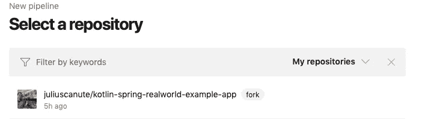
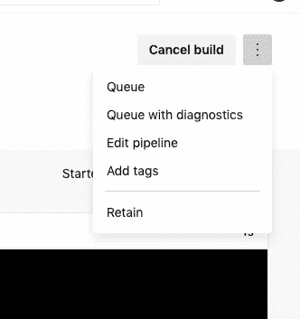
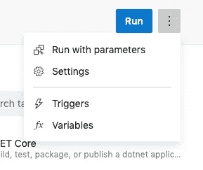
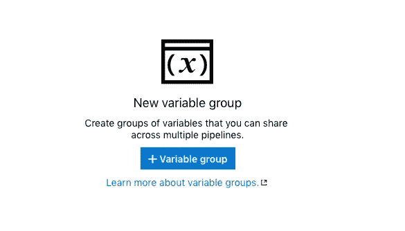
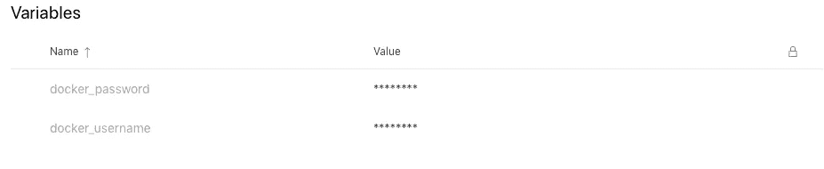
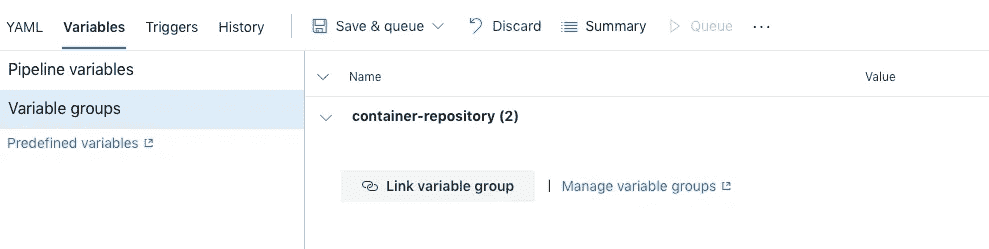
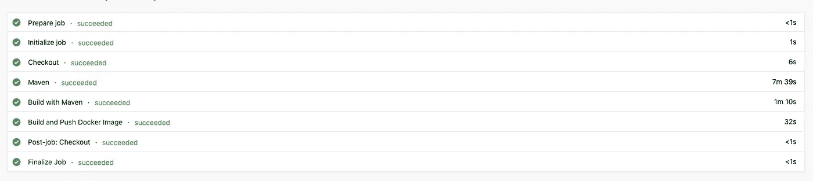
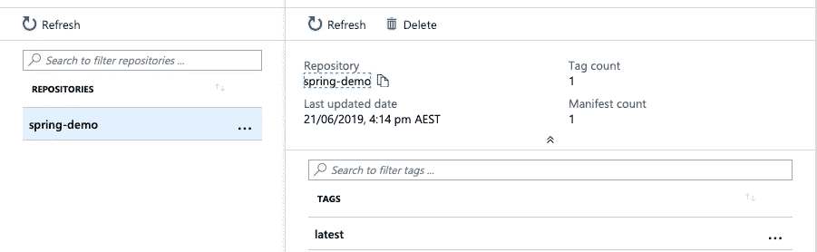

# 使用 Azure DevOps 构建和部署 Spring Boot Web 服务

> 原文：<https://itnext.io/build-and-deploy-spring-boot-web-service-using-azure-devops-28d745ad086f?source=collection_archive---------2----------------------->

我最近试用了 Azure DevOps 管道，惊讶于它的设置和使用如此简单。

我想记录所做的事情，以便将来当我想做类似的事情时可以参考。

我希望有人发现这也很有用。

在开始这次冒险之前，我决定设定一个我想通过这次实验达到的目标。

> 目标
> “我想要一个真实世界的 spring boot web 服务，并使用 Kubernetes 将其部署在 Azure 基础设施中。”

有几件事我假设你已经有了，如果你跟随:
*你已经有一个 Azure 帐户。
*您拥有 Azure Dev Ops 帐户。

有几件事我想你已经知道了:
*你知道如何在 Azure Web 控制台上工作。
*你知道如何使用 Terraform，并且你已经为 Azure 配置了它。

在本文中，我将展示创建基础设施的步骤，然后是设置 Azure DevOps 管道的步骤。

# 使用 Terrafrom 创建基础设施

首先，我们必须准备好基础设施来保存从 Azure DevOps 管道推送的 Docker 映像。

为了准备这个基础设施，我使用了 Terraform，并在 Azure 存储容器中远程保存我的状态。

1.  查看以下报告中的地形代码:[https://github.com/juliuscanute/azure-infrastructure](https://github.com/juliuscanute/azure-infrastructure)。

2.在 state 目录中创建' **terraform.tvars** '。

```
storage_account_name = "exampleaccount"
container_name = "examplecontainer"
location = "australiasoutheast"
resource_group_name = "example"
```

3.现在对 **'state/main.tf'** 中的以下行进行注释。

```
# terraform {
# backend “azurerm” {}
# }
```

4.执行以下 terraform 命令来规划和应用对基础架构的更改。

```
terraform init
terraform plan --var-file="terraform.tvars"
terraform apply --var-file="terraform.tvars"
```

在应用步骤之后，Terraform 输出变量，我们在后续步骤中使用这些变量将状态文件上传到容器。

```
Apply complete! Resources: 0 added, 0 changed, 0 destroyed.Outputs:
container_name = ####
resource_group_location = ####
resource_group_name = ####
storage_account_name = ####
storage_id = ####
storage_key = ####
```

5.我们将使用上面的信息将状态文件上传到容器(远程)。

```
export AZURE_STORAGE_ACCOUNT=<storage_account_name>
export AZURE_STORAGE_KEY=<storage_key>az storage blob upload --container-name <container_name> --file terraform.tfstate --name <example>.tfstate
```

6.创建 state/terraform.cfg 并取消步骤 3 中注释的行。

```
storage_account_name = "<storage_account_name>"
container_name = "<container_name>"
key = "<example>.tfstate"
access_key = "<storage_key>"
```

7.让我们验证一下 Terraform 是否能读写远程状态文件。

```
terraform init --backend-config="terraform.cfg"
terraform apply --var-file="terraform.tvars"Apply complete! Resources: 0 added, 0 changed, 0 destroyed.
```

8.让我们添加 deploy/terraform.tvars 并确保'<example>。“tfstate”与前面步骤中创建的状态文件相匹配。</example>

```
registry_name = "examplerepo"
storage_account_name = "<storage_account_name>"
container_name = "<container_name>"
key = "<example>.tfstate"
accesss_key = "<storage_key>"
```

9.让我们添加 deploy/terraform.cfg，并确保您为该键指定了一个不同的名称。

```
storage_account_name = "<storage_account_name>"
container_name = "<container_name>"
key = "<different>.tfstate"
access_key = "<storage_key>"
```

10.让我们通过切换到 deploy 目录并执行下面显示的命令来完成保存 docker 映像的基础设施设置。请记下用户名和密码，因为我们将使用它们来设置推送 docker 映像的管道。

```
cd ../deploy/
terraform init --backend-config="terraform.cfg"
terraform apply --var-file="terraform.tvars"...
Apply complete! Resources: 1 added, 0 changed, 0 destroyed.Outputs:login_server = ####
password = ####
username = ####
```

# 使用 Azure 管道构建

对于这个管道构建，我将使用以下存储库中的代码:
[https://github . com/Julius Canute/kot Lin-spring-real world-example-app](https://github.com/juliuscanute/kotlin-spring-realworld-example-app)

1.  从导航抽屉中选择 Pipelines，然后单击 create New Pipeline，如图所示。



创建新管道

2.选择您承载代码的位置；就我而言，它驻留在 GitHub 中。



源代码托管提供商

3.选择包含 Spring 代码的存储库。



[https://github . com/Julius Canute/kot Lin-spring-real world-example-app](https://github.com/juliuscanute/kotlin-spring-realworld-example-app)

4.确保您的存储库有一个 Dockerfile，它知道如何打包构建的 JAR。

5.使用以下步骤配置 Azure 管道并完成配置，虽然这会自动触发管道作业，但您可以暂时停止它，因为没有凭据它将会失败。

6.现在是添加秘密的时候了，点击所示的菜单并选择编辑管道。



7.在“编辑管道”中，再次选择菜单，并选择变量。



8.创建新的变量组。



9.输入您从 Terraform 输出中获得的用户名和密码，并保存创建的变量组。



10.将变量组与现有管道链接。



11.再次触发构建，但这一次，它应该成功完成。



12.您可以通过从 Azure Web 门户登录和查看来验证 Docker 映像是否被成功地推送到存储库。



在[的下一篇文章](/build-and-deploy-spring-boot-web-service-using-azure-devops-part-2-9252e247d140)中，我将向您展示如何使用存储库中的 Docker 映像，并将其部署到 Azure 中的 Kubernetes 集群。