# 使用 Azure DevOps 构建和部署 Spring Boot Web 服务—第 2 部分

> 原文：<https://itnext.io/build-and-deploy-spring-boot-web-service-using-azure-devops-part-2-9252e247d140?source=collection_archive---------1----------------------->

我用 Azure DevOps pipeline 做了实验，发现它很有趣，所以我想把它记录下来，如果我将来从事类似的工作，它将作为一个参考点，也希望有人会发现这很有用。

我将从上一篇文章离开的地方继续这篇文章。如果您还没有阅读上一篇文章，您可以使用下面的[链接](/build-and-deploy-spring-boot-web-service-using-azure-devops-28d745ad086f)进行访问。

只是回顾一下我之前所做的。我创建了一个基础设施来存放 Azure 中的 Docker 映像，并使用 Azure DevOps 建立了一个构建管道来生成一个 JAR，将 JAR 打包到 Docker 映像中，并将其推入 Azure 中的私有 Docker 存储库中。

我假设你熟悉 Terraform，Kubernetes 和 Helm。

在本文中，我将通过扩展我之前使用 Terraform 所做的工作来展示创建 Kubernetes 基础设施的步骤，然后对应用程序进行一些配置更改以使其适合部署，
最后，设置 Azure DevOps 发布管道以部署 spring boot 服务的步骤。

# 使用 Terraform 为 Kubernetes 创建基础设施

您可以从下面的 GitHub [链接](https://github.com/juliuscanute/azure-infrastructure)中获得基础设施的代码变更。

我将在 Terraform 中进行以下更改，以在 Azure 中创建 Kubernetes 基础设施。

1.  将以下更改附加到 **deploy/main.tf** 的末尾

```
module "kubernetes" {
source = "git@github.com:juliuscanute/azure-terraform-modules.git//kubernetes?ref=0.0.14"
resource_group_name = "${data.terraform_remote_state.init.resource_group_name}"
resouce_group_location = "${data.terraform_remote_state.init.resource_group_location}"
kubernetes_cluster_name = "${var.kubernetes_cluster_name}"
dns_prefix = "${var.dns_prefix}"
client_id = "${var.client_id}"
client_secret = "${var.client_secret}"
retention_in_days = 30
analytics_sku = "PerGB2018"
}
```

2.将以下变量附加到 **deploy/terraform.tvars**

```
kubernetes_cluster_name = "sampleclustername"
dns_prefix = "samplednsprefix"
client_id = ####
client_secret = ####
```

3.将更改应用于基础架构。

```
cd deploy/
terraform apply --var-file="terraform.tvars"...
module.kubernetes.azurerm_kubernetes_cluster.kubernetes_cluster: Still creating... (6m0s elapsed)
module.kubernetes.azurerm_kubernetes_cluster.kubernetes_cluster: Creation complete after 6m7sApply complete! Resources: 3 added, 0 changed, 0 destroyed.
```

你也可以在 Azure 门户中验证这一点。

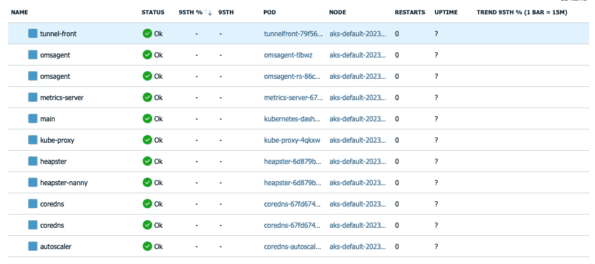

Azure 门户

# Spring Boot 服务和 Kubernetes 部署图的配置更改

我已经向 Spring Boot 服务添加了 dev 和 prod 属性，并使得在启动容器之前根据需要进行切换成为可能。

用 dev properties 引导服务会启动服务来使用内存中的数据库，而用 prod 启动服务会连接到在 Kubernetes 集群中启动的 MySql 数据库。

```
resources
|_________ [application-dev.properties](https://github.com/juliuscanute/kotlin-spring-realworld-example-app/blob/master/src/main/resources/application-dev.properties)
|_________ [application-prod.properties](https://github.com/juliuscanute/kotlin-spring-realworld-example-app/blob/master/src/main/resources/application-prod.properties)
|_________ [application.properties](https://github.com/juliuscanute/kotlin-spring-realworld-example-app/blob/master/src/main/resources/application.properties)
```

属性文件依赖于一些环境变量，这些变量在容器启动时从所示的部署图表传递给容器。

[spring-demo/templates/application . YAML](https://github.com/juliuscanute/kotlin-spring-realworld-example-app/blob/master/spring-demo/templates/application.yaml)

一些环境变量在配置映射中设置，并在部署期间附加到容器。

[spring-demo/templates/configuration files-config map . YAML](https://github.com/juliuscanute/kotlin-spring-realworld-example-app/blob/master/spring-demo/templates/configurationFiles-configmap.yaml)

我还在构建管道中增加了几个步骤，以打包舵图并发布发布过程中使用的工件。

[蔚蓝管道公司](https://github.com/juliuscanute/kotlin-spring-realworld-example-app/blob/master/azure-pipelines.yml)

验证构建管道是否正常工作，工件是否已经发布。在构建工作完成之后，您可以看到工件以蓝色显示。

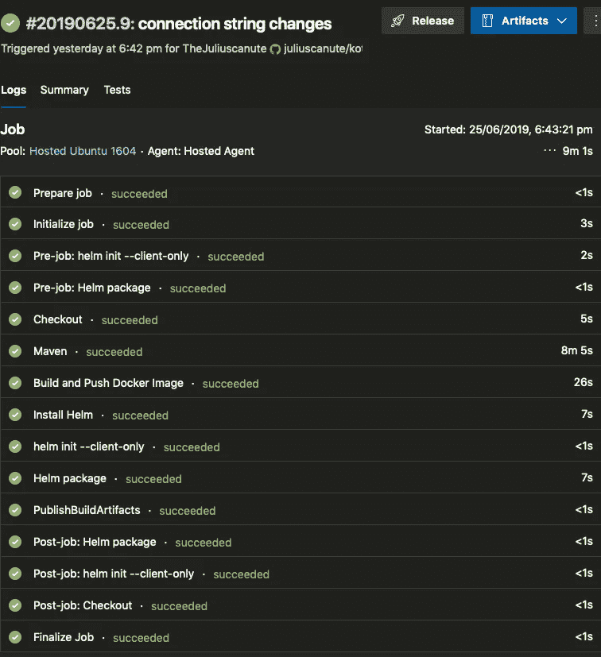

Azure DevOps

您还可以通过在 Azure 门户内部进行日志记录来验证 Docker 图像是否被标记并在您的私有存储库中发布。

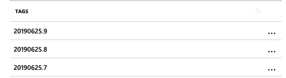

Azure 容器注册中心—私有存储库

# Azure DevOps 发布管道设置

我将使用 Azure DevOps 创建一个发布管道来部署在构建过程中创建的工件。

1.  我将从创建一个新的发布管道开始。

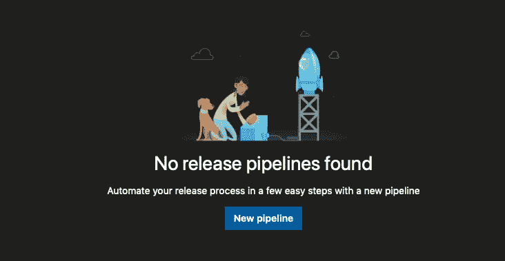

新发布管道

2.从右侧显示的面板中选择舵模板。

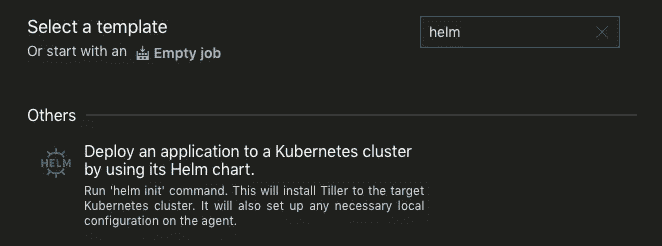

ADO —模板

3.给环境取一个合适的艺名。

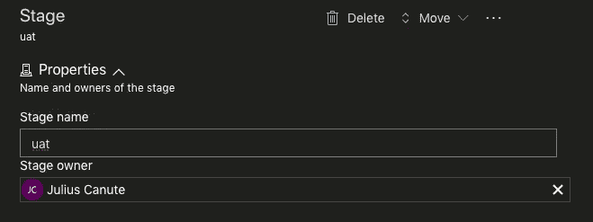

ADO —阶段

4.现在需要对任务进行配置，以连接到 Azure 中托管的 Kubernetes 基础设施，并根据 Helm Charts 中的配置部署 pod。

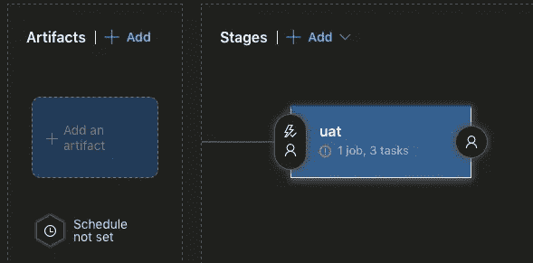

ADO 阶段视图

5.设置这些任务所需的大多数设置都可以从 Terraform 配置中获得。

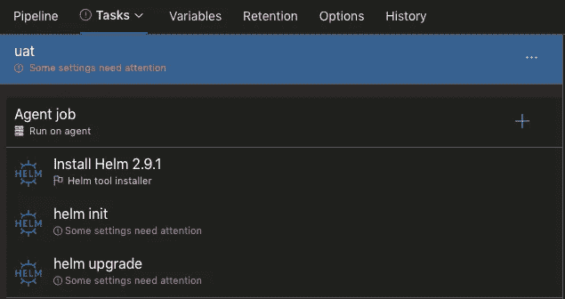

ADO —任务

6.除了授权信息，下面提供的信息可以作为 helm 初始化和升级的参考。

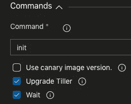

掌舵初始化

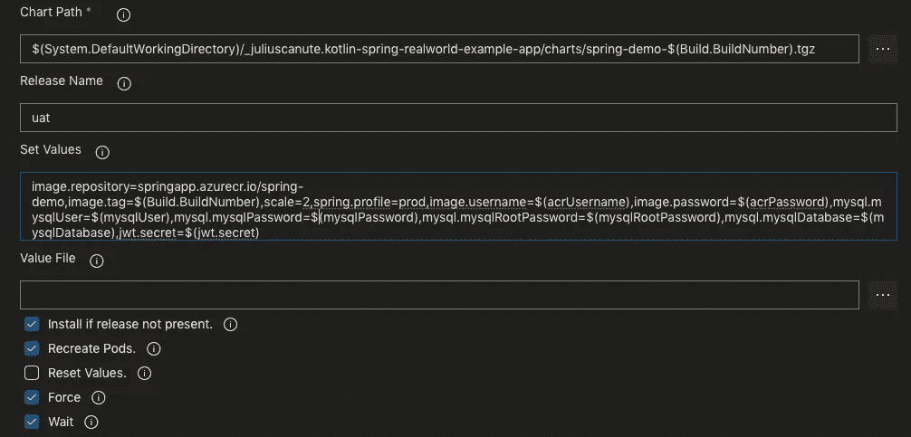

头盔升级

7.创建阶段使用的变量组。

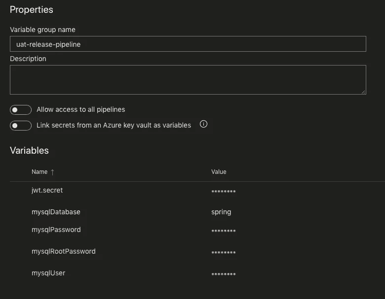

可变组

8.将变量组链接到舞台。

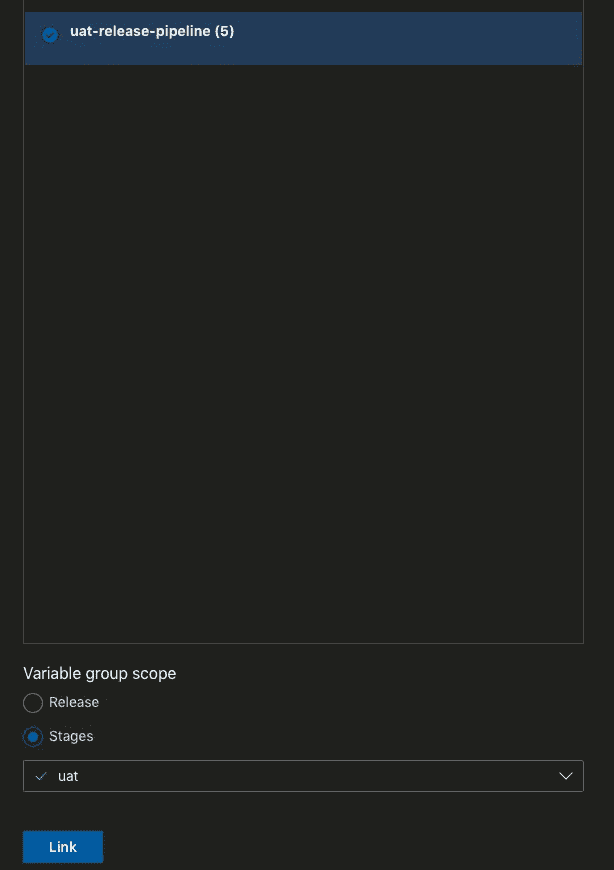

9.我还有整个发布管道使用的管道变量。

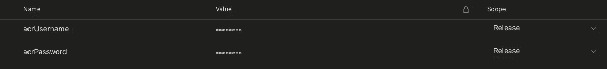

管道变量

10.通过从 pipeline editor 屏幕中选择 Add an artifact，我可以选择从哪里获取构建工件。

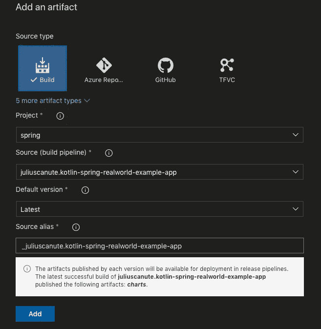

添加工件

11.一旦发布管道建立起来，我们就可以通过创建一个发布来开始我们的部署。

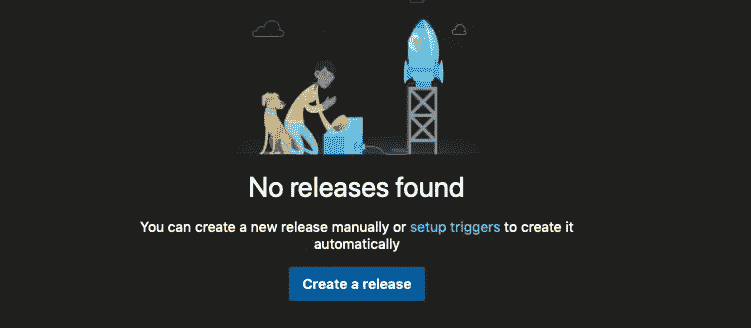

创建一个版本

12.选择要推出的工件。在本例中，我从构建管道中选择了最后一个成功的构建。

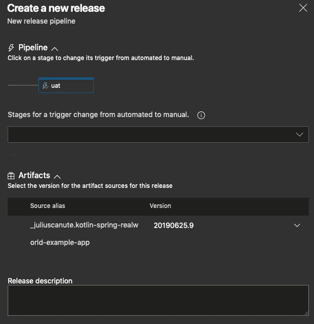

13.下图显示了 pod 被成功部署到 Kubernetes 集群。

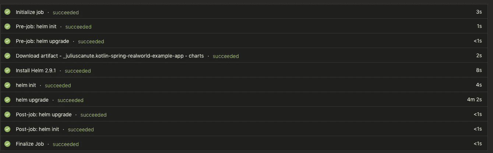

14.您可以在 Kubernetes 仪表板中查看这一点。下面显示的命令创建了一个到本地主机的隧道，您可以使用它来查看仪表板。

```
az aks browse --resource-group <resource_group_name> --name <kubernetes_cluster_name>
```

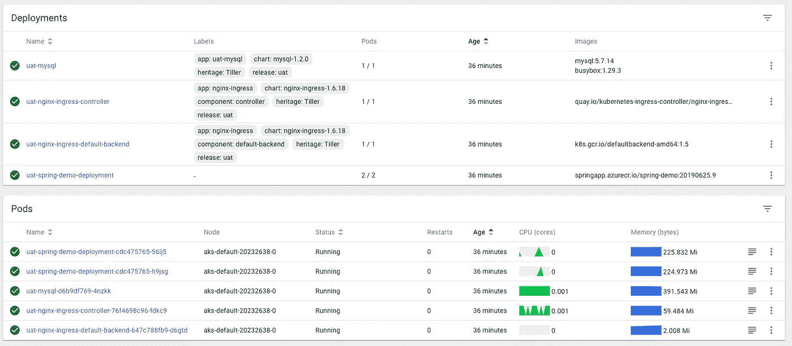

Kubernetes 仪表板

15.从入口控制器获取 IP 地址，并执行 cURL GET 请求来验证服务是否响应。

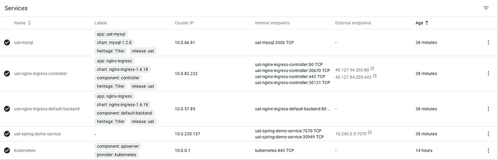

Kubernetes 仪表板

```
curl [http://40.127.94.203/api/tags](http://40.127.94.203/api/tags)*   Trying 40.127.94.203...
* TCP_NODELAY set
* Connected to 40.127.94.203 (40.127.94.203) port 80 (#0)
> GET /api/tags HTTP/1.1
> Host: 40.127.94.203
> User-Agent: curl/7.54.0
> Accept: */*
>
< HTTP/1.1 200
< Server: nginx/1.15.10
< Date: Wed, 26 Jun 2019 01:28:35 GMT
< Content-Type: application/json;charset=UTF-8
< Transfer-Encoding: chunked
< Connection: keep-alive
< Vary: Accept-Encoding
<
* Connection #0 to host 40.127.94.203 left intact{"tags":[]}
```

16.执行下面的命令很神奇，我可以用它在本地对集群的问题进行故障诊断。

```
> az aks get-credentials --resource-group <resource_group_name> --name <kubernetes_cluster_name>> kubectl get pods
```

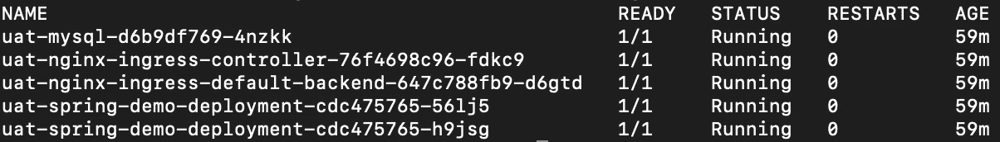

豆荚展开

本文总结了在 Azure 中构建和部署 Spring Boot Web 服务的两部分系列。我希望你喜欢它，如果你正在构建一个类似的东西，那就万事如意了。