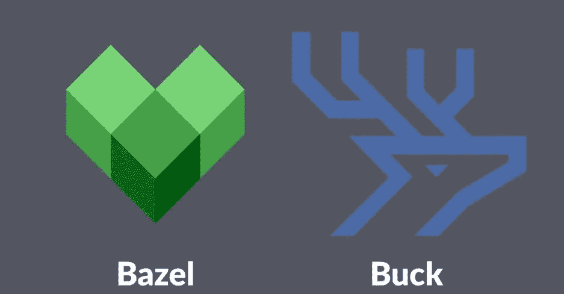

# 使用 Bazel 在模拟器中构建并运行 Telegram-iOS v7.3

> 原文：<https://itnext.io/build-and-run-telegram-ios-v7-3-in-simulator-with-bazel-fe36f305bd55?source=collection_archive---------0----------------------->

> [hubo.dev](https://hubo.dev/2020-12-28-build-and-run-telegram-ios-v7-3-on-simulator-with-bazel/) 的镜像



Telegram-iOS 上周发布了 7.3 版[和新的群组语音聊天及其他改进。我的](https://telegram.org/blog/voice-chats)[上一篇关于在模拟器中构建和运行的文章](/build-and-run-telegram-ios-on-xcode-12-x-simulator-2aff89c25a9f)因为几个原因而不起作用:

*   巴克在大苏尔破产了。最新版本 2020.10.21.01 给出了一个内部错误，由 [facebook/buck#2491](https://github.com/facebook/buck/issues/2491) 报告。Big Sur 附带了一个内置的动态链接器缓存，这使得 JNA 无法检查动态库是否存在[Java-native-access/jna # 1215](https://github.com/java-native-access/jna/issues/1215)目前，除了 Airbnb 的 fork [airbnb/buck#24](https://github.com/airbnb/buck/pull/24) 的一个变通办法之外，Buck 团队还没有正式修复它。
*   Telegram-iOS 已经升级了构建工具链，以使用 Xcode 12 以及子模块`webrtc-ios`。我之前帖子中的一些变通方法已经没有必要了。

这个项目已经并行使用 Buck 和 Bazel 作为构建系统有一段时间了。现在是我们换到大苏尔的巴泽尔的好时机。

# 说明

我的开发机器运行的是 macOS Big Sur v11.1 和 Xcode 12.2 (12B45b)。我们可以先用家酿安装 Bazel 和 Yasm。构建一些第三方依赖项需要 Yasm 和 CMake。

```
brew install bazel yasm cmake
```

以下是我机器上的版本信息:

让我们克隆项目代码并切换到标签`release-7.3`:

```
git clone --recursive [https://github.com/TelegramMessenger/telegram-ios.git](https://github.com/TelegramMessenger/telegram-ios.git)
cd telegram-ios
git checkout release-7.3
```

我想重用项目中存在的伪发行版代码设计文件，因为它对于在模拟器中运行来说无关紧要。我需要在`Makefile`上应用一个小的变化:

```
sed -i'' -e 's/Telegram development/Telegram distribution/g' Makefile
```

sed 命令用“电报分发”替换了两次“电报开发”,这使得构建系统不会对伪造的代码设计文件感到恐慌。不同之处如下，供您参考:

是时候让目标`bazel_project_noextensions`或`bazel_project`生成 Xcode 项目文件了:

```
CODESIGNING_DATA_PATH="build-system/fake-codesigning" \
CODESIGNING_CERTS_VARIANT="distribution" \
CODESIGNING_PROFILES_VARIANT="appstore" \
COMMIT_ID=`git rev-parse HEAD` \
BUILD_NUMBER=`git rev-list --count HEAD` \
LOCAL_CODESIGNING=1 \
IGNORE_XCODE_VERSION_MISMATCH=1 \
sh build-system/verify.sh make bazel_project_noextensions
```

Bazel 在`build-input/gen/project/Telegram.xcodeproj/`保存项目文件后，Xcode 会自动打开。我们可以继续在模拟器中构建和运行 Telegram-iOS。没有扩展的构建在我的机器上需要大约 11 分钟。如果你有的话，请让我知道苹果 M1 需要什么。

# 结论

由巴泽尔来建项目更顺畅。我非常欣赏的另一个变化是，所有依赖项都是源代码文件的目标，而不是 Buck 预先构建的二进制文件，这使得调试更加容易。