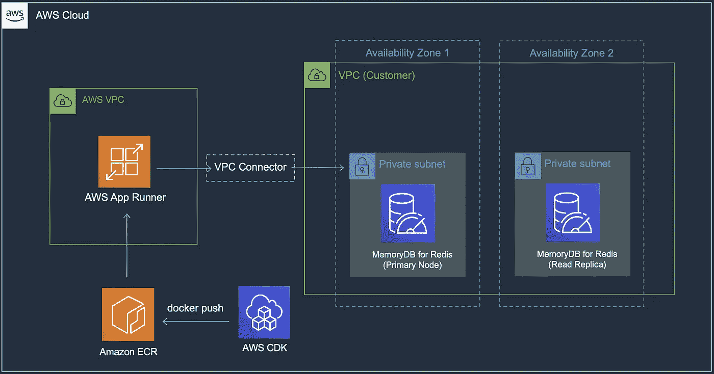
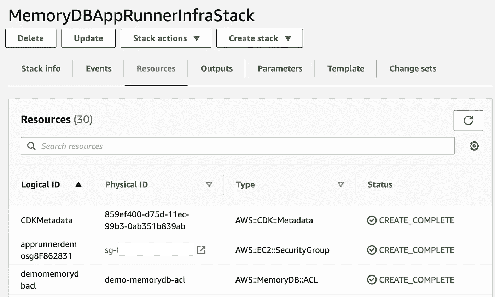
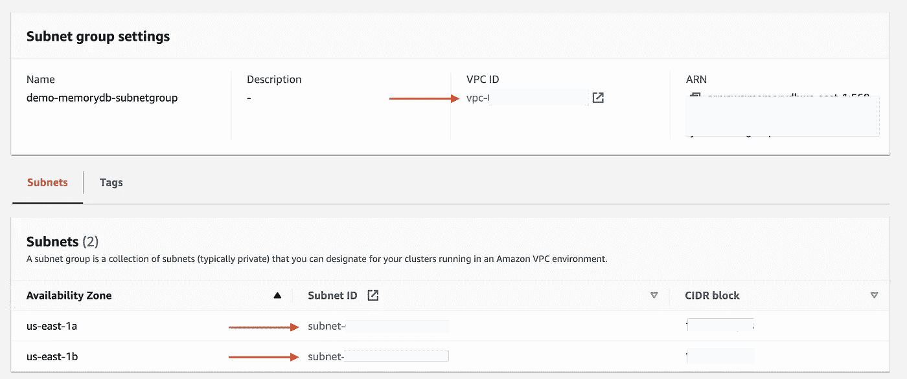
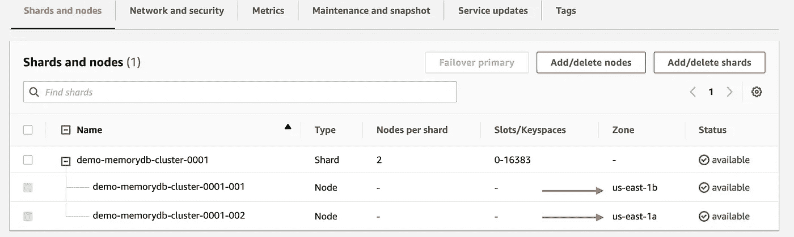
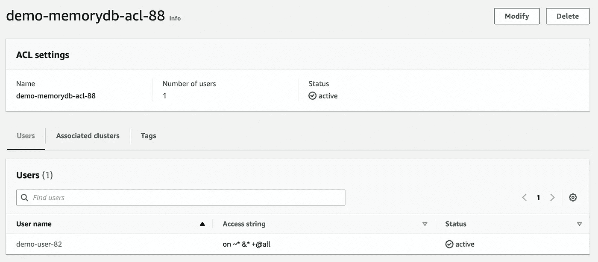
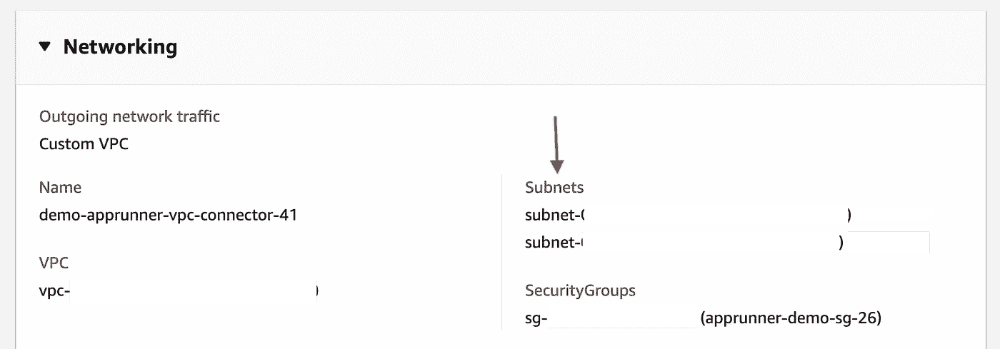
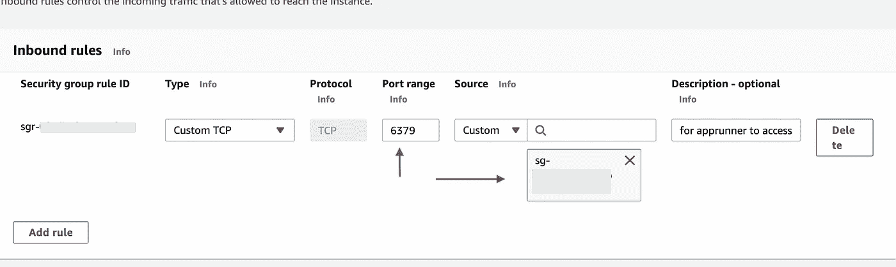
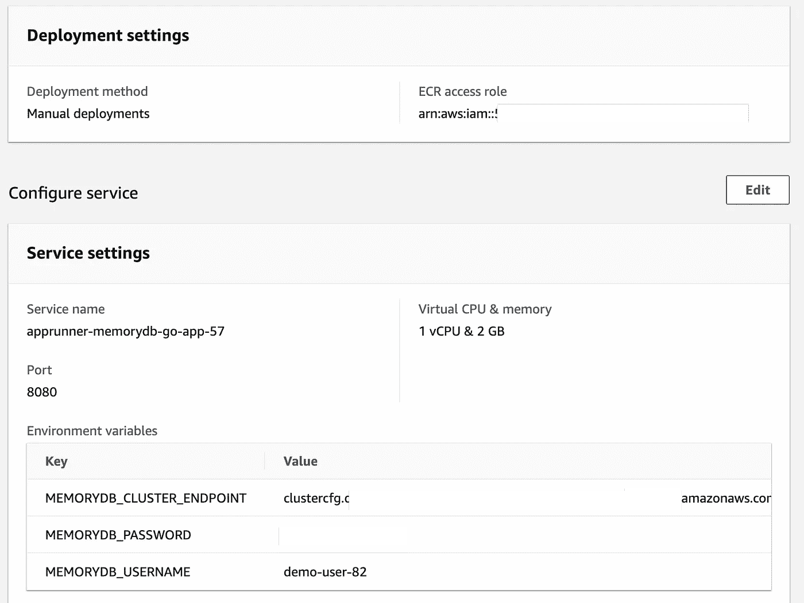
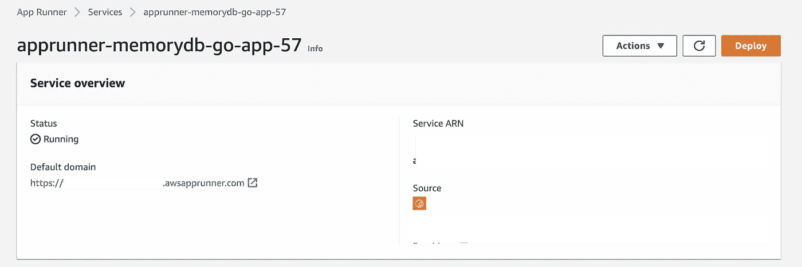

# 使用 AWS App Runner、Redis 和 AWS CDK 构建云原生应用

> 原文：<https://itnext.io/build-cloud-native-go-apps-with-aws-app-runner-redis-and-aws-cdk-e1bd7ba6ddf3?source=collection_archive---------4----------------------->

## *在 App Runner 上运行您的 Go 应用程序，将其与 Redis 的 MemoryDB 集成，并使用 AWS CDK 将应用程序与基础架构一起打包和部署*

[AWS App Runner](https://docs.aws.amazon.com/apprunner/latest/dg/what-is-apprunner.html) 允许您以快速、简单且经济高效的方式部署和运行云原生应用。您可以选择自己喜欢的编程语言，因为 App Runner 可以直接从源代码(例如 GitHub 中)或 Docker 容器映像(来自 ECR 中的[私有或公共回购)进行部署——所有这些都无需担心底层基础设施的供应和管理。](https://docs.aws.amazon.com/AmazonECR/latest/userguide/Repositories.html)



高级解决方案架构

这篇博客文章展示了如何在 AWS App Runner 上运行 Go 应用程序，该应用程序将进一步与 Redis 的[Amazon MemoryDB](https://docs.aws.amazon.com/memorydb/latest/devguide/what-is-memorydb-for-redis.html)(Redis 兼容的、持久的内存数据库服务)集成。您将使用 AWS CDK 部署应用程序及其基础设施。这包括 [App Runner VPC 连接器](https://docs.aws.amazon.com/apprunner/latest/dg/network-vpc.html)配置以连接 MemoryDB，以及使用 CDK 将您的 Go 应用程序打包为 Docker 映像，上传到 ECR 并无缝部署到 App Runner(无需手动步骤)。

我将以简短地浏览一下用 Go 编写的 CDK 代码来结束我的博客，这要感谢 [CDK Go 支持](https://docs.aws.amazon.com/cdk/v2/guide/work-with-cdk-go.html)(在撰写本文时它在*开发者预览版*)。

> *代码为* [*可在 GitHub*](https://github.com/abhirockzz/go-redis-apprunner) 上找到

继续之前，请确保您已准备好以下内容:

# 先决条件

*   创建一个 AWS 账户(如果你还没有的话)并登录。您使用的 IAM 用户必须有足够的权限进行必要的 AWS 服务调用和管理 AWS 资源。
*   安装和配置 [AWS CLI](https://docs.aws.amazon.com/cli/latest/userguide/install-cliv2.html)
*   安装并引导 [AWS CDK](https://docs.aws.amazon.com/cdk/v2/guide/getting_started.html#getting_started_install)
*   设置[对接](https://docs.docker.com/get-docker/)
*   [安装 Go](https://go.dev/dl/)

# 使用单一命令部署基础架构和应用程序

克隆 GitHub repo 并切换到正确的目录:

```
git clone https://github.com/abhirockzz/go-redis-apprunnercd cdk
```

设置环境变量:

*   App Runner 服务名称和端口
*   您为 MemoryDB 选择的密码(这只是出于演示目的—对于生产，您将有特定的流程来处理敏感信息)

请注意密码要求。来自[文档](https://docs.aws.amazon.com/memorydb/latest/devguide/clusters.acls.html):

> *"特别是，在对 MemoryDB 使用 ACL 时要注意这些用户密码限制:*
> 
> 密码必须是 16–128 个可打印字符。
> 
> 不允许使用下列非字母数字字符:，" "/ @。"

```
export APPRUNNER_SERVICE_NAME=apprunner-memorydb-go-app
export APPRUNNER_SERVICE_PORT=8080
export MEMORYDB_PASSWORD=<password of your choice e.g. P@ssw0rd12345678>cdk deploy --all
```

这将启动堆栈创建。你现在需要做的就是…等等。

**为什么？？嗯，那是因为 CDK 在幕后为我们做了一切。从 VPC(和子网、NAT 网关等)开始。)、MemoryDB 集群、安全组、打包并将我们的应用程序作为 Docker 映像上传(到私有 ECR repo)并最终将其部署为应用程序运行器服务——这相当多！**

随意导航到 *AWS 控制台>cloud formation>Stacks*查看发生了什么…



一旦两个堆栈都运行完成，您就可以浏览所有组件:

MemoryDB 子网组— VPC 和两个子网，每个子网位于一个可用性分区中。



内存数据库集群— CDK 代码被硬编码以创建双节点集群(单个碎片)，即一个主节点和一个副本节点。请注意，主节点和副本节点分布在不同的 az 上(按照上面的子网组配置)



此外，MemoryDB 的 ACL 和用户设置—这将用于身份验证(用户名/密码)和访问控制(授权)。



请记住，MemoryDB 在不同的 VPC 中运行，默认情况下不可能将您的 App Runner 服务连接到它。您需要将您的服务与 MemoryDB VPC 相关联——这就是 App Runner VPC 连接器的用武之地，并允许它与 MemoryDB 通信。

VPC 和子网与 MemoryDB 的相同。还要注意安全组——稍后将详细介绍



检查 MemoryDB 安全组。有一个入站规则规定:*源*安全组(在本例中与 App Runner VPC 连接器配置相关联)可以访问与*目标*安全组(在本例中为 MemoryDB)相关联的实例的 TCP 端口`6379`



您还可以确认为 App Runner 创建的 IAM 访问角色以及服务环境变量:

> *环境变量已用于演示目的。对于生产应用程序，您应该使用 AWS Secrets Manager 来存储和检索敏感信息，如密码、身份验证令牌等。*



# 测试应用程序

应用程序本身相当简单，公开了几个 HTTP 端点来创建样本数据。从详细信息页面找到 App Runner 服务 URL。



您可以使用任何 HTTP 客户端测试应用程序(在本例中我使用了`curl`):

```
*# create a couple of user entries*
curl -i -X POST -d '{"email":"user1@foo.com", "name":"user1"}' <enter APPRUNNER_APP_URL>
curl -i -X POST -d '{"email":"user2@foo.com", "name":"user2"}' <enter APPRUNNER_APP_URL>HTTP/1.1 200 OK
Date: Fri, 20 May 2022 08:05:06 GMT
Content-Length: 0*# search for user via email*
curl -i <enter APPRUNNER_APP_URL>/user2@foo.comHTTP/1.1 200 OK
Date: Fri, 20 May 2022 08:05:11 GMT
Content-Length: 41
Content-Type: text/plain; charset=utf-8{"email":"user2@foo.com","name":"user2"}*# is a user does not exist*
curl -i <enter APPRUNNER_APP_URL>/not_there@foo.comHTTP/1.1 404 Not Found
Content-Type: text/plain; charset=utf-8
X-Content-Type-Options: nosniff
Date: Fri, 20 May 2022 08:05:36 GMT
Content-Length: 38user does not exist not_there@foo.co
```

# 打扫

完成本教程后，删除堆栈:

```
cdk destroy --all
```

# 快速浏览 CDK 代码

基础设施部分(具体来说是 IaaC)由两个(CDK) [栈](https://docs.aws.amazon.com/cdk/v2/guide/stacks.html)组成(在单个 [CDK App](https://docs.aws.amazon.com/cdk/v2/guide/apps.html) 的上下文中)。

我将提供一个用 Go 编写的 CDK 代码的演示，感谢 [CDK Go 支持](https://docs.aws.amazon.com/cdk/v2/guide/work-with-cdk-go.html)(在撰写本文时是开发者预览版)。

> *请注意，为了简洁起见，一些代码已经被编辑/省略——您可以随时在*[*GitHub repo*](https://github.com/abhirockzz/go-redis-apprunner)中查阅完整的代码

这是第一个堆栈:

总结一下:

*   创建 VPC 和相关组件的一行代码！
*   我们为 MemoryDB 集群创建 ACL、用户、子网组，并在使用`awsmemorydb.NewCfnCluster`创建集群时引用它们
*   我们还为 MemoryDB 和 AppRunner (VPC 配置)创建所需的安全组

```
...
vpc = awsec2.NewVpc(stack, jsii.String("demo-vpc"), nil)authInfo := map[string]interface{}{"Type": "password", "Passwords": []string{getMemoryDBPassword()}}
user = awsmemorydb.NewCfnUser(stack, jsii.String("demo-memorydb-user"), &awsmemorydb.CfnUserProps{UserName: jsii.String("demo-user"), AccessString: jsii.String(accessString), AuthenticationMode: authInfo})
acl := awsmemorydb.NewCfnACL(stack, jsii.String("demo-memorydb-acl"), &awsmemorydb.CfnACLProps{AclName: jsii.String("demo-memorydb-acl"), UserNames: &[]*string{user.UserName()}})*//snip...*subnetGroup := awsmemorydb.NewCfnSubnetGroup(stack, jsii.String("demo-memorydb-subnetgroup"), &awsmemorydb.CfnSubnetGroupProps{SubnetGroupName: jsii.String("demo-memorydb-subnetgroup"), SubnetIds: &subnetIDsForSubnetGroup})memorydbSecurityGroup := awsec2.NewSecurityGroup(stack, jsii.String("memorydb-demo-sg"), &awsec2.SecurityGroupProps{Vpc: vpc, SecurityGroupName: jsii.String("memorydb-demo-sg"), AllowAllOutbound: jsii.Bool(true)})memorydbCluster = awsmemorydb.NewCfnCluster(stack, jsii.String("demo-memorydb-cluster"), &awsmemorydb.CfnClusterProps{ClusterName: jsii.String("demo-memorydb-cluster"), NodeType: jsii.String(memoryDBNodeType), AclName: acl.AclName(), NumShards: jsii.Number(numMemoryDBShards), EngineVersion: jsii.String(memoryDBRedisEngineVersion), Port: jsii.Number(memoryDBRedisPort), SubnetGroupName: subnetGroup.SubnetGroupName(), NumReplicasPerShard: jsii.Number(numMemoryDBReplicaPerShard), TlsEnabled: jsii.Bool(true), SecurityGroupIds: &[]*string{memorydbSecurityGroup.SecurityGroupId()}, ParameterGroupName: jsii.String(memoryDBDefaultParameterGroupName)})*//snip...*appRunnerVPCConnSecurityGroup = awsec2.NewSecurityGroup(stack, jsii.String("apprunner-demo-sg"), &awsec2.SecurityGroupProps{Vpc: vpc, SecurityGroupName: jsii.String("apprunner-demo-sg"), AllowAllOutbound: jsii.Bool(true)})memorydbSecurityGroup.AddIngressRule(awsec2.Peer_SecurityGroupId(appRunnerVPCConnSecurityGroup.SecurityGroupId(), nil), awsec2.Port_Tcp(jsii.Number(memoryDBRedisPort)), jsii.String("for apprunner to access memorydb"), jsii.Bool(false))
...
```

对于 App Runner 服务:

*   Docker 映像构建和上传至私有 ECR 回购流程由 CDK 完成
*   我们指定服务将需要的环境变量
*   App Runner 源配置引用 IAM 角色、ECR 映像和环境变量
*   然后是封装 VPC 连接器配置的网络配置，
*   最后，创建了 App Runner 服务

```
...
ecrAccessPolicy := awsiam.ManagedPolicy_FromManagedPolicyArn(stack, jsii.String("ecr-access-policy"), jsii.String(appRunnerServicePolicyForECRAccessARN))apprunnerECRIAMrole := awsiam.NewRole(stack, jsii.String("role-apprunner-ecr"), &awsiam.RoleProps{AssumedBy: awsiam.NewServicePrincipal(jsii.String(appRunnerServicePrincipal), nil), RoleName: jsii.String("role-apprunner-ecr"), ManagedPolicies: &[]awsiam.IManagedPolicy{ecrAccessPolicy}})ecrAccessRoleConfig := awsapprunner.CfnService_AuthenticationConfigurationProperty{AccessRoleArn: apprunnerECRIAMrole.RoleArn()}memoryDBEndpointURL := fmt.Sprintf("%s:%s", *memorydbCluster.AttrClusterEndpointAddress(), strconv.Itoa(int(*memorydbCluster.Port())))appRunnerServiceEnvVarConfig := []awsapprunner.CfnService_KeyValuePairProperty{{Name: jsii.String("MEMORYDB_CLUSTER_ENDPOINT"), Value: jsii.String(memoryDBEndpointURL)}, {Name: jsii.String("MEMORYDB_USERNAME"), Value: user.UserName()}, {Name: jsii.String("MEMORYDB_PASSWORD"), Value: jsii.String(getMemoryDBPassword())}}imageConfig := awsapprunner.CfnService_ImageConfigurationProperty{RuntimeEnvironmentVariables: appRunnerServiceEnvVarConfig, Port: jsii.String(getAppRunnerServicePort())}appDockerImage := awsecrassets.NewDockerImageAsset(stack, jsii.String("app-image"), &awsecrassets.DockerImageAssetProps{Directory: jsii.String("../app/")})sourceConfig := awsapprunner.CfnService_SourceConfigurationProperty{AuthenticationConfiguration: ecrAccessRoleConfig, ImageRepository: awsapprunner.CfnService_ImageRepositoryProperty{ImageIdentifier: jsii.String(*appDockerImage.ImageUri()), ImageRepositoryType: jsii.String(ecrImageRepositoryType), ImageConfiguration: imageConfig}}*//snip...*vpcConnector := awsapprunner.NewCfnVpcConnector(stack, jsii.String("apprunner-vpc-connector"), &awsapprunner.CfnVpcConnectorProps{Subnets: &subnetIDsForSubnetGroup, SecurityGroups: &[]*string{appRunnerVPCConnSecurityGroup.SecurityGroupId()}, VpcConnectorName: jsii.String("demo-apprunner-vpc-connector")})networkConfig := awsapprunner.CfnService_NetworkConfigurationProperty{EgressConfiguration: awsapprunner.CfnService_EgressConfigurationProperty{EgressType: jsii.String(appRunnerEgressType), VpcConnectorArn: vpcConnector.AttrVpcConnectorArn()}}app := awsapprunner.NewCfnService(stack, jsii.String("apprunner-app"), &awsapprunner.CfnServiceProps{SourceConfiguration: sourceConfig, ServiceName: jsii.String(getAppRunnerServiceName()), NetworkConfiguration: networkConfig})
...
```

# 该结束了！

您使用 AWS CDK 在 App Runner 上部署了一个 Go 应用程序(以及下面的！).在此过程中，您还学习了如何配置 App Runner，以便使用 VPC 连接器与 MemoryDB for Redis 集成，以及整个解决方案的 CDK 代码的高级概述。

这个博客到此为止。敬请关注更多和快乐的编码！