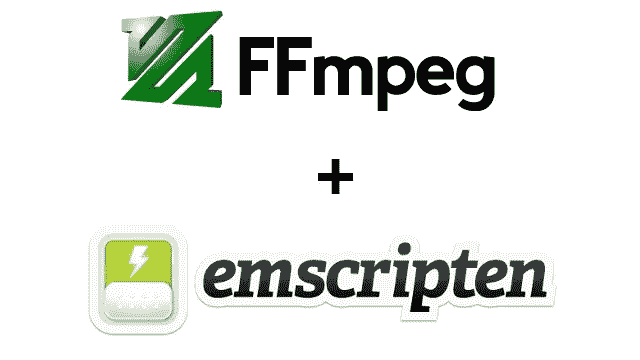
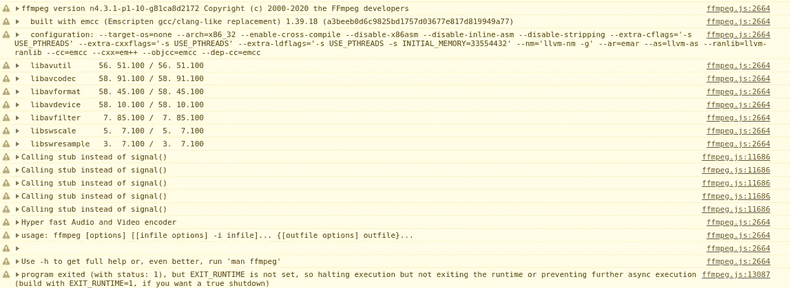

# 构建 FFmpeg WebAssembly 版本(= ffmpeg.wasm):第 2 部分用 Emscripten 编译

> 原文：<https://itnext.io/build-ffmpeg-webassembly-version-ffmpeg-js-part-2-compile-with-emscripten-4c581e8c9a16?source=collection_archive---------3----------------------->



> *2020/9 更新:修改故事，使其在 MacOS 中工作。*
> 
> 2020/2/11 更新:从这个故事的反应来看，目前遵循指令在 Mac 环境下不起作用。我无法解决这个问题，因为我没有自己的问题。在 Mac 中最简单的方法就是在虚拟机中安装像 Ubuntu 一样的 linux 发行版。

上一个故事:[构建 FFmpeg WebAssembly 版本(= ffmpeg.wasm): Part.1 准备](https://medium.com/@jeromewus/build-ffmpeg-webassembly-version-ffmpeg-js-part-1-preparation-ed12bf4c8fac)

> 从这里开始，事情将变得更加复杂和难以理解，如果你不知道发生了什么，你可能需要谷歌背景知识(或者你可以留下回答来问我)。
> 
> 此外，为了使本教程更有用，我试着写下我如何解决每个问题的细节，希望它能帮助你建立你选择的库。

在这一部分，您将学习:

1.  如何使用 Docker 设置脚本环境
2.  `emconfigure`和`emmake`的用法
3.  如何修复用 Emscripten 编译 FFmpeg 时的问题

# 如何使用 Docker 设置脚本环境

在[构建 FFmpeg WebAssembly 版本(= ffmpeg.wasm): Part.1 准备](https://medium.com/@jeromewus/build-ffmpeg-webassembly-version-ffmpeg-js-part-1-preparation-ed12bf4c8fac)中，我们已经用 GCC 构建了 FFmpeg 的原始版本，现在我们转而使用 Emscripten。

我们要用的 emscripten 的版本是 1 . 39 . 18(trz ECI/Emscripten:1 . 39 . 18-upstream)，你可以通过[官方教程](https://emscripten.org/docs/getting_started/downloads.html#installation-instructions)安装 Emscripten(本教程中我们是[setup-EMS dk](https://github.com/mymindstorm/setup-emsdk)Github Actions in MAC OS)或者从 docker hub 拉 Emscripten 镜像。

```
$ docker pull trzeci/emscripten:1.39.18-upstream
```

> 这可能需要几分钟的时间，因为映像的大小约为 1 GB。

然后我们需要更新`build-with-docker.sh`如下:

> 第 8 行不是必需的，但是它可以帮助您在后续构建中加快速度。

下一步我们要做的是找到用 emscripten 构建 FFmpeg 的配置，这是一个试错的过程，需要挖掘文档和耐心。

# `emconfigure` 和`emmake &` 的用法如何修复用 Emscripten 编译 FFmpeg 时的问题

让我们开始寻找正确配置的旅程。在 Part.1 中，它以`./configure --disable-x86asm`开头，要用 emscripten 来做，需要把它改成`emconfigure ./configure --disable-x86asm`。(有关 emconfigure 的详细信息，请查看此处的)由于我们正在进行交叉编译，因此需要添加交叉编译标志来明确告知 FFmpeg。

下面我们来更新一下`build.sh`吧:

神奇的是，没有任何错误，所以我们只需要输入`emmake make -j`就可以得到 FFmpeg.wasm 了吗？不幸的是，答案是否定的，`emconfigure`最重要的任务之一就是将编译器从 gcc 替换为 emcc(或者 g++替换为 em++)，但是在`./configure`的输出中，我们仍然得到 gcc 作为我们的编译器。

```
emscripten sdl2-config called with /emsdk_portable/emscripten/tag-1.38.45/system/bin/sdl2-config --cflags                            
emscripten sdl2-config called with /emsdk_portable/emscripten/tag-1.38.45/system/bin/sdl2-config --libs                               
install prefix            /usr/local                                                                                                   
source path               .                                                                                                                
C compiler                gcc             # Should be emcc                                                                                             
C library                 glibc                                                                                                           
ARCH                      x86 (generic)                                                                                                     
big-endian                no                                                                                                            
runtime cpu detection     yes                                                                                                         
standalone assembly       no                                                                                                            
x86 assembler             nasm
```

每个自动化工具都有其局限性，在这种情况下，我们需要手动操作。让我们检查一下是否有任何论点可以拯救我们。

```
$ ./configure --help
```

在`Toolchain options`下，有参数分配编译器使用。

```
root@57ab95def750:/src# ./configure --help
Usage: configure [options]
Options: [defaults in brackets after descriptions]Help options:
...
Toolchain options:                                                                                                             
...
  --nm=NM                  use nm tool NM [nm -g]
  --ar=AR                  use archive tool AR [ar]
  --as=AS                  use assembler AS []
  --ln_s=LN_S              use symbolic link tool LN_S [ln -s -f]
  --strip=STRIP            use strip tool STRIP [strip]
  --windres=WINDRES        use windows resource compiler WINDRES [windres]
  --x86asmexe=EXE          use nasm-compatible assembler EXE [nasm]
  --cc=CC                  use C compiler CC [gcc]
  --cxx=CXX                use C compiler CXX [g++]
  --objcc=OCC              use ObjC compiler OCC [gcc]
  --dep-cc=DEPCC           use dependency generator DEPCC [gcc]
  --nvcc=NVCC              use Nvidia CUDA compiler NVCC [nvcc]
  --ld=LD                  use linker LD []
...
```

让我们在`build.sh`中将这些参数传递给 emscripten 进行编译:

> 对于本机版本，请确保`llvm-ranlib`、`llvm-as`和`llvm-nm`存在。如果没有，您可以在`$EMSDK_ROOT/upstream/bin`中找到它们。

有了这些参数，`./configure`将会花费更多的时间来运行，但是你最终会得到想要的输出。

```
emscripten sdl2-config called with /emsdk_portable/emscripten/tag-1.39.18/system/bin/sdl2-config --cflags                            
emscripten sdl2-config called with /emsdk_portable/emscripten/tag-1.39.18/system/bin/sdl2-config --libs                                     
install prefix            /usr/local                                                                                                   
source path               .                                                                                                         
C compiler                emcc         # emcc as expected                                                                                    
C library                                                                                                                          
ARCH                      x86 (generic)                                                                                                     
big-endian                no                                                                                                              
runtime cpu detection     yes                                                                                                             
standalone assembly       no
```

在`build.sh`的末尾添加`emmake make -j4`(您可以将并行度提高到类似`-j8`或简单地使用`-j`来使用所有内核):

并且在执行后会立即失败:

```
...
./libavutil/x86/timer.h:39:24: error: invalid output constraint '=a' in asm
                     : "=a" (a), "=d" (d));
                       ^
```

从输出消息中，我们可以确定该错误与 asm 有关。打开`./libavutil/x86/timer.h`，我们可以确认问题是由 x86 内联汇编引起的，它与 WebAssembly 不兼容，因此解决方案是在`build.sh`中禁用它:

它工作并继续编译，直到我们遇到另一个错误:

```
...
CC libavfilter/dnn/dnn_backend_native_layers.o
In file included from libavfilter/aeval.c:26:
In file included from ./libavutil/avassert.h:31:
In file included from ./libavutil/avutil.h:296:
In file included from ./libavutil/common.h:533:
In file included from ./libavutil/internal.h:176:
./libavutil/libm.h:54:32: error: static declaration of 'cbrt' follows non-static declaration
static av_always_inline double cbrt(double x)
                               ^
/emsdk_portable/upstream/emscripten/system/include/libc/math.h:151:13: note: previous declaration is here
double      cbrt(double);
            ^
In file included from libavfilter/aeval.c:26:
```

这一次根本原因不是那么明显，所以我们需要更深入地挖掘在`./configure`期间出了什么问题。一个非常有用的检查文件是`ffbuild/config.log`，它包含了`./configure`期间的日志，大多数时候你可以在那里找到根本原因。

通过在`config.log`中搜索`cbrt`，我们发现错误信息如下:

```
...
check_mathfunc cbrt 1                                                                                                                             test_ld cc                                                                                                                                        test_cc                                                                                                                                           BEGIN /tmp/ffconf.syfN4Irw/test.c                                                                                                                     1 #include <math.h>                                                                                                                               2 float foo(float f, float g) { return cbrt(f); }                                                                                             
    3 int main(void){ return (int) foo; }                                                                                                         
END /tmp/ffconf.syfN4Irw/test.c                                                                                                                   
emcc -D_ISOC99_SOURCE -D_FILE_OFFSET_BITS=64 -D_LARGEFILE_SOURCE -D_POSIX_C_SOURCE=200112 -D_XOPEN_SOURCE=600 -std=c11 -fomit-frame-pointer -pthread -c -o /tmp/ffconf.syfN4Irw/test.o /tmp/ffconf.syfN4Irw/test.c                                                                                  emcc -Wl,-z,noexecstack -o /tmp/ffconf.syfN4Irw/test /tmp/ffconf.syfN4Irw/test.o                                                                  wasm-ld: error: 'atomics' feature is used by /tmp/ffconf.syfN4Irw/test.o, so --shared-memory must be used
... 
```

该测试试图检查 cbrt 是否在环境中工作，但是由于`atomics`特性出错而失败。使用`pthread`时会询问`atomics`，所以让我们添加`pthread`标志。(查看[此处](https://emscripten.org/docs/porting/pthreads.html)了解更多关于 pthread 标志的详细信息)

更新`build.sh`:

它工作并继续编译，直到我们遇到另一个错误:

```
...
LD      ffplay_g                                                                                                                                  emcc: warning: ignoring unsupported linker flag: `-rpath-link=:libpostproc:libswresample:libswscale:libavfilter:libavdevice:libavformat:libavcodec:libavutil:libavresample` [-Wlinkflags]                                                                                                           
7 warnings generated.                                                      
wasm-ld: error: initial memory too small, 19491744 bytes needed
...                    
make: *** [Makefile:114: ffplay_g] Error 1
make: *** Waiting for unfinished jobs....
emcc: warning: ignoring unsupported linker flag: `-rpath-link=:libpostproc:libswresample:libswscale:libavfilter:libavdevice:libavformat:libavcodec
:libavutil:libavresample` [-Wlinkflags]
...
```

这次的问题是由于初始内存太小(在 Emscripten 中默认只有 16 MB，这里最小的是 19+ MB)，所以我们需要通过传递`-s INITIAL_MEMORY=33554432` (32 MB)将初始内存提高到一个更高的值。

修复后仍有一个错误:

```
LD      ffplay_g
emcc: warning: ignoring unsupported linker flag: `-rpath-link=:libpostproc:libswresample:libswscale:libavfilter:libavdevice:libavformat:libavcodec:libavutil:libavresample` [-Wlinkflags]
6 warnings generated.
LD      ffmpeg_g
emcc: warning: ignoring unsupported linker flag: `-rpath-link=:libpostproc:libswresample:libswscale:libavfilter:libavdevice:libavformat:libavcodec:libavutil:libavresample` [-Wlinkflags]
9 warnings generated.
LD      ffprobe_g
emcc: warning: ignoring unsupported linker flag: `-rpath-link=:libpostproc:libswresample:libswscale:libavfilter:libavdevice:libavformat:libavcodec:libavutil:libavresample` [-Wlinkflags]
STRIP   ffmpeg
strip:ffmpeg_g: file format not recognized
make: *** [Makefile:107: ffmpeg] Error 1
make: *** Waiting for unfinished jobs....
```

由于我们无法剥离(因为它不是有效的二进制格式，所以有意义)，让我们简单地用`--disable-stripping`禁用剥离，并再次生成:

最后，我们成功地完成了`emmake make -j`部分，您可以看到根文件夹中生成的 ffplay / ffplay_g、ffprobe / ffprobe_g 和 ffmpeg / ffmpeg_g。它看起来很完美，但是有一个怪异的`_g`后缀使得输出文件是这样的:

*   ffmpeg
*   ffmpeg_g
*   ffmpeg_g.wasm
*   ffmpeg_g.worker.js

这里的 ffmpeg 和 ffmpeg_g 实际上都是 js 文件，理想的命名如下:

*   ffmpeg / ffmpeg_g => ffmpeg.js
*   ffmpeg_g.wasm => ffmpeg.wasm
*   ffmpeg _ g . worker . js = > ffmpeg . worker . js

要解决这个问题，我们需要自己构建它。构建 ffmpeg 的命令可以通过运行`emmake make -n`来提取:

```
...
printf "LD\t%s\n" ffmpeg_g; emcc -Llibavcodec -Llibavdevice -Llibavfilter -Llibavformat -Llibavresample -Llibavutil -Llibpostproc -Llibswscale -Llibswresample -Wl,--as-needed -Wl,-z,noexecstack -Wl,--warn-common -Wl,-rpath-link=libpostproc:libswresample:libswscale:libavfilter:libavdevice:libavformat:libavcodec:libavutil:libavresample -Qunused-arguments   -o ffmpeg_g fftools/ffmpeg_opt.o fftools/ffmpeg_filter.o fftools/ffmpeg_hw.o fftools/cmdutils.o fftools/ffmpeg.o  -lavdevice -lavfilter -lavformat -lavcodec -lswresample -lswscale -lavutil  -lm -pthread -lm -lm -pthread -lm -lm -lm -pthread -lm
printf "CP\t%s\n" ffmpeg; cp -p ffmpeg_g ffmpeg
...
```

稍微清理一下:

```
emcc \
  -I. -I./fftools \
  -Llibavcodec -Llibavdevice -Llibavfilter -Llibavformat -Llibavresample -Llibavutil -Llibpostproc -Llibswscale -Llibswresample \
  -Qunused-arguments \
  -o ffmpeg_g fftools/ffmpeg_opt.o fftools/ffmpeg_filter.o fftools/ffmpeg_hw.o fftools/cmdutils.o fftools/ffmpeg.o \
  -lavdevice -lavfilter -lavformat -lavcodec -lswresample -lswscale -lavutil -lm
```

因为我们正在构建我们自己的版本，所以让我们在`./configure`步骤中添加`--disable-programs`和`--disable-doc`来加速构建，并且在构建 ffmpeg 时添加一些必要的标志

让我们创建一个[basic.html](https://github.com/ffmpegwasm/FFmpeg/blob/n4.3.1-p2/wasm/basic.html)来测试 ffmpeg.wasm 是否工作:

运行轻量级 web 服务器(例如`python3 -m http.server 3000`)并访问网页(例如`[http://localhost:3000/basic.html](http://localhost:8000/test.html))` [)](http://localhost:8000/test.html)) 并打开 Chrome DevTools。



你可以看到它的输出类似于原始的 FFmpeg，这给了我们一个很好的起点来完善我们的 ffmpeg.wasm 库。

你可以访问这里的知识库，看看它是如何详细工作的:[https://github.com/ffmpegwasm/FFmpeg/tree/n4.3.1-p2](https://github.com/ffmpegwasm/FFmpeg/tree/n4.3.1-p2)

并且可以在这里随意下载建造神器:【https://github.com/ffmpegwasm/FFmpeg/releases/tag/n4.3.1-p2 

如何打磨和创建一个“真正的”ffmpeg.wasm 库，请看本系列故事的[构建 FFmpeg WebAssembly 版本(= FFmpeg . wasm):part . 3 FFmpeg . wasm v 0.1—将 avi 转码为 mp4](https://medium.com/@jeromewus/build-ffmpeg-webassembly-version-ffmpeg-js-part-3-ffmpeg-js-v0-1-0-transcoding-avi-to-mp4-f729e503a397) 。😃