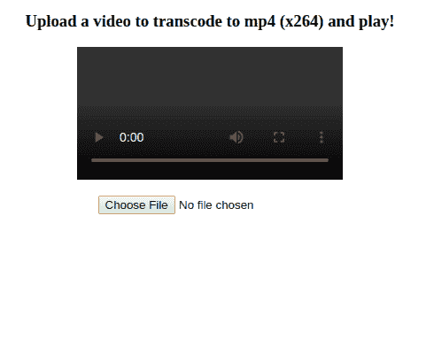

# 构建 FFmpeg WebAssembly 版本(= FFmpeg . wasm):part . 4 FFmpeg . wasm v 0.2—添加 Libx264

> 原文：<https://itnext.io/build-ffmpeg-webassembly-version-ffmpeg-js-part-4-ffmpeg-js-v0-2-web-worker-and-libx264-d0596f1beb4e?source=collection_archive---------2----------------------->

> 2020/9 更新:调整段落结构，使其更具可读性。

之前的故事:[构建 FFmpeg WebAssembly 版本(= FFmpeg . wasm):part . 3 FFmpeg . wasm v 0.1—将 avi 转码为 mp4](/build-ffmpeg-webassembly-version-ffmpeg-js-part-3-ffmpeg-js-v0-1-0-transcoding-avi-to-mp4-f729e503a397)

在这一部分，您将学习:

1.  将 Libx264 添加到 ffmpeg-core.js
2.  浏览器中的 ffmpeg.wasm 演示

# 将 Libx264 添加到 ffmpeg-core.js

下一步，我们想转码一个 avi 视频，并在我们的网络浏览器中播放。默认情况下,`ffmpeg-core.js`可以将 avi 代码转换为 mp4，但是 mp4 文件不能在网络浏览器中播放，因为它的编码不被支持。所以我们首先需要将 libx264 添加到我们的`ffmpeg-core.js`中。

下面是我们将要添加的`x264`库的链接:

 [## 视频局域网/ x264

### x264，最好最快的 H.264 编码器

code.videolan.org](https://code.videolan.org/videolan/x264) 

`x264`比`ffmpeg`更容易建立，以下是你需要通过的关键论点:

> 检查存储库中的完整版本 [build-x264.sh](https://github.com/ffmpegwasm/FFmpeg/blob/n4.3.1-p4/wasm/build-scripts/build-x264.sh)

配置 ffmpeg 时，必须添加`--enable-gpl`和`--enable-libx264`标志。

> 检查存储库中的完整版本的 [configure.sh](https://github.com/ffmpegwasm/FFmpeg/blob/n4.3.1-p4/wasm/build-scripts/configure.sh) 和 [build-ffmpeg.sh](https://github.com/ffmpegwasm/FFmpeg/blob/n4.3.1-p4/wasm/build-scripts/build-ffmpeg.sh)

所有脚本就绪后，现在您可以用`x264`构建一个 ffmpeg.wasm(可能还有所有其他库。)

# 浏览器中的 ffmpeg.wasm 演示

这个故事的最后一部分是 ffmpeg.wasm v0.2.2 的演示，场景是创建一个网页，使用户能够上传视频文件(例如 avi)并在网络浏览器中播放。由于无法直接播放 avi 文件，我们将首先使用 ffmpeg.wasm 对视频进行转码:

以下是完整的 HTML 代码(在此下载示例视频[):](https://github.com/ffmpegwasm/ffmpeg.wasm/raw/master/tests/assets/flame.avi)

> 可能需要很长时间才能完成，可以打开 DevTools 查看日志。检查[transcode.html](https://github.com/ffmpegwasm/FFmpeg/blob/n4.3.1-p4/wasm/transcode.html)看看它是如何工作的。

你可以访问这里的知识库，看看它是如何详细工作的:[https://github.com/ffmpegwasm/FFmpeg/tree/n4.3.1-p4](https://github.com/ffmpegwasm/FFmpeg/tree/n4.3.1-p4)

并且可以在这里随意下载建造神器:【https://github.com/ffmpegwasm/FFmpeg/releases/tag/n4.3.1-p4 

这是这一系列故事的一个暂停，希望你学会如何从头开始构建自己的 ffmpeg.wasm，并有可能应用于任何其他库。下次见！😃