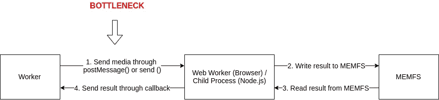
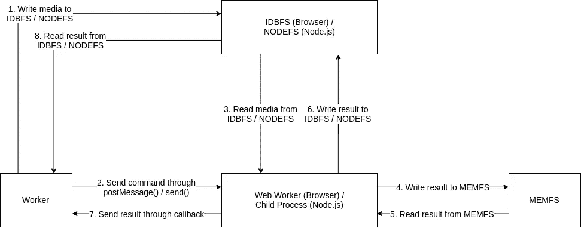

# 构建 FFmpeg WebAssembly 版本(= ffmpeg.wasm):第 6 部分深入研究文件系统(已过时)

> 原文：<https://itnext.io/build-ffmpeg-webassembly-version-ffmpeg-js-part-6-a-deep-dive-into-file-system-56eba10067ca?source=collection_archive---------4----------------------->

> 2020/1/14:从 ffmpeg.wasm v0.6.0 开始，我放弃了 IDBFS 和 NODEFS，并在 postMessage 中使用 Transferable 来解决这个问题。IDBFS 的主要问题是 IDBFS 的大小限制太小(大约 200 MB)，但是您仍然可以查看这个故事作为使用这两个文件系统的示例。

上一篇:[构建 FFmpeg WebAssembly 版本(= FFmpeg . wasm):part . 5 FFmpeg . wasm v 0.3—前 js 和直播](/build-ffmpeg-webassembly-version-ffmpeg-js-part-5-ffmpeg-js-v0-3-pre-js-and-live-streaming-c1498939a74c)

在这一部分，您将学习:

1.  MEMFS、IDBFS 和 NODEFS 之间的区别
2.  如何挂载 IDBFS 和 NODEFS
3.  解决一个现实世界的问题:ffmepg.js 文件大小限制

# MEMFS、IDBFS 和 NODEFS 之间的区别

默认情况下，当您使用 Emscripten 通过文件系统操作传输任何 C/C++库时，Emscripten 使用一个名为 MEMFS 的模拟文件系统来确保库在 browser 和 node.js 环境下工作。

使用 MEMFS 既方便又快捷，但也有一些缺点:

1.  由于 Emscripten 最多只能使用 2 GB 内存，因此 MEMFS 更容易耗尽内存
2.  在您的主进程和 Emscripten 之间将有一个数据“传递”行为(参见“解决一个现实世界的问题:ffmepg.js 文件大小限制”)

要解决这些问题，一种方法是使用 IDBFS 和 NODEFS 作为应用程序的真正文件系统。

IDBFS，用在浏览器(和 web worker)环境中是使用 IndexedDB 作为文件系统来存储你的文件

> 由于 IndexedDB 有一些同步问题，您需要在写入文件后使用 FS.syncfs()

NODEFS，用在 Node.js 环境中就是用 Node.js 中的 fs API 来模拟一个文件系统。

> 更多详情:[https://EMS cripten . org/docs/API _ reference/file system-API . html](https://emscripten.org/docs/api_reference/Filesystem-API.html)

# 如何挂载 IDBFS 和 NODEFS

挂载 IDBFS 和 NODEFS 需要使用第 5 部分介绍的`--pre-js`，这次我们需要覆盖一个名为`preRun`的函数(详情[此处](https://emscripten.org/docs/api_reference/module.html#Module.preRun))。

下面是一个用法示例:

根据您的应用程序，使用其他函数如`preInit`应该没问题，但是这里我们使用`preRun`来完成任务。

# 解决一个现实世界的问题:ffmepg.js 文件大小限制

有一天有一个[问题](https://github.com/ffmpegjs/ffmpeg.js/issues/8)报告说 ffmpeg.wasm 不能处理大文件。为了解决这个问题，我们首先重新审视我们的设计:

当媒体文件不是很大时，看起来还可以，但是当媒体文件大到 100 MB 时，通过 postMessage()或 send()传递这样大的媒体文件看起来不合理，因此会导致 ffmpeg.wasm 崩溃。

这里的瓶颈是由于 Web Worker / Child 进程作为一个传递组件来发送和接收媒体文件，为了解决这个问题，我们需要使用一个 Worker 和 Web Worker / Child 进程都可以访问的文件系统，因此我们进行了重新设计，这是优化的设计。

这里的想法是让 Worker 和 Web Worker /子进程都能够从 IDBFS / NODEFS 中读写，这释放了我们在初始设计中看到的瓶颈。

虽然它看起来更复杂，但它解决了 ffmpeg.wasm 中处理大文件的问题。现在你可以在下面的 CodePen 中尝试一下。(您可以[下载](https://drive.google.com/file/d/1uIv_RTzXyS1gf7_erQmOJ_vNRCbAfvgd/view)一个 90 MB 的视频文件)

> 这种方式的一个主要副作用是，它将海量数据存储在用户的 IndexedDB(浏览器)和文件系统(Node.js)中。记住尽可能进行清理和吹扫。

这是第 6 部分，感谢您的时间，期待在下一部分看到你。😃

存储库:

*   ffmpeg-core . js:【https://github.com/ffmpegwasm/FFmpeg 
*   ffmpeg . wasm:【https://github.com/ffmpegwasm/ffmpeg.wasm 