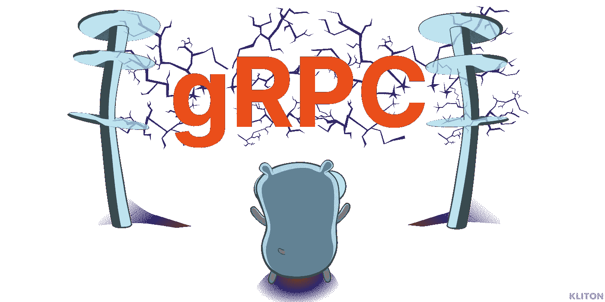
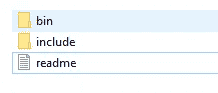
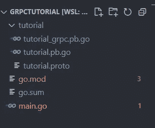
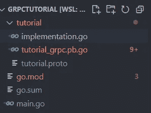

# 用 Golang/Go 逐步构建 gRPC 服务器

> 原文：<https://itnext.io/build-grpc-server-with-golang-go-step-by-step-b3f5abcf9e0e?source=collection_archive---------0----------------------->

## 用 Golang 编写一个完整的 gRPC 应用程序



# gRPC 是什么？

是由 **Google** 开发的处理远程过程调用(RPC)的框架。

今天，gRPC 被谷歌、思科、Dropbox、网飞、IBM 等技术领导者所使用。

有关官方文件，请查看 [grpc.io](https://grpc.io/) 。

## 利益

gRPC 使用 HTTP/2 作为其传输协议。虽然与 HTTP 1.1 兼容，但 HTTP/2 具有许多高级功能:

*   **轻量级消息。**用 gRPC 编码的消息比 JSON 消息小 60-80%。
*   **代码生成。gRPC 已经自动化了代码生成，涵盖了 C#、C++、Java、Go、Kotlin、Node、PHP、Python、Ruby 等语言。**
*   **支持流媒体**。gRPC 还提供数据流:服务器端流、客户端流和双向流。
*   **超速。** gRPC 比 REST+JSON 通信快 7 倍甚至 8 倍。

# [什么是协议缓冲器？](https://developers.google.com/protocol-buffers/docs/overview)

协议缓冲区是 Google 的语言中立、平台中立、可扩展的机制，用于序列化结构化数据——想想 XML，但是更小、更快、更简单。

**您只需定义一次数据的结构化方式，然后就可以使用专门生成的源代码，使用各种语言轻松地将结构化数据写入各种数据流或从中读取。**

您可以在一个`.proto`文件中定义一个 protobuf 消息，如下所示:

# 先决条件

## 戈朗

你必须拥有任何一款最新发布的 [**三大版本的围棋。**](https://go.dev/doc/devel/release)

## 协议缓冲编译程序

为了编译协议定义`(.proto file)`,我们必须安装协议缓冲编译器和协议编译器的 golang 插件。

protobuf 编译器是一个可执行文件，你可以从这里的 [**下载(官方页面)。**](https://github.com/protocolbuffers/protobuf/tags)

例如在 linux 上，您将下载

```
[protoc-21.6-linux-x86_64.zip](https://github.com/protocolbuffers/protobuf/releases/download/v21.6/protoc-21.6-linux-x86_64.zip)
```



[protocol-21.6-win 64 . zip](https://github.com/protocolbuffers/protobuf/releases/download/v21.6/protoc-21.6-win64.zip)内容

*然后按照 readme(从 windows 到 linux 到 osx 都不一样)。*

基本上，你必须把 bin 文件夹的内容(协议二进制文件)放在你的**路径**中。

## **Go 插件**

然后你必须为协议编译器安装 **Go 插件**:

```
$ go install google.golang.org/protobuf/cmd/protoc-gen-go
$ go install google.golang.org/grpc/cmd/protoc-gen-go-grpc
```

最后(如果你以前没有做过)，你必须更新你的`PATH`来包含 go/bin，这样`protoc`就可以找到你刚刚安装的插件。

```
$ export PATH="$PATH:**$(**go env GOPATH**)**/bin"
```

现在，您已经拥有了构建 gRPC 服务器所需的所有工具😃

# 第一步

首先，你必须初始化一个 golang 项目*(随你怎么命名，我把我的命名为 grpctutorial )*

```
$ go mod init grpctutorial
```

然后，您必须安装 grpc-go 软件包

```
$ go get -u google.golang.org/grpc
```

现在我们编写主函数(和 main.go 文件)

然后，您必须创建您的第一个协议文件，并将其放在名为**教程**的目录中。

## 编译原型文件

现在我们已经定义了原型，我们必须把它编译成 Golang 代码。

将终端移动到包含您的的文件夹。proto 文件并运行这个命令

```
$ protoc --go_out=. --go_opt=paths=source_relative \
  --go-grpc_out=. --go-grpc_opt=paths=source_relative \
  *.proto
```

基本上，这个命令将获得你当前所在文件夹中的所有`*.proto`文件，并用我们之前用 grpc 插件安装的协议二进制文件进行编译。

我的项目编译后看起来是这样的:



注意:我已经将 tutorial.proto 文件放在 tutorial 文件夹/包中。

文件`tutorial_grpc.pb.go`是用 protocol(带 grpc 插件)编译的`tutorial.proto`文件的结果。

在`tutorial_grpc.pb.go` 文件中，有我们在 proto 文件中定义的所有类型，还有服务器和客户端代码。

# gRPC 服务器的实施

在运行 gRPC 服务器之前，我们**必须实现我们在`.proto`文件中定义的方法**。

在我们的例子中，我们必须实现

```
rpc SayHello (HelloRequest) returns (HelloReply) {}
```

为了启动 gRPC 服务器，我们必须实现这个接口(您可以在`tutorial_grpc.pb.go`文件中找到它)

首先，我们在`.proto`文件旁边创建一个`server.go`文件。



现在我们必须启动服务器，并在 main.go 文件的 TCP 端口上为它提供服务

现在，您已经准备好在端口 9000 上启动服务器😃 😃

```
$ go run .
```

## 让我们用 BloomRPC(用于 RPC 服务的 GUI 客户机)测试我们的 gRPC 服务器

你可以从 github 页面下载 Bloom。

安装之后，您必须添加您在项目中定义的 proto(在我的例子中是 tutorial.proto ),然后您可以测试您的 API。


我们的服务器正在工作😃

## 最后的想法

现在，您终于创建了您的第一台 gRPC 服务器。

如果你做到了这一步，我希望你喜欢它！

如果你有任何问题，请留下评论。

感谢您的阅读。

# 这里有一些我写的其他文章，我想你会觉得有用

[](https://www.klitonbare.com/blog/animate-svg-with-framer) [## 用 React 和帧运动制作 SVG 动画

### 你好👋在这篇文章中，我将向你展示我是如何为我的博客标识创建一个绘制效果的。在这里你将得到什么(你可以…

www.klitonbare.com](https://www.klitonbare.com/blog/animate-svg-with-framer) [](/best-books-that-every-software-developer-must-know-8b96faff180d) [## 每个软件开发人员都必须知道的最佳书籍！

### 你的书架上有这些书吗？

itnext.io](/best-books-that-every-software-developer-must-know-8b96faff180d) [](/best-vscode-extensions-by-a-full-stack-developer-in-2022-f730037b6e0b) [## 2022 年全栈开发者评选的最佳 VsCode 扩展

### 作为一名完整的堆栈开发人员，以下是我挑选的最好的 VS 代码扩展！

itnext.io](/best-vscode-extensions-by-a-full-stack-developer-in-2022-f730037b6e0b)