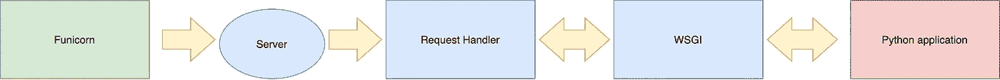

# 从头开始建造 Gunicorn

> 原文：<https://itnext.io/build-gunicorn-from-scratch-d75870960b9b?source=collection_archive---------6----------------------->

图片来自[Pexels](https://www.pexels.com/photo/boston-terrier-wearing-unicorn-pet-costume-1564506/)的马克·格兰西

许多 python 开发者使用 gunicorn 来部署他们的 python 应用程序，它是使用最多的 python WSGI 服务器之一。为了更好地理解这些服务器是如何工作的，我决定自己创建一个！

该服务器具有以下主要特性:

*   **干净的代码:**该项目具有教育目的，为了展示 wsgi 规范如何在幕后工作，代码尽可能清晰，代码在三个不同的层中解耦:网络服务器、WSGI (wsgi 规范)、http2(域实体)
*   **它必须工作！:**服务器必须能够接收传入的请求，加载 python 应用程序并返回有效的响应。

这个项目还没有做好生产准备，它可能会包含 bug。此外，该项目并没有满足所有的用例以及所有可能的极限情况，使用它来部署我们的应用程序是不安全的。

# 伏尼康

我决定创建 Funicorn 作为 Gunicorn 的非生产版本。

# 整体架构

该项目的架构非常简单，它包含三个组件:

*   **网络组件**(服务器和请求处理器)，处理与操作系统的底层交互。
*   **WSGI 层。:**它遵循 wsgi 规范，**它能够与 python 应用程序对话。**
*   **Python 应用:**它包含了你想用你的应用执行的业务逻辑，它通常使用一个框架，比如 Flask 或者 Django

整体架构——富尼科恩

# 主要应用

主应用程序是我们的服务器入口点，它接收所有必要的配置以正确处理您的应用程序。此外，它也是处理服务器生命的地方。

funicorn 类只接收必要的信息来正常工作。它将 application_path 参数传递给处理程序，并包装服务器特性。

# 计算机网络服务器

网络服务器处理底层网络需求。它成功地建立、保持和完成网络连接，例如打开网络套接字，将套接字绑定到特定的主机和端口，还将信息传递给处理程序。

为了防止我从零开始构建服务器并自己处理网络连接，我使用了来自 [socketserver python 模块](https://docs.python.org/3.8/library/socketserver.html)的`TCPServer`，这个模块提供了一些服务器类，它们具有您需要的基本特性。

# 请求处理程序

Funicorn 处理程序恰当地处理服务器收到的每个请求。它加载 python 应用程序，处理服务器收到的数据，并返回适当的响应。

我的处理程序继承自 BaseRequestHandler，它是 python 的套接字库提供的基类。

# 请求和响应

为了轻松地处理 HTTP 和网络实体，我创建了一个请求和响应类，其中包含所有必要的信息。

这些类只隔离请求和响应信息，比如消息头、使用的方法和消息体。

主体必须是一个类似文件的对象，它被传递给应用程序，并且它必须至少实现方法 read 和 write。我已经用 BytesIO 建模了。

# WSGI

WSGI 应用程序实体是为服务器的其余部分包装 python 应用程序和 WSGI 规范的层。它接收请求实体，将其传递给 python 应用程序，并返回处理后的响应。

主要方法是`process_request`，在这里处理请求，并通过环境变量传递给应用程序。最后，通过`start_response`方法(在[规范](https://www.python.org/dev/peps/pep-3333/#the-start-response-callable)中定义)构建响应，并返回给处理程序。

请求提供的所有信息，都以下面的方式包装在环境变量中。

为了正确工作，你需要向 Python 应用程序提供许多环境变量，这些变量在 [python 提案](https://www.python.org/dev/peps/pep-3333/#environ-variables)中有定义，其中大部分是强制性的。

此外，这些变量中有许多是由 [HTTP 协议](https://tools.ietf.org/html/rfc7231#section-5)定义的，每一个都为应用程序提供重要的信息。我只实现了强制变量。

我不会更详细地解释这些变量，因为我认为在[网](https://www.python.org/dev/peps/pep-3333/#environ-variables)上已经有足够的关于它的信息了。

# Python 应用程序

我们的服务器执行的 python 应用程序是一个简单的 Flask 示例。应用程序能够接收 GET 和 POST 请求。

*   **GET:** 应用程序返回“Hello World”
*   **POST:** 应用程序从请求中返回相同的主体(回送应用程序)

# 结论

实施这个项目是一个很好的练习，因为它迫使你了解你不知道的关于 python 社区最常用的一些标准的许多细节，以及它实际上是如何工作的，它不是魔术，它实际上是代码！

我建议任何人看一看[库](https://github.com/juanbenitopr/funicorn)，在那里你可以看到整个代码，以便更好地了解我无法在这里总结的许多细节。你可以克隆它并使用它，就像我之前评论的那样，我尽量说得更清楚，但是如果你有任何疑问，请告诉我:)

此外，如果你喜欢这篇文章，让我在评论区知道，它会帮助你了解这种项目是如何工作的。

# 资源

 [## Juan benitopr/富尼科恩

### 这个项目模拟了任何 WSGI 服务器的基本行为。该项目有教育目的，它的目的是…

github.com](https://github.com/juanbenitopr/funicorn)  [## 加入中等。

### 加入中等。

加入 Medium.medium.com](https://medium.com/@juanbenito.pr/build-gunicorn-from-scratch-d75870960b9b)  [## socketserver -网络服务器的框架- Python 3.8.3 文档

### 源代码:Lib/socketserver.py 该模块简化了编写网络服务器的任务。有四个基本的…

docs.python.org](https://docs.python.org/3.8/library/socketserver.html)  [## 用于 UNIX 的 Python WSGI HTTP 服务器

### 这里有一个如何开始使用 Gunicorn 的快速纲要。有关更多详细信息，请阅读文档。

gunicorn.org](https://gunicorn.org)  [## RFC 7231 -超文本传输协议(HTTP/1.1):语义和内容

### 互联网工程任务组。征求意见:7231 Adobe Obsoletes:2616j . resch ke…

tools.ietf.org](https://tools.ietf.org/html/rfc7231#section-5)  [## PEP 3333 - Python Web 服务器网关接口 1.0.1 版

### 这是 PEP 333 的更新版本，略微修改以提高 Python 3 下的可用性，并加入了…

www.python.org](https://www.python.org/dev/peps/pep-3333/#environ-variables)