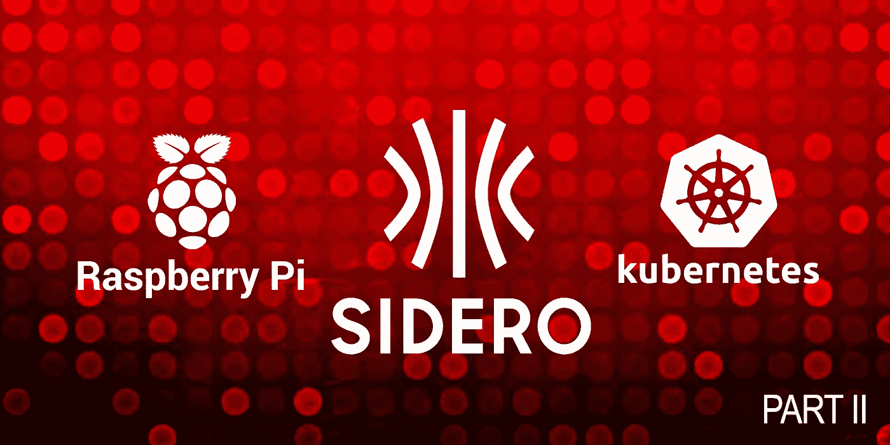
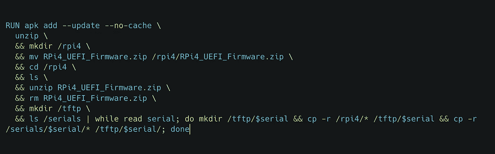

# 在 Raspberry Pi 上使用 Sidero Metal 和 Talos Linux 构建 Kubernetes 集群

> 原文：<https://itnext.io/build-kubernetes-clusters-using-sidero-metal-talos-linux-on-raspberry-pi-54a9961a7d4c?source=collection_archive---------6----------------------->

第二部分:设置控制平面 Kubernetes 集群

合著者:安东尼·拉比托



在第一部分中，我们介绍了一些高级概念和工具；如果你没有看过第一部分，请点击这里查看。

在第二部分中，我们将介绍一些快速入门指南，介绍如何创建一个将在 Talos Linux 上运行并安装 Sidero Metal 的控制平面集群。第三部分将继续介绍如何将集群 API 与 Sidero Metal 一起使用，以声明方式提供集群并管理其生命周期。

## 先决条件

*   [CLI 工具](https://www.sidero.dev/docs/v0.5/getting-started/prereq-cli-tools/)
*   [Kubernetes](https://www.sidero.dev/docs/v0.5/getting-started/prereq-kubernetes/)
*   [DHCP 服务](https://www.sidero.dev/docs/v0.5/getting-started/prereq-dhcp/)

## 设置控制平面集群

要安装 Sidero Metal，它必须先部署在 Kubernetes 集群中，然后才能用于提供其他 Kubernetes 集群。因此，有几个选项可供考虑——您可以创建 Sidero Metal 的 docker 托管实例来创建控制平面集群，然后将 Sidero Metal 转换为在该集群中运行；或者你也可以用 Talos Linux 在裸机上手动部署你的控制平面集群，部署 Sidero Metal ( [推荐](https://www.sidero.dev/docs/v0.5/guides/sidero-on-rpi4))。

如果您选择按照推荐的方法在裸机上安装 Talos，可以使用以下指南；[https://www . sidero . dev/docs/v 0.5/guides/sidero-on-rpi 4/# installing-talos](https://www.sidero.dev/docs/v0.5/guides/sidero-on-rpi4/#installing-talos)

*注意:在撰写本博客时，v0.5 是最新版本，但是在浏览本博客时，您应该使用基于的最新文档。*

## 安装集群 API 和 Sidero Metal

在很大程度上安装集群 API 和 Sidero Metal 是非常简单的，但是，要让它在一些裸机上工作，可能需要注意一些小问题。例如，当使用 Raspberry Pis 时，我们将采取一些额外的步骤来让 iPXE 和 Sider Metal 管理这些裸机。

首先，按照官方文档安装 Sidero Metal，可以在这里查看:[https://www . Sidero . dev/docs/v 0.5/guides/Sidero-on-rpi 4/# installing-Sidero](https://www.sidero.dev/docs/v0.5/getting-started/install-clusterapi/)

确保安装完成后，验证 Sidero Metal 是否暴露，并且可以从群集外部接触到它。

```
$ curl -I http://192.168.1.150:8081/tftp/ipxe.efi
HTTP/1.1 200 OK
Accept-Ranges: bytes
Content-Length: 1020416
Content-Type: application/octet-stream
```

如果在对您的实例运行该命令时得到以上输出，那么**恭喜您。**尽管对那些使用树莓酱的人来说，我们还没有完全完成！

## 设置裸机 RPi

Raspberry Pi 有一些特定的引导文件夹结构，我们需要解决这些结构，以便让 EEPROM 引导到 UEFI，然后允许 RPi 通过 iPXE 引导到 Talos Lmux。

【https://www.sidero.dev/docs/v0.5/guides/rpi4-as-servers/】注:这里通过他们有用的指南进一步阐述:[](https://www.sidero.dev/docs/v0.5/guides/rpi4-as-servers/)

***更新 EEPROM***

*作为一次性事件，您需要使用此方法更新 EEPROM[https://www . sidero . dev/docs/v 0.5/guides/rpi 4-as-servers/# update-EEPROM](https://www.sidero.dev/docs/v0.5/guides/rpi4-as-servers/#update-eeprom)*

***序列号***

*我们需要收集每个设备的序列号，这些序列号在启动时以下列格式显示:*

```
*board: xxxxxx <serial> <MAC address>*
```

*否则，如果您可以通过 SSH 访问 RPi，您可以使用以下命令:*

```
*$ cat /proc/cpuinfo | grep Serial | cut -d ' ' -f 2
100000003bc47760*
```

*创建一个新目录，并在里面为你的每一个覆盆子 Pi 系列创建一个新文件夹。*

*例如。*

```
*serials/
├── 1836c205
├── 3e79ca27
├── 56af08e4
└── 8e2bc983*
```

*然后把 RPi UEFI 写到 SD 卡上——可以在这里找到:[https://github.com/pftf/RPi4/releases](https://github.com/pftf/RPi4/releases)*

*启动每个 RPi，并更改启动顺序，优先启动网络，然后启动硬盘。*

*在更改启动顺序后，您将在每个 RPi 上执行此操作。移动“RPI_EFI.fd ”,并将其放在相应的串行文件夹中。这使得 RPi 可以完全通过 TFTP Sidero Metal 上的网络服务 UEFI 进行无 sd 卡网络引导。*

**注意:在移动 RPI_EFI.fd 并准备移动到下一个 RPI 后，确保“RPI_EFI.fd”实际上已被移动而不是被复制。这是 UEFI 的 nvram，与 RPi 序列号相关。这意味着它在每个 RPi 中都是唯一的。因此，确保在移动到下一个 RPi 时该文件不存在是很重要的。**

*完成后，您的目录结构应该如下所示:*

```
*serials/
├── 1836c205
│   └── RPI_EFI.fd
├── 3e79ca27
│   └── RPI_EFI.fd
├── 56af08e4
│   └── RPI_EFI.fd
└── 8e2bc983    
    └── RPI_EFI.fd*
```

***创建赛德洛金属初始容器图像***

*现在，我们可以为 Sidero Metal 可以使用的这些 nvrams 构建一个容器映像。*

*这将足以构建容器映像。*

```
*FROM docker.io/library/alpine:3.15.0COPY ./serials /serialsADD https://github.com/pftf/RPi4/releases/download/v1.31/RPi4_UEFI_Firmware_v1.31.zip RPi4_UEFI_Firmware.zipRUN apk add --update --no-cache \
  unzip \
  && mkdir /rpi4 \
  && mv RPi4_UEFI_Firmware.zip /rpi4/RPi4_UEFI_Firmware.zip \
  && cd /rpi4 \
  && ls \
  && unzip RPi4_UEFI_Firmware.zip \
  && rm RPi4_UEFI_Firmware.zip \
  && mkdir /tftp \
  && ls /serials | while read serial; do mkdir /tftp/$serial && cp -r /rpi4/* /tftp/$serial && cp -r /serials/$serial/* /tftp/$serial/; done*
```

*一旦构建了映像，就将其推送到一个容器映像 repo，如 GHCR.io 或 docker.io。*

***修补 Sidero 金属初始容器***

*Sidero Metal 随后可以使用它，并在 init 容器中复制 rpi 后对其进行网络引导。*

*例如，使用以下内容创建一个 patch.yaml 文件:*

```
*spec:
  template:
    spec:
      volumes:
      - name: tftp-folder
        emptyDir: {} 
      initContainers:
      - image: ghcr.io/<USER>/raspberrypi4-uefi:v<TAG> # <-- change accordingly.
        imagePullPolicy: Always
        name: tftp-folder-setup
        command: ["cp"]
        args: ["-r", "/tftp", "/var/lib/sidero/"]
        volumeMounts:
        - mountPath: /var/lib/sidero/tftp 
          name: tftp-folder
      containers:
      - name: manager
        volumeMounts:
        - mountPath: /var/lib/sidero/tftp
          name: tftp-folder*
```

*然后，您可以运行以下命令:*

```
*kubectl patch --patch-file patch.yaml deploy sidero-controller-manager  -n sidero-system*
```

*修补 Sidero Metal 部署后，使用以下命令尝试 netboot 一个 RPi，只连接一个空白硬盘或 SD 卡，如果成功，Talos Linux 将引导 loop，RPi 将作为服务器出现在 kubernetes 资源列表中:*

```
*kubectl get servers -o wide*
```

*请继续关注第 3 部分——我们将展示如何使用我们目前正在使用的 Sider Metal 配置以声明方式构建 Kubernetes 集群！*

**