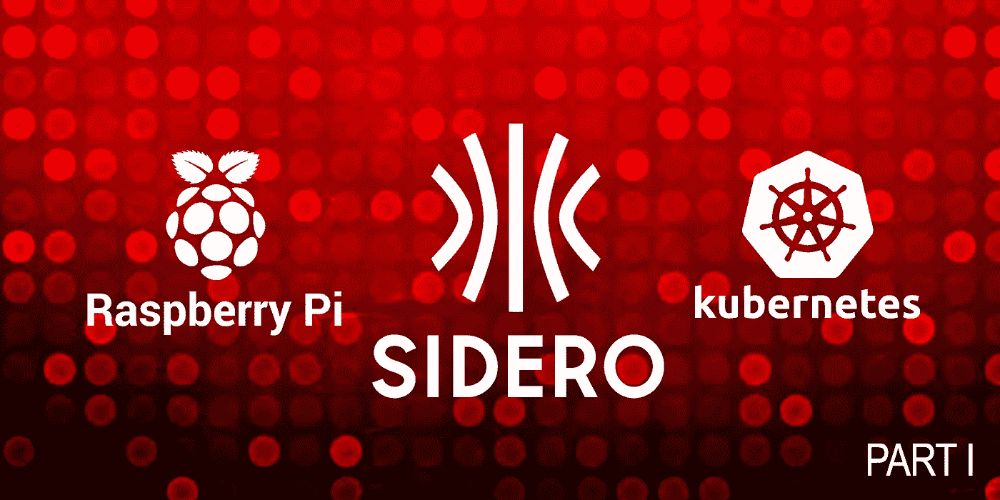

# 在 Raspberry Pi 上使用 Sidero Metal 和 Talos Linux 构建 Kubernetes 集群

> 原文：<https://itnext.io/build-kubernetes-clusters-using-sidero-metal-talos-linux-on-raspberry-pi-8d307ad850c9?source=collection_archive---------3----------------------->

第一部分:Kubernetes 裸机生命周期管理

合著者:安东尼·拉比托

## 介绍

本博客系列将涵盖一种非常有见解的方法来管理裸机基础设施，提供 Kubernetes 集群，并通过一系列开源软件以自动化和可重复的方式对这些集群进行生命周期管理。还有使用这些概念和整体方法的一些主要好处。

## 主要优势

使用 Cluster API 和 Sidero Metal 管理裸机有许多优势，这不是一个确定的列表，但我想强调以下几点:

**声明性—** 带有 Sidero Metal 扩展的集群 API 提供了一种以声明方式定义基础设施状态的方法。

**不可变—** 不可变的供应基础设施提供了可重复性的能力，并且消除了由于就地升级和配置漂移而产生的变更管理问题的风险。

**安全—** Talos Linux 提供了一种默认的安全姿态。这是一个专门为供应 Kubernetes 而设计的操作系统。它在操作系统中的占用空间显著减少，并且所有访问都是通过具有严格 MTL 的 API 进行的。

## 第一部分:Kubernetes 裸机生命周期管理

## Kubernetes 作为基础设施

在讨论 Sidero Metal 和 Talos Linux 之前，需要强调的是，本系列将 Kubernetes 集群视为“基础设施”的一部分。在原生云计算中，越来越多的努力被用来改善不可变基础设施的无缝性；尽管自托管裸机基础设施怎么样？

## 集群 API

*来源:*[*https://github.com/kubernetes-sigs/cluster-api*](https://github.com/kubernetes-sigs/cluster-api)

> 什么是集群 API？
> 
> Cluster API 是 Kubernetes 的一个子项目，致力于提供声明性 API 和工具来简化多个 Kubernetes 集群的供应、升级和操作。

Cluster API 项目支持构建定制的“提供者”,它将功能扩展到不同类型的基础设施，这就是 Sidero Metal 的用武之地；Sidero Metal 扩展了集群 API，允许 Kubernetes 裸机生命周期管理。这是一个游戏改变者！

## 含铁金属

*来源:*[*https://github.com/talos-systems/sidero*](https://github.com/talos-systems/sidero)

Sidero Metal 扩展集群 API 提供了声明式定义基础设施的能力；It 部门负责管理裸机基础架构，使其符合所需的状态。此外，它还为裸机提供了不变的基础架构体验，从而降低了复杂性和故障率，提高了安全性，并简化了故障排除体验。

## Talos Linux

*来源:*[*【https://github.com/talos-systems/talos】*](https://github.com/talos-systems/talos)

Talos Linux 是一个运行 Kubernetes 的现代操作系统:安全、不可变、最小化。Talos Linux 是完全开源的，可以投入生产，并得到 Sidero 实验室人员的支持。所有的系统管理都是通过 API 完成的——没有外壳或交互式控制台。

为什么选择 Talos Linux？

*   安全性:Talos Linux 减少了您的攻击面:它是最小的、强化的和不可变的。所有 API 访问都通过相互 TLS (mTLS)身份验证来保护。
*   可预测性:Talos Linux 消除了配置漂移，通过采用不可变的基础设施思想减少了未知因素，并提供了原子更新。
*   可演进性:Talos Linux 简化了您的架构，增加了您的灵活性，并始终提供当前稳定的 Kubernetes 和 Linux 版本。

*注意:Talos Linux 是 CNCF 的一部分！*

这些项目为在 Raspberry Pi 上运行 Kubernetes 集群带来了很多优势，我们将在下一部分中看到！