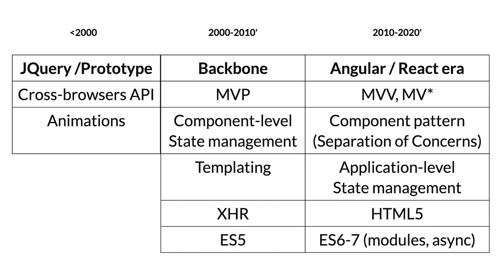
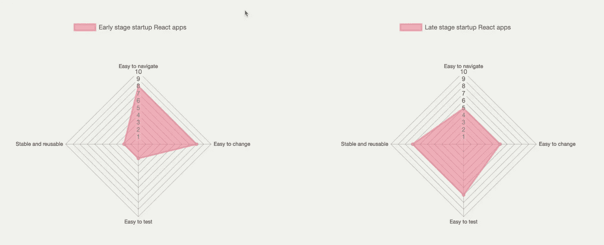

# 构建可维护的 React 应用程序系列

> 原文：<https://itnext.io/build-maintainable-react-apps-series-9ff2977f48f7?source=collection_archive---------1----------------------->

## 可维护性的良好实践和技巧

奥马尔·弗洛雷斯的照片

在过去的 20 年里，前端的复杂性急剧增加；我们很快从小部件 JavaScript 发展到单页应用。
步伐仍然很快，我们在短短几年内就从 Redux 发展到 Mobx，现在又发展到 React hooks，这使得我们比以往任何时候都更有必要欢迎应用程序的变化。

从小工具到应用程序

随着 React 和生态系统的库解决了现代前端架构的大多数挑战(性能、渲染、状态管理)，我们作为前端工程师的主要任务是以可持续的方式构建和扩展应用程序，换句话说，**以可维护的方式**。

“构建可维护的 React 应用程序”系列由 3 部分组成:

## 第一部分:保持应用程序有条理

1.  将你的申请分成有意义的部分
2.  在代码组织中反映已定义的应用程序部分

 [## 构建可维护的 React 应用程序—第一部分

### 保持你的应用程序有条理

medium.com](https://medium.com/@wittydeveloper/build-maintainable-react-apps-part-i-6e2656bae131) 

## 第二部分:轻松变更:面向未来的组件代码

1.  状态管理
2.  松散耦合组件
3.  组件分解模式
4.  启用反应警告并保持您的依赖关系最新

 [## 构建可维护的 React 应用程序—第二部分

### 轻松更改:面向未来的组件代码

medium.com](https://medium.com/@wittydeveloper/build-maintainable-react-apps-part-ii-62e51d10440d) 

## 第三部分:测试策略和可测试组件

1.  测试 React 代码的许多方法
2.  一个很好的测试策略示例
3.  让你的组件可测试

 [## 构建可维护的 React 应用程序—第三部分

### 测试策略和可测试组件

medium.com](https://medium.com/@wittydeveloper/build-maintainable-react-apps-part-iii-9cef8777d606) 

—

我希望你会发现这些技巧和最佳实践是有用的，并且它们会启发你新的方法来保持你的 React 应用程序的可维护性。

# TLDR；

可维护性就是找到让应用程序保持运行的方法。
然而，每家公司的运营速度不同，这影响了所涵盖主题的技术决策的优先级。

**早期创业公司**可能希望快速迭代，打破常规，以适应产品市场，从而在易于重构的“经得起未来考验的组件”上投入更多时间(例如:重复代码)，然而，测试将不再是优先事项。

一个后期创业公司，很可能由一个更大的工程团队和更苛刻的客户组成，可能会在代码组织和测试方面投入更多，以保证产品的质量。

—

你会在下面找到这些文章的原则总结；现在是您选择哪些是您的业务的优先事项并构建您的架构原则的时候了！

## 论代码组织

*   **识别你的应用程序的部分(域)**将有助于塑造一个更好的架构(例如:状态)。
*   花少量的时间找到一个**合适的组件名称**是一个很好的设计练习，它将带来一致性(位置和明确定义的职责)

## 关于组件代码

*   **定制钩子是容器/视图模式的一个很好的替代品。** 让你的组件专注于 UI 方面。
*   **确保您的组件仅直接依赖于显示的数据；否则**，使用业务逻辑助手，自定义钩子。
*   小心不好的抽象；他们最有可能阻止变革。
*   分解模式和产品设计师提供的 UI 是构建定义良好的组件的良好起点

## 关于测试

*   **React 应用可以通过许多有用的不同方式进行测试:** E2E 测试、集成测试、单元阴影渲染测试、单元业务逻辑测试
*   通过**定义测试策略**，投入时间测试你产品最重要的部分
*   **通过避免业务逻辑中嵌入耦合和组件，确保您的组件可以很容易地被测试**。

**在 Twitter 上关注我**了解 React、GraphQL 和 TypeScript 的最新动态！

 [## 查理·波利

### Charly Poly(@ where is chary)的最新推文。帮助您充分利用✍️🎙.的新网络技术巴黎…

twitter.com](https://twitter.com/whereischarly) 

这个系列是基于我在 2020 年 4 月[极客](http://geekle.us/)大会上的一次演讲:

[https://noti.st/charlypoly/GlaLFs/maintainable-react](https://noti.st/charlypoly/GlaLFs/maintainable-react)，视频可在[https://youtu.be/4w_cEAkhp48](https://youtu.be/4w_cEAkhp48)获得

❤️向[路易·拉丰](https://medium.com/u/5e7adfc6c6e0?source=post_page-----9ff2977f48f7--------------------------------)和[乔纳斯](https://medium.com/u/dc5e520e40c6?source=post_page-----9ff2977f48f7--------------------------------)进行了系列回顾！