# 构建强大的无框架 web 组件

> 原文：<https://itnext.io/build-powerful-frameworkless-web-components-482bab0706b1?source=collection_archive---------2----------------------->

# 简介—为什么选择 Web 组件和 Stencil.js

如今前端框架和库的激增导致许多公司寻找与框架无关的(经得起未来考验的)方法来创建他们的 UI 构建块。输入 Web 组件。Web 组件是一组**本地**浏览器 API，允许我们创建看起来像自定义 html 标签的东西(例如我们在一个附加的 js 文件中构建的功能。它们的强大之处在于它们是可重用的、封装的，并且浏览器无需外部库或框架的帮助就能呈现它们。

您可以只使用普通的 HTML 和 JavaScript 创建定制的 Web 组件，或者您可以像酷孩子一样使用 Stencil.js 之类的东西将漂亮的现代 js/tsx 代码编译成 Web 组件。

# 本文的目标是

我将向您介绍使用模板开发功能性**导航栏**组件的思想过程和代码。我们的目标是，到本文结束时，你将能够理解 [CodeSandbox 演示](https://codesandbox.io/s/alx-menu-9z9ep)中的大部分代码，并且你也将开始体会到 Web 组件是多么强大，它们是多么容易构建。

# 我们的导航栏组件

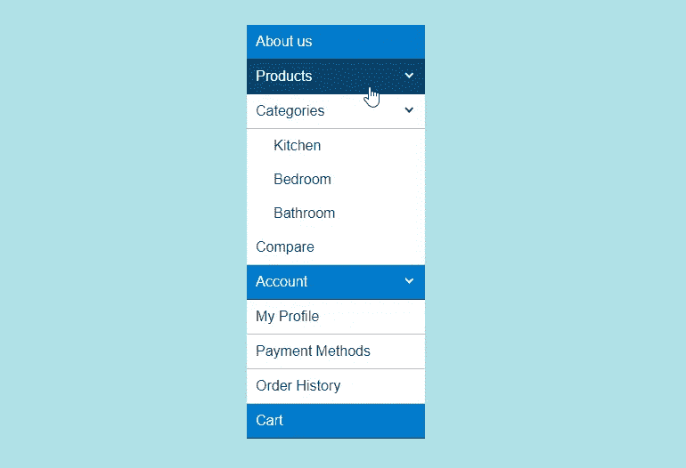

我们的导航栏自定义 web 组件

上图显示的是成品。一些要求包括:

*   需要支持无限深度的嵌套。
*   需要内置基本的可访问性支持。
*   需要有主题。
*   标记应该直观简单。
*   需要在 Edge 和 IE11 中完美运行

# **加价**

当构建 Web 组件时，我喜欢从测试标记中的不同想法开始；我认为这奠定了一个良好的基础。我为 navbar 提出的第一个概念是实际使用两个定制组件(名为 alx-nav 和 alx-nav-item ),它们将模拟创建菜单的常见

*   方法:

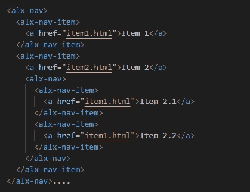

第一个想法——模仿一个

*   结构

这是可行的，并且会产生一个非常精细的可定制菜单，但是看起来有点过分了。我可以在整个菜单中只使用一个自定义组件吗？果然:

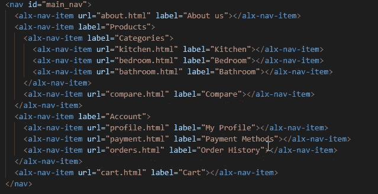

第二个想法——整个导航条只有一个组件

这个漂亮的标记足以让整个导航条呈现出我们设计中的样子。我们在这里只使用了一个组件，**AlxNavItem**(html 标签为< alx-nav-item >)，它采用了一个定义其链接的 href 的`url`属性。如果它是一个父元素，它的内容区域可以有多个 alx-nav-items(在它的开始和结束标签之间)。

请记住，上述标记可以在没有任何框架或库的静态 html 页面中工作。浏览器只是将<alx-nav-item>识别为一个 Web 组件，并运行我们的幕后代码来渲染，使它按照我们想要的方式工作。</alx-nav-item>

# 代码概述

的。tsx 文件是所有奇迹发生的地方。Stencil 使用 TypeScript，然后将文件转换为 JavaScript。如果您不熟悉，TypeScript 只是带有一些语法糖的 JavaScript 主要是为了支持静态类型。我喜欢 TypeScript，但它可能非常冗长，所以我决定不使用它的大部分甜言蜜语。

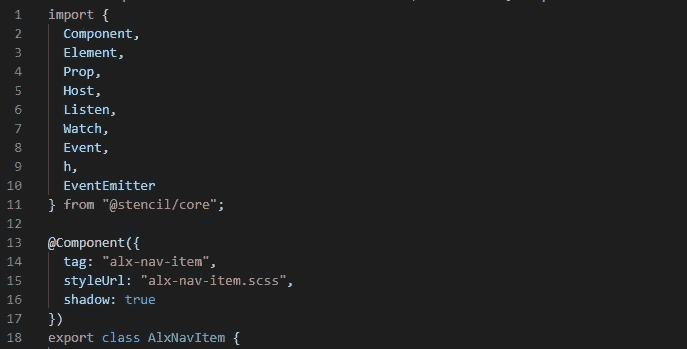

我们组件的顶部

从代码的顶部开始，我们导入了将要使用的模板核心类——没有什么特别的。然而，在我们继续之前，你需要了解一下**装饰者**。Stencil 几乎在任何地方都使用一个名为 decorators 的类型脚本特性。本质上，它们只是以@符号开始的关键字，为编译器提供关于组件、属性、事件等的元数据。它们所依附的东西。我们在上面的代码(第 13 行)中看到了一个，就在我们进入组件类之前。这里，`@Component` decorator 告诉编译器我们的组件的定制 html 标记名应该是什么，以及使用什么样的样式表。

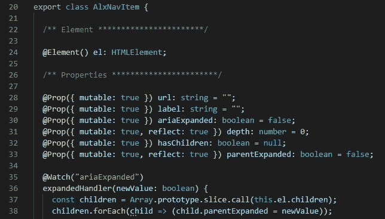

公共属性/标签属性

我们转到组件类的内部，从设置一些属性开始。`@Element`装饰器将组件本身作为 DOM 元素返回，并将其分配给`el`。之后，我们用@Prop decorator 定义了一些公共属性。这些属性可以通过我们的 html 标签的属性(例如`<alx-nav-item **label=”About us”**>`)

每当`ariaExpanded`属性被更新时，`@Watch`装饰器(第 33 行)将触发它下面的方法，该方法依次迭代这个组件的每个子组件，并将它们的`parentExpanded`属性设置为 true。稍后将使用它来为可访问性正确设置`tabIndex`。

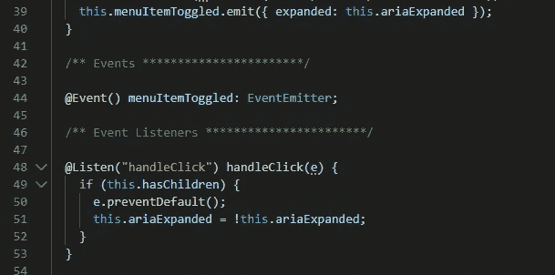

处理和调度事件

接下来我们要处理事件。当一个<alx-nav-item>被切换时(通过点击它或者按回车键),我们想要调度一个名为`menuItemToggled()`的自定义 DOM 事件，它可以被使用我们组件的人监听。装饰者为我们设置了这个(第 40 行)</alx-nav-item>

第 48 行的监听器通过检查组件实例是否有子实例来处理组件上的 click 事件，然后简单地切换`ariaExpanded`属性的值。记住，这将引起连锁反应，触发上面的`@Watch(‘ariaExpanded’)`监视器，然后调度`menuItemToggled`事件(第 39 行)。

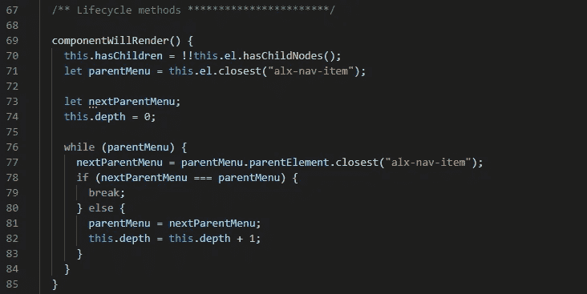

挂钩到生命周期方法

现在我们来看组件的核心——它的生命周期方法。这些是一系列被自动调用的方法，从一个组件的诞生到它的死亡。上面我们使用了`componentWillRender()`方法(它在每个`render()`之前被调用)来计算当前< alx-nav-item >在菜单树中的深度。我们通过不断地沿着树向上移动直到到达最外层的父节点来完成这个任务。

render()生命周期方法

`render()`方法可以被认为是**主**生命周期方法，我们用它在幕后返回组成< alx-nav-item >的元素(在 JSX)。如果你不熟悉 JSX [，看看这里](https://stenciljs.com/docs/templating-jsx)。需要注意的一件重要事情是，每当@Prop 或@State 变量发生变化时,`render()`就会运行。

在我们的`render()`方法的顶部，我们设置了这个特定的< alx-nav-item >实例的左缩进，这取决于它在导航树中的当前深度。然后，我们输出一个<和一个>标签，其中充满了与可访问性相关的属性，并组成了组件的实际可点击链接。如果存在子元素，我们还会呈现一个包含子元素< alx-nav-item >的 div(第 104 行)。

一些澄清:

*   特殊的<host>标签(第 89 行)指的是组件实例的 html 标签本身(<alx-nav-item>标签)。</alx-nav-item></host>
*   对于元素的 onClick 事件(第 98 行),我们通过一个箭头函数传递 handleClick()处理程序。我们这样做是因为如果我们直接传递 handleClick，那么 handleClick()中的“this”关键字将引用被单击的元素，而不是我们的 AlxNavItem 实例(您也可以使用 bind()来获得相同的结果)
*   一个很酷的小技巧是用逻辑& &操作符内嵌 **if** (第 104 行)。在 JavaScript 中， **true & &表达式**总是计算为**表达式**，所以我们在这里用这个来表示如果组件有子组件，渲染它们。
*   浏览器会将自定义元素的内容(开始和结束标记之间的所有内容)放在特殊的<slot>元素(第 105 行)中。如果要在不同的位置输出内容，也可以使用命名槽。</slot>

# 设计它

我们在这个项目中使用了 SCSS，这意味着安装@stencil/sass 依赖项，并确保将它添加到我们的 stencil.config.ts 中:

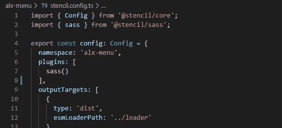

在模具中使用 Sass/Scss

请记住，我们的组件使用的是影子 DOM(我们在类顶部的@Component decorator 中设置了这一点)。虽然听起来很酷，但这意味着我们的组件的样式和 html 将被封装在它们自己的受保护的小 DOM 中——我们不需要担心 CSS 作用域或 render()函数返回的任何内容会受到它之外的任何内容的影响。

我们组件的样式应该非常简单。以下是其中一小部分的一些注释:

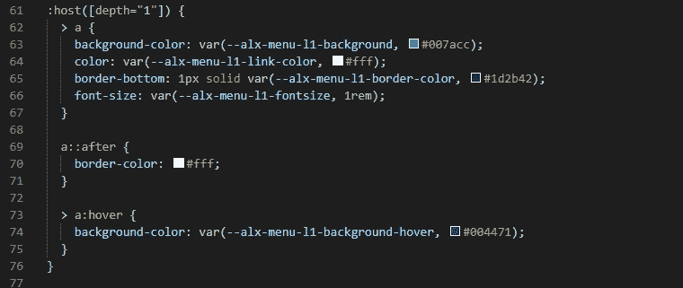

我们样式表的一部分

*   :host 伪类函数(第 61 行)遵循了与我们在代码的 render 函数中使用的<host>标记相同的思想，因为它针对的是我们的自定义元素本身(<alx-nav-item>)。这里我们说，如果我们的元素有一个深度属性“1”(即在第一层)，那么样式中的标签会有一点不同。</alx-nav-item></host>
*   你会注意到我们使用 CSS 变量来设置尺寸和颜色。请记住，我们将影子 DOM 用于我们的组件，所以我们不能从外部改变它的样式。例如，如果在一个特定的页面上，我们想为 L1 设置背景色，我们需要改变变量`--alx-menu-l1-background`，否则它默认为#007acc。在一个健壮的设计系统中，你会有多层这样的变量&它们的缺省值，产生一个非常优雅的主题化方法。

# 演示

你可以在这里找到整个项目:[https://codesandbox.io/s/alx-menu-9z9ep](https://codesandbox.io/s/alx-menu-9z9ep)

CodeSandbox 预览窗口正在显示 **src/index.html** 的渲染内容。我建议你放弃这个项目，把它玩一玩。

# 使用我们的组件

Stencil 生成的 Web 组件可以通过在标准 html 中使用它们的标签或者在 React、Vue 或 Angular 等框架中作为 JSX 组件来使用。不管是什么情况，当你准备好的时候，确保在你的模板项目目录中运行`npm run build`。

## 在纯 HTML 中

要在普通 HTML 中使用我们的组件，我们所要做的就是复制`/build` 文件夹，并在我们的页面中包含入口点 js 文件(例如``)就是这样！

*   如果我们的项目中有多个组件，我们仍然只需要包含一个文件；Stencil 的动态加载器将只加载页面上正在使用的组件。
*   旧的浏览器支持也由 Stencil 的加载器负责(通过 core-js polyfills)，所以我们不需要做任何其他事情来使我们的 navbar 在 IE11 中工作！

## 在反应范围内

我将会写一篇关于如何让你的模板生成的 Web 组件在 React 中完美地**工作的更广泛的文章(有一些奇怪的地方需要处理),但是现在，这将足以让我们的 navbar 组件正常工作:**

*   **我们将在模板项目的根目录下运行`npm pack`——这将把我们的组件打包成一个漂亮的小。存储在本地的 tgz 文件。(如果我们想与他人分享，我们也可以将其发布到 NPM 回购协议上)**
*   **在 React 项目文件夹中，我们将运行`npm install /absolute/path/to/ourComponentPackage.tgz`,然后转到将 React 应用程序注入 DOM 的脚本(通常是 index.js ),添加以下两行:**

**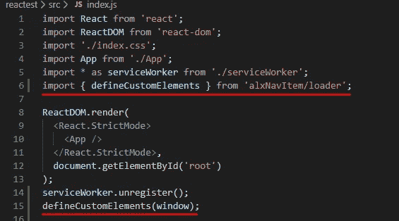**

**将我们的 web 组件导入 React**

*   **搞定了。我们现在可以在 React 中使用导航组件，就像使用常规 HTML 元素一样:**

**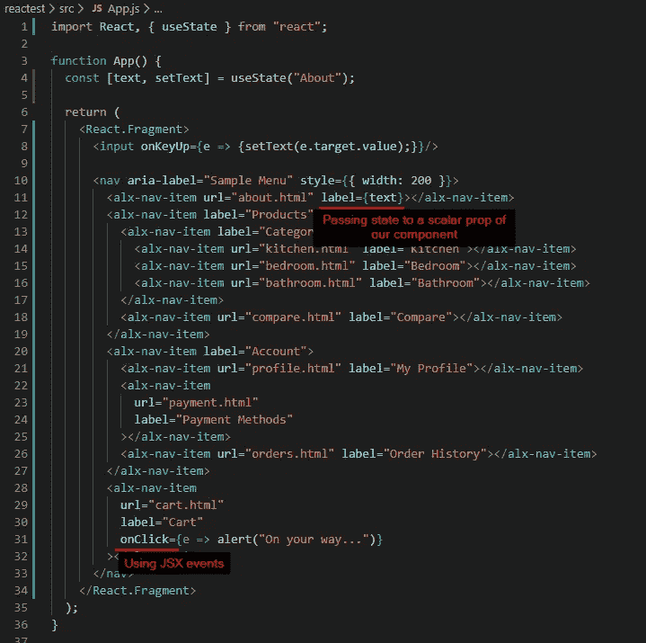**

**在 React 中使用我们的 web 组件**