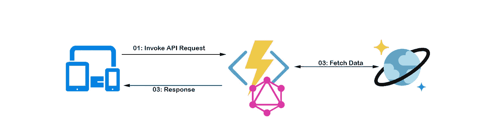
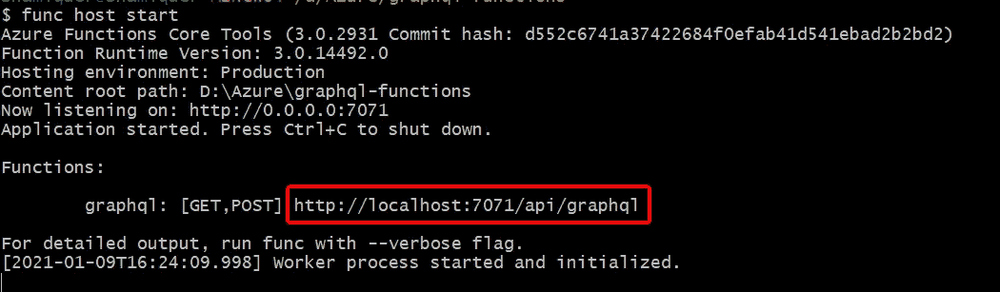
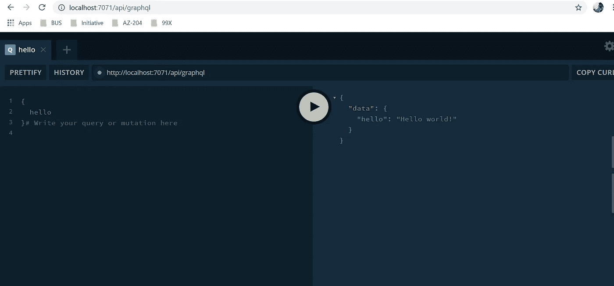
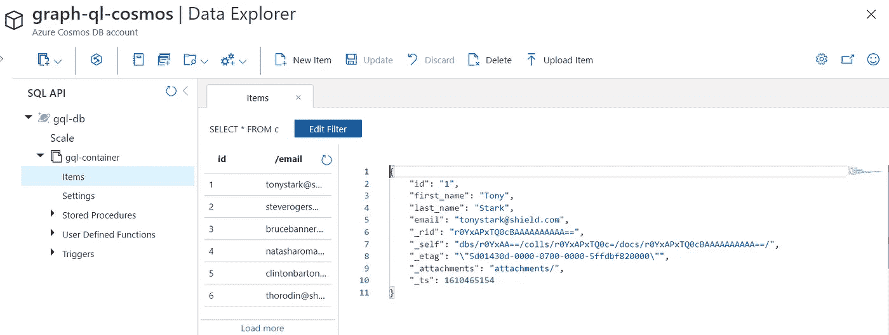
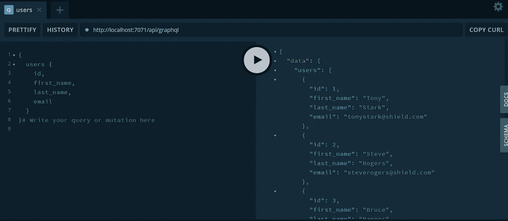

# 用 GraphQL 和 Azure 构建无服务器 API 第一部分

> 原文：<https://itnext.io/build-serverless-api-with-graphql-and-azure-part-i-e9e7f4be0200?source=collection_archive---------2----------------------->

无服务器架构是软件行业的当前趋势，它允许您在经济高效的短期服务中运行应用程序。使用 GraphQL，您可以减少对单个端点的服务调用数量。使用这两种技术，我们可以构建经济高效的 API。

在本系列文章中，我将指导您如何将 GraphQL API 和 Azure 函数集成在一起(第一部分)。此外，我们如何使用 oAuth2 身份验证来保护这个 API(第二部分)。

下面是我们将在本文中涉及的内容的概要图，



我假设你已经与 Azure 技术和 GraphQL 合作过。因此，我不打算详细解释每一部分的每一个术语。

# 先决条件

*   Azure 技术、Azure CLI 命令和 [GraphQL](https://graphql.org/) 的基础知识
*   Azure 帐户(您可以使用 Azure 免费订阅)
*   安装 [Azure Functions 核心工具 CLI 版本 2.x](https://docs.microsoft.com/en-us/azure/azure-functions/functions-run-local?tabs=macos%2Ccsharp%2Cbash#v2)
*   安装 [Azure CLI](https://docs.microsoft.com/en-us/cli/azure/install-azure-cli)
*   [邮递员](https://www.postman.com/)工具

# 在本地创建 Azure 函数

我们可以选择用 C#、NodeJS、python 等不同语言编写 Azure 函数。我将在本文中选择 NodeJS。

首先，让我们创建我们的 Azure 函数项目。打开控制台，运行以下命令:

```
func init graphql-functions --worker-runtime node
cd graphql-functions
```

然后，运行以下命令来生成 HTTP 触发器模板。

```
func new --template "Http Trigger" --name graphql
```

这将在“graphql”文件夹中生成两个预构建的模板，分别为`function.json`和`index.js`。我们将在这个`index.js`中编写我们的业务逻辑。

现在用 VS 代码或者你喜欢的 IDE 打开这个函数项目，编辑`function.json`。这里，我们需要将“HTTP out”绑定替换为“$return”，如下所示:

```
{
  "bindings": [
    {
      "authLevel": "function",
      "type": "httpTrigger",
      "direction": "in",
      "name": "req",
      "methods": [
        "get",
        "post"
      ]
    },
    {
      "type": "http",
      "direction": "out",
      **"name": "$return"**
    }
  ]
}
```

## 设置 GraphQL 端点

让我们使用 npm 为 Azure 函数安装 Apollo 服务器集成:

```
npm install --save apollo-server-azure-functions
```

现在打开“graphql/index.js”文件。我们将在这个文件中编写我们的逻辑。首先，让我们编写一个简单的带有“Hello World”响应的 GraphQL 模式。

用以下代码替换现有代码:

好了，我们的初始 GraphQL 设置完成了。让我们运行这个函数:

```
func host start
```

您应该在控制台中看到类似的输出。



复制图表并粘贴到浏览器中。您应该看到下面的 GraphQL 操场如下:



好了，现在我们已经把 Azure 函数和 GraphQL 集成在一起了。现在我们可以开始编写实际的业务逻辑了。对于这篇文章，我将使用[宇宙数据库](https://azure.microsoft.com/en-us/services/cosmos-db/)。

## 在 Azure 中设置 Cosmos DB

我已经在我的 Azure 订阅中设置了一个简单的 Cosmos DB。

> **注意:**更好的在一个资源组中维护你所有的资源(cosmos DB，function app)。这样就更容易在最后清理了。



以下是文档的结构。您可以在您的 Cosmos 容器中添加一些如下结构的虚拟记录。

```
{
    "id": "1",
    "first_name": "Tony",
    "last_name": "Stark",
    "email": "[tonystark@shield.com](mailto:tonystark@shield.com)"
}
```

设置好 Azure Cosmo 数据库后，复制连接字符串:

*   登录 Azure 门户并导航到您的 Cosmos DB
*   从左侧面板中选择“钥匙”
*   复制主连接字符串并将其粘贴到记事本中。

## 为宇宙编写代码

为我们的项目安装 Cosmo DB npm 包。在控制台中运行以下命令:

```
npm install --save @azure/cosmos
```

然后，打开`index.js`文件，导入 Cosmos 客户端。

```
const { CosmosClient } = require('@azure/cosmos');
```

然后定义以下变量并设置值。

```
const connectionString = "ADD_YOUR_CONNECTION_STRING";
const databaseName = "ADD_DATABASE_NAME";
const containerName = "ADD_CONTAINER_NAME";
```

> **注意:**由于这只是一个演示，所以在代码中添加连接字符串。推荐的方法是将连接字符串存储在配置文件中或存储在密钥库中。

现在，让我们创建到 Cosmo 数据库的连接。

```
const client = new CosmosClient(connectionString);
```

然后用以下模式替换现有的 GraphQL 模式:

```
const typeDefs = gql`
  type User {
    id: Int,
    first_name: String
    last_name: String,
    email: String
  },type Query {
    user(id: Int!): User,
    users: [User]
  }
`;
```

如您所见，我们用 id、名字、姓氏和电子邮件定义了用户模式，这与我们的 Cosmos 文档结构相似。此外，我们引入了两个查询。一个查询是通过 Id 获取用户，另一个方法是检索数据库中的所有用户。

然后，让我们用下面的方法替换我们的解析器方法:

```
const resolvers = {
  Query: {
    user: getUser,
    users: getAllUser
  }
};
```

我们已经为解析器中的每个查询分配了相关的函数。现在，我们可以编写 getUser 和 getAllUser 业务方法。

```
getUser = async (_, { id }) => {
  let query = "SELECT * FROM c WHERE c.id = [@userId](http://twitter.com/userId)";
  let params = [{ name: "[@userId](http://twitter.com/userId)", value: id.toString() }]; let { resources: items } = await client.database("gql-db").container("gql-container")
    .items.query({ query: query, parameters: params }).fetchAll();if (items.length > 0) {
    return items[0];
  }return null;
};getAllUser = async () => {
  let { resources: items } = await client.database("gql-db").container("gql-container")
    .items.query({ query: "SELECT * from c" }).fetchAll();
  return items;
};
```

完成上述步骤后，您的完整代码应该如下所示:

现在在本地再次运行这个函数&在操场上执行一些查询。



如果该功能工作正常，就可以发货了！！！

让我们在第二部分中进一步讨论如何将这个无服务器应用程序部署到云中并应用身份验证。

[](/build-serverless-api-with-graphql-and-azure-part-ii-3ae427763ccc) [## 用 GraphQL 和 Azure 构建无服务器 API 第二部分

### 使用 oAuth2 保护 API

itnext.io](/build-serverless-api-with-graphql-and-azure-part-ii-3ae427763ccc) 

您可以从这里获得本文的源代码:

[](https://github.com/shamique/GraphQL-AzureFunction) [## shamique/GraphQL-AzureFunction

### 在 GitHub 上创建一个帐户，为 shamique/GraphQL-AzureFunction 的开发做出贡献。

github.com](https://github.com/shamique/GraphQL-AzureFunction)