# 用 GraphQL 和 Azure 构建无服务器 API 第二部分

> 原文：<https://itnext.io/build-serverless-api-with-graphql-and-azure-part-ii-3ae427763ccc?source=collection_archive---------3----------------------->

在我的上一篇文章中，我讨论了如何在 Azure 中构建基于 GraphQL 的无服务器 API。如果你还没有读过，你可以从这里开始读:

[](https://shamique.medium.com/build-serverless-api-with-graphql-and-azure-part-i-e9e7f4be0200) [## 用 GraphQL 和 Azure 构建无服务器 API 第一部分

### 将 GraphQL 与 Azure 函数集成

shamique.medium.com](https://shamique.medium.com/build-serverless-api-with-graphql-and-azure-part-i-e9e7f4be0200) 

在本章中，我将讨论如何将我们构建的功能部署到 Azure cloud，并为 API 实现 OAuth2 安全性。

下面是我们将在本文中涉及的内容的概要图，

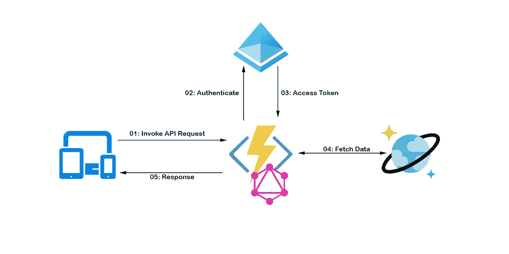

先创建我们的函数 App。

# 创建 Azure 功能应用程序

为了部署我们的功能，我将使用 Azure CLI 命令。首先，让我们登录 Azure 订阅。

打开您的控制台并运行

```
az login
```

这将提示您登录 Azure 订阅。提供您的用户名和密码。认证后，您可以关闭浏览器。

要部署我们的功能，我们需要事先创建以下资源:

*   Azure 资源组
*   Azure 存储帐户
*   Azure 功能 app

所以让我们一个接一个地创建这些资源。首先让我们在 bash 控制台中定义以下变量。

```
RESOURCE_GROUP="graphql-rg"
LOCATION="eastus"
STORAGE_ACCOUNT="graphqlstorage23"
FUNCTION_APP="graphql-function"
```

> 您可以随意更新这些值。请注意:存储帐户只能由字母和数字组成。

然后，让我们创建资源

```
**#Resource group** az group create --name $RESOURCE_GROUP --location $LOCATION**#Storage Account**az storage account create --name $STORAGE_ACCOUNT \
--location $LOCATION \
--resource-group $RESOURCE_GROUP \
--sku Standard_LRS**#Function APP**az functionapp create \
--resource-group $RESOURCE_GROUP \
--name $FUNCTION_APP \
--consumption-plan-location $LOCATION \
--runtime node \
--storage-account $STORAGE_ACCOUNT \
--functions-version 3
```

我们已经创建了部署我们的职能所需的资源。现在让我们部署代码。

> 第一部分的源代码在这里上传。如果需要，你可以克隆:[https://github.com/shamique/GraphQL-AzureFunction](https://github.com/shamique/GraphQL-AzureFunction)

# 部署功能

在我们将该功能部署到云之前，让我们禁用 GraphQL playground。因为我们在生产模式下不需要 GraphQL playground。

编辑 index.js 函数，在 Apollo 服务器初始化中添加`**playground: false**`。

```
...const server = new ApolloServer({ typeDefs, resolvers, **playground: false** });exports.graphqlHandler = server.createHandler();
```

好吧！让我们部署代码。导航到应用程序路径(如果尚未导航)。

```
func azure functionapp publish $FUNCTION_APP
```

成功部署后，您将获得该函数的 URL。收到，我们将在下一步中使用它。

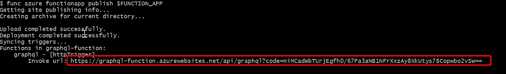

# 测试 API

因为我们禁用了 GraphQL playground，所以我们不能在浏览器中测试 API。所以让我们用 Postman 来做我们的测试。

打开 post man 并粘贴 API URL。然后，选择 Body 部分下的 GraphQL，并粘贴您的查询参数。

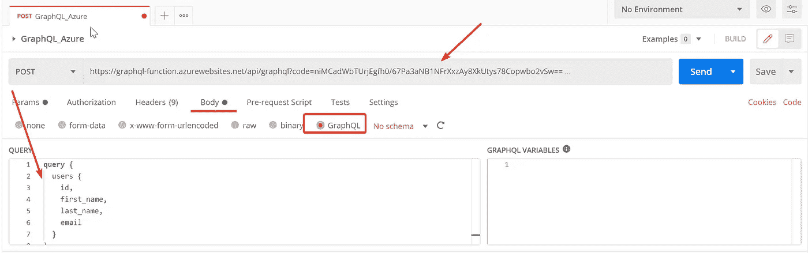

将请求作为 POST 请求发送，并检查结果。如果您已经正确地设置了一切，您应该会看到结果。

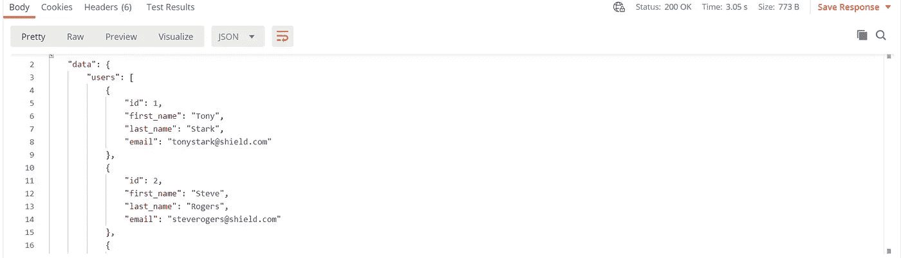

万岁！！！我们做到了。

目前我们部署的 API 是公开的。也就是说，任何有链接的人都可以访问数据。所以让我们用 oAuth2 来保护这个 API。

# 使用身份验证令牌保护 API

为了保护我们的 API，我将对 Azure AD 使用 oAuth2 隐式授权流。要了解更多关于 oAuth2 隐式授权流的信息，您可以在此处阅读:

[](https://docs.microsoft.com/en-us/azure/active-directory/develop/v2-oauth2-auth-code-flow) [## 微软身份平台和 OAuth 2.0 授权代码流-微软身份平台

### OAuth 2.0 授权码授权可用于安装在设备上的应用程序，以获得对受保护的…

docs.microsoft.com](https://docs.microsoft.com/en-us/azure/active-directory/develop/v2-oauth2-auth-code-flow) 

好了，现在让我们用 Azure AD 为我们的应用程序启用身份验证。

*   登录 Azure 门户→选中你的 Azure 功能。然后导航至**认证/授权**并启用“应用服务认证”。然后从下拉列表中选择“使用 Azure Active Directory 登录”选项。

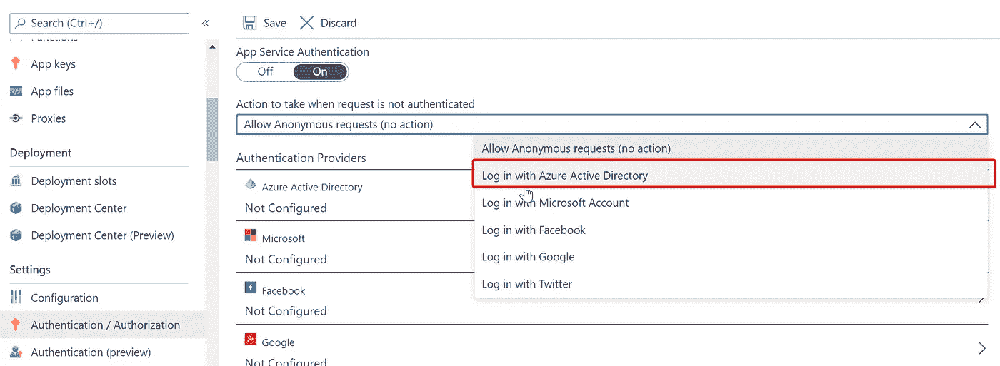

*   点击“Azure Active Directory”选项并选择“快速”模式。保留其余设置，单击“确定”，然后单击“保存”。

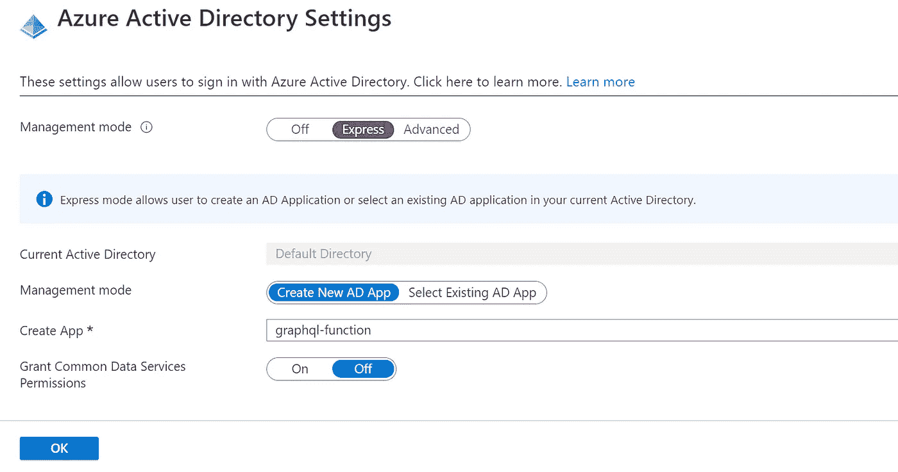

我们已经为我们的功能应用启用了广告认证。现在，让我们配置我们的广告应用程序来获取访问令牌。

*   在 azure portal 中，导航到“Azure Active Directory”，然后从菜单中单击“应用注册”。你应该看到新创建的应用程序下的应用程序列表。

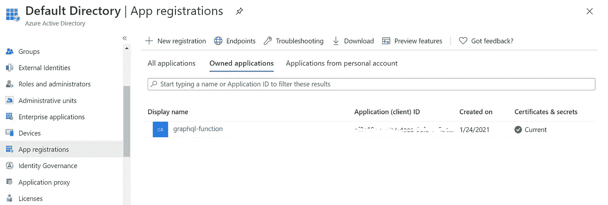

*   打开你的应用程序，导航至“认证”。在重定向 URI 下，添加一个新的重定向 URL“localhost”。

> 通过身份验证后，您将获得访问重定向 URL 中提供的 URL 的访问令牌。

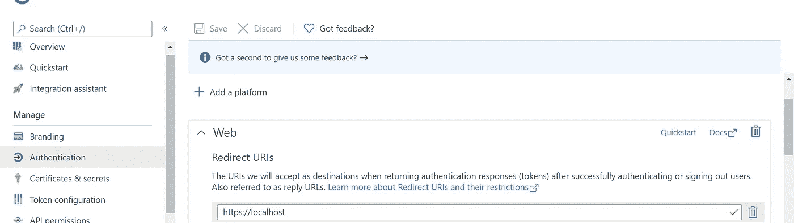

*   然后，选择“隐式授权和混合流”部分下的“ID 令牌”

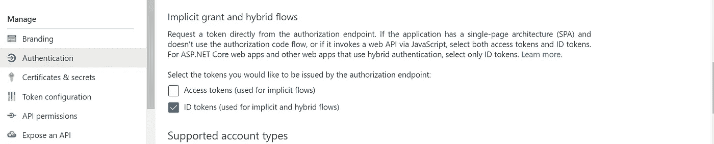

好了，我们已经用 AD 配置了函数应用程序，并启用了隐式授权流。在我们进入测试之前，我们需要向我们的应用程序添加一个**密钥**。我们需要这个密钥从客户端应用程序获取访问令牌。

*   导航至应用程序中的“客户和秘密”部分。单击“新客户端密码”。添加一个首选名称，然后单击添加。复制客户端机密值，这是我们下一步需要的。

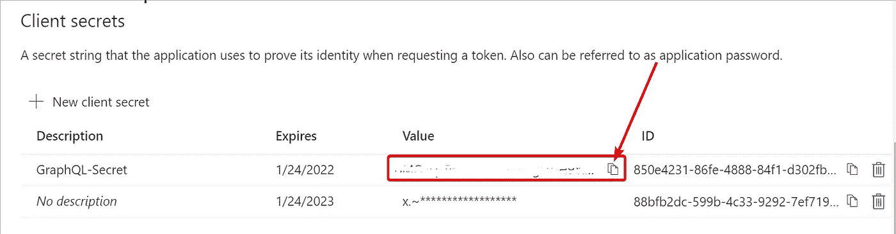

好吧。因此，我们已经为 API 配置了隐式授权流。现在让我们测试我们的 API。

# 使用访问令牌测试 API

因为我们为 API 启用了身份验证，所以没有访问令牌就不能调用 API。如果在 postman 中重新测试 API，应该会得到 401 未授权异常。

现在，要调用我们的 API，我们应该按顺序遵循以下步骤:

*   获取授权码
*   用访问令牌交换授权码
*   使用访问令牌调用 API

## 获取授权码

要获得授权码，我们需要使用以下 URL，

```
https://login.microsoftonline.com/**{Tenant ID}**/oauth2/authorize?client_id=**{Client_ID}**&response_type=code&response_mode=query&resource_id=**{Client_ID}**&redirect_uri=https://localhost
```

租户 ID 和客户 ID 可以从广告应用程序概览页面的概览页面中获取

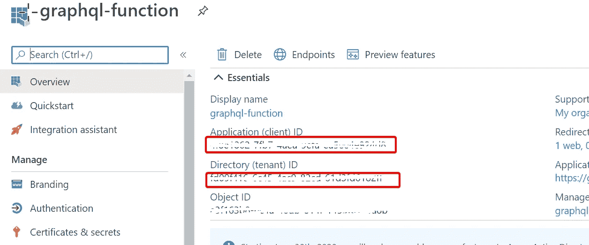

用正确的值替换突出显示的查询参数，并在浏览器中浏览。您将被要求登录您的 Azure 订阅。提供凭据，成功登录后，您将被重定向到带有授权代码的本地主机回调 url。

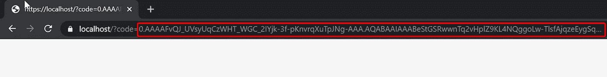

> **注意:**在回调 URL 中，您将有两个查询参数。代码&会话状态。确保只复制代码值

复制授权码。我们将在下一步中使用此代码来获取访问令牌。

## 用访问令牌交换授权码

要获得 oAuth2 访问令牌，我们需要向 oAuth2 url 下面发出 post 请求，并在请求体中传递一些属性。

```
https://login.microsoftonline.com/common/oauth2/token
```

打开 PostMan 工具，按如下方式构造查询请求:

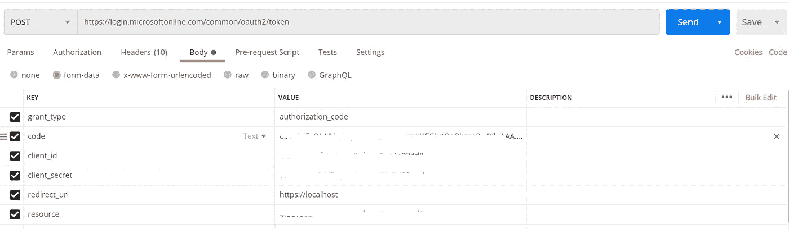

*   代码—提供我们在上一步中复制的授权代码
*   client_id & resource —提供您的应用程序的客户端 id
*   client_secret —提供您在上一步中复制的客户端机密

请求成功后，您应该得到类似的响应，如下所示，带有访问令牌和刷新令牌:

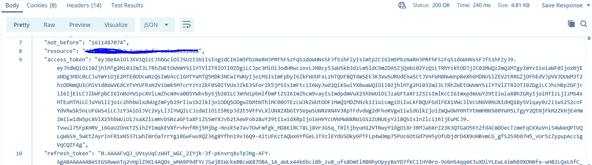

复制 access_token。在下一步中，我们可以使用这个访问令牌来调用我们的 API。

## 使用访问令牌调用 API

现在回到我们的 API 服务器调用，在 postman 中添加授权头作为**载体< your_access_token >** 。

然后，调用 API，您现在应该得到没有任何问题的响应。

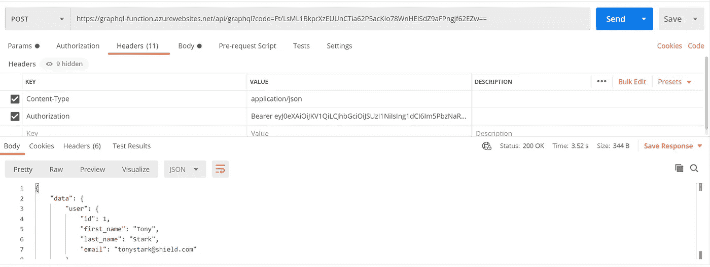

厉害！！！现在，我们的 API 是可扩展的、高效的，也是安全的。

# 包裹

这标志着这个系列的结束。完成练习后，您可以删除 Azure 订阅中的资源以避免计费。如果所有资源都在一个资源组下，您可以直接删除资源组本身。否则，您将不得不逐个删除每个资源。

```
az group delete --name <Resource Group Name> --yes
```

# 参考链接

[](https://docs.microsoft.com/en-us/azure/active-directory/develop/v2-oauth2-auth-code-flow) [## 微软身份平台和 OAuth 2.0 授权代码流-微软身份平台

### OAuth 2.0 授权码授权可用于安装在设备上的应用程序，以获得对受保护的…

docs.microsoft.com](https://docs.microsoft.com/en-us/azure/active-directory/develop/v2-oauth2-auth-code-flow) [](https://docs.microsoft.com/en-us/cli/azure/) [## Azure CLI 概述

### Azure 命令行界面(Azure CLI)是一组用于创建和管理 Azure 资源的命令。蔚蓝的天空…

docs.microsoft.com](https://docs.microsoft.com/en-us/cli/azure/) [](https://www.apollographql.com/docs/apollo-server/deployment/azure-functions/) [## 使用 Azure 功能部署

### 这是 Apollo 社区 GraphQL 服务器的 Azure 功能集成。阅读文档下面的所有示例是…

www.apollographql.com](https://www.apollographql.com/docs/apollo-server/deployment/azure-functions/)