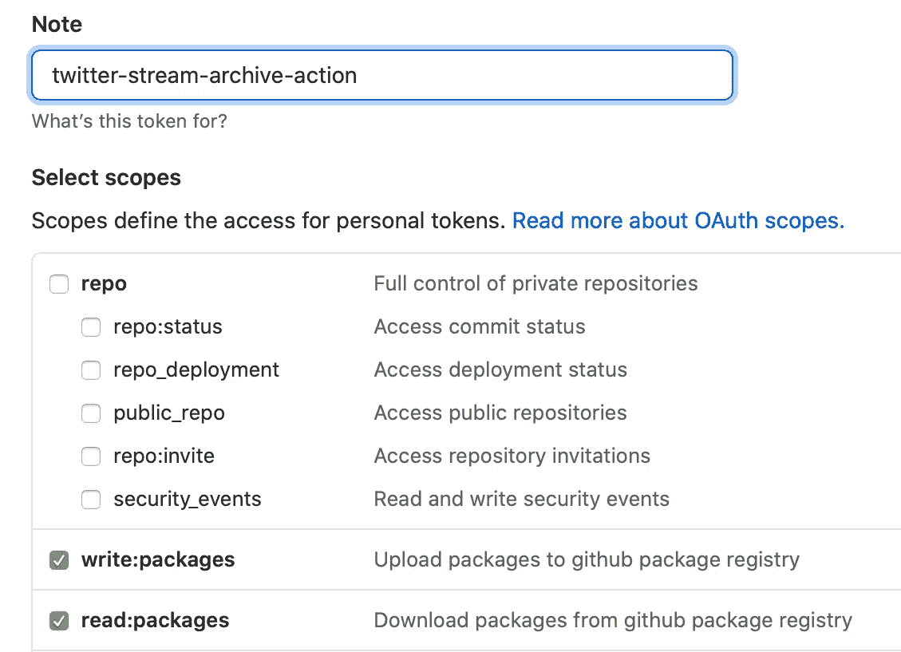
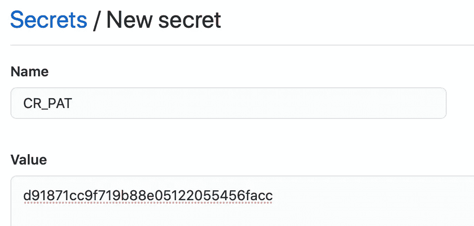
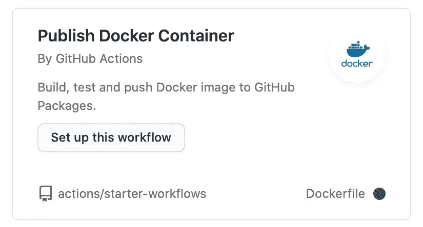
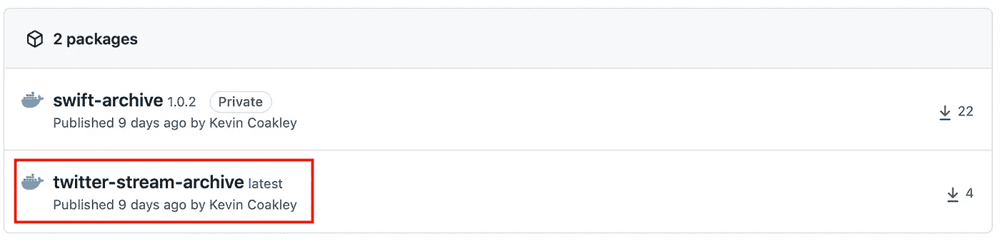
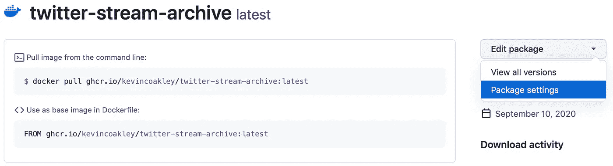
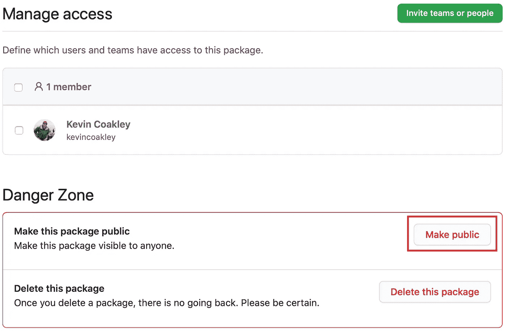
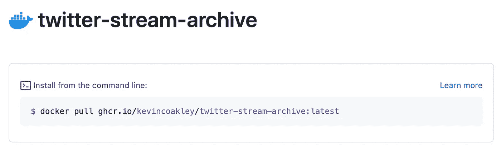

# 构建和发布:GitHub 容器注册和 Kubernetes

> 原文：<https://itnext.io/build-ship-github-container-registry-kubernetes-aa06029b3f21?source=collection_archive---------1----------------------->


本月初 [GitHub](https://www.github.com/) 宣布了新的 [GitHub 容器注册](https://github.blog/2020-09-01-introducing-github-container-registry/)服务。这个服务类似于 [Docker Hub](https://hub.docker.com/) 和 GitHub 自己的[包注册表](https://github.blog/2019-05-10-introducing-github-package-registry/)。在这篇文章中，我将解释为什么你应该使用 GitHub 的容器注册表，描述如何创建一个 [GitHub 动作](https://github.com/features/actions)来自动构建和推送 [Docker](https://www.docker.com/) 图像到 GitHub 的容器注册表，以及如何在你的 [Kubernetes](https://kubernetes.io) 集群中使用这些 Docker 图像。

# 目录

— [为什么要用 GitHub 的容器注册表而不是 Docker Hub？](#eb5a)
——[GitHub 包注册表 VS GitHub 容器注册表:用哪个？](#34a6)
— [使用 GitHub 动作创建 Docker 图像并发布到 GCR](#0075)
— [如何公开 GCR Docker 图像](#7678)
— [如何使用 Kubernetes](#2237)
拉取公开的 GCR Docker 图像— [如何使用 Kubernetes 拉取私人的 GCR Docker 图像](#b6cb)


# **为什么要用 GitHub 的容器注册表而不是 Docker Hub？**

首先，如果你在 Docker 项目中使用 GitHub，那么使用 GitHub 的容器注册表通过只使用一个服务简化了你的工作流程。其次，使用 GitHub 动作构建 Docker 映像是可定制的，这让您在构建 Docker 映像时更加灵活，更重要的是，在出现错误时有更多的方法来调试问题。接下来，GitHub Actions 将在几分钟内构建并发布 Docker 图像，我经常要等 20 多分钟才能在 Docker Hub 上构建并提供我的新 Docker 图像。最后，GitHub 目前没有计划删除旧的 Docker 图片，不像 Docker Hub 最近宣布的那样。

# **GitHub 包注册表 VS GitHub 容器注册表:用哪个？**

2019 年 GitHub 推出了 [GitHub 包注册表](https://github.blog/2019-05-10-introducing-github-package-registry/)，然后在 2020 年他们推出了 [GitHub 容器注册表](https://github.blog/2020-09-01-introducing-github-container-registry/)。乍一看，这两种服务看起来完全相同，但至少有一个重要的区别。

GitHub 列出了容器注册表的主要区别:

> -将容器图像存储在您的组织和用户帐户中，而不是存储库中。
> -独立于存储库权限和可见性设置细粒度的权限和可见性。
> -匿名访问公共容器图像。

不过在我看来，GitHub 包注册表和 GitHub 容器注册表最重要的区别就是上传到 [GitHub 包注册表的图片不能删除](https://docs.github.com/en/packages/publishing-and-managing-packages/deleting-a-package#about-public-package-deletion)！嗯，这并不是 100%正确，如果你将 GitHub 库设为私有，那么你可以删除这个包，但是将 GitHub 库设为私有会产生意想不到的后果。

# 使用 GitHub 动作自动创建 Docker 图像，并将它们发布到 GitHub 的容器注册表中

在这个例子中，我将使用我所做的工作将我的[Twitter-stream-archive](https://github.com/kevincoakley/twitter-stream-archive)Docker 映像从 Docker Hub 迁移到 GitHub 的容器注册表中，用于我的 Kubernetes 集群。twitter-stream-archive 做什么并不重要，重要的是 twitter-stream-archive 在 GitHub 存储库根目录中有一个`DockerFile`并将通过运行`docker build .`创建一个有效的 Docker 映像。如果 GitHub 存储库中没有工作的`DockerFile`，下面的指令将不会创建一个工作的 Docker 映像。

如果你想自己查看文件和 GitHub 操作，twitter-stream-archive GitHub 存储库在:[https://github.com/kevincoakley/twitter-stream-archive](https://github.com/kevincoakley/twitter-stream-archive)和 Docker 图片在[https://github.com/kevincoakley?tab=packages](https://github.com/kevincoakley?tab=packages)

**1。创建 GitHub 个人访问令牌**

GitHub 容器注册表使用 GitHub 个人访问令牌代替您的 GitHub 密码进行身份验证。进入你的账户设置，创建一个拥有`read:packages` & `write:packages`权限的 [GitHub 个人访问令牌](https://docs.github.com/en/github/authenticating-to-github/creating-a-personal-access-token)。复制粘贴或记下您的 GitHub 个人访问令牌，用于步骤#2。另外，我建议为每个存储库创建一个新的 GitHub 个人访问令牌。



**2。创建 CR_PAT 库密码**

接下来，转到包含您的 Docker 项目的 GitHub 存储库的存储库设置，并[创建一个名为`CR_PAT`的存储库秘密](https://docs.github.com/en/actions/configuring-and-managing-workflows/creating-and-storing-encrypted-secrets#creating-encrypted-secrets-for-a-repository)。



**3。创建 GitHub 动作工作流 yaml 文件**

现在创建 GitHub 动作工作流 yaml 文件。GitHub 在[动作/启动程序-工作流存储库](https://github.com/actions/starter-workflows)中创建了一个名为**发布 Docker 容器**的 GitHub 动作工作流。该工作流也可以在存储库的 Actions 选项卡上找到，单击 **New Workflow** 按钮并在**持续集成工作流**部分下搜索 **Publish Docker 容器**。点击**设置此工作流程**按钮将在 GitHub 网站上打开一个文本编辑器。



如果您不喜欢使用 GitHub 的网站来创建动作，您可以在您的计算机上创建 GitHub 动作工作流 yaml 文件，并将其提交到您的 GitHub 存储库。[在发表这篇文章的时候，最新的稳定版本可以在这里找到](https://github.com/actions/starter-workflows/blob/60765e84900ccf192eadf19a9459e67566ffaabe/ci/docker-publish.yml)或者[你可以参考我的 twitter-stream-archive GitHub 资源库中的 docker-publish . YAML](https://github.com/kevincoakley/twitter-stream-archive/blob/master/.github/workflows/docker-publish.yml)。

**4。更新 IMAGE_NAME**

一旦`/.github/workflows/docker-publish.yaml`在一个编辑器中打开，无论是在 GitHub 的网站上还是在你的电脑上，找到`IMAGE_NAME`变量并将其更改为你想要调用 Docker 图像的名称。`IMAGE_NAME`可以是任何东西，不必与库名相同，但是为了简单起见，我总是将`IMAGE_NAME`设置为 GitHub 库名。

```
env:  
  # TODO: Change variable to your image's name.  
  IMAGE_NAME: **<docker-image-name>**
```

**5。提交并推送 GitHub 动作工作流 yaml 文件**

最后，在更新了`IMAGE_NAME`之后，继续将`/.github/workflows/docker-publish.yaml`提交到您的存储库中。如果您提交了对`master`分支的更改，那么 Publish Docker Container GitHub 动作应该会为您的 GitHub 存储库创建一个 Docker 映像。您可以通过 GitHub 个人资料上的 Packages 选项卡来验证 Docker 映像是否已创建:**https://github.com/<GitHub-username>？tab =包装**。如果有问题，那么您可以通过访问**https://github.com/<github-username>/<GitHub-repository>/actions**并查看 GitHub 操作输出来排除故障。

如果您将更改提交到除了`master`之外的分支，那么您会注意到 Docker 映像没有构建。根据发布 Docker 容器 GitHub 操作中的`on`定义，Docker 映像仅在 git 推送到`master`分支时创建(Docker 映像标记为最新),或者在通过 git tag 命令从`v`开始创建新的 git 标记时创建，或者在 GitHub 网站上创建新版本时创建。

```
on:
  push:
    # Publish `master` as Docker `latest` image.
    branches:
      - master

    # Publish `v1.2.3` tags as releases.
    tags:
      - v*

  # Run tests for any PRs.
  pull_request:
```

现在你有了一个由 GitHub 的容器注册表托管的工作 Docker 映像，但是我们还没有准备好将这个 Docker 映像部署到 Kubernetes。默认情况下，新创建的 GitHub 容器注册表 Docker 映像是私有的。下面我将向您展示如何公开 GitHub 容器注册 Docker 映像，这样您就可以将 GitHub 容器注册 Docker 映像拉至您的 Kubernetes 集群而无需认证，我还将向您展示如何认证您的 Kubernetes 集群以拉下私有 GitHub 容器注册 Docker 映像。

# 如何公开 GitHub 容器注册表 Docker 图像

如果你不在乎保持你的 GitHub 容器注册 Docker 图像的私密性，那么我推荐你公开你的 GitHub 容器注册 Docker 图像。一旦 GitHub 容器注册表出测试版，我相信 GitHub 会向用户收取存储私有图像的费用。

为了公开 GitHub 容器注册表 Docker 映像，请按照以下步骤操作:

1.转到您的 **GitHub 档案上的**包**选项卡。**包选项卡的直接 URL 是**https://github.com/<github-username>？tab =包装**。


2.选择 Docker 图像



3.转到**编辑包下的**包设置**。**



4.点击**张扬**按钮。



现在你的 GitHub 容器注册 Docker 镜像是公开的。任何人都可以通过 GitHub 个人资料上的 Packages 选项卡找到它，并将其下拉到他们的 Docker 系统。

# 如何用 Kubernetes 提取公共 GitHub 容器注册 Docker 图像


如果 GitHub 容器注册表中的 Docker 映像是公开的，那么您所要做的就是更新 Kubernetes 部署中的`image`键定义。如果您使用 Docker Hub，请更改图像值:

```
containers:
  - name: twitter-stream-archive
    image: **<docker-hub-username>/<docker-image-name>:<tag>**
```

使用 ghcr.io Docker 注册服务器:

```
containers:
  - name: twitter-stream-archive
    image: **ghcr.io/<github-username>/<docker-image-name>:<tag>**
```

如果有任何问题，图像值应该是什么去**https://github.com/<github-username>？tab=packages** 并选择封装。



部署定义更新后，使用`kubectl`应用更新的 YAML 文件，Kubernetes 将终止运行 Docker Hub Docker 映像的 Pod，并创建一个运行 GitHub 容器注册 Docker 映像的新 Pod。

# 如何用 Kubernetes 拉私有 GitHub 容器注册 Docker 图像

如果 GitHub 容器注册 docker 映像是私有的，那么您必须在 Kubernetes 中创建 docker-registry secret，以便向 GitHub 容器注册服务进行认证，从而下载 Docker 映像。*注意:docker-registry secret 必须在每个 Kubernetes 名称空间中创建，它将提取 docker 图像*。docker-registry secret 将包含您的 GitHub 用户名和一个 GitHub 个人访问令牌。我建议为每个 Kubernetes 集群创建一个新的 [GitHub 个人访问令牌](https://docs.github.com/en/github/authenticating-to-github/creating-a-personal-access-token),不要重复使用为 GitHub 动作创建的个人访问令牌来创建 Docker 映像。

一旦你有了一个新的 GitHub 个人访问令牌，你就可以运行下面的`kubectl`命令来创建 docker-registry secret:

```
kubectl -n **<k8s-namespace>** create secret docker-registry **<k8s-docker-registry-secret-name>** --docker-server=ghcr.io --docker-username=**<github-username>** --docker-password=**<github-personal-access-token>**  --docker-email=**<email-address>**
```

创建 docker-registry secret 之后，您可以更新和应用您的 Kubernetes 部署定义，并添加`imagePullSecrets`键。下面是我的 twitter 流存档项目中的一个例子:

```
---
apiVersion: apps/v1
kind: Deployment
metadata:
  name: twitter-stream-archive-deployment
  labels:
    app: twitter-stream-archive
  namespace: twitter-stream-archive
spec:
  replicas: 1
  selector:
    matchLabels:
      app: twitter-stream-archive
  template:
    metadata:
      labels:
        app: twitter-stream-archive
    spec:
containers:
  - name: twitter-stream-archive
    image: ghcr.io/<github-username>/<docker-image-name>:<tag>
**imagePullSecrets:
  - name: <k8s-docker-registry-secret-name>**
```

注意`imagePullSecrets`键与`containers`键在同一层，不是`containers`键的子键。

就是这样！GitHub 通过使用 GitHub 操作创建了一个美妙的 CI/CD 体验，使得将所有 Docker 图像迁移到 GitHub 容器注册表变得很容易。通过一些实践，您应该能够在几分钟内将 Docker 项目从 Docker Hub 迁移到 GitHub 容器注册表。