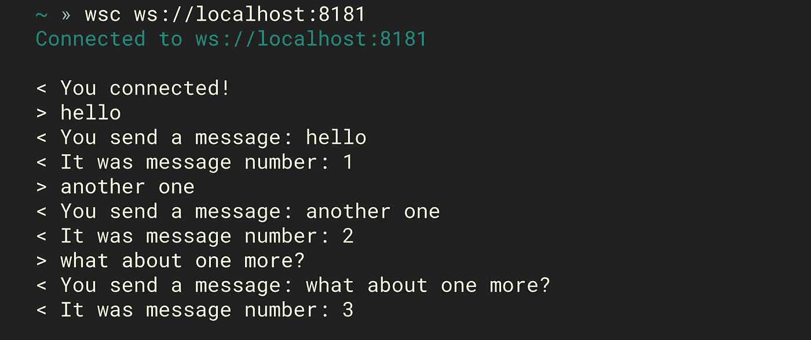
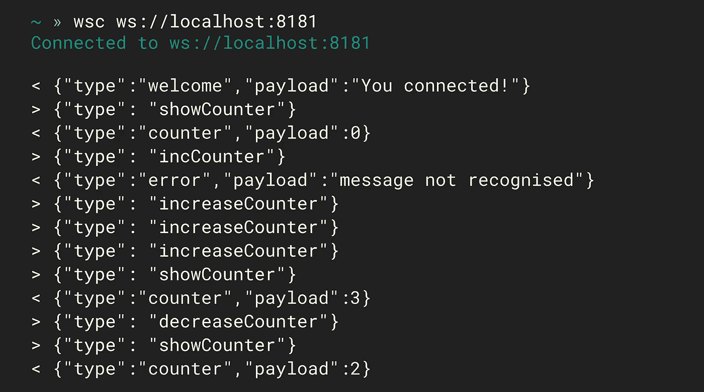
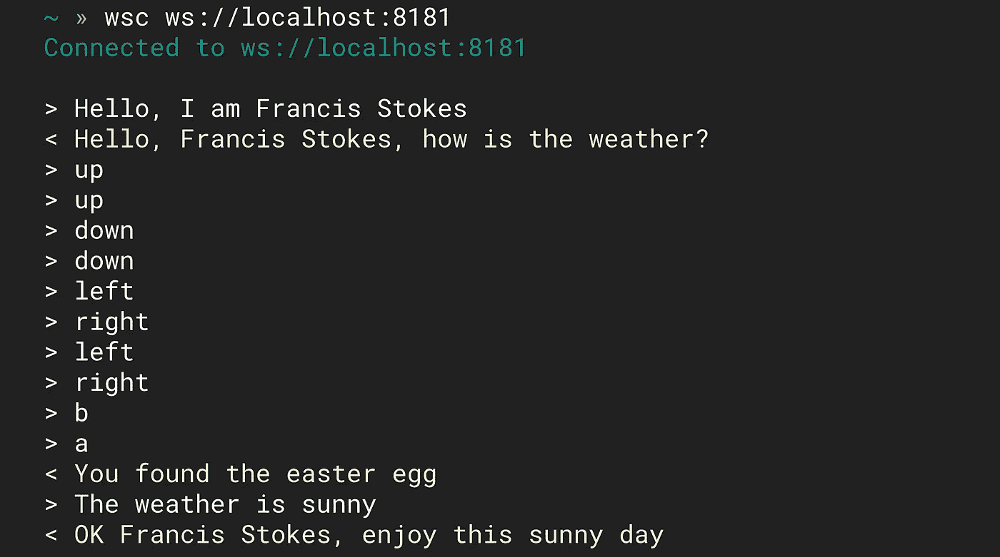

# 🔩用 Hexnut 在节点中构建结构化 Web 套接字后端

> 原文：<https://itnext.io/build-structured-web-socket-backends-in-node-with-hexnut-1d505c9c30b0?source=collection_archive---------2----------------------->


http://github.com/francisrstokes/hexnut

想象一下:你一直在用 Express 或 Koa 构建节点后端，你已经找到了你在代码组织、结构和抽象方面的最佳状态。添加路线总是干净的，你可以以极快的速度完成。然后，突然之间，您有了一个涉及一些实时功能的新需求。你认为没问题， *Express* 和 *Koa* 都有 web socket 扩展。所以你设置了它，这就是噩梦开始的地方。

*   您漂亮的代码结构现在已经支离破碎，因为套接字是事件驱动的，是持久的，不像您现有的路由
*   您已经建立的中间件模式已经不复存在，现在您要处理、验证和响应通过套接字传入的原始数据
*   整个事情就像是你曾经优雅的应用程序侧面的一个肿瘤

如果这些你听起来很熟悉，那么请放心:你不是唯一的一个。事实是实时应用程序很难做好，尤其是对于习惯于构建无状态 REST APIs 的开发人员来说。

> 真正的问题是它是错误的抽象层次。

我这么说是什么意思？本质上，套接字是你在 web 上可以想到的最低层次的持久通信机制。您实际上在做两件事:将数据推入套接字，或者将数据取出。相比之下，我们习惯于使用最基本的框架:路由、请求/响应(或上下文)对象、内置异步流等。这是一个更高的抽象概念，因为您可以忽略处理 HTTP 请求的大部分细节。

我们能把网络套接字提升到同样的水平吗？[这正是我一直在用**六角螺母**](https://github.com/francisrstokes/hexnut) 做的事情。

## 什么是 Hexnut？

Hexnut 是一个基于中间件的超轻量框架。它可以与像 *Express* 和 *Koa* 这样的框架协同工作，甚至共享相同的底层服务器对象！它只有两个重要的概念:

1.  当客户端连接到服务器时，会创建一个特殊的*上下文*对象，该对象在连接的整个生命周期中都存在。 ***ctx*** 对象(正如其通常的名称)用于与客户端通信，并在消息来回传递时建立状态。
2.  连接、消息和关闭事件在中间件链中处理。当这些事件进来时， ***ctx*** 上的某些属性被设置来指示它是哪种事件，并且相同的 ***ctx*** 对象被传递给中间件功能。中间件可以用来设置属性和向客户端发送消息，它还可以选择是否应该触发链中的下一个中间件。

对于那些只想看一些代码的人来说，让我们看看一个基本服务器在 **Hexnut** 中会是什么样子。首先，让我们从 npm 安装一些依赖项:

然后是服务器代码:



使用 wsc，一个命令行 web 套接字工具，我们可以看到消息是如何交换的

尽管这是最基本的，但它应该已经比您通常会发现的事件侦听器和全局状态的混乱有所改进。但是要真正开始看到好处，我们应该添加更多的中间件。

## 更深入的例子

下一个片段稍微长一点，但是不要担心，我们会分解它。

在我们进入代码之前，我只想指出你可能已经在想的问题:为什么有一个 ***六角螺母*** 包和一个 ***六角螺母手柄*** 包？

嗯，***hex nut-handle***只是一个非常简单的助手包，你可以很容易地自己编写([不，认真地，检查一下代码——它有 30 行](https://github.com/francisrstokes/hexnut-handle/blob/master/index.js))。Hexnut 被设计成一个超级简单的内核，带有可插拔的中间件，允许您定制应用程序以满足您的特定需求。这正是***hex nut-handle***的作用——一个可重用的中间件助手。

回到上面的代码！因此，如果你以前使用过 web 框架，那么对前两个中间件应该很熟悉。我们基本上添加了一些功能来轻松地将 *json* 消息发送到客户端(第 7–12 行)，还添加了一些功能来自动尝试解析来自客户端的 *json* 消息(第 15–25 行)。

每个中间件的签名总是相同的。

注意中间件*可以是*一个异步函数，所以如果需要的话，你可以很容易地*等待*！当您使用 ***六角螺母手柄*** 中的函数时，它们也只是转换成这个相同的签名。

从第 35 行开始，我们首先在连接时设置一个计数器，然后处理增加或减少计数器的消息。***六角螺母*** *s *。matchMessage()* 应该感觉有点像在 Express/Koa 中设置路由，因为基本上就是这么回事；我们正在定义一个消息何时应该被一个特定的中间件处理，如果它不匹配， **Hexnut** 只是用下一个中间件再次尝试。*

*最后，从第 61 行开始，有一个中间件捕捉任何尚未处理的消息，在我们的小应用程序中，这被认为是一个“错误”，我们通知用户。*

**

*虽然很简单，但我们在这里得到了四个主要的好处。*

1.  *结构*
2.  *关注点分离*
3.  *可预测的信息流*
4.  *复用性*

## *结构*

*虽然现在所有的东西都在一个文件中，但是我们可以很容易地将控制器分成它们自己的文件和文件夹。这种结构通过允许片段被分解成块来帮助我们理解代码。*

## *关注点分离*

*就像在 http web 框架中有不同的路由一样，对于套接字，我们可以通过匹配消息来创建类似的想法。这个简单的想法可以进一步建立，以创建更复杂的系统，但即使就其本身而言，它也将不同的功能分离到它们自己的空间中。这当然很重要，因为没有比在同一个地方混合一堆不相关的逻辑更好的方法来创建难以调试的代码了！*

## *可预测的信息流*

*基本上是结构和关注点分离的结合。我们可以预测数据将如何通过我们的应用程序，跟踪消息将在哪里处理，以及从那里发出什么呼叫。*

## *复用性*

*中间件体系结构自然会导致代码重用，尤其是上面那些实用的中间件，它们向 ***ctx*** 对象或预处理消息的中间件添加了通用方法。*

*与类似于 *socket.io 的方法形成对比，*socket 是 Web Sockets 最原始、最流行的解决方案之一。 *Socket.io* 强调创建 **rooms** 和 **namespaces** ，用户在这里连接并能够向服务器和彼此发送消息(表面上)。交流是事件驱动的，这意味着除了房间的概念之外，开发者必须添加他们自己的结构。当您试图解决的真正问题是您的应用程序逻辑时，这使得坚持上述原则变得非常困难！*

*这些都不是说 *socket.io* 不好。 *socket.io* 的另一大好处是它可以逐步增强你的 socket，所以如果你的用户的浏览器不能使用真正的 Web Sockets，他们可以在后台进行长时间轮询。这是一个不小的壮举，它的工作方式令人印象深刻！但是网络已经向前发展了，这种多填充解决方案现在对许多用户来说已经不适用了。*

*那么，我们怎样才能走得更远呢？web 套接字有一个完全独特的地方，在普通的 http 服务器中很难做到，那就是创建特定的消息交换协议，它必须以正确的顺序发生，具有正确的内容，并且可能在它们之间建立状态。为此，我们可以使用专门构建的**六角螺母**库，名为 ***六角螺母序列*** 。*

# *Hexnut 序列:创建客户机/服务器对话的简单方法*

*让我们举一个虚构的例子，假设我们已经定义了一个可以在客户机和服务器之间进行的交换。*

*   *客户端发送“你好，我是 *<姓名>**
*   *服务器发回“你好 *<姓名>* ，天气如何？”*
*   *客户端发送“天气为 *<天气类型>* ”*
*   *服务器回应“好的 *<名字>* ，享受这 *<天气类型>* 天”*

*这非常简单，只交换了 4 条消息，没有复杂的循环或逻辑。但是也许你可以看到，如果我们想要以一种坚持我们上面描述的四个原则的方式来写这个，它可能会变得棘手。*

*当你必须来回发送和接收*相关但独立的*消息时，特别是当交换是有状态的时，你如何**分离关注点**和保留一个**可预测的信息流**？*

***六角螺母序列**有助于解决这个问题。让我们实现这个例子，看看它是如何保持代码整洁的:*

****sequence . un interruptible(…)***会为 ***Hexnut*** 创建一个中间件，就像 ***handle.message(…)一样。*** 然而不同的是，你传递的函数是[生成器函数](https://developer.mozilla.org/en-US/docs/Web/JavaScript/Reference/Statements/function*)而不是普通函数。我们很快就会看到原因，但是请注意，生成器函数中的所有代码(除了 **yield** 关键字)都是普通代码。*

*因此，让我们来看看第 7 行的 **yield** 关键字—在 ***hexnut-sequence*** 中， **yield** 关键字用于几个方面，但主要是表示我们需要等待来自客户端的消息。在这种情况下，这有点像 *await，*但这是不同的，因为我们*只有在传入的消息通过我们提供给 ***的测试时，才会继续*运行这个函数。matchMessage()*** 。*

*然后，我们从消息中提取名称，并将响应发送给客户端。之后，我们为天气匹配另一条消息，并发送最终响应。*

*可以做的不止 ***。matchMessage()*** 与*产量*虽然:*

*   ****。getMessage()*** 将简单地等待下一条消息，而不进行验证*
*   ****。如果条件不为真，断言(条件)*** 将导致序列中断*
*   ****。await(promiseReturningFunction)***将等待一个承诺，并且只有当它已经解决时才继续。*

*如果你想知道**不间断**到底是怎么回事，事实证明你可以有两种来回交换:*

1.  *一个序列开始，然后一些其他不相关的消息进来，但只要下一个相关的消息出现就继续(可中断)*
2.  *开始的序列，但如果同时出现不相关的消息，则立即重置(不可中断)*

*所以在上面的例子中，你必须准确地播放出序列*。如果你发送了意想不到的东西，你将不得不重新开始。在下一个例子中，我们将把它改为**可中断**来显示不同之处。**

## **可中断与不可中断**

**如果你是一个成长于 90 年代的游戏玩家，你可能会认出这个新的序列是传说中的 [konami 代码](https://en.wikipedia.org/wiki/Konami_Code)。为了看到复活节彩蛋消息，客户端必须准确、有序、不间断地发送所有这些消息。然而，我们之前看到的问候序列现在是**可中断**，所以我们可以先发送姓名，然后发送整个 konami 代码。当我们最终返回并发送天气时，序列将准确地从它停止的地方继续！**

****

**这些都是微不足道的例子，但是实时 web 应用组合和利用这种方法的可能性是无穷无尽的！**

## **但是客户呢？**

**后端可以在这个抽象层次上工作是很好的，但是前端呢？他们被困在底层地狱了吗？**当然不是！****

**[**hexnut-client**](https://github.com/francisrstokes/hexnut-client) 将相同的架构带到前端。所有相同的中间件仍然可以在客户端工作(除非它是专门针对后端的！).**

**有了 **Hexnut** ，实时应用的机制不再是问题；你可以完全专注于制作一个很棒的应用程序。有了可插拔的中间件方法，您可以随心所欲地做到这一点！喜欢 [RxJS](https://rxjs.dev/) ？安装[**hex nut-with observable**middleware](https://github.com/francisrstokes/hexnut-with-observable)helper，用可观察流的全部力量编写你的所有中间件！只需要简单的消息处理？六角螺母手柄 就可以了。结构化对话？ [**六角螺母-序列**](https://github.com/francisrstokes/hexnut-sequence) ！**

> **如果这些不符合您的需求，请编写一个符合您需求的并与社区共享！**

**我正在积极研究 [**六角螺母**](https://github.com/francisrstokes/hexnut) ，你也可以！你能做的最好也是最简单的事情就是在你的下一个项目中使用它！除此之外，我很乐意改进文档，所以如果你正在寻找你的第一个开源贡献，这可能是它！**

```
**npm i hexnut**
```

****一些快速链接:****

*   **⭐️ [**六角螺母项目页面**](https://github.com/francisrstokes/hexnut) + [**六角螺母客户端**](https://github.com/francisrstokes/hexnut-client)**
*   **📖 [**Docs**](https://github.com/francisrstokes/hexnut/blob/master/docs/index.md) ( [需要改进，欢迎帮忙！](https://github.com/francisrstokes/hexnut/issues))**
*   **⛓ **中间件** : [六角螺母-序列](https://github.com/francisrstokes/hexnut-sequence)，[六角螺母-可观察](https://github.com/francisrstokes/hexnut-with-observable)，[六角螺母-句柄](https://github.com/francisrstokes/hexnut-handle)，[六角螺母-主体解析器](https://github.com/francisrstokes/hexnut-bodyparser)，[+更多](https://github.com/francisrstokes/hexnut#middleware)**
*   **💬[给我发个 **tweet**](https://github.com/francisrstokes/hexnut#middleware) ！**