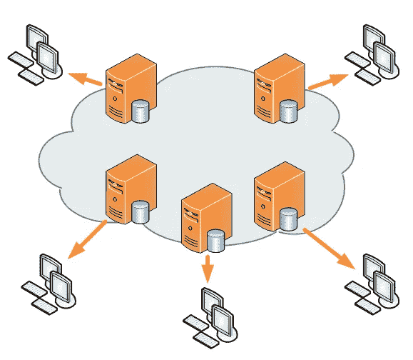
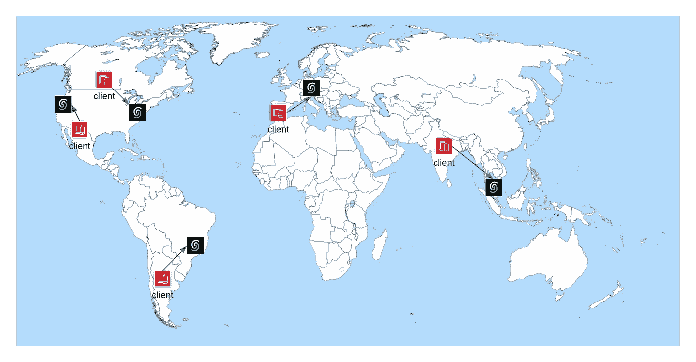

# 使用 Next.js Edge 渲染和全球分布式数据库构建 web 开发的未来

> 原文：<https://itnext.io/build-the-future-of-web-development-with-next-js-3f6414f93b25?source=collection_archive---------3----------------------->

Next.js 允许您构建 React 应用程序。最近，由于出色的开发人员体验和许多其他使其使用起来充满乐趣的特性，它获得了很大的人气。

在本文中，我们将使用 Next.js Edge 和[upshredis](https://upstash.com/?utm_source=remi1)构建一个最先进的 web 应用程序。随着边缘计算的最新发展，我们将使用 Next.js 的最新功能(Edge SSR 和 Edge API Routes)来构建一个速度极快、完全分布式和可扩展的应用程序。好消息是，它是 100%无服务器的，没有服务器管理。

为了展示边缘计算的威力，我们将创建一个简单的 URL shortener 应用程序。URL 缩短器是一种接受 URL 并将其转换为更短的 URL 的服务。当你想在 Twitter 或其他社交媒体平台上分享网址时，这很有用。当您想要对用户隐藏实际的 URL 时，它也很有用。

# **边缘计算**

过去，Next.js 中的静态站点生成(SSG)是在 CDN 的帮助下从边缘提供的。静态 HTML 内容部署在世界各地，用户从最近的边缘位置获取内容。这是减少延迟和提高应用程序性能的好方法。



对于动态内容，Next.js 提供了服务器端呈现(SSR)。内容在服务器上生成，并发送给客户端。过去，与 SSG 相比，SSR 仅部署在一个位置，便于设置。

有了最新版本的 Next.js (Next.js 12.2)，我们就可以访问边缘渲染了。该功能仍处于实验模式，但您已经可以试用了。这允许在边缘部署 SSR 和 API 路由。因此，现在可以在一个配置中从多个位置提供动态内容。

移动到边缘后，数据库会出现瓶颈。由于复杂性和运营成本，很难在多个位置部署数据库。但是，有了像 Upstash 这样的现代数据库提供商，我们现在可以一键部署一个全球 Redis 数据库。边缘渲染/计算的完美匹配。最重要的是，Upstash 是一个无服务器的数据库，所以你不必担心基础设施。

# **边缘服务器渲染**

我们将使用 Next.js 样板文件作为起点。使用 TypeScript 和 Tailwind CSS 从 Next.js 开始是一个很好的方法。还配置了 ESLint，beauty，Husky，Jest，Cypress。你可以在 GitHub 的 [Next.js 样板](https://github.com/ixartz/Next-js-Boilerplate)找到源代码。

首先，让我们创建一个名为`*src/pages/admin/index . tsx*的新页面的新` *admin* 文件夹:

当您想要在边缘部署时，可以在所有页面上设置“*运行时*”配置。默认情况下,*运行时间*被设置为“*节点*”。但是，对于边缘渲染，我们需要将其设置为“*实验边缘*”。

部署应用程序后，您可以看到页面在边缘呈现。您可以通过在浏览器中打开页面来检查它，服务器应该会返回` *edge* `。

# **边缘 API 路由**

您不局限于渲染，您还可以在边缘部署您的 API 路由。让我们创建一个新的 API 路由`*src/pages/API/create-redirection . ts*`:

与边缘渲染相同，我们需要将`*运行时*配置设置为`*实验边缘*'。

您可以使用您的浏览器或您喜欢的 HTTP 客户端来测试 API 路由。它应该返回` *{"runtime":"edge"}* `。

# **全局启用 Edge**

您可以全局启用它，而不是在每个 Next.js 页面上设置`*运行时*`配置(它对 API 路由无效)。为此，您需要在项目的根目录下创建一个新文件“ *next.config.js* ”:

```
module.exports = {
  experimental: {
    runtime: 'experimental-edge',
  },
};
```

# **无服务器分布式全局数据库**

在确保应用程序部署在边缘之后，我们现在可以关注数据库部分。我们将使用一个无服务器的 Redis 数据库提供者。

在本文中，我们将使用免费计划。首先，我们需要在 Upstash 上创建一个帐户。然后，创建一个新的全局 Redis 数据库:


不要忘记在“*类型*部分选择“*全局*”。

# **连接到 Redis 数据库**

我们将使用`*@ upstresh/Redis dis*`包来连接 Upstash Redis 数据库。您可以使用以下命令安装它:

```
npm install @upstash/redis
```

然后，创建一个新文件“ *src/utils/redis.ts* ”:

在您的 upsh 仪表板上，您可以复制`*upsh _ REDIS _ REST _ URL*`值。然后，您可以粘贴到` . env '文件中:

```
UPSTASH_REDIS_REST_URL=https://XXXXXXXX.upstash.io
```

您还需要复制`*UPSTASH _ REDIS _ REST _ TOKEN*值。这一次，您需要将它粘贴到` . env.local `文件中:

```
UPSTASH_REDIS_REST_TOKEN=XXXXXXXX
```

因为我们正在使用` *.env.local* `文件，所以它不会被提交给 Git 存储库。将秘密值存储在这个文件中是一个很好的做法。

您还需要在您的 Vercel 仪表板中添加“*UPSTASH _ REDIS _ REST _ TOKEN*”。转到`*设置* ` > ` *环境变量*并定义`*UPSTASH _ REDIS _ REST _ TOKEN*变量。

# **向数据库添加数据**

在将数据添加到数据库之前，我们需要通过创建一个新文件` *src/types/redirection.ts* 来定义数据结构:

```
export type IRedirection = {
  id: string;
  url: string;
};
```

我们将使用之前创建的 API 路由向数据库添加数据。让我们更新`*src/pages/API/create-redirection . ts*`文件:

我们使用` *hset* ` Redis 方法向数据库添加数据。

部署后，您可以通过发送具有以下正文的 POST 请求来测试 API 路由:

```
{
  "id": "magic",
  "url": "https://google.com"
}
```

通过发送这个请求，它将向数据库添加一个新条目。然后，这个想法是当用户输入“ *magic* ”作为 ID 时，将用户重定向到 Google 网站。

# **使用中间件在边缘上重定向**

Next.js 中的一个中间件允许您在完成请求之前运行一个函数。默认情况下，所有中间件都在边缘执行。所以，不需要设置任何配置。

我们将在 Next.js 中间件中添加重定向逻辑。让我们创建一个名为`*src/middle ware . ts*的新文件:

在文件的底部，我们使用` *config* 对象来定义` *matcher* 配置。因此，只有当路径名以`/ *r* /'开头时，中间件才会被执行。

我们使用` *hget* ` Redis 方法从数据库中获取 URL。如果条目存在，它会将用户重定向到 URL。否则，它会重定向到主页。

# 列出所有的重定向

我们将使用之前创建的` *admin* `文件夹中的索引页面来列出数据库中存储的所有重定向。让我们更新“*src/pages/admin/index . tsx*”文件:

我们还使用` *getServerSideProps* `函数通过 SSR 获取服务器端的数据。并且，我们已经在` *next.config.js* 文件中设置了`*运行时*配置。因此，页面将在每个请求的边缘呈现。

对于数据库，我们使用` *hgetall* ` Redis 方法来获取所有条目。然后，我们在 Next.js 页面上显示列表。

# 结论

学习完本教程后，您应该能够使用 Vercel 和 [Upstash](https://upstash.com/?utm_source=remi1) 在生产环境中部署 URL shortener。好消息是一切都在边缘:API 路由、中间件和渲染都在边缘发生。我们不仅使用了边缘计算，还使用了全球分布式数据库 Upstash。所以，一切都贴近用户，快捷。



所有基础架构都是 100%无服务器的，您无需担心服务器管理和扩展。您可以专注于业务逻辑和用户体验。