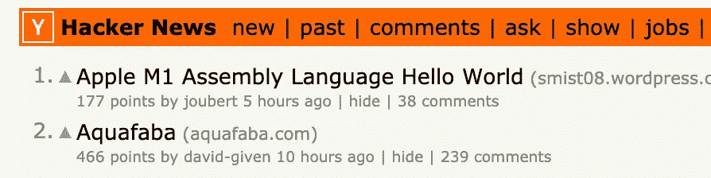
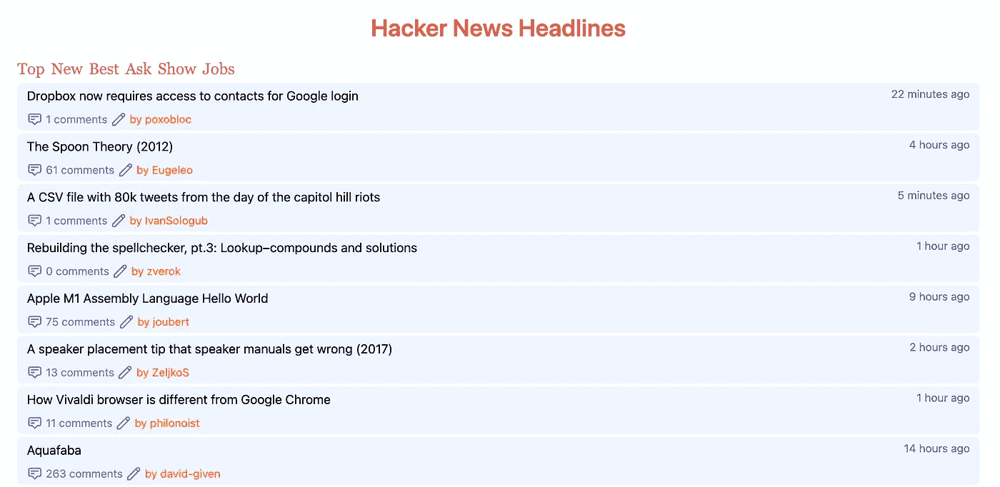
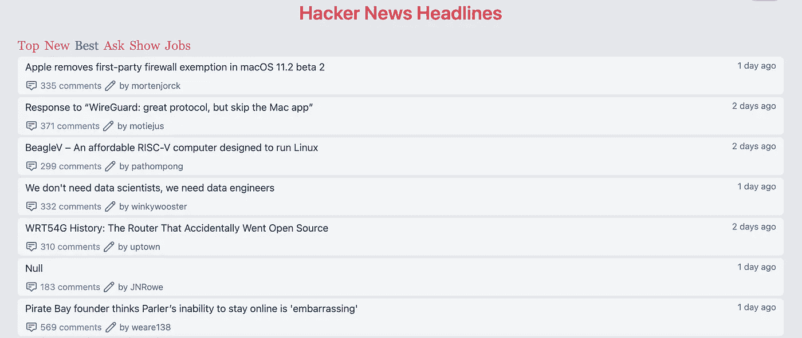
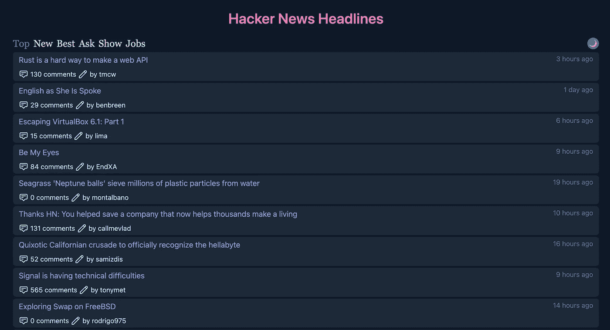

# 使用 VueJS 3 构建 HackerNews 阅读器—第 2 部分，实现黑暗模式

> 原文：<https://itnext.io/build-the-hackernews-reader-with-vuejs-3-part-2-dark-mode-implemented-c4caf7d0c9de?source=collection_archive---------4----------------------->


照片由[贝丝 Jnr](https://unsplash.com/@bthjnr?utm_source=medium&utm_medium=referral) 在 [Unsplash](https://unsplash.com?utm_source=medium&utm_medium=referral) 拍摄

在用 VueJS 3 构建了一个非常基本的单页应用程序(SPA)之后，今天我们将继续增强这个应用程序。我们在这一部分的目标是:

*-通过迷你导航从 HackerNews 获取更多种类的项目(以前，该网站只接收* ***热门*** *故事)。*

*-如今，黑暗模式几乎是每个应用程序的一流功能，所以我们也将为我们的应用程序配备它。*

*-执行* `*localStorage*` *保存用户偏好:最后选择的主题，以及暗/亮模式*

***在每一个教程里，我都会尽量详细的解释为什么我用这个不用那个，以及一些幕后的概念***

# **从 HackerNews API 获取更多故事主题**

我们使用 Github 的当前版本继续开发。看看 HackerNews 主页，我们可以看到它有其他主题，如*新闻、工作、提问……*和查看官方 HackerNews API 文档[，所有这些都是通过 REST APIs 支持的。以下是来自官方网站& URL 端点的截图:](https://github.com/HackerNews/API))



官方网站的主题导航

```
[https://hacker-news.firebaseio.com/v0/topstories.json?print=pretty](https://hacker-news.firebaseio.com/v0/topstories.json?print=pretty)[https://hacker-news.firebaseio.com/v0/beststories.json?print=pretty](https://hacker-news.firebaseio.com/v0/beststories.json?print=pretty)[https://hacker-news.firebaseio.com/v0/newstories.json?print=pretty](https://hacker-news.firebaseio.com/v0/newstories.json?print=pretty)[https://hacker-news.firebaseio.com/v0/askstories.json?print=pretty](https://hacker-news.firebaseio.com/v0/askstories.json?print=pretty)[https://hacker-news.firebaseio.com/v0/showstories.json?print=pretty](https://hacker-news.firebaseio.com/v0/showstories.json?print=pretty)[https://hacker-news.firebaseio.com/v0/jobstories.json?print=pretty](https://hacker-news.firebaseio.com/v0/jobstories.json?print=pretty)
```

当检查 URL 端点时，有一个模式，我们可以将它用于我们的应用程序`${topic}stories`。让在用户界面中实现。首先，我们在`App.vue`文件中向 Vue 应用程序添加一个属性，一个包含主题及其标题的数组:

通过这种数据结构的设计，我们可以轻松地为主题导航定制图标、颜色等。然后，我们使用`v-for`生成导航栏

结果就像下面的截图。



显示主题导航栏

稍后将使用`$event`参数来操作 CSS 类。而且，我必须说，Tailwind CSS 框架是如此强大，尤其是在这种场景下，我不需要硬编码其他 CSS 类，只需要使用内置的类实用工具来装饰元素。

下一步，我们需要让用户界面工作的函数，我们要实现一个方法，当用户点击它时加载每个主题。这只是一个简单的函数，用一个参数来`dispatch` 来自 Vuex 商店的`fetchItems`动作(我们稍后会修改它)。此外，我们需要一种机制来突出显示活动主题，通过添加&从 Tailwind 框架中移除一个文本颜色类。

现在，对于 Vuex Store 动作，我们将把`store/index.js`中的函数`loadLatestTopItems`重命名为`fetchItems`，并修改如下:

新函数采用 params 类型(默认为`top`)，然后通过使用现代 javascript 的模板文字特性直接传递给 API URL 端点。现在，运行命令`yarn dev`并打开`http://localhost:3000`来检查是否一切正常。它应该正常工作，但是，问题是当你第一次加载页面时，活动主题没有突出显示，我们需要一个解决方案。

```
created() {
  *this*.loadStories("top");
},
mounted() {
  *this*.$refs["topic-top"].classList.add("text-yellow-500");
},
```

代码很容易理解，当组件是`created`时，我们通过使用定义的方法`loadStories`加载头条新闻，但是在 Vue 实例生命周期的这个阶段，DOM 还没有准备好，所以我们需要将下一段代码放到`mounted`事件中，以便在用户加载页面时突出显示头条新闻主题。



突出显示活动主题

# **实现黑暗模式&本地存储**

好了，有趣的部分，为我们的应用程序实现黑暗模式。幸运的是，Tailwind 已经支持这个特性。*“为了尽可能简单地做到这一点，Tailwind 包含了一个黑暗版本，当黑暗模式启用时，你可以用不同的方式设计你的网站”*

然后，我们将在应用程序中实现一个黑暗类。首先我们在`src/assets/css`的`main.css`文件中创建一些基础类。

在这一步，颜色完全取决于你的口味，Github 上有完整的源代码供你参考。为了保存用户的喜好，像这样的 SPA app，`localStorage`是一个合理的选择。从 MDN，*"只读 localStorage 属性允许您访问文档来源的存储对象；存储的数据跨浏览器会话保存。localStorage 类似于 sessionStorage，只是 localStorage 中存储的数据没有到期时间"*，下面的函数`toggleDarkMode`就是基于它编写的。该函数将接受一个参数来设置预期的主题(我们可以在初始化应用程序时使用)或切换它。

我们在文件`App.vue`的`template`部分为用户装饰了一个图标(我只是用表情符号来快速设计)来切换主题

```
<div *class*="theme-switch-wrapper">
<span *ref*="toggleDark" *class*="h-6 w-6 flex items-center justify-center cursor-pointer bg-blue-500 dark:bg-green-500 rounded-full" *@click*="toggleDarkMode">☀️</span>
</div>
```

去看看。



启用黑暗模式

最后，我们在初始化应用程序时设置 init 变量，以加载用户的偏好。

应用程序将加载用户浏览的最后一个主题或为下一个会话选择的主题。完成的工作代码被推送到 [Github repo](https://github.com/infantiablue/vhnews) 上，并且[启用了黑暗模式的 HackerNews 阅读器](https://hnews.techika.com/)的现场演示被更新到最新版本。

# **结论**

总之，我们从 Vue 3 框架中学到了更多的基本实现，从 Tailwind CSS 学到了黑暗模式支持，以及使用`localStorage`保存用户的偏好。在接下来的教程中，我们将介绍 Vue 3 更先进的概念，如插件，mixin &合成 API …任何反馈都将不胜感激。

*本帖原帖自* [*我的博客*](https://techika.com/2021/01/16/build-hackernews-reader-vuejs-tailwind-p2/) *。*