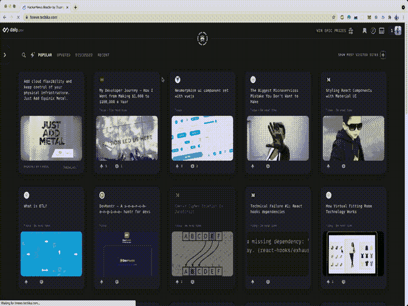

# 使用 VueJS 3 构建 HackerNews 阅读器—第 3 部分，使用 ES2018 语法无限加载

> 原文：<https://itnext.io/build-the-hackernews-reader-with-vuejs-3-part-3-infinite-loading-with-es2018-syntax-9b5e2ad55e3d?source=collection_archive---------1----------------------->


照片由[王嘉卉·阿塞维多](https://unsplash.com/@angelyviviana55?utm_source=medium&utm_medium=referral)在 [Unsplash](https://unsplash.com?utm_source=medium&utm_medium=referral) 上拍摄

**目标**

继续上一部分[ [1](/hackernews-reader-with-vue-3-vite-2-and-vuex-4-part-1-247315ceb06a?source=friends_link&sk=5a1871c1fd3495c5527c35f41cfa2e5d) ][ [2](/build-the-hackernews-reader-with-vuejs-3-part-2-dark-mode-implemented-c4caf7d0c9de?source=friends_link&sk=32a3ec70519f08b9d3f51fc8de8263ac) ]在这一部分中，我们将通过一些高级技术来实现无限加载功能，以从 HackerNews 和 skeleton gradient animation 获得更多帖子，从而提供最佳的用户体验。虽然有 Vue 插件支持无限加载，但在本教程中，我们将从头开始构建，以便我们可以通过进度深入学习。最后，由于 HackerNews API 的限制，我们有机会尝试 ES2018 的新功能`await for of`和往常一样，我将一步一步地详细解释我们为什么以及如何编码。



**分析**

首先，我们需要分析来自 HackerNews 的 API，以起草实现无限加载的基本设计。从[官方文档](https://github.com/HackerNews/API)来看，HackerNews API 是建立在 Firebase 之上的，我们最多只能查询 500 个最近的条目。结果是下面的 id 列表。

因此，为了对项目进行分页，我们可以如下`slice`:

**设计**

下一步，我们设计函数来处理来自 API 的数据，然后在用户滚动加载时呈现这些数据。在之前的教程中，我们只是一次加载所有的，所以这不会是一个问题。然而，当我们要实现无限加载特性时，这可能会导致一个问题。首先，让我们来看看如何无限地装载物品。我们将这样使用事件`scroll`:

基本上，上面的代码块将监听事件`scroll`，每当用户到达页面底部，函数`handleScroll`将被调用来呈现新的项目。但是，在生产中，由于第三方 API 的限制，我们需要进行大量的查询。

所有这些活动都是异步的，由来自`Promise`对象的机制处理。所以，即使所有这些项目都没有解决，事件`scroll`仍然被监听并继续调用`handleScroll`函数。

总而言之，有一些技术要求需要实现:

1.  当 API 结果仍未解析时，防止调用`handleScroll`的标志
2.  一个停止`scroll`事件监听的标志，当没有更多的项目从 API 加载时
3.  处理跨主题的分页
4.  一次处理多个异步请求的机制。

**实施**

为了处理第一个任务，将在全局状态下创建一个`boolean`变量`loading`，这样我们就可以跟踪请求何时被初始化，以便在所有数据处理完毕时打开和关闭它。我们还创建了另一个`boolean`变量`endPagination`来跟踪对于一个特定的主题是否没有更多的条目要加载。最后，一个`int`变量`page`操纵分页。那么我们的全局状态配置会是这样的。

接下来，我们将处理 API 请求。有几种方法可以处理多个异步请求，例如使用`Promise.all()`，不过，我还是要向您介绍如何利用 ES2018 的一个非常有用的新功能:[异步迭代](https://github.com/tc39/proposal-async-iteration) `for await ... of`

因为这个语法相当新，所以我们需要`babel`来使它在浏览器上工作。

首先，安装一些插件和`@babel/core`

```
yarn add -D @babel/core @rollup/plugin-babel @babel/plugin-proposal-async-generator-functions
```

创建新文件`.babelrc`

```
{"plugins": ["@babel/plugin-proposal-async-generator-functions"]}
```

然后修改`vite.config.js`

你可以在这里阅读更多关于巴别塔变换插件[的内容。然后，我们就可以走了。为了实现这个特性，我们将编写一个*异步函数生成器。*](https://babeljs.io/docs/en/babel-plugin-proposal-async-generator-functions)

上述异步函数将生成符合异步可迭代协议的值，然后可以使用`for await ... of`循环这些值。该机制对于同步请求活动至关重要，这样我们就可以处理事件`on`，正如我在开始时提到的。你可以从 Github repo 查看完整的代码`[store\index.js](https://github.com/infantiablue/vhnews/blob/main/src/store/index.js)`。

**骨骼装载**

骨架加载模式并不新鲜，它被广泛采用，以增强用户在加载更多内容时的体验。应用到我们的项目中并不难。所以，我只是简单地写一下它是如何工作的，代码已经在 Github repo 中了。

我们所要做的就是用所需的 CSS 创建另一个 Vue 组件，以便设置背景的样式和动画。诀窍是我们需要设置框架文章的数量，如何符合分页系统。为了实现这个目标，我们编写了一个简洁函数来生成一个与`v-for`一起使用的数字列表

你可以在回购中查看完整的代码`components\Skeleton.vue`

**奖金**

还有另一个新组件`components\Modal.vue`为文本帖子创建模态效果，例如 *Ask* 。这个组件使用了一个新的 Vue 3 API，[传送](https://v3.vuejs.org/guide/teleport.html)。我会留给你自己去探索。这很容易理解。

# 结论

在这一部分，我认为最重要的教训是我们如何分析、计划和实现期望的特性。通过提前计划，我们将避免许多错误，并在编码实现阶段节省大量时间。不仅如此，我们还有机会在实际项目中熟悉 ES2018 语法`for await ... of`。

[现场试玩](http://WIN EPIC PRIZES    1 Profile image Search Tags MY TAGS HOT TAGS  #tech-news   #general-programming   #security   #react   #webdev   #javascript   #google   #data-science   #cloud   #business   #startup   #aws   #machine-learning   #apple   #career   #microsoft   #ai   #cyber   #testing   #python   #nodejs   #azure   #infrastructure   #css   #hardware   #devtools   #kubernetes   #java   #deep-learning   #linux   #open-source   #architecture   #venture-capital   #github   #c   #devops   #sap   #logging   #html   #r   #ios   #containers   #data-privacy   #backend   #sql   #vuejs   #authentication   #angular   #typescript   #docker   #wordpress   #spring   #golang   #iot   #web-design   #google-chrome   #automation   #flutter   #git   #gcp   #crypto   #ruby   #react-native   #graphql   #game-development   #gaming   #serverless   #nlp   #rails   #php   #agile   #cicd   #rust   #big-data   #bots   #mongodb   #swift   #apache   #aspnet   #blockchain   #ecommerce   #tensorflow   #postgresql   #laravel   #firebase   #.net   #vr   #math   #terraform   #apache-spark   #kafka   #ar   #elk   #nextjs   #cryptography   #ibm   #webpack   #mysql   #adobe   #kotlin   #microsoft-sql-server   #oracle   #crawling   #game-design   #accessibility   #red-hat   #bi   #android-development   #bootstrap-css   #firefox   #nocode   #computer-vision   #redis   #gitlab   #blazor   #tailwind-css   #xamarin   #cms   #robotics   #data-analysis   #pytorch   #scala   #gatsby   #openshift   #bluetooth   #seo   #heroku   #django   #ethics   #elixir   #jupyter   #bash   #symfony   #jquery   #salesforce   #safari   #erp   #netlify   #selenium   #powershell   #nginx   #cloudflare   #ibm-cloud   #digitalocean   #mozilla   #embedded   #flask   #jenkins   #ionic   #keras   #auth0   #lightbend   #svelte   #haskell   #chromium   #crm   #hashicorp   #grpc   #mulesoft   #dart   #microsoft-edge   #julia   #perl   #aiops   #deno   #jamstack   #prometheus   #grafana   #vb   #nestjs   #ansible   #scikit   #okta   #google-bigquery   #active-directory   #firmware   #apache-cassandra   #gradle   #emberjs   #chef   #confluent-cloud   #ravendb   #nativescript   #alibaba-cloud   #prisma   #rabbitmq   #neo4j   #couchbase   #faunadb   #apache-flink   #pulumi   #apache-airflow   #clojure   #influxdb   #vite   #bitbucket   #lisp   #algolia   #fastify   #react-query   #puppet   #ballerina   #elm   #preact   #mobile-design   #fastapi   #erlang   #supabase   #alpinejs   #winui   #lua   #dailydev   #harperdb   #apache-hadoop   #apache-activemq   #sinatra   #gis   #web3   #kerberos   #adonisjs   #godot   #devrel   #hotwire     POPULAR UPVOTED DISCUSSED RECENT SHOW MOST VISITED SITES  Find out if a PWA is right for your next app dev project  PROMOTED Remove ads? freeCodeCamp My Developer Journey – How I Went from Making $1,000 to $100,000 a Year Today 11m read time Post image  5 1 Vue.js Examples   Neumorphism ui component set with vuejs Today Post image  4 2 Medium Styling React Components with Material UI Today 3m read time Post image  Product Hunt DevHuntr — A s̶e̶a̶r̶c̶h̶ e̶n̶g̶i̶n̶e̶ huntr for devs Today Post image  DZone What is ETL? Today 9m read time Post image  Medium Technical Failure #1: React hooks dependencies Today 2m read time Post image  Medium Caesar Cipher Solution In JavaScript Today 4m read time Post image  1 DZone How Virtual Fitting Room Technology Works Today 9m read time Post image  1 Medium Javascript Hoisting & TDZ Today 1m read time Post image   Testing with Deno — Part 3 Processing results for CI/CD Today 6m read time Post image  Netflix TechBlog My (Seemingly) Random Walk to Netflix Today 8m read time Post image  TechCrunch Alibaba is making its cloud OS compatible with multiple chip architectures Today 1m read time Post image  DZone AWS Serverless Data Lake: Built Real-time Using Apache Hudi, AWS Glue, and Kinesis Stream Today 4m read time Post image  Red Hat Developer Kubernetes-native Java: Latest and greatest features of Quarkus 2.0 | DevNation Tech Talk Today Post image  redislabs AI for Fraud Detection Mini Summit Today   J4K Conference 2021 Today   DevNation Deep Dive: Argo CD Today   Running Google MoveNet Single Pose models on OpenVINO Today 1m read time   Standalone text engine for iOS Today 1m read time  1  Link Hover Style 142 Today  1  Pagination Style 117 Today   GBI CIO Retail Roundtable Today   Toon Filters And Video Transformation in EbSynth [Part 2] Today   Using Cucumber with Gradle Today 3m read time   Swift Comments Today   Draw a scribbly underline underneath some text in React Today   Data Platform: The New Generation Data Lakes Today 11m read time   Microfrontends in action — how NOT to fail when introducing them Today 8m read time  2  Understand JavaScript Array Methods in 7 minutes Yesterday 13m read time  24 2  What Netflix Should Consider Before Diving into Gaming Today)
[Github 回购](https://github.com/infantiablue/vhnews)

*原载于*[](https://techika.com/2021/05/29/build-hackernews-reader-vuejs-tailwind-p3/)**——*[*我的个人博客*](https://techika.com) *。**