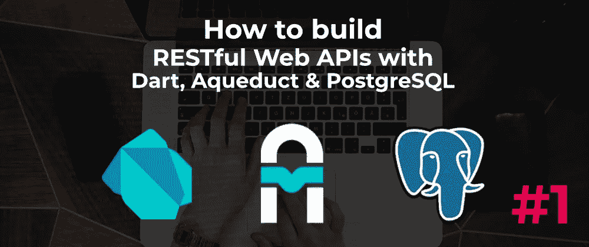

# 用 Aqueduct #1 构建 Web APIs

> 原文：<https://itnext.io/build-web-apis-with-aqueduct-1-video-series-f57c766213dd?source=collection_archive---------3----------------------->

## 了解如何使用 Dart、Aqueduct 和 PostgreSQL 构建 RESTful Web APIs

几个月前，我写了一系列基于 Dart 的 Aqueduct 框架的文章。我们开发了一个 RESTful API，提供来自 PostgreSQL 数据库的阅读材料列表。

在这一系列视频中，我们将为 Dart 2 开发一个基于 Aqueduct 3 的 Web API。自从那篇引入了突破性变化的文章发表以来，API 已经发生了变化。

这是该系列的第一个视频:

→ [**在 YouTube 上观看**](http://bit.ly/aqueduct-tutorial)

# 渡槽概述

Aqueduct 是一个开源框架，用于在服务器上创建和部署 RESTful Web APIs。它借用了*快车*、*哈比神*甚至*的概念。NET Web API* ，如果您已经使用过任何其他框架，它提供了一个入口点。

以下是它的一些功能:

1.  流体，可链接**路线**。*组成你的路线的函数风格及其处理方法*
2.  一个 **CLI** 工具。*这允许你通过发出简单的命令来搭建你的下一个项目*
3.  **多线程**开箱。*通过 Dart 的“隔离”加速应用程序的多个实例，在服务器上的所有 CPU 内核间扩展。*
4.  有内置的**窗体**。如果你使用关系数据库，这是必备的！还支持数据库迁移。
5.  拥有一个**集成测试**库。因为你需要测试所有的东西！与 TravisCI 等工具配合良好。

在他们的网站上了解更多信息。

下面是 [**完整视频**](http://bit.ly/aqueduct-tutorial) 。

**订阅** [**我的 YouTube 频道**](http://bit.ly/fullstackdart) 获取更多涵盖 Dart 全栈 web 开发各个方面的视频。

**喜欢，分享** [**关注我**](https://twitter.com/creativ_bracket) 😍有关 Dart 的更多内容。

# 进一步阅读

*   [**渡槽:**一巡](http://aqueduct.io/docs/tour/)
*   [**用 Aqueduct #2** (视频系列)](/build-web-apis-with-aqueduct-2-video-series-830883070960)构建 Web APIs
*   [**免费飞镖截屏在 Egghead.io**](https://egghead.io/instructors/jermaine-oppong)