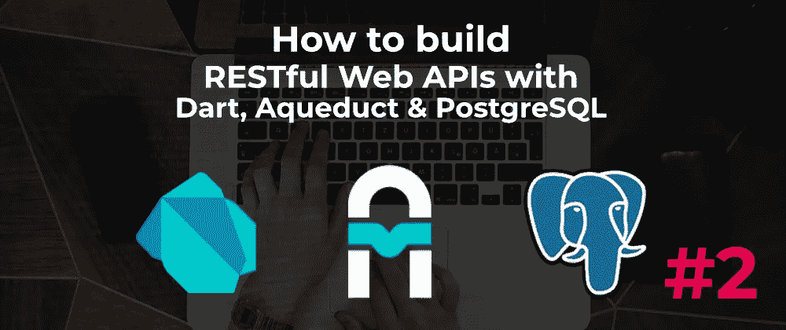

# 使用 Aqueduct #2 构建 Web APIs(视频系列)

> 原文：<https://itnext.io/build-web-apis-with-aqueduct-2-video-series-830883070960?source=collection_archive---------1----------------------->

## 了解如何使用路由器和控制器来处理请求



在本文中，我们将更详细地研究路由，构建一个能够执行 CRUD ( *创建、读取、更新、删除*)操作的端点。我们将利用`Router`和`Controller`类来处理对端点的请求。

这是该系列的第二个视频:

→ [**在 YouTube 上观看**](http://bit.ly/aqueduct-tutorial-2)

# 什么是路由器？

路由器通过路径捕获请求，并将其转发给使用`link`方法进行解析的`Controller`或实现中间件功能来处理请求的`linkFunction`。

它看起来是这样的:

```
final **router** = **Router**();router.**route**('/path-1').**link**(() => Path1Controller());
router.**route**('/path-2').**linkFunction**((Request req) async {
  return Response.ok('Hello, World!');
});
```

调用`route()`时，路径作为参数传递，也可以接受路由参数:

```
router.**route**('/path-1/**:name**').link(...);
router.**route**('/path-2/**[:name]**').linkFunction(...); **// wrapping in square brackets means its optional**
```

因此，在这个代码片段中，在“ **/path-1** ”之后的路径段中传递的任何内容都被捕获到“name”路径变量中:

```
router.route('/path-1/:name').linkFunction((request) async {
  final **name** = **request.path.variables['name']**;
  return Response.ok('Hello, **$name**');
});
```

看这个 [**视频**](http://bit.ly/aqueduct-tutorial-2) **中路由器和控制器是如何工作的。**

→ [**获取源代码**](https://github.com/graphicbeacon/aqueduct-tutorial/tree/part-2)

**订阅** [**我的 YouTube 频道**](http://bit.ly/fullstackdart) 获取更多涵盖 Dart 全栈 web 开发各个方面的视频。

**喜欢，分享** [**关注我**](https://twitter.com/creativ_bracket) 😍有关 Dart 的更多内容。

# 进一步阅读

*   [**处理 HTTP 请求**:概述](http://aqueduct.io/docs/http/)
*   [**egghead . io 上的免费飞镖截屏**](https://egghead.io/instructors/jermaine-oppong)