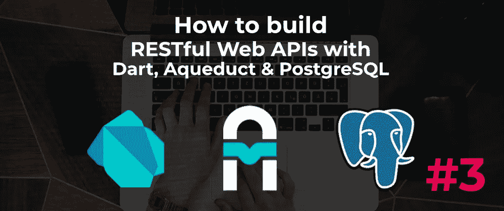

# 使用 Aqueduct #3 构建 Web APIs(视频系列)

> 原文：<https://itnext.io/build-web-apis-with-aqueduct-3-video-series-13b04e8a326e?source=collection_archive---------6----------------------->

## 了解如何序列化请求负载和集成 PostgreSQL 数据库



在这一部分，我们将看看`Serializable`类，以及它们如何使我们能够处理请求体的有效载荷。然后，我们将继续设置和集成我们的 PostgreSQL 数据库。

这是该系列的第三个视频:

→ [**在 YouTube 上观看**](https://www.youtube.com/watch?v=sXk9nkdSVq4)

# 什么是可序列化对象？

这些对象负责对请求的有效负载进行编码和解码。要使用这个类，定义我们的子类并覆盖`asMap()`和`readFromMap()`方法。

```
class Read extends Serializable {
  String title;
  String author;
  int year; @override
  Map<String, dynamic> **asMap**() => **{
    'title': title,
    'author': author,
    'year': year,
  }** @override
  void **readFromMap**(Map<String, dynamic> **requestBody**) {
    **title** = requestBody['title'] **as** String;
    **author** = requestBody['author'] **as** String;
    **year** = requestBody['year'] **as** int;
  }
}
```

所以`asMap()`方法接受`Read`的实例成员并返回一个`Map`结构，这在返回 JSON 响应时很有用。

`readFromMap()`用于将请求有效负载键提取到我们的实例属性中。这允许我们将实例绑定到 POST 请求方法中的`body`有效负载参数:

```
class ReadsController extends ResourceController {
  ...
  ...
  @Operation.post()
  Future<Response> createNewRead(@**Bind.body**() **Read** body) async {
    ...
  }
  ...
  ...
}
```

在 [**完整视频**](http://bit.ly/aqueduct-tutorial-3) 中，进一步了解这是如何工作的，以及我们如何集成一个全功能的 PostgreSQL 数据库。

→ [**获取源代码**](https://github.com/graphicbeacon/aqueduct-tutorial/tree/part-3)

**订阅** [**我的 YouTube 频道**](http://bit.ly/fullstackdart) 获取更多关于 Dart 全栈 web 开发各个方面的视频。

**喜欢，分享一下** [**跟我来**](https://twitter.com/creativ_bracket) 😍有关 Dart 的更多内容。

# 进一步阅读

*   [**处理 HTTP 请求:**可序列化对象](http://aqueduct.io/docs/http/request_and_response/#serializable-objects)
*   [**导水管文件:**从数据库中读取](http://aqueduct.io/docs/tut/executing-queries/)
*   [**egghead . io 上的免费飞镖截屏**](https://egghead.io/instructors/jermaine-oppong)