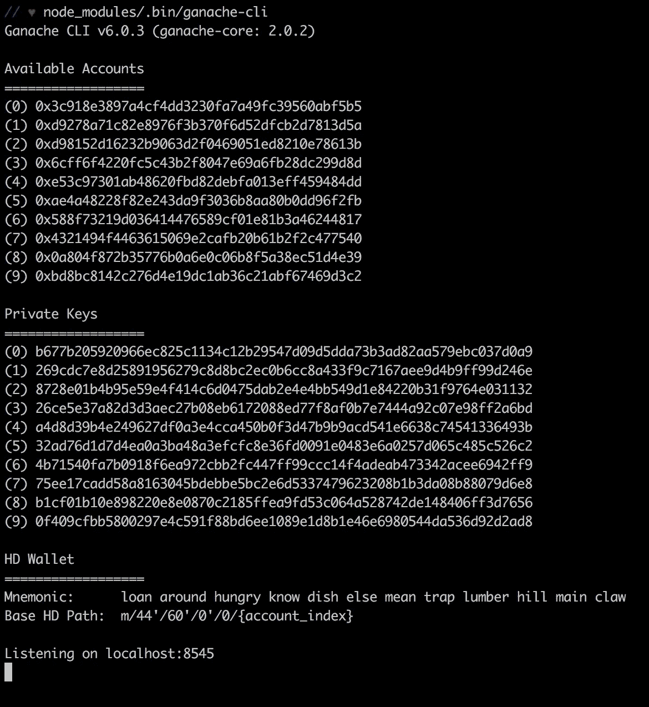
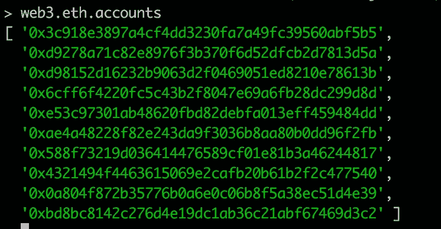
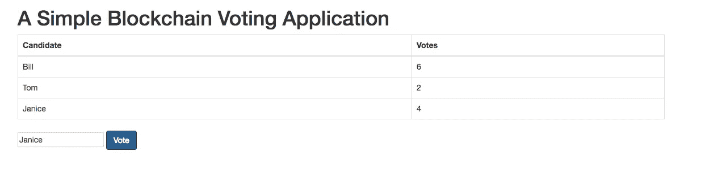

# 通过 5 个快速步骤构建您的第一个区块链应用

> 原文：<https://itnext.io/build-your-first-blockchain-application-in-5-quick-steps-89ebb96adbfe?source=collection_archive---------1----------------------->


[*点击这里在 LinkedIn* 上分享这篇文章](https://www.linkedin.com/cws/share?url=https%3A%2F%2Fitnext.io%2Fbuild-your-first-blockchain-application-in-5-quick-steps-89ebb96adbfe)

说区块链有炒作是一种保守的说法。但是为了让这场革命继续前进，我们需要更多的工程师！最近，[宣布](https://techcrunch.com/2018/02/14/blockchain-engineers-are-in-demand/)每个区块链工程师有 14 个职位空缺。

很明显，这里人才匮乏，本教程的目标是提供一个区块链基础，在这里你可以快速构建你的第一个全栈分散式应用(DApp)。

我们将建立一个作为投票系统的 DApp，代码可以在这里找到。本教程将介绍如何在本地区块链网络上创建、编译和部署合同。然后，您将能够通过 nodejs cosole 或网页 GUI 与合同进行交互。

请记住，这可以用有限的技术知识来完成，但它是为那些有一点编码经验的人设计的。在我们进行这些步骤时，将会有一个简短的流程背景，作为高级概述。如果你对某个特定的领域感兴趣，不要犹豫去谷歌搜索更多的信息。

这是一种轻量级的方法，允许您使用完整的堆栈项目立即投入运行。本教程的特点是没有框架，有限的依赖，没有废话。

让我们直接进入…

# 步骤 1:克隆存储库并安装依赖项

```
*# Clone the source repository*
git clone [https:*//github.com/benstew/voting-blockchain-dapp.git*](https://github.com/benstew/voting-blockchain-dapp.git) *# Check that npm and node are installed*
*# The tutorial was created with the below versions*
created with the below versions)
$ npm -v
v7.10.1$ node -v
4.2.0
```

Ganache 是一个在本地内存中运行的区块链模拟器。我们将用它来测试我们的应用程序以太坊区块链:

```
$ npm install ganache-cli web3@0.20.2
```

必须编译坚固性代码。我们将使用“solc”来编译我们的 solidity 代码:

```
$ npm install solc
```

# 步骤 2:运行 Ganache CLI

```
$ node_modules/.bin/ganache-cli
```

预期产出:



# 第三步:编辑合同

我们将在 nodejs 控制台中编译契约:

```
~/voting-blockchain-app $ node
> Web3 = require('web3')
> web3 = new Web3(new Web3.providers.HttpProvider("http://localhost:8545"));
```

我们可以确保 web3 对象已初始化，并且可以通过对该对象使用“accounts”方法与区块链进行通信:



要编译合同，将 solidity 代码从 voting.sol 加载到一个字符串变量中，然后编译(也将在 nodejs 控制台中运行):

```
> code = fs.readFileSync('voting.sol').toString()
> solc = require('solc')
> compiledCode = solc.compile(code)
```

# 步骤 4:部署合同

创建合同对象并部署合同:

```
> abiDefinition = JSON.parse(compiledCode.contracts[':voting'].interface)
> VotingContract = web3.eth.contract(abiDefinition)
> byteCode = compiledCode.contracts[':voting'].bytecode
> deployedContract = VotingContract.new(['Bill','Tom','Janice'],{data: byteCode, from: web3.eth.accounts[0], gas: 4700000})
> deployedContract.address
> contractInstance = VotingContract.at(deployedContract.address)
```

仅供参考——与区块链互动需要花钱。我们通过上面的 **gas** 金额来指定我们愿意为包含在区块链中的代码支付多少费用。这个数额将给予矿工，使我们的代码可以包括在区块链。

# 步骤 5:与合同互动

首先，我们将通过节点控制台与契约进行交互:

```
> contractInstance.totalVotesFor.call('Bill')
Output: { [String: '0'] s: 1, e: 0, c: [ 0 ] }> contractInstance.voteForCandidate('Bill', {from: web3.eth.accounts[0]})
Output: '0xdedc7ae544c3dde74ab5a0b07422c5a51b5240603d31074f5b75c0ebc786bf53'> contractInstance.voteForCandidate('Tom', {from: web3.eth.accounts[0]})
Output:'0x02c054d238038d68b65d55770fabfca592a5cf6590229ab91bbe7cd72da46de9'> contractInstance.voteForCandidate('Tom', {from: web3.eth.accounts[0]})
Output:'0x3da069a09577514f2baaa11bc3015a16edf26aad28dffbcd126bde2e71f2b76f'$ contractInstance.totalVotesFor.call('Janice').toLocaleString()
Output:'3'
```

我们还可以通过轻量级的 web GUI 与合同进行交互。

为了使用 GUI，您需要为您的合同更新[~/voting-区块链-app/index.js](https://github.com/benstew/voting-blockchain-dapp/blob/master/index.js#L6) 中的合同实例地址

```
*# In your nodejs console, execute contractInstance.address to* 
*# get the address at which the contract is deployed and change* 
*# the line below to use your deployed address*
contractInstance = ScoringContract.at('0xe46c0742867695226bdacc9b821d7f26dbdd294e');
```

在浏览器中打开~/voting-区块链-app/index.html。您应该会看到下面的内容，并且能够通过输入候选人的姓名(Bill、Tom、Janice)并单击“投票”进行交互:



本教程的目标是为构建您的第一个区块链应用程序提供一个快速、简洁的介绍。通过理解完整的堆栈流，很容易调整这个玩具应用程序或构建一些全新的东西。

一个很好的下一步是在这里深入研究以太坊文档。在那里，您可以学习构建任何东西，从更高级的 DApps 到众卖，再到构建您自己的加密货币！

你真诚的，

本·斯图尔特