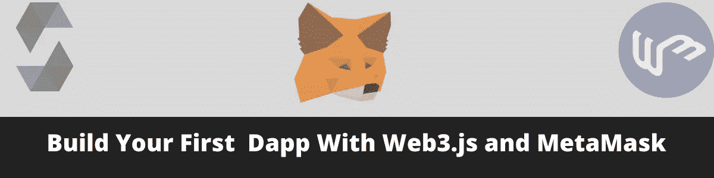
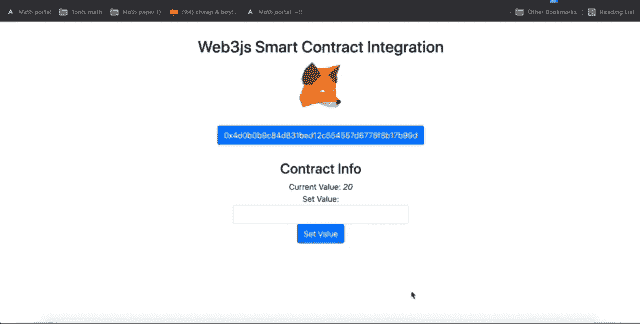
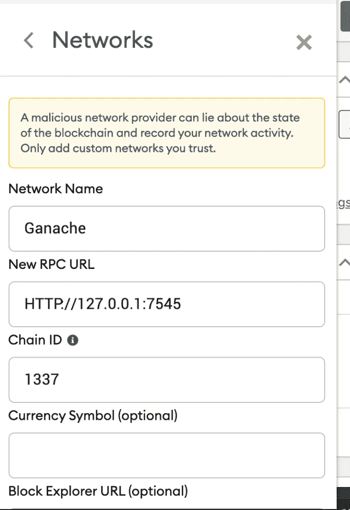
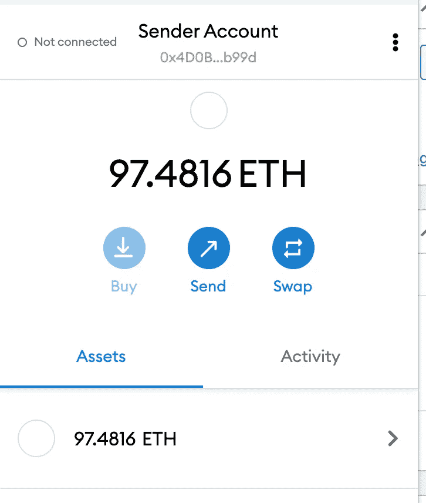
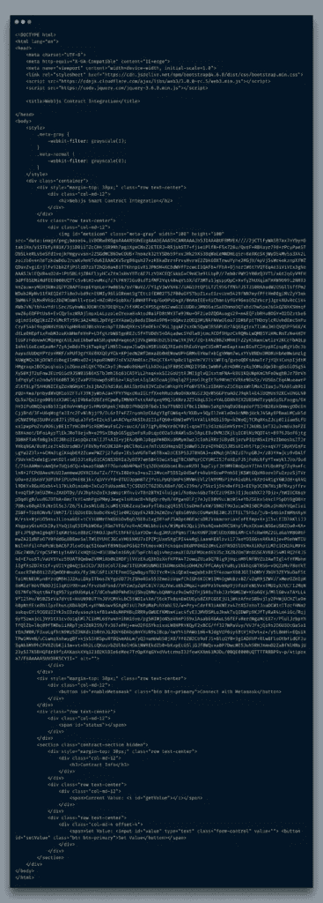
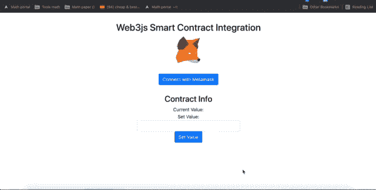
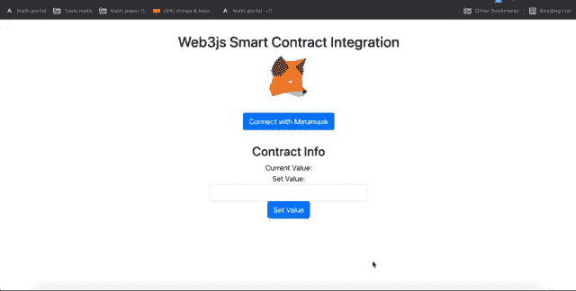
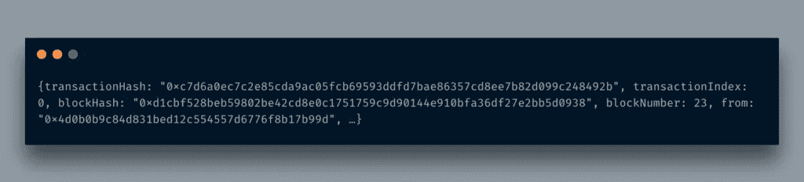

# 用 Web3.js 和 MetaMask 构建你的第一个 Solidity Dapp

> 原文：<https://itnext.io/build-your-first-solidity-dapp-with-web3-js-and-metamask-b18d63196bb5?source=collection_archive---------1----------------------->



事实上，我在 web3.js 的 [Solidity 系列](http://blog.adnansiddiqi.me/tag/solidity/)中计划了另一个主题，但是这篇文章可能会跑题，因此我正在讨论 web3.js 的基础知识以及如何与智能合同进行交互。我将使用我在这里创建的[的同一个合同。基本上就是上一个帖子的 web3.js 版本。](http://blog.adnansiddiqi.me/develop-and-deploy-your-first-ethereum-smart-contract-with-python/)

与其他关于使用 NodeJs 和 React 的基于 web3.js 的前端的帖子不同，我不会使用任何这样的东西，因为它不需要创建一个去中心化的应用程序的前端。你甚至根本不需要 NodeJS。你可以使用你现有的技能，如 PHP/Laravel、Django、Rails 等，创建一个 dApp，通过 *web3.js* 与以太坊区块链对话。

在这篇文章中，我将创建一个简单的基于 HTML 的界面，它将与我之前创建的智能契约进行交互。我们将学习如何与 MetaMask 交互，以及如何将 MetaMask 与 Ganache 连接。最后，该应用程序将像下面这样工作:



# 什么是元掩码

据 MetaMask 官方[网站](https://metamask.io/):

> 区块链应用程序的加密钱包和网关

他们从 Chrome 扩展开始，让网络应用与基于以太坊的区块链交互。用户通过创建一个新的钱夹或通过输入私钥创建一个现有的钱夹来与主网或测试网进行交互。

# MetaMask 和 Ganache 集成

在之前的帖子中，我已经告诉你如何设置 Ganache。现在，我们必须将基于 Ganache 的区块链与 MetaMask 连接起来，这相当容易。



RPC URL 是由 Ganache 在其接口上提供的。 **1337** 是 Ganache 的*链条 ID* 。

一旦连接了区块链节点，您就必须在 MetaMask wallet 中添加一个帐户。你所要做的就是从你的一个账户中导入密钥并标记它。出于开发目的，我在这里集成了我的第一个帐户。



现在让我们开始编码。我们首先要做的事情之一是包含所有需要的库。除了 *web3.js* 库之外，我还使用了 *Bootstrap* 和 *Jquery* 。



这是我上面演示的同一个页面的结构。它包含灰显的元掩码图标，通知用户元掩码尚未安装。我们将编写代码来实现这一功能。

这个功能非常简单。当您添加*元掩码*时，它会全局暴露`ethereum`对象。如果此对象可用，则意味着元掩码已启用。我正在使用 jQuery 来灰化/着色徽标。在我们调用它之前，我将使用 jQuery 的`onready()`函数来调用它。

如果您运行这段代码，它会产生以下结果



正如你在上面看到的，当我删除扩展时，它禁用了按钮和徽标。

现在，下一步是编写*连接 MetaMask* 按钮的逻辑。为此，我在这里引入了一个新的函数`conenct()`。我还将引入`handleAccountsChanged`回调函数，它处理元掩码提供的`eth_requestAccounts`方法的响应。

```
function handleAccountsChanged(accounts) {
            console.log('Calling HandleChanged')

            if (accounts.length === 0) {
                console.log('Please connect to MetaMask.');
                $('#enableMetamask').html('Connect with Metamask')
            } else if (accounts[0] !== currentAccount) {
                currentAccount = accounts[0];
                $('#enableMetamask').html(currentAccount)
                $('#status').html('')

                if(currentAccount != null) {
                    // Set the button label
                    $('#enableMetamask').html(currentAccount)
                }
            }
            console.log('WalletAddress in HandleAccountChanged ='+walletAddress)
        }function connect() {
            console.log('Calling connect()')
            ethereum
            .request({ method: 'eth_requestAccounts' })
            .then(handleAccountsChanged)
            .catch((err) => {
            if (err.code === 4001) {
                // EIP-1193 userRejectedRequest error
                // If this happens, the user rejected the connection request.
                console.log('Please connect to MetaMask.');
                $('#status').html('You refused to connect Metamask')
            } else {
                console.error(err);
            }
            });
        }
```

`ethereum.request`是 MetaMask 提供的一个通用函数，用于执行不同的操作。在这里，我要求 MetaMask 返回所附的帐户。如果没有，它会弹出一个对话框来连接它。你可以在这里了解更多[。](https://docs.metamask.io/guide/ethereum-provider.html#methods)



上面发生了很多事情。假设当我点击按钮时，您已经导入了钱包密钥，它会激活 MetaMask 界面，并要求您连接要在该网站上使用的钱包。你可以连接多个钱包，但现在，让我们依靠一个钱包。一旦它成功地连接了这个网站和钱包，我就在按钮上显示钱包地址。这个过程有点类似于典型的登录机制，在登录后显示一个欢迎说明。取消时，我显示一条消息，说明该网站的访问者拒绝连接他/她的 MetaMask 钱包。现在，无论您执行什么操作，都将使用您连接的钱包。

好了，我们已经连接了我们的钱包，现在剩下的唯一事情就是与智能合约进行交互。所以让我们开始写代码吧！

我刚刚注意到我还没有编写与 Ganache 交互的代码。为此，我们必须使用 *web3.js* 库。我已经把它包含在我的 HTML 文件中了(*你不需要* `*node*` *或者* `*npm*` *来实现这个目的。毕竟，这是一个简单的 JS 库，我们可以保留老学校的一部分，但使用新技术*。

```
let web3;
let abi;$.getJSON("build/contracts/FirstContract.json", function(result) {            
    abi = result.abi
});try {            
      web3 = new Web3(new Web3.providers.HttpProvider("[http://localhost:7545](http://localhost:7545)"));
} catch (error) {
      alert(error)
}
```

这里发生了一些事情:在声明了所需的变量之后，我首先得到了契约的 ABI。我们将在与智能合同例程交互时使用它。接下来，我将连接加纳切以太坊区块链。

到目前为止还不错，现在我要添加一个函数，在这里命名为，`getValue()`。这个函数将在页面加载时被调用。`document.ready()`现在看起来如下:

```
$( document ).ready(function() {
            m = detectMetaMask()
            if(m) {
                $('#metaicon').removeClass('meta-gray')
                $('#metaicon').addClass('meta-normal')
                $('#enableMetamask').attr('disabled',false)
                // connect() 
            } else {
                $('#enableMetamask').attr('disabled',true)
                $('#metaicon').removeClass('meta-normal')
                $('#metaicon').addClass('meta-gray')
            }$('#enableMetamask').click(function() {
                connect()
            });try {            
                web3 = new Web3(new Web3.providers.HttpProvider("[http://localhost:7545](http://localhost:7545)"));
            } catch (error) {
                alert(error)
            }            

            //Fetch Value from Smart Contract
            getValue()
        })
```

`getValue()`包含以下代码来与区块链交互。

```
async function getValue() {
            console.log('GetValue')
            const contractFirst = new web3.eth.Contract(
                        abi,
                        contactAddress
            );contractFirst.methods.getValue().call().then(function (result) {                
                $('#getValue').html(result)
            });
        }
```

我正在创建`eth.Contract`的实例，并在构造函数中传递`abi`和`contactAddress`。一旦它被建立，我在这里调用智能契约的`getValue()`函数并在 div 中显示结果。

接下来，我将编写按钮的`click`事件将调用的`setValue()`函数的逻辑，并将输入的值传递给智能契约。

```
async function setValue() {
            console.log('Set Value')

            input_value = $('#value').val()

            if(input_value.trim() == '') {
                input_value = 0
            }
            if(!isNaN(input_value)) {
                input_value = parseInt(input_value)   
            }const contractFirst = new web3.eth.Contract(
                        abi,
                        contactAddress
            );

            contractFirst.methods.setValue(input_value).send({from:currentAccount}).then(function (result) {
                console.log(result);
                $('#getValue').html(input_value)
            });

        }
```

它与 getValue() one 非常相似。这里唯一的不同是我使用了`send()`而不是`call()`

我也在这里设置钱包地址。我这样做是因为当你在区块链传递一个值时，你实际上是在做一笔交易，因此它会从你的钱包中扣除油费。

好的，所以当我单击设置值按钮时，它会返回以下 JSON:



您可以随时确认:


如您所见，*事务哈希*是相同的。你可以看到 *25* 是输入值。

# 结论

所以在这篇(另一篇长)文章中，你学习了如何利用你现有的 HTML/Javascript 技能来编写 dApps 的前端。正如你在这里看到的，你不需要学习 NodeJS 或者 React。因为它是一个 HTML 文件，所以我在 Github 上用名称`contract_demo.html`提交了[这里的](https://github.com/kadnan/SolidityPythonTutorial/commit/f91655b774c86178c7da1cdde7b4a7c4ccab3e8c)。

*原载于 2021 年 7 月 18 日*[*http://blog . adnansiddiqi . me*](http://blog.adnansiddiqi.me/build-your-first-solidity-dapp-with-web3-js-and-metamask/)*。*