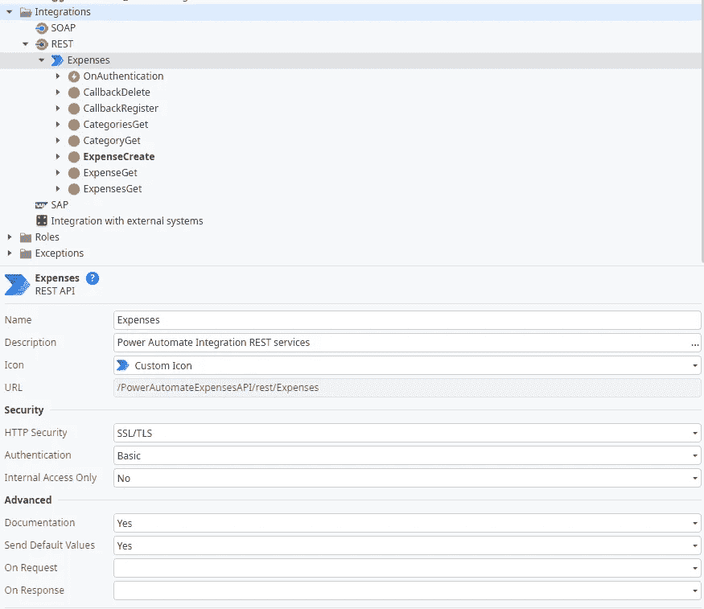
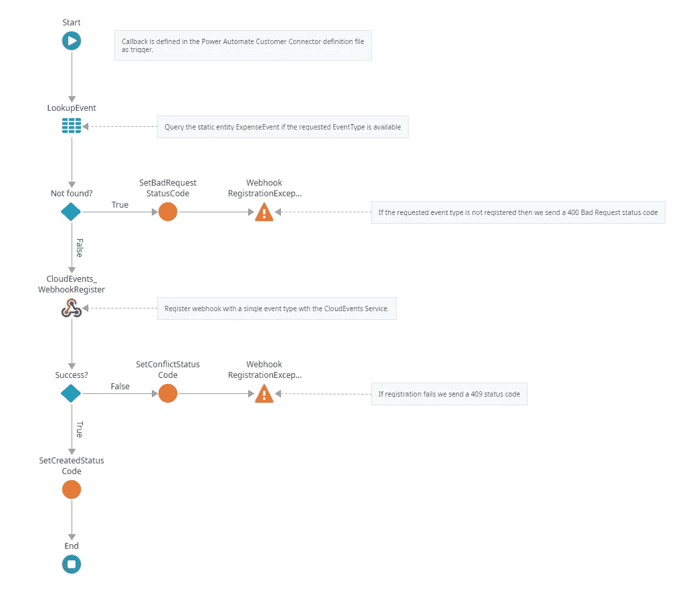
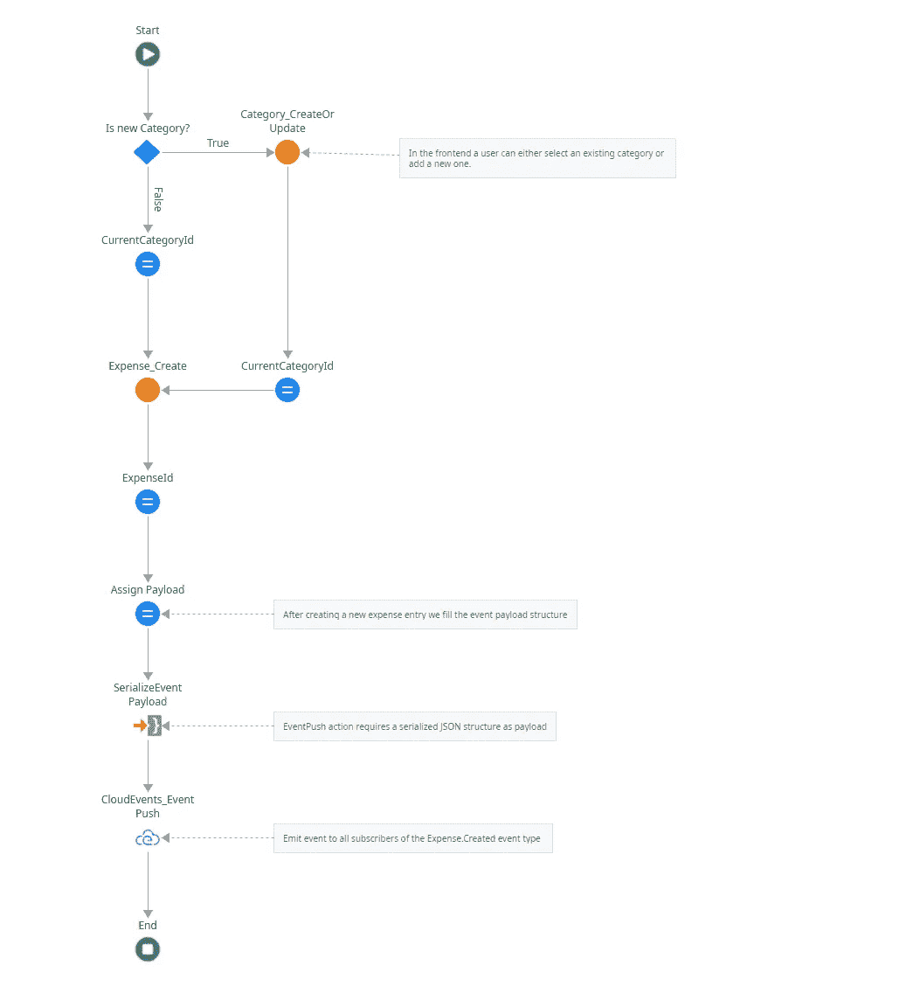
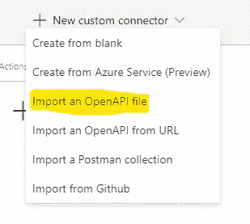

# 构建您的下一个 OutSystems 应用程序启用 Microsoft Power Automate

> 原文：<https://itnext.io/build-your-next-outsystems-app-microsoft-power-enabled-221d14dea15c?source=collection_archive---------2----------------------->

在这个演练中，我们将看看用[微软 Power Automate](https://docs.microsoft.com/en-us/power-automate/) 的功能丰富 [OutSystems](https://www.outsystems.com) 应用程序所需的步骤。

# 微软电力自动化

Power Automate 的易用性真正允许任何用户自动执行重复性任务。Power Automate 流程的创建始于触发器的选择。有三种类型的触发器:手动、自动和预定。触发器决定了流程中的后续活动(操作)何时运行(由用户手动启动、在事件发生后自动运行或根据计划定期运行)。

Power Automate 通过数据连接器提供触发器和动作。微软本身为微软 365 和 Azure 生态系统提供了众多的数据连接器。第三方提供商提供的用于连接其他(云)服务的额外数据连接器对其进行了补充。最后，Power Automate 客户还可以创建他们自己的定制数据连接器，并提供给他们的用户。

数据连接器由 OpenAPI 版本 2 定义文件描述(带有一些附加的扩展属性)。该定义可以使用 Power Automate 中的可视化助手或任何其他编辑器创建，然后导入。这里有一些关于 OpenAPI 版本 2(又名 Swagger)的更多信息的链接。

*   [基本结构(swagger.io)](https://swagger.io/docs/specification/2-0/basic-structure/)
*   [OpenAPI 规范—版本 2.0 | Swagger](https://swagger.io/specification/v2/)
*   [招摇编辑](https://swagger.io/docs/open-source-tools/swagger-editor/)
*   [自定义连接器 OpenAPI 扩展](https://docs.microsoft.com/en-us/connectors/custom-connectors/openapi-extensions)

> 自定义数据连接器是 Power 平台的一项高级功能，需要额外的许可。

Power Automate 的主要目标群体是办公室工作人员，他们在自助服务中自动化自己的工作流。基于 Power Automate 的 Azure Logic Apps 提供了更多的功能。Logic Apps 的目标是 IT 专业人员和软件开发人员为他们的组织构建应用程序和服务之间的复杂自动化。

# 外部系统集成

Power Automate 流程中的操作是对 REST API 的请求。因此，对于我们想要在 Power Automate 流程中包含的每个操作，我们必须在外部系统中公开一个端点。

Power Automate 中的触发器可以是 webhook 触发器，也可以是自定义轮询触发器。后者定期检查 API 端点是否有新数据，并触发流程。Webhook 触发器一直等到我们的 OutSystems 应用程序推送数据，然后运行流。这就是我们在本演练中使用的方法。如果您想了解更多关于自定义**轮询触发器的信息，**请参见[为 Microsoft Power Automate | Microsoft Docs 使用轮询触发器](https://docs.microsoft.com/en-us/connectors/custom-connectors/create-polling-trigger)。

每当使用 webhook 触发器时，Power Automate 都会生成一个唯一的 webhook URL。此外，Power Automate 对自定义连接器定义文件中定义的 API 端点执行注册请求。该请求包括生成的 webhook URL 以及我们的 OutSystems 应用程序发送通知需要“知道”的任何附加数据。触发用户可能被要求输入该附加数据，或者它是预定义的并被隐藏地发送。

因此，我们在 OutSystems 应用程序中需要另一个 API 端点来处理 webhook 注册。

# 演示应用程序—概述

为了展示如何将 Power Automate 与 OutSystems 应用程序集成，我准备了一个演示应用程序，可在 forge: Power Automate 集成演示上获得。

[电力自动化集成演示—概述|外部系统](https://www.outsystems.com/forge/component-overview/13400/power-automate-integration-demo)

这是一个最基本的费用跟踪应用程序。您可以输入带有标题、类别和金额的费用。就是这样。

Power Automate 用户应该能够在任何时候触发流程

*   创建任何费用条目

作为行动，我们希望为 Power Automate 用户提供以下内容

*   检索给定 id 的费用条目的详细信息
*   检索给定类别的所有费用条目
*   创建新的费用条目

**Power Automate 集成演示**依赖于 CloudEvents 组件。CloudEvents 是我基于 [cloudevents.io](https://www.cloudevents.io) 规范开发的 webhook 通知服务。你可以在我们的专用锻造组件[微型铁砧](https://anvil.isdfeniqs.com/en/catalog/cloudevents.html)上了解更多关于这项服务的信息。

CloudEvents 为一个或多个事件类型(以及可选的 subject/topic)处理 webhook 注册，并将事件推送到注册的 web hook。

继续从 forge 下载应用程序到您的环境中。个人环境就足够了。

现在是时候仔细看看应用程序的两个重要构件了。

# 演示应用程序—公开的 REST APIs

**PowerAutomateExpensesAPI** 模块公开了 REST API 端点。注意认证设置为**基本**认证。在 **OnAuthentication** 处理程序中的实现包含使用来自系统模块的 **User_Login** 的默认实现。

Power Automate 定制连接器支持以下身份验证方法

*   **基本** —如演示应用程序所示的用户名和密码验证
*   **API 关键字** —请求头或 url 中的任何关键字
*   **OAuth** —中央身份服务(Azure AD、Okta 等。)支持 OAuth 认证流。(我在面向公众环境中的建议)。

除了基于资源的端点(类别和费用条目)，还有一个**回调注册**和**回调删除**端点。前者接受对**/回调**的 **POST** 请求，后者接受对**/回调**的 **DELETE** 请求。这两个人负责注册和删除新的 Power Automate 触发器。

公开的 REST APIs

**回调寄存器**执行以下操作

*   如果注册事件类型与条目匹配，则查询静态实体，如果不匹配，则抛出一个 **400 错误请求**
*   向 CloudEvents 通知服务注册 webhook 目标 url，如果不成功，则抛出一个 **429 冲突**
*   返回一个 **201 创建的**状态

回调寄存器

**CallbackDelete** 从 CloudEvents 通知服务器删除注册的 webhook 目标 url。

> 每当删除触发器或整个流时，Microsoft Power Automate 都会自动调用删除回调端点。

所有其他基于资源的端点包装相应的服务器动作以返回结果。

# 演示应用程序—通知注册的 webhook 用户

向我们的 webhook 订阅者发出事件是在 **AddExpense** 服务器动作中完成的:

*   创建费用条目
*   构建并序列化事件负载(在我们的例子中，它只是费用标识符)
*   用序列化的负载和**费用调用 **CloudEvents_EventPush** 服务动作。已创建**事件类型。

添加费用服务器操作

# 自定义连接器—定义

我已经准备了一个自定义连接器定义。您可以在这个 github 资源库中找到完整的定义文件

【github.com 动力平台/主 Stefan-d-p/动力平台费用

将 apiDefinition.swagger.json 文件下载到本地文件夹。然后打开 Power Automate。

在**数据**菜单中点击**定制连接器**，然后在顶部菜单中点击**新建定制连接器——导入一个 OpenAPI 文件**。选择下载的 swagger 文件并点击继续。

导入 OpenAPI 文件

将**主机**更改为您的外部系统环境。

然后点击**保存连接器**。

让我们看看定义文件的一些关键元素

找到**回调**路径和**x-ms-notification-conten**t 属性。下面定义了事件有效负载。这意味着这些数据是在您的 OutSystems 应用程序触发流时发送的。

post 路径下的 **x-ms-trigger** 属性告诉 Power Automate 这是一个触发器定义，而 **TargetUrl** 属性下的 **x-ms-notification-url** 告诉 Power Automate 将唯一的 webhook url 放入这个参数属性中。

要构建您自己的定义文件，您可以使用 Power Automate 的可视化编辑器或任何其他代码编辑器。在这里可以找到关于如何为 Power Automate 构建定制连接器的很好的课程。

[为 Power Automate 构建定制连接器—了解|微软文档](https://docs.microsoft.com/en-us/learn/paths/build-custom-connectors/)

如果一切正常，您的连接器现在已经准备好，可以在流中使用了。向一个新的流添加触发器，并提供您的 **OutSystems 登录凭证**用于基本认证。

将任何其他动作放在触发器下面，以对来自 OutSystems 应用程序的 webhooks 作出反应。测试您的流程(手动)。

打开演示应用程序并创建一个费用条目。保存条目后，您的 Power Automate 流应该会立即触发。

我希望你喜欢它的工作，因为我有创造它的乐趣。

如果您在启动和运行时遇到困难，请使用 OutSystems 论坛获得帮助。非常欢迎对如何改进这篇文章提出建议。通过我的 [OutSystems Profile](https://www.outsystems.com/profile/0qginuc0j5/overview) 给我发消息，或者直接在 medium 上回复。低编码快乐！