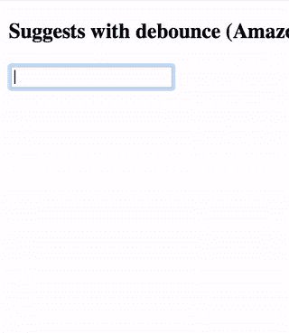
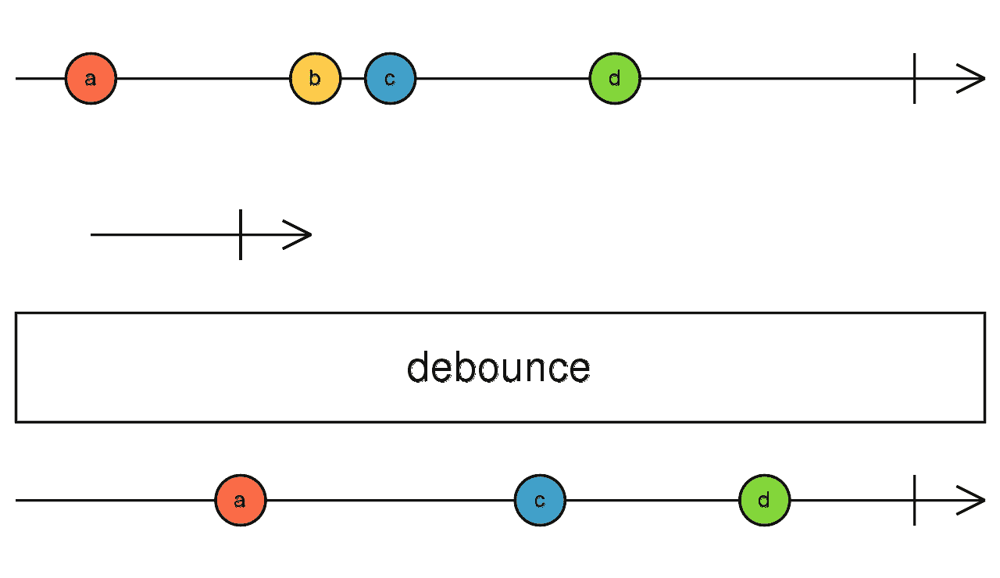

# 用 React 和 reenhance 组件构建自动完成输入

> 原文：<https://itnext.io/build-your-own-autocomplete-input-with-react-and-reenhance-components-97386da48678?source=collection_archive---------3----------------------->


在本文中，使用`AsyncResolver`、`StateProvider`和`DebouncePropagator from [reenhance-components](https://www.npmjs.com/package/reenhance-components)`创建您自己的自动完成输入组件的逐步说明。你可以在底部找到 CodePen 和示例库。

# 简短的背景

现代 web 应用程序具有各种交互式组件。最常用的是自动完成输入，它可以帮助用户快速正确地输入值。通常，这些建议来自后端 API，如产品数据库、销售排名、用户历史或其他大数据。

用 React 制作这样的组件并不容易，因为它充满了异步、事件和状态管理。现在有了`reenhance-components`，事情变得简单多了。本文的结果组件如下所示。



让我们进行下一步。

# 管理输入状态

在 React 中，输入字段的值应该以某种状态存储。否则，您将需要一个`ref`对象来获取 DOM 属性的值。最常见的方式叫做[受控组件](https://reactjs.org/docs/forms.html#controlled-components)。

虽然状态可以存储在 Redux 中，但是这并不总是一个好主意。在我看来，如果字段仅用于过滤或查询值，状态可以存储在本地。要在 JSX 以声明方式创建本地商店，可以使用`reenhance-components`中的`StateProvider`，如下所示:

```
const InputState = StateProvider('');const SuggestedInput = () => (
  <InputState>
    {({ state: query, setState: setQuery }) => (
      <div>
        <input value={query} onChange={e => setQuery(e.target.value)} />
      </div>
    )}
  </InputState>
);
```

# 正在执行 API 请求

为了从后端系统获得建议，调用`fetch` API(或类似的)是必要的。这些 API 返回`Promise`，因此它们必须在呈现内容之前被解析。

[在我以前的文章](/simple-ajax-fetch-with-react-rxjs-hocs-bb174bc45d9e)中，我展示了一个使用 RxJS 和 HoCs 的例子，但是现在有了一个包装组件`AsyncResolver`。使用`AsyncResolver`，您可以通过在 JSX 中将一个异步函数和参数作为道具传递来检索响应内容。下面是一个例子:

```
const asyncFetch =
  ({ query }) =>
    fetch(queryToUrl(query))
      .then(res => res.json());const SuggestAsyncResolver = AsyncResolver('query', []);const Suggests = ({ query }) => (
  <SuggestAsyncResolver query={query} subject={asyncFetch}>
    {props => (
      <ul>
        {props[1].map(str => (
          <li key={str}>{str}</li>
        ))}
      </ul>
    )}
  </SuggestAsyncResolver>
);
```

# 通过去抖动减少 API 请求

在实际应用中，减少来自最终用户的 API 请求是非常重要的。对于自动完成，我们可以将 API 请求延迟 150-200 毫秒，而不会降低用户体验。

然而，仅仅延迟是不够的，还必须在这段时间内巩固事件。这样的行为在 RxJS 中被称为`[debounce](http://reactivex.io/rxjs/class/es6/Observable.js~Observable.html#instance-method-debounce)`。



RxJS 文件中的去抖图形

可以使用`DebouncePropagator`来采用它，它将 JSX 中的 prop 传播延迟给定的毫秒。

示例:

```
const SuggestDebounce = DebouncePropagator({ query: '' });const SuggestsWithDebounce = ({ query }) => (
  <SuggestDebounce time={200} query={query}>
    {({ query }) => (
      <div>
        <Suggests query={query} />
      </div>
    )}
  </SuggestDebounce>
)
```

# 最终产品

你可以在 CodePen 中试试这个例子。它显示了来自 Amazon.com 的建议。

这里还有一个使用 WebPack 和 Babel 的存储库。只需结帐并键入`npm install`和`npm start`就可以在本地尝试。

 [## FPT/re enhance-组件-babel-示例

### 组件-巴别塔-例子-最小反应，网络包，巴别塔设置。你想超越创建-反应-应用…

github.com](https://github.com/fpt/reenhance-components-babel-examples) 

# 结论

乍一看，自动完成输入似乎很复杂，但它可以一步一步地构建。`reenhance-components`帮助你把功能元素放在 JSX，构建丰富的组件，没有任何类，hoc，Redux。