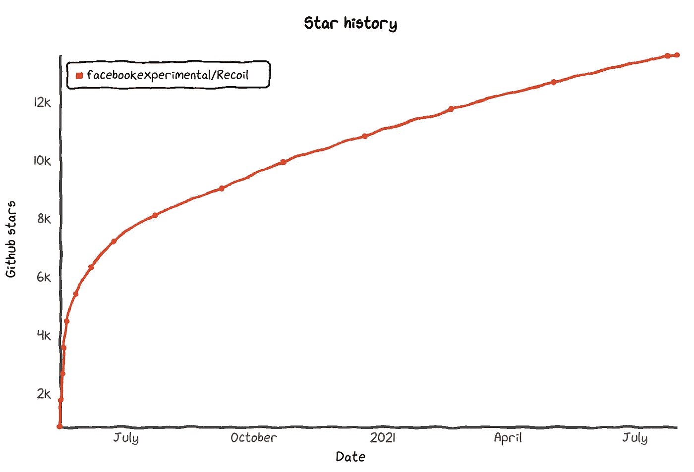
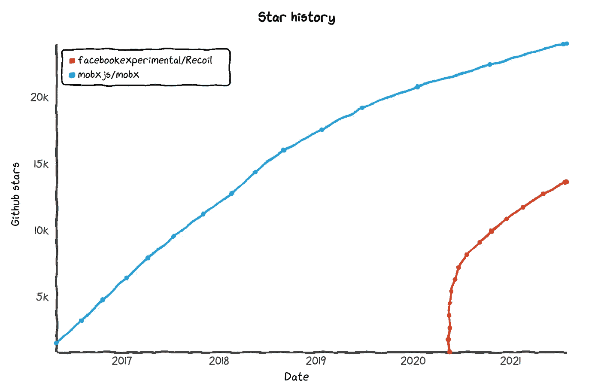

# 建立你自己的后座力

> 原文：<https://itnext.io/build-your-own-recoil-6d3ab91eee16?source=collection_archive---------0----------------------->


[反冲](https://recoiljs.org/)是脸书为 React 提供的一个新的实验状态管理库。它的核心概念是原子和选择器:

## 原子

原子是状态的单位。它的一个例子可以是表示用户输入的一些文本状态:

```
const textState = atom({
  key: 'textState',
  default: '',
});
```

借助`useRecoilValue`或`useRecoilState`钩子，可以在 React 组件中使用原子:

```
function TextInput() {
  const [text, setText] = useRecoilState(textState);
  const onChange = (event) => {
    setText(event.target.value);
  }; return <input type="text" value={text} onChange={onChange} />;
}
```

## 选择器

选择器是一个纯粹的函数，它接受原子并代表一个派生状态:

```
const charCountState = selector({
  key: 'charCountState',
  get: ({get}) => {
    const text = get(textState); return text.length;
  },
});
```

与 atom `useRecoilValue`或`useRecoilState`相同，必须使用挂钩:

```
function CharacterCount() {
  const count = useRecoilValue(charCountState); return <>Character Count: {count}</>;
}
```

反冲越来越受欢迎，今天它已经超过 [13k 星](https://star-history.t9t.io/#facebookexperimental/Recoil)。



这使得它有望在工程中使用。唯一的缺点是反冲工程仍然是实验性的。这可能会给未来带来一些风险。

从另一方面来说，你可能习惯于另一种状态的管理。可以是 [Redux](https://redux.js.org/) 、 [RxJS](https://rxjs.dev/) 、 [MobX](https://mobx.js.org/README.html) 、来自[小叶](https://github.com/Leaflet/Leaflet/blob/master/src/core/Events.js)的事件等等。所以你能坚持下去，让项目为迁移做好准备吗？或者你能有一个 B 计划来应对反冲无法释放的情况吗？这两个问题的答案都是肯定的，让我们看看如何在 MobX 上实现它。

# MobX

[MobX](https://mobx.js.org/getting-started) 是一个简单、可扩展且经过测试的状态管理解决方案，它有自己的概念:

> *确保可以从应用程序状态派生的所有内容都将被派生。自动地。*

该库拥有超过 [24k 颗恒星](https://star-history.t9t.io/#facebookexperimental/Recoil)，并且只有 [5 期](https://github.com/mobxjs/mobx/issues)，这表明它的稳定性非常好。



要用 MobX 实现`textState`,你唯一需要做的就是使用类，并使其具有反应性:

```
class TextState = {
  text = ""; constructor() {
    constructor() {
      makeAutoObservable(this);
    }
  } setText(nextText) {
    this.text = nextText;
  }
}
```

之后，可以在任何 React 组件中使用它:

```
const textState = new TextStat();
function TextInput() {
  const {text, setText} = textState;
  const onChange = (event) => {
    setText(event.target.value);
  }; return <input type="text" value={text} onChange={onChange} />;
}
```

该解决方案的缺点可能是，您需要引入一个新的依赖关系 [mobx-react](https://github.com/mobxjs/mobx/tree/main/packages/mobx-react) 并使用`observer`，这样组件将对变化做出反应。

要解决上面提到的问题，可以在 MobX 上构建您自己的“反冲包装器”,并实现您需要的确切功能。

# MobX-反冲

让我们从`atom`的实现开始。看看它的反冲实现，我们需要了解两件事:

# 选择

接受`key`和`default`值的选项参数(*我们不打算涵盖所有反冲功能*):

```
interface Config<T> {
  key: string;
  default: T;
}
```

# 原子

要实现 Atom，我们需要:

```
interface AtomType<T> {
  key: string;
  value: T;
  update: (nextValue: T) => void;
}
```

知道可以创建一个接受`Config`并构建`AtomType`的函数:

```
export function atom<T>(config: Config<T>): AtomType<T> {
  class AtomImpl implements AtomType<T> {
    key: string = config.key; value: T = config.default; constructor() {
      makeAutoObservable(this);
    } update(nextValue: T) {
      this.value = nextValue;
    }
  } return new AtomImpl();
}
```

这允许创建一个 mobx 可观察类，它可以作为一个独立的类使用，或者传递给`useRecoilValue`或`useRecoilState`钩子。

# useRecoilState

这将是一个接受原子并返回其值的 React 钩子。该值也将在`useState`挂钩的帮助下存储，该挂钩也提供了对变化做出反应的可能性:

```
export function useRecoilState<T>(atom: AtomType<T>): [T, (value: T) => void] {
  const [value, setValue] = useState<T>(atom.value);
  useEffect(() => {
    const disposer = autorun(() => {
      setValue(atom.value);
    });
    return disposer;
  }, [atom]);
  return [
    value,
    (value: T) => {
      atom.update(value);
    }
  ];
}
```

# useRecoilValue

使用`useRecoilState`并获得结果数组的第一个值，这个反冲钩子很容易实现:

```
export function useRecoilValue<T>(atom: AtomType<T>): T {
  return useRecoilState(atom)[0];
}
```

# 选择器

接下来需要实现的是一个`selector`。每个选择器应该对`get`和`set`原子实现一种可能性。我们将关注`get`功能。和`atoms`一样，每个选择器都应该有一个`key`属性。了解这一点后，我们需要实现以下功能:

```
export function selector<T>(options: {
  key: string;
  get: (util: { get: <V>(atom: AtomType<V>) => V }) => T;
}): AtomType<T> {
  ...
}
```

要获得原子的实际值，可以使用`options.get`。这使我们有可能使用 MobX 中的`autorun`来定义新的局部`atom`，它将表示值并对变化做出反应。在这种情况下，`selector`的最终实现可以是:

```
export function selector<T>(options: {
  key: string;
  get: (util: { get: <V>(atom: AtomType<V>) => V }) => T;
}): AtomType<T> {
  const get = (atom: AtomType<any>) => {
    return atom.value;
  }; const getActualValue = () => options.get({ get }); const resultAtom = atom({
    key: options.key,
    default: getActualValue()
  }); autorun(() => {
    resultAtom.update(getActualValue());
  }); return resultAtom;
}
```

这基本上是我们需要的一切，现在我们已经可以开始在项目中使用“反冲”了。

# 实施的好处

好处之一就是可以用新的方式使用自己喜欢的状态管理库。另一件事是定义自定义原子的可能性。例如，假设当`textState` atom 改变时，您需要触发一些动作(可能是一个 API 调用来触发搜索)。要用后座力来做，你需要使用`effects_UNSTABLE`。使用 MobX，您可以提供定制的 atom 实现:

```
const textState = atom(textStateMobx);
```

其中`textStateMobx`是带有附加功能的`AtomType`的一些实现:

```
class TextState implements implements AtomType<string> {
  key: string = 'textState'; value: string = ''; constructor() {
    makeAutoObservable(this);
    this.debouncedApiCall = debounce(this.doApiCall, DEBOUNCE_TIME);
  } update(nextValue: string) {
    this.value = nextValue;
    debouncedApiCall();
  } doApiCall() {
    if (this.value.length > MIN_LENGTH) {
      // some api call
    }
  }
}
```

# 构建“mobx-反冲”应用程序

反冲为[示例](https://recoiljs.org/docs/introduction/getting-started)提供了文本输入和输入符号计数器。几乎不需要对其进行调整，整个示例如下:

```
function TextInput() {
  const [text, setText] = useRecoilState(textState); const onChange = (event) => {
    setText(event.target.value);
  }; return (
    <div>
      <input type="text" value={text} onChange={onChange} />
      <br />
      Echo: {text}
    </div>
  );
}function CharacterCount() {
  const count = useRecoilValue(charCountState); return <>Character Count: {count}</>;
}function CharacterCounter() {
  return (
    <div>
      <TextInput />
      <CharacterCount />
    </div>
  );
}export default function App() {
  return <CharacterCounter />;
}
```

唯一的区别是`atom`、`selector`、`useRecoilState`和`useRecoilValue`必须从本地定义的“反冲”实现中导入，而不是从`'recoil'`中导入:

```
import React from 'react';
import {
  atom,
  selector,
  useRecoilState,
  useRecoilValue,
} from './mobx2recoil';
```

感谢阅读，我希望你喜欢这个想法。在 [codesandbox](https://codesandbox.io/s/throbbing-glitter-4zrcg?file=/src/App.tsx) 中有一个工作示例。祝你编码好运！